# Phát triển một 3-tier web application đơn giản

## 1. Mô tả

3-tier web application sử dụng 3 dịch vụ gồm: web, api và database dựa trên MERN (MongoDB, ExpressJs, ReactJs, NodeJs) Stack.

  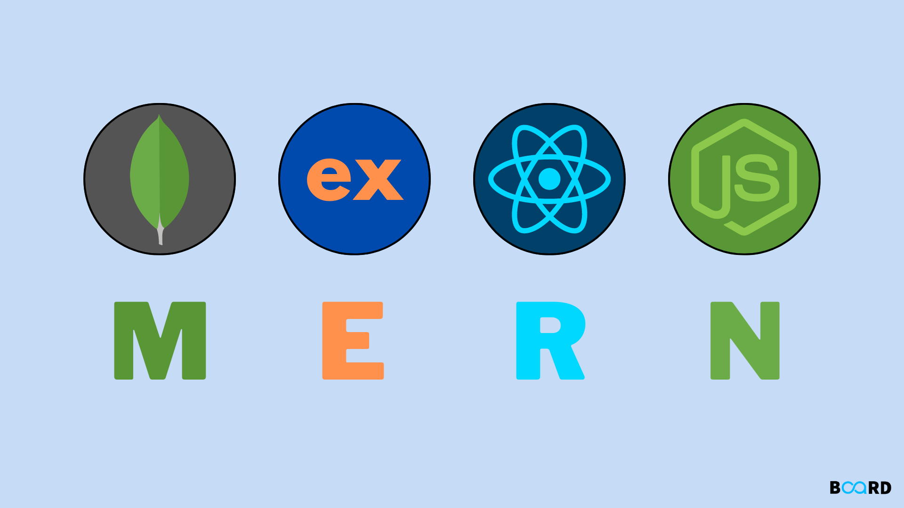

  <i><a href=https://www.boardinfinity.com/blog/mern-stack-what-is-it>
         MERN Stack
        </a></i>

 

Maintain source code của api và web ở 2 repo khác nhau, mỗi feature là 1 pull request. Ở cả 2 repo áp dụng git flow thực hiện tạo các nhánh main, release, develop. Khi phát triển 1 feature mới sẽ thực hiện checkout ra và tạo pull request vào nhánh develop. Từ develop sẽ được merge vào release rồi sau đó đến main. Các tag sẽ được tạo từ nhánh main để đánh dấu các phiên bản triển khai.

  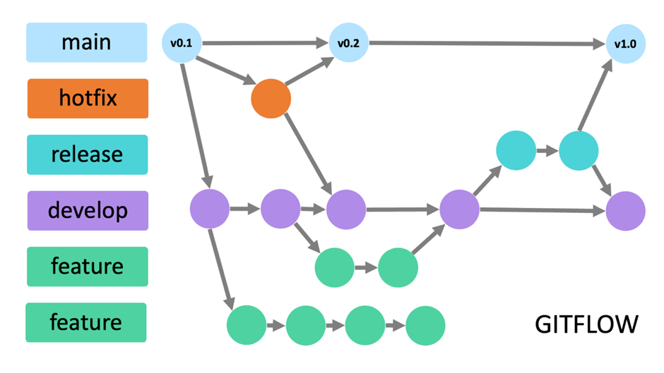

  <i><a href=https://medium.com/@yanminthwin/understanding-github-flow-and-git-flow-957bc6e12220>
         Understanding GitHub Flow and Git Flow
        </a></i>

 

Các commit gửi lên sẽ được tuân theo 1 convention. Commit convention là một cách tiêu chuẩn hóa việc viết commit message trong quá trình phát triển phần mềm. Nó giúp các thành viên trong nhóm hiểu rõ hơn về nội dung của mỗi commit và dễ dàng theo dõi lịch sử thay đổi của dự án. Trong 2 repo `VDT-midterm-api` và `VDT-midterm-web` sẽ sử dụng Angular Conventional Commit.

  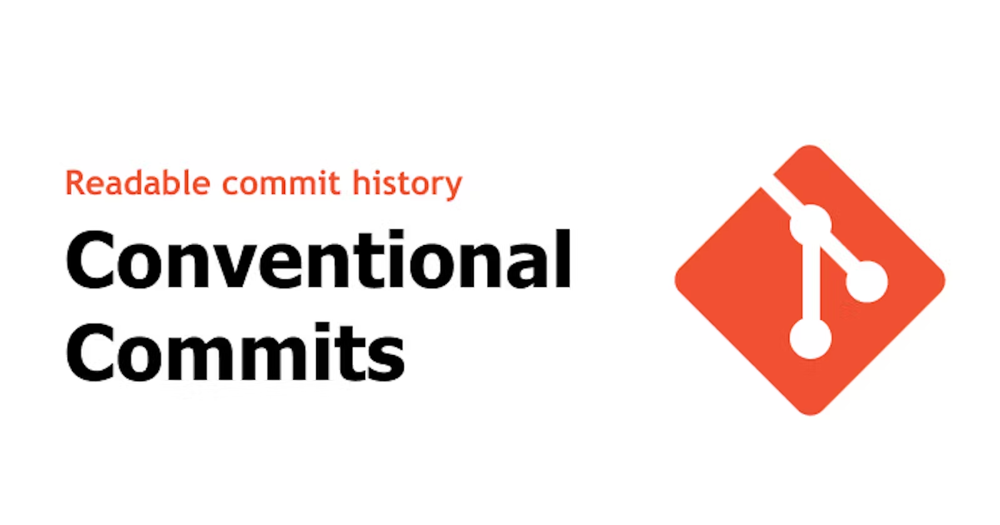

  <i><a href=https://www.conventionalcommits.org/en/v1.0.0-beta.4>
         Angular Conventional Commit
        </a></i>

 

### 1.1 Dịch vụ web

Phát triển dịch vụ web sử dụng thư viện [ReactJS](https://react.dev/) viết theo [TypeScript](https://www.typescriptlang.org/) và kết hợp với 1 build tool có module bundler Rollup là [ViteJs](https://vitejs.dev/).

ReactJS là một thư viện JavaScript phổ biến để xây dựng giao diện người dùng. Vite là một công cụ build nhanh chóng và hiện đại, giúp tăng tốc quá trình phát triển bằng cách cung cấp một môi trường phát triển nhanh và một hệ thống build hiệu quả. TypeScript là một phần mở rộng của JavaScript, cung cấp tính năng kiểm tra kiểu tĩnh và các công cụ hỗ trợ phát triển mạnh mẽ. Kết hợp ReactJS, Vite và TypeScript giúp cải thiện hiệu suất phát triển và chất lượng mã nguồn.

  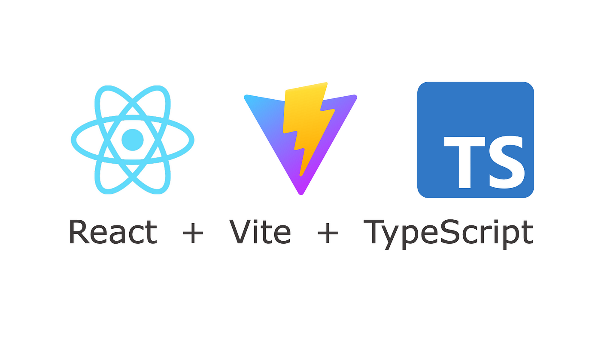

  <i> ReactJs + Vite + TypeScript</i>

### 1.2 Dịch vụ api

Phát triển dịch vụ api sử dụng framework [ExpressJs](https://expressjs.com/) của Nodejs viết theo TypeScipt.

Express.js là một framework web phổ biến cho Node.js, cho phép tạo ra các ứng dụng web và API một cách nhanh chóng và dễ dàng. TypeScript là một phần mở rộng của JavaScript, cung cấp tính năng kiểm tra kiểu tĩnh và các công cụ hỗ trợ phát triển mạnh mẽ. Việc sử dụng TypeScript với Express.js giúp cải thiện chất lượng mã nguồn và khả năng bảo trì của dự án.

  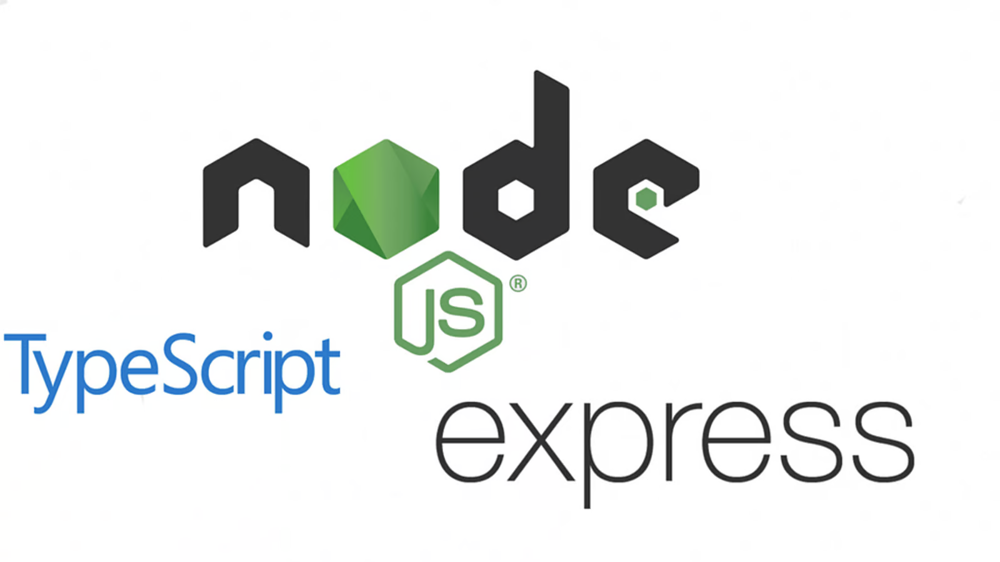

  <i>Nodejs + ExpressJs + TypeScript</i>

### 1.3 Dịch vụ database

Phát triển dịch vụ database dựa trên cơ sở dữ liệu MongoDB.

MongoDB là một cơ sở dữ liệu NoSQL mã nguồn mở, cho phép lưu trữ và truy vấn dữ liệu dưới dạng tài liệu (document) JSON linh hoạt. Được thiết kế để mở rộng và hỗ trợ tính linh hoạt trong việc lưu trữ dữ liệu phi cấu trúc, MongoDB là một lựa chọn phổ biến cho các ứng dụng web nhanh chóng và hiện đại.

  

  <i>MongoDB</i>

## 2. Output

- <b>Repo api</b>: [VDT-midterm-api](https://github.com/quangtuanitmo18/VDT-midterm-api)

  - Pull requests:
    - [Feature/api-crud-users](https://github.com/quangtuanitmo18/VDT-midterm-api/pull/1)
    - [Feature/dockerize-api-server](https://github.com/quangtuanitmo18/VDT-midterm-api/pull/2)
    - [Feature/test-api-crud-users](https://github.com/quangtuanitmo18/VDT-midterm-api/pull/3)
    - [Feature/pipeline-ci-cd](https://github.com/quangtuanitmo18/VDT-midterm-api/pull/4)

- <b>Repo web</b>: [VDT-midterm-web](https://github.com/quangtuanitmo18/VDT-midterm-web)
  - Pull requests:
    - [Feature/users-data-binding](https://github.com/quangtuanitmo18/VDT-midterm-web/pull/1)
    - [Feature/dockerize-client-server](https://github.com/quangtuanitmo18/VDT-midterm-web/pull/2)
    - [Feature/pipeline-ci-cd](https://github.com/quangtuanitmo18/VDT-midterm-web/pull/3)

 

#### Test Api trên postman

  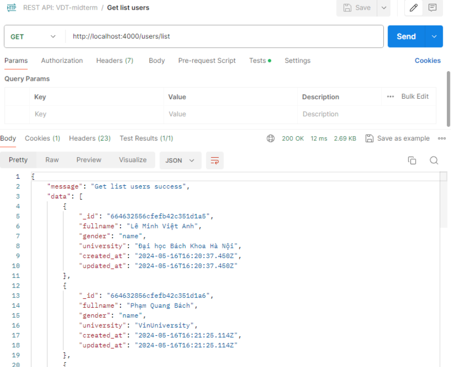

  <i>Api get list users</i>

 

  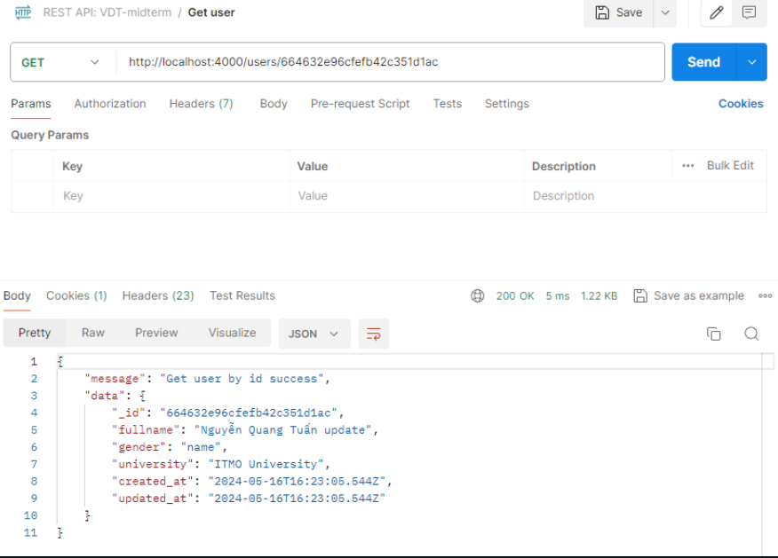

  <i>Api get user</i>

 

  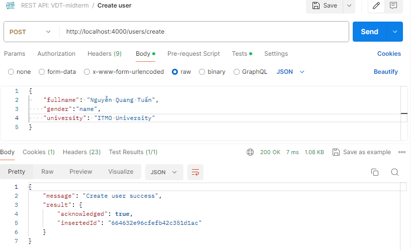

  <i>Api create user</i>

 

  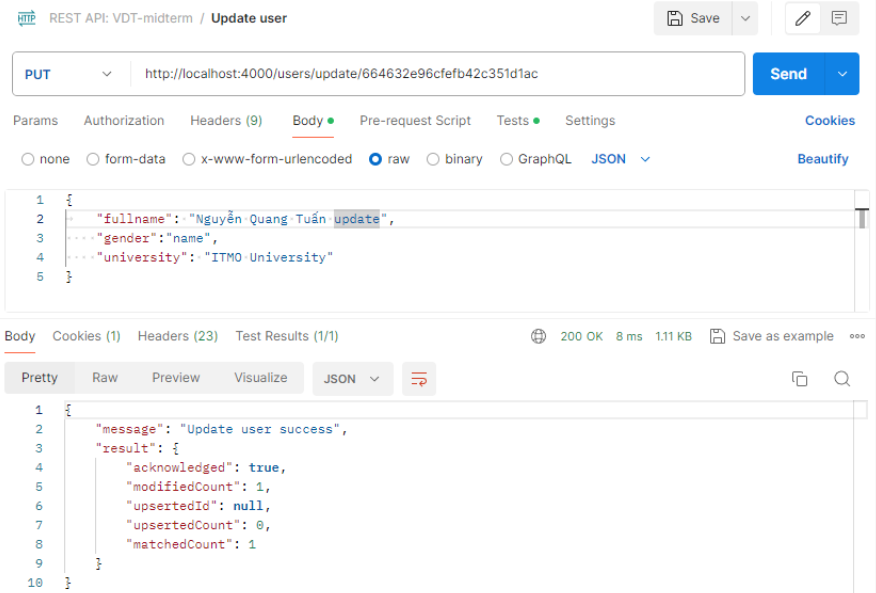

  <i>Api update user</i>

 

  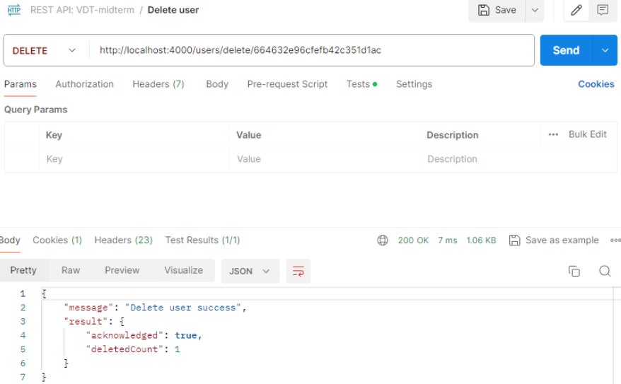

  <i>Api delete user</i>

 

#### Kết quả khi chạy các test cases

  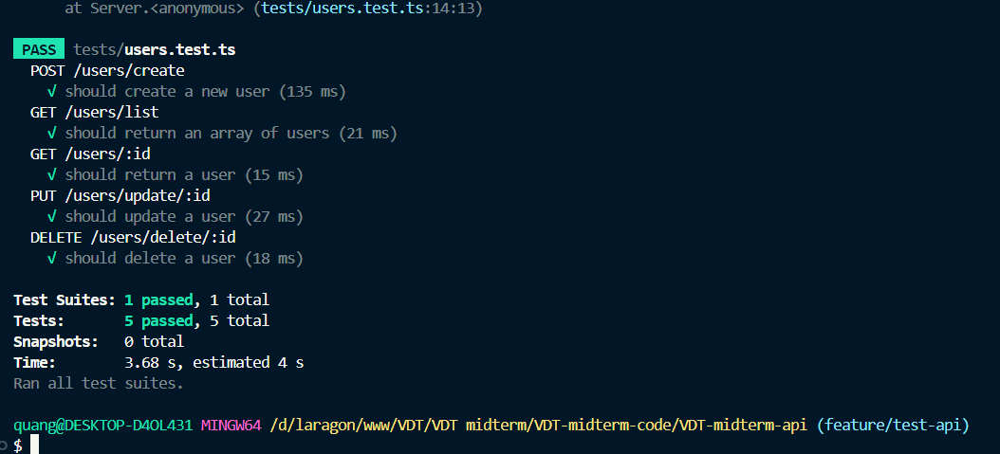

  <i>Result of test cases</i>

 

#### Kết quả hiển thị trên browser

  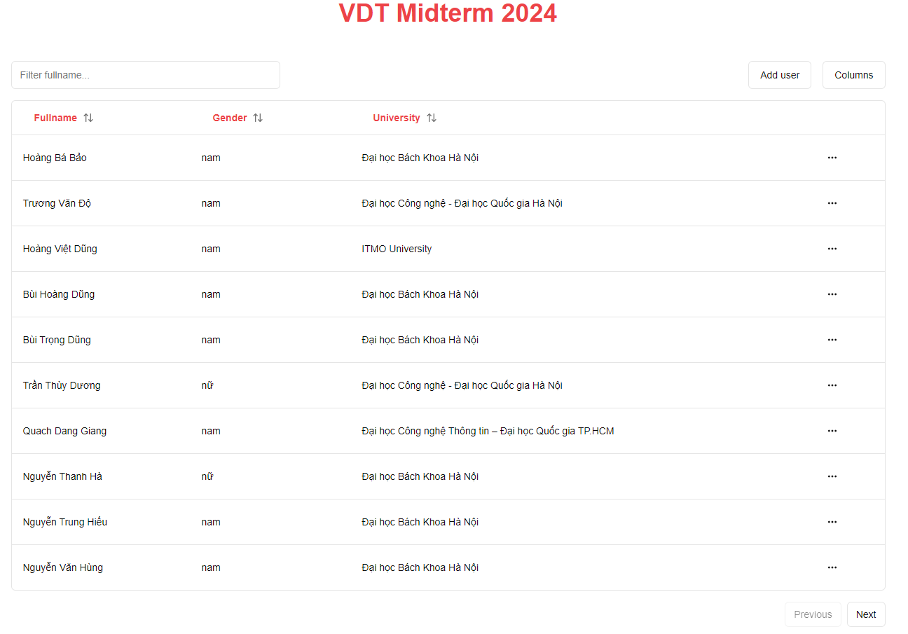

  <i>Bảng danh sách các users</i>

 
