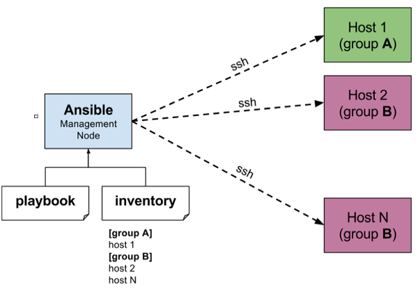
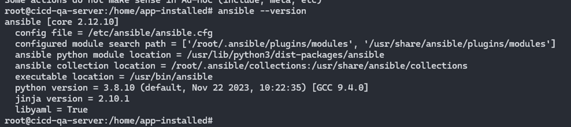
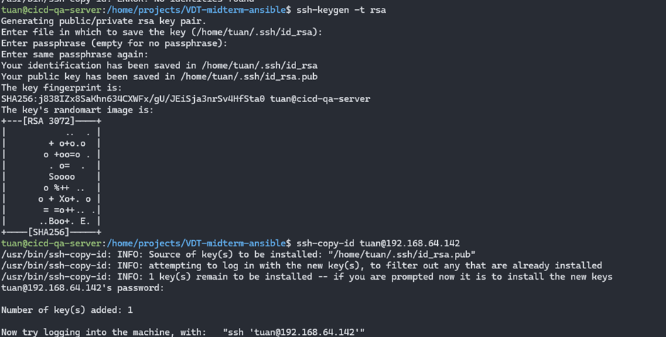
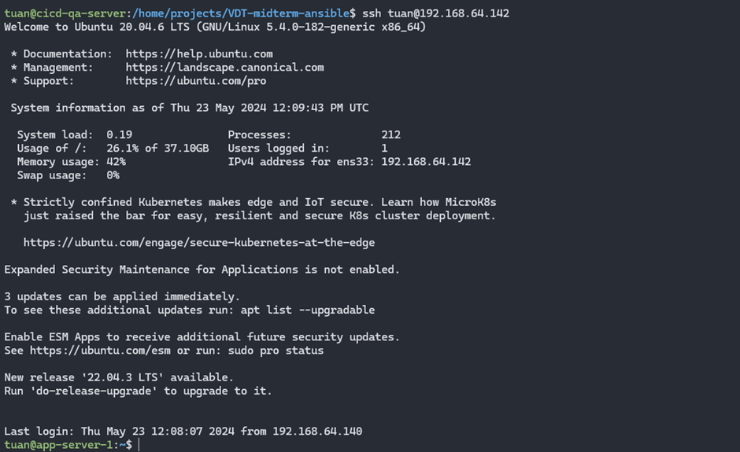

## Cài đặt Ansible lên server (cicd-qa-server: 192.168.64.140)

Ansible là một công cụ mã nguồn mở được sử dụng để tự động hóa các công việc quản trị hệ thống và triển khai ứng dụng. Nó cho phép viết các playbook để định nghĩa các tác vụ cụ thể và triển khai chúng trên các máy chủ mục tiêu một cách dễ dàng và hiệu quả.

Các thành phần chính của Ansible bao gồm:

- Inventory: Là danh sách các máy chủ mà muốn quản lý và triển khai. Ansible sử dụng inventory để biết được các máy chủ nào đang hoạt động và thực hiện các tác vụ trên chúng.

- Playbooks: Là các tập lệnh YAML viết để định nghĩa các công việc cụ thể muốn thực hiện trên các máy chủ mục tiêu. Mỗi playbook bao gồm một hoặc nhiều nhiệm vụ, và mỗi nhiệm vụ có thể là một roles, một task hoặc một handler.

- Roles: Là một cách để tổ chức và chia sẻ mã giữa các playbook. Một role là một tập hợp các tác vụ và các file mẫu cụ thể cho một chức năng hoặc ứng dụng cụ thể. Các role giúp tái sử dụng mã, giảm thiểu sự lặp lại và dễ dàng quản lý.

- Tasks: Là các công việc cụ thể thực hiện trên các máy chủ mục tiêu. Mỗi task định nghĩa một hành động như cài đặt gói phần mềm, khởi động dịch vụ, sao chép file, v.v.

- Handlers: Là các công việc được kích hoạt chỉ khi cần thiết, thường được sử dụng để khởi động lại các dịch vụ sau khi các thay đổi đã được áp dụng.

- Modules: Là các chương trình nhỏ được thực thi trên các máy chủ mục tiêu để thực hiện các công việc cụ thể. Ansible đi kèm với nhiều modules tích hợp sẵn như copy, yum, apt, service, command, v.v.

- Vars: Ansible cho phép định nghĩa biến để sử dụng trong playbook (đơn giản là cấu hình các biến để có thể sử dụng lại được các cấu hình, truyền biến, bảo mật dữ liệu,…)

  

#### Cài đặt Ansible

[ansible-setup.sh](../scripts/ansible-setup.sh)

`touch ansible-setup.sh && chmod +x ansible-setup.sh && vim docker-setup.sh`

`./ansible-setup.sh` chạy script cài đặt ansible và kiểm tra version được kết quả như dưới đây

  

 

Sau khi đã cài Ansible xong, tiếp theo cần tạo ssh key và copy public key lên các server

Dưới đây thực hiện tạo ssh key và copy lên server `app-server-1: 192.168.64.142`, đối với các server khác thực hiện tương tự.

Tạo ssh key từ user `tuan` bằng lệnh `ssh-keygen -t rsa`, sau đó copy lên `app-server-1: 192.168.64.142` bằng lệnh `ssh-copy-id tuan@192.168.64.142`

User `tuan` đầu tiên là user trên ansible host `cicd-qa-server: 192.168.64.140`, user `tuan` thứ 2 là user trên target host `app-server-1: 192.168.64.142`

Để user `tuan` trên ansible host có quyền sudo và không cần nhập mật khẩu trong quá trình chạy thì cần thêm config `tuan ALL=(ALL) NOPASSWD:ALL` vào `/etc/sudoers.tmp`. Đối với user trên target host cũng sẽ cần thực hiện tương tự để có đủ quyền cài đặt gói phần mềm, khởi động dịch vụ, sao chép file, v.v.

  

 

Sau khi copy được public key lên target host thì ssh đến nó sẽ không cần dùng mật khẩu

  

