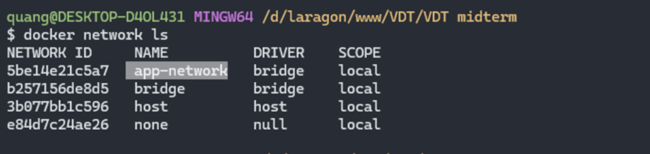
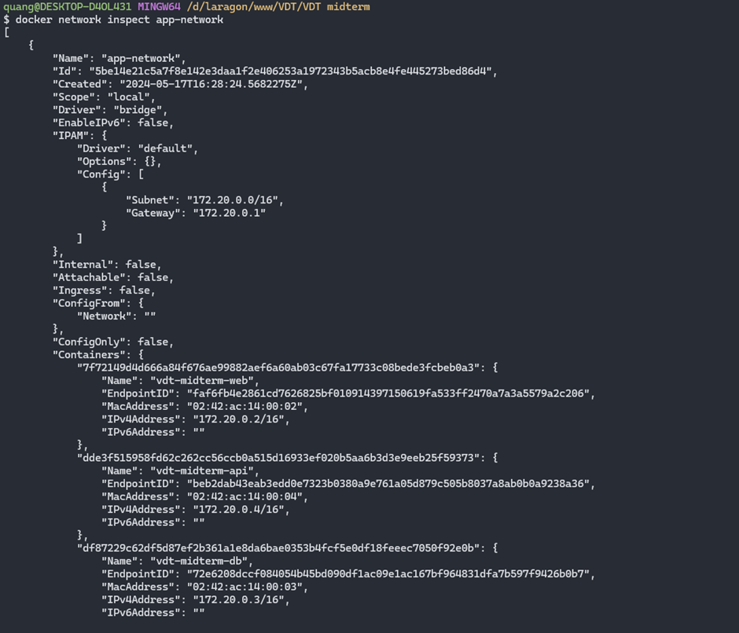

## Cài đặt network để thông giữa các dịch vụ api, web và db

Chạy câu lệnh `docker network create app-network` để tạo network có tên là **app-network**.

Kiểm tra các network hiện có `docker network ls`.

  

  <i>Container networking</i>

Sau khi chạy 3 container của 3 dịch vụ web, api, db lên. Thực hiện inspect network thấy 3 dịch vụ đã nằm trong **app-network**.

  

  <i>Inspect network</i>

