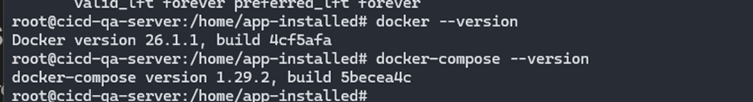

## Cài đặt docker và docker-compose lên trên các server

File [docker-setup.sh](../scripts/docker-setup.sh) cho việc cài đặt docker và docker-compose.

`touch docker-setup.sh && chmod +x docker-setup.sh && vim docker-setup.sh`

`./docker-setup.sh` chạy script cài đặt docker và kiểm tra version được kết quả như dưới đây

  

 

Bên trên là cài đặt docker và docker-compose lên `cicd-qa-server: 192.168.64.140`, đối với các server khác thực hiện tương tự.

**_Sau khi cài đặt Ansible thì có thể dùng Ansible để cài đặt docker và docker-compose lên các target host sẽ nhanh và tiện lợi hơn._**
