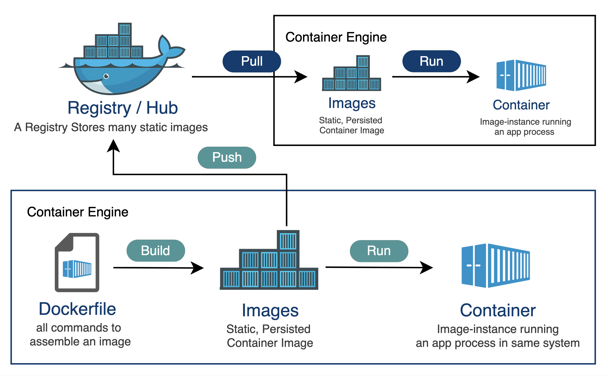
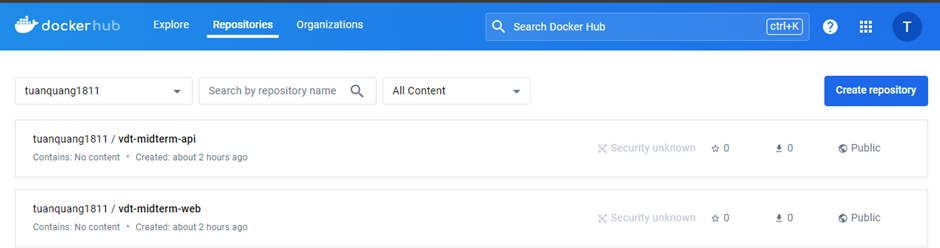

## Tạo repo trên Docker Hub

Docker Hub là một dịch vụ lưu trữ và chia sẻ các container Docker do Docker Inc. cung cấp. Đây là một phần quan trọng trong hệ sinh thái Docker, giúp các nhà phát triển và tổ chức dễ dàng tìm kiếm, lưu trữ, quản lý và chia sẻ các image Docker. Dưới đây là một số thông tin chi tiết về Docker Hub:

- Chức năng chính

  - Lưu trữ image Docker: Docker Hub là nơi lưu trữ các image Docker, bao gồm các image chính thức do Docker và các đối tác phát hành, cũng như các image được tạo bởi cộng đồng.
  - Chia sẻ image: Người dùng có thể chia sẻ image Docker với cộng đồng hoặc trong nhóm phát triển của mình. Docker Hub hỗ trợ việc thiết lập các kho lưu trữ công khai và riêng tư.
  - Tìm kiếm và tải image: Người dùng có thể tìm kiếm và tải về các image Docker có sẵn từ Docker Hub, giúp dễ dàng triển khai các ứng dụng và dịch vụ.
  - Tích hợp CI/CD: Docker Hub tích hợp với các hệ thống CI/CD phổ biến như Jenkins, GitLab CI, Travis CI, giúp tự động hóa quá trình xây dựng và đẩy image Docker.

- Các thành phần chính

  - Repositories (Kho lưu trữ): Đây là nơi lưu trữ các image Docker. Có hai loại repository chính:

    - Public repositories: Bất kỳ ai cũng có thể truy cập và tải về các image trong các kho lưu trữ công khai.
    - Private repositories: Chỉ những người dùng được chỉ định mới có quyền truy cập, phù hợp cho việc lưu trữ các image nội bộ hoặc bảo mật.

  - Organizations (Tổ chức): Docker Hub cho phép tạo và quản lý các tổ chức, giúp dễ dàng quản lý quyền truy cập và chia sẻ image Docker trong nhóm phát triển hoặc công ty.
  - Teams (Nhóm): Trong mỗi tổ chức, người dùng có thể tạo các nhóm và phân quyền truy cập khác nhau cho từng nhóm.

  

<i><a href=https://community.sap.com/t5/technology-blogs-by-sap/use-private-registry-for-containerize-a-cap-application-part-1/ba-p/13541667>
Docker Hub
</a></i>

 

Với tài khoản cá nhân miễn phí thì chỉ có thể tạo 1 repo private trên Docker Hub.

Thực hiện tạo 2 repo public trên Docker Hub là `vdt-midterm-api` và `vdt-midterm-web`

  

 
