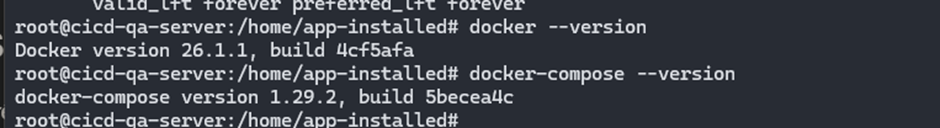
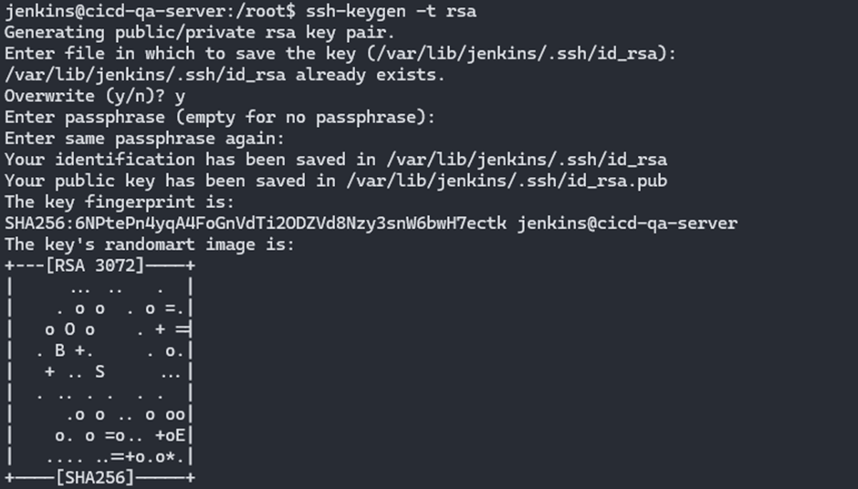

## Setup Jenkins server (cicd-qa-server: 192.168.64.140) trên port 8080

Jenkins là một công cụ mã nguồn mở viết bằng Java sử dụng để tự động hóa các tác vụ liên quan đến phát triển phần mềm, đặc biệt là trong CI/CD. Jenkins có thể kết hợp được với hầu hết các công cụ khác của hệ thống tích hợp liên tục với nhiều nền tảng khác nhau. Ngoài ra, cộng đồng sử dụng Jenkins rất lớn nên cũng rất dễ trong việc sử dụng và hỗ trợ khi gặp khó khăn.

<div align="center">
  
</div>

<div align="center">
  <i>jenkins</i>
</div>
<br>

### Cài đặt Jenkins

[jenkins-setup.sh](../scripts/jenkins-setup.sh)

`touch jenkins-setup.sh && chmod +x jenkins-setup.sh && vim jenkins-setup.sh` tiến hành tạo thư mục để lưu cấu hình cài đặt các ứng dụng, di chuyển đến thư mục đó tạo một file script để cài đặt jenkins và cấp quyền thực thi file đó.

Chạy câu lệnh `./jenkins-setup.sh` để cài đặt jenkins. Port mặc định của jenkins là 8080.

<div align="center">
  
</div>

Sau khi cài đặt thành công jenkins, vào browser và truy cập và đường link `192.168.64.140:8080`

<div align="center">
  
</div>

Để lấy được mật khẩu của user root trên jenkins cần chạy lệnh `cat /var/lib/jenkins/secrets/initialAdminPassword`

<div align="center">
  
</div>

Tiếp theo install các plugin trên Jenkins theo mặc định.

<div align="center">
  
</div>

Tiếp đến cần tạo tài khoản và thiết lập jenkins url

<div align="center">
  
</div>

<div align="center">
  
</div>

Sau khi hoàn thành các bước trên, cài đặt thành công vào màn hình quản lý của jenkins.

<div align="center">
  
</div>
<br>

Tiếp theo, tương tự sẽ cài đặt docker và docker-compose cho Jenkins server ([docker-setup.sh](../scripts/docker-setup.sh))

`touch docker-setup.sh && chmod +x docker-setup.sh && vim docker-setup.sh`

`./docker-setup.sh` chạy script cài đặt docker và kiểm tra version được kết quả như dưới đây

<div align="center">
  
</div>
<br>

`usermod -aG docker jenkins` thêm user jenkins vào group docker để jenkins có thể sử dụng docker trong Jenkins CICD Pipeline

Cài đặt các plugin sau lên jenkins server

- Gitlab
- Docker
- Blue Ocean
- SSH Agent
- Sonarqube scanner

<div align="center">
  
</div>

<div align="center">
  
</div>
<div align="center">
  
</div>
<div align="center">
  
</div>
<div align="center">
  
</div>

#### Tích hợp Gitlab lên Jenkins server

Tại giao diện Jenkins nhấn chọn `Manage Jenkins -> System` tìm đến gitlab và tiến hành config như dưới đây

<div align="center">
  
</div>

Khi nhấn chọn thêm credentials phía trên sẽ mở ra popup để tạo Credential như dưới đây tiến hành nhập thông tin token chính là access token đã tạo bên gitlab server

<div align="center">
  
</div>

Quay lại chọn credentials vừa tạo nhấn test connect và đã thành công

<div align="center">
  
</div>
<br>

#### Tích hợp Sonarqube lên Jenkins server

Tương tự như trên khi tích hợp Gitlab vào Jenkins thì trước tiên cần có 1 token từ Sonarqube.
Sau khi có Sonarqube token tiến hành tạo credential trên Jenkins
Để thêm được credential mới lên Jenkins chọn `Dashboard -> Manage Jenkins -> Credentials -> System -> Global Credetial`

<div align="center">
  
</div>
<br>

Config system Sonarqube dưới đây (phần server auten token: chọn credentials mới tạo phía trên)

<div align="center">
  
</div>
<br>

#### Tích hợp Telegram lên Jenkins server

Sau khi tiến hành các bước cài đặt bot bên Telegram sẽ nhận được `Token` và `chatId`

Tiến hành tạo credential trên Jenkins cho `Token` và `chatId`
Để thêm được credential mới lên Jenkins chọn `Dashboard -> Manage Jenkins -> Credentials -> System -> Global Credetial`

`secret` là `Token` và `chatId` nhận được từ Telegram

<div align="center">
  
</div>

<div align="center">
  
</div>

Config system TelegramBot dưới đây (Telegram Bot name: là `username` của bot tạo bên Telegram và `Telegram Bot token` là `Token` phía trên)

<div align="center">
  
</div>

#### Tạo pipeline trên jenkins

sẽ có 2 pipeline là `pipeline-vdt-midterm-api` và `pipeline-vdt-midterm-web`
các bước dưới đây thực hiện trên `pipeline-vdt-midterm-api`, đối với `pipeline-vdt-midterm-web` thực hiện tương tự.

Chọn `New Item` ở dashboard của jenkins để tiền hành tạo pipeline

<div align="center">
  
</div>
<br>

Phần General tích chọn `Discard old builds` và lưu lại 10 bản chạy gần nhất

<div align="center">
  
</div>
<br>

Tiếp tục ở General, build triggers như dưới đây để Jenkins CICD Pipeline chạy cả được những action như push, merge code

<div align="center">
  
</div>
<br>

phần pipeline chọn như sau và URL chính là URL bên project ở gitlab

<div align="center">
  
</div>
<br>

Tiếp tục thêm credentials của gitlab. Credentials đây chính là account có quyền admin trên gitlab, nếu không Jenkins CICD Pipeline chạy sẽ không clone được code.

<div align="center">
  
</div>
<br>
Đến phần Pipeline, branch ở đây chọn là main và release vậy là khi merge request hoặc push từ 2 nhánh này Jenkins mới chạy. Tránh trường hợp cứ push và tạo merge request ở 1 nhánh bất kì thì pipeline đều chạy.

<div align="center">
  
</div>
<br>

#### Tạo Token của user admin trên Jenkins

Bước cuối cùng tích hợp Gitlab với Jenkins chính là thiết lập webhook. Để tạo được webhook ở gitlab thì cần có API token của user admin trên Jenkins

`Dashboard -> user -> configure` để thiết lập API token trên Jenkins

<div align="center">
  
</div>
<br>

#### Tạo thư mục quản lý dự án

Chạy lệnh `mkdir /home/projects/VDT-midterm-api` và `mkdir /home/projects/VDT-midterm-web` để tạo 2 thư mục lưu trữ dự án

<div align="center">
  
</div>
<br>
Tiếp đến trong pipeline sẽ dùng user `jenkins` (user mặc định được tạo ra khi cài Jenkins server). Sẽ có những command khi thực hiện với user `jenkins` cần quyền sudo và hỏi mật khẩu nên cần đưa user `jenkins` vào trong group sudo và chạy command không cần nhập mật khẩu.

chạy `visudo` và thêm `jenkins ALL=(ALL:ALL) NOPASSWD: ALL` vào phần `#Allow members of group sudo to execute any command`

<div align="center">
  
</div>
<br>

**_Ví dụ:_**
Code trên Gitlab sau khi được Jenkins pull về sẽ nằm trong workspace của nó.

<div align="center">
  
</div>
<br>

Cần tiến hành copy code từ workspace của Jenkins về thư mục quản lý dự án đã tạo ở trên (`VDT-midterm-api` và `VDT-midterm-web`) và cấp quyền sở hữu và quyền thực thi trên thư mục đó cho user Jenkins. Trong pipeline có 1 stage là `checkout source` giúp làm điều này.

```shell
stage('Checkout source' ){
        steps{
            sh "sudo cp -r . $PATH_PROJECT \
            && sudo chown -R jenkins:jenkins $PATH_PROJECT \
            && sudo chmod -R 755  $PATH_PROJECT \
            "
        }
}
```

Với stage trên do có các command dùng đến quyền `sudo` và hiện tại trong pipeline là dùng user `jenkins` nên mới cần đưa user `jenkins` vào group `sudo` như trên và cấp quyền không cần dùng mật khẩu để pipeline không bị ngắt quãng.

#### Tạo SSH key

Mục đích của việc tạo ssh key là để trong giai đoạn CD sẽ cần ssh đến server chạy dịch vụ `web` và `api` để pull image từ Docker Hub

Trong server Jenkins tiến hành tạo khóa ssh và access để có thể truy cập sang `app-server-1: 192.168.64.142` và `app-server-2: 192.168.64.144` như sau:

`ssh-keygen -t rsa` tạo ra một cặp khóa public và khóa private RSA cho việc xác thực truy cập từ xa cho Jenkins CI/CD Pipeline.

<div align="center">
  
</div>
<br>

`ssh-copy-id -i ~/.ssh/id_rsa.pub tuan@192.168.64.142` sao chép khóa public của người dùng lên server `app-server-1`. Với `app-server-2` thực hiện tương tự.

<div align="center">
  
</div>
<br>

ssh vào từ server `app-server-1` và không cần nhập mật khẩu đã thành công.

<div align="center">
  
</div>
<br>

Lưu lại private key rồi tạo credential trên Jenkins server với cái private key đó để có thể dùng được trong pipeline CI/CD

<div align="center">
  
</div>
