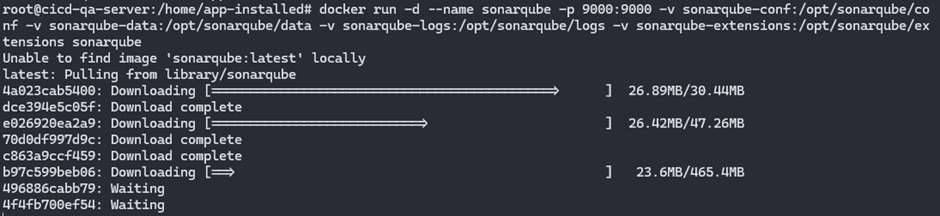
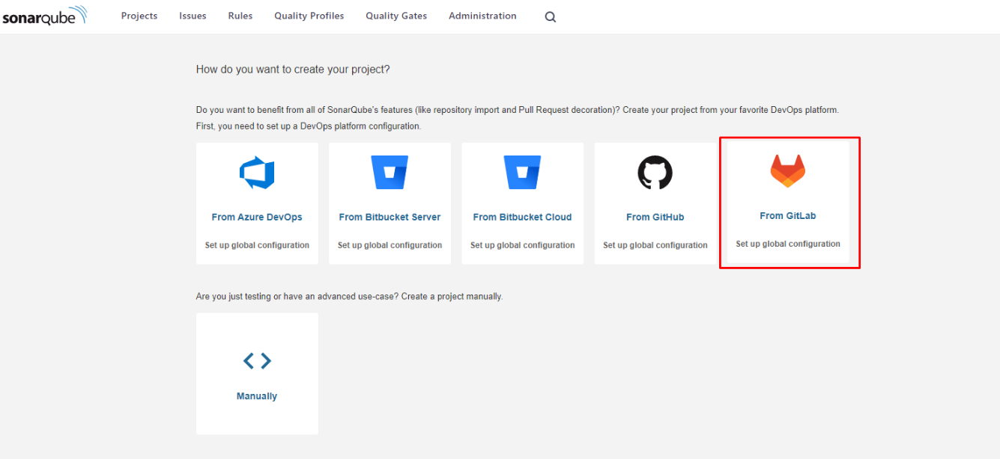
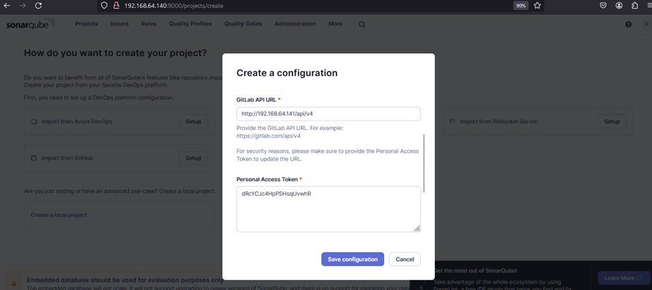
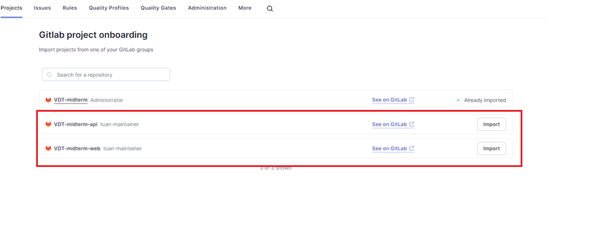
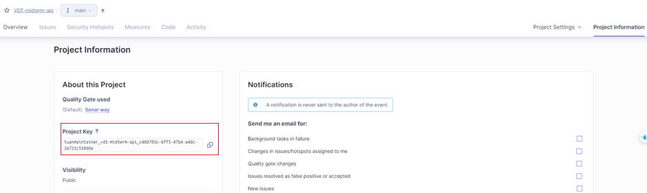
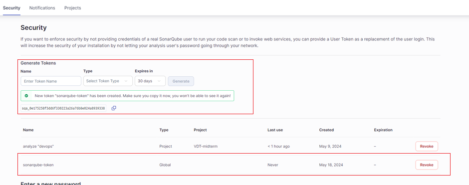

### Setup Sonarqube server (cicd-qa-server: 192.168.64.140) trên port 9000

SonarQube là một nền tảng mã nguồn mở dùng để quản lý chất lượng mã nguồn, được phát triển bởi công ty SonarSource. Nó giúp các nhà phát triển phát hiện và sửa chữa các lỗi, vấn đề bảo mật, và các điểm yếu trong mã nguồn của họ. Dưới đây là một số thông tin chi tiết về SonarQube:

Chức năng chính:

- Phân tích mã nguồn: SonarQube hỗ trợ phân tích mã nguồn cho nhiều ngôn ngữ lập trình như Java, C#, JavaScript, TypeScript, Python, Go, và nhiều ngôn ngữ khác.
- Phát hiện lỗi và vấn đề bảo mật: SonarQube có khả năng phát hiện các lỗi lập trình, lỗi bảo mật, các vấn đề về hiệu suất và những chỗ trong mã nguồn có thể cải thiện.
- Chấm điểm chất lượng mã: Dựa trên các kết quả phân tích, SonarQube sẽ cung cấp các chỉ số và báo cáo về chất lượng mã nguồn như Technical Debt (nợ kỹ thuật), Code Coverage (phạm vi kiểm tra mã), và các chỉ số khác.
- Tích hợp CI/CD: SonarQube dễ dàng tích hợp với các hệ thống CI/CD phổ biến như Jenkins, GitLab CI, Travis CI, CircleCI, giúp tự động hóa quá trình phân tích mã nguồn trong các pipeline phát triển phần mềm.

  

 

#### Cài đặt Sonarqube

Để chạy được sonarqube server lên, thực hiện câu lệnh chạy với docker sau:
`docker run -d --name sonarqube -p 9000:9000 -v sonarqube-conf:/opt/sonarqube/conf -v sonarqube-data:/opt/sonarqube/data -v sonarqube-logs:/opt/sonarqube/logs -v sonarqube-extensions:/opt/sonarqube/extensions sonarqube`

  

 

sau khi chạy docker container lên thành công, truy cập vào địa chỉ `192.168.64.140:9000` để tiến hành các bước cài đặt ban đầu cho sonarqube.

#### Tạo project trên sonarqube từ gitlab.

  

 

Để sonarqube có thể kết nối được đến các project trên gitlab thì cần nhập 2 thông tin:

- Gitlab API URL: `http://192.168.64.141/api/v4` - địa chỉ của server gitlab + `/api/v4`
- Personal Access Token: access token được tạo trên server gitlab

  

 

Tiếp đến cần import 2 dự án `VDT-midterm-api` và `VDT-midterm-web` vào

  

#### Lấy project Key của các dự án trên sonarqube

Mỗi dự án sau khi import từ gitlab vào sonarqube như trên sẽ có project key riêng
Để lấy được project key cần chọn vào dự án `Overview -> Project infomation`

  

Project key này sẽ được tạo credential trên Jenkins server để dùng trong pipeline CI/CD. Giúp pipeline CI/CD biết được cần phân tích code của dự án nào.

#### Tạo Token của user trên Sonarqube server

Để Jenkins có thể chạy được Sonarqube trên Jenkins server thì cần 1 Token của user trên Sonarqube
Chọn vào tab `Security` và tạo token

  

 

Token này sau đó sẽ được tạo credential trên jenkins server, giúp jenkins có quyền sử dụng sonarqube trên pipeline CI/CD
