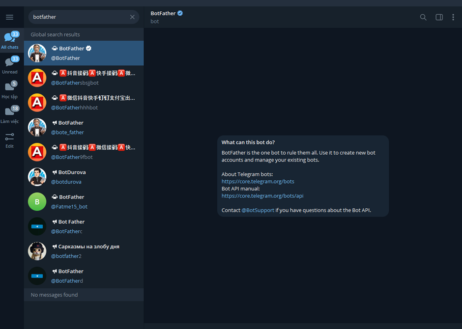
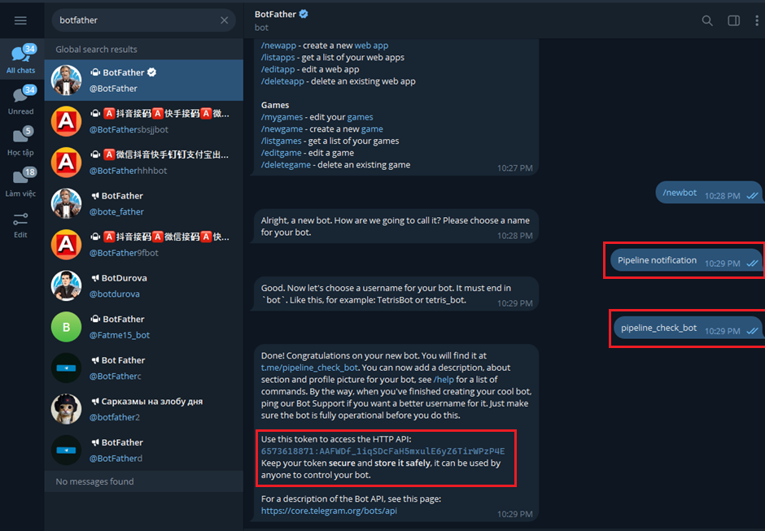
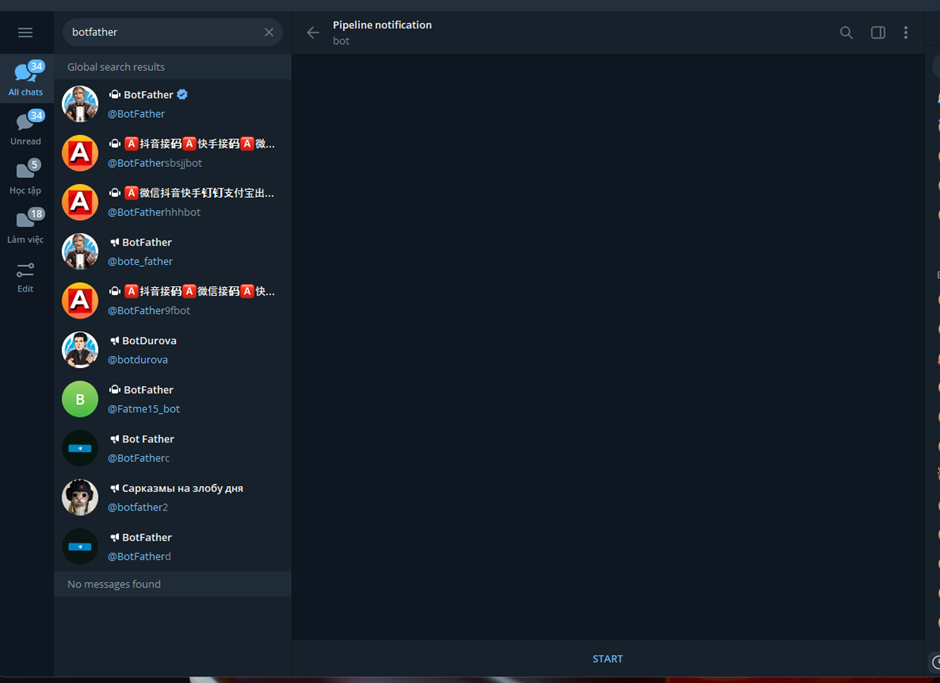
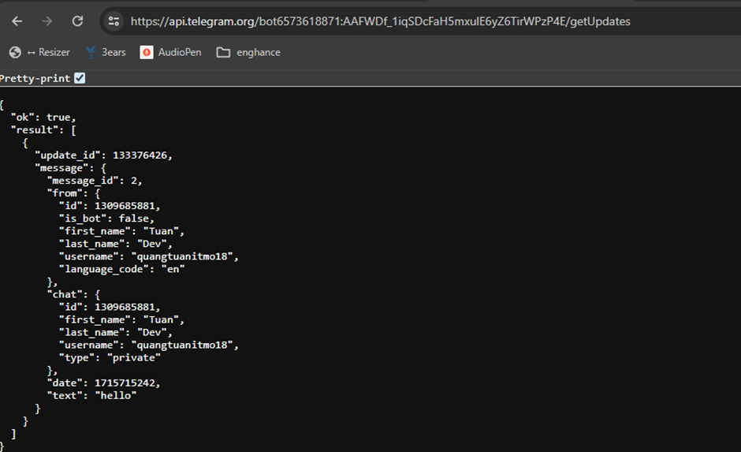

## Tích hợp gửi thông báo Pipeline CI/CD đến Telegram

Tìm kiếm botfather trên Telegram

  

 

Thực hiện các bước theo chỉ dẫn của `BotFather` để tạo bot mới, chọn `name` và `username` cho bot

- `name`: `Pipeline notification`
- `username`: `pipeline_check_bot`

Sau khi thành công sẽ có:

- Link để chuyển tới cuộc hội thoại của bot
- Token hãy lưu lại để sau sử dụng trong pipline CI/CD

  

 

Chuyển đến con bot mới tạo ấn `Start` và chat 1 nội dung bất kì nào đó

  

 

Truy cập vào link: `https://api.telegram.org/bot<Token>/getUpdates` và lưu lại Chat ID để sử dụng cho pipeline CI/CD

  

 
