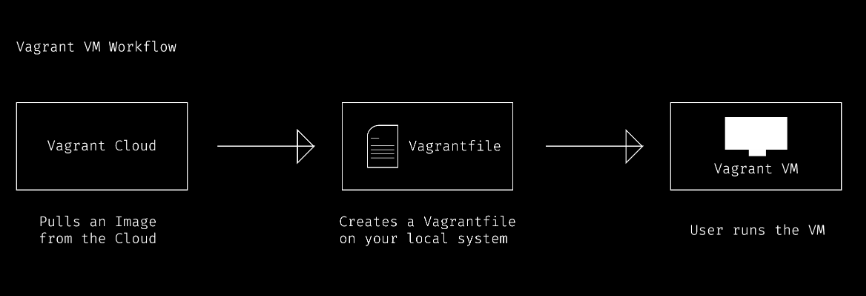
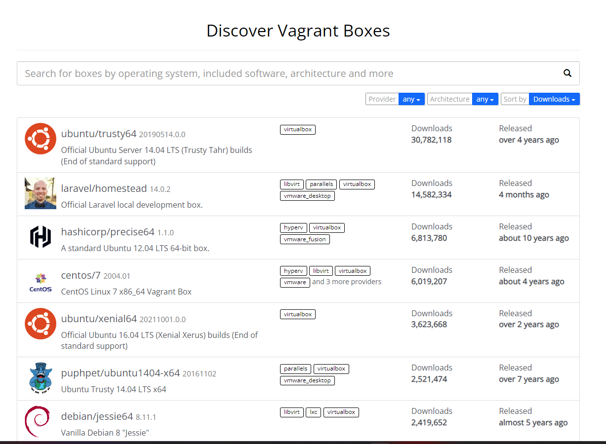
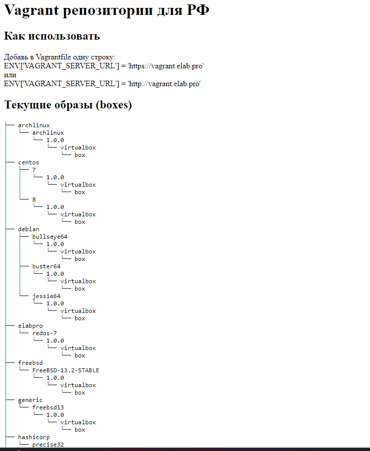

## Dùng Vagrant để tạo máy ảo

Vagrant là một công cụ mã nguồn mở được phát triển bởi HashiCorp, được thiết kế để quản lý và tự động hóa việc triển khai môi trường phát triển bằng cách sử dụng máy ảo hoặc container. Nó cho phép các nhà phát triển xây dựng, chia sẻ và duy trì môi trường phát triển đồng nhất và dễ dàng tái tạo trên nhiều hệ thống.

Dưới đây là một số đặc điểm quan trọng của Vagrant:

- Tự động hóa triển khai môi trường: Vagrant cho phép mô tả môi trường phát triển của mình trong một tệp cấu hình đơn giản bằng ngôn ngữ Ruby gọi là Vagrantfile. Bằng cách này, có thể xác định cách môi trường của mình được cấu hình, bao gồm các máy ảo, cài đặt phần mềm, và cấu hình mạng.

- Tương thích với nhiều nhà cung cấp ảo hóa: Vagrant hỗ trợ nhiều nhà cung cấp ảo hóa như VirtualBox, VMware, Hyper-V, Docker và nhiều hơn nữa. Điều này cho phép triển khai môi trường phát triển trên nhiều nền tảng mà không phụ thuộc vào hệ thống ảo hóa cụ thể.

- Quản lý các box: Vagrant sử dụng các "box" làm cơ sở để tạo ra các máy ảo. Box là một hình ảnh máy ảo đã được chuẩn bị trước, bao gồm hệ điều hành và phần mềm cần thiết. Cộng đồng Vagrant cung cấp nhiều box sẵn có cho nhiều môi trường phát triển khác nhau.

- Dễ dàng sử dụng và cấu hình: Vagrant cung cấp một loạt các lệnh dễ sử dụng để quản lý các máy ảo và môi trường phát triển. Có thể tạo, khởi động, dừng và xóa các máy ảo một cách dễ dàng từ dòng lệnh.

  

<i>Vargant VM Workflow</i>

 

Để cài đặt được máy ảo từ Vagrant trước tiên cần cài `vagrant` và `virtualbox` lên máy trước.

Cấu hình máy ảo dựa trên [Vagrantfile](../scripts/Vagrantfile), sau đó chạy lệnh `vagrant up` để khởi tạo máy ảo.

Mặc định các boxes của Vagrant sẽ được lấy từ [Vagrant cloud](https://app.vagrantup.com/boxes/search), tuy nhiên các nước bị cấm sử dụng sẽ không truy cập được đến tài nguyên này (Nga,...). Để khắc phục có thể dùng các nguồn tài nguyên khác như `https://vagrant.elab.pro/downloads/`. Việc cần làm là thêm dòng config `ENV['VAGRANT_SERVER_URL'] = 'https://vagrant.elab.pro'` vào `Vagrantfile`

  

<i>Vargant cloud</i>

 

  

 

Các lệnh hay dùng với Vagrant:

- `vagrant init`: tạo Vagrantfile mới

- `vagrant up`: thực hiện tạo máy ảo

- `vagrant ssh`: truy cập vào máy ảo

- `vagrant halt`: dừng máy ảo (shutdown)

- `vagrant reload`: chạy lại máy ảo có cập nhật lại cấu hình từ Vagrantfile (khi thay đổi cấu hình máy)

- `vagrant destroy`: xóa máy ảo
