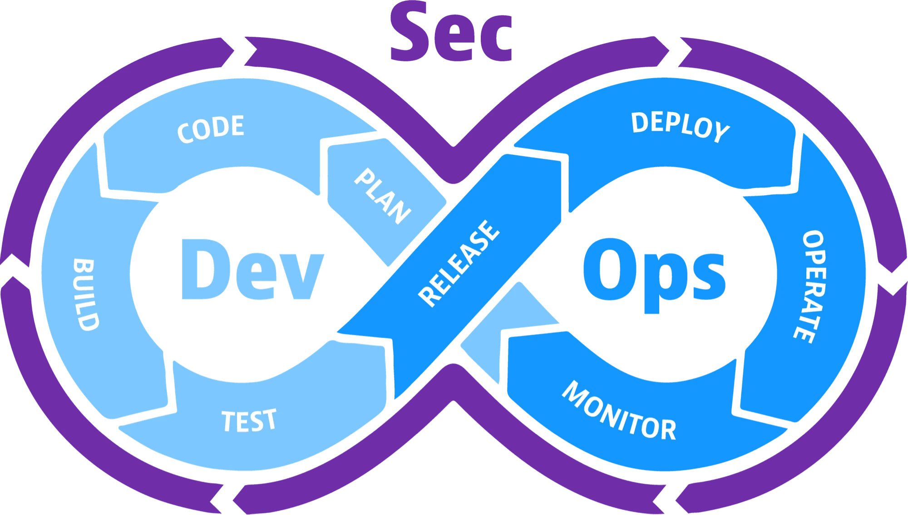
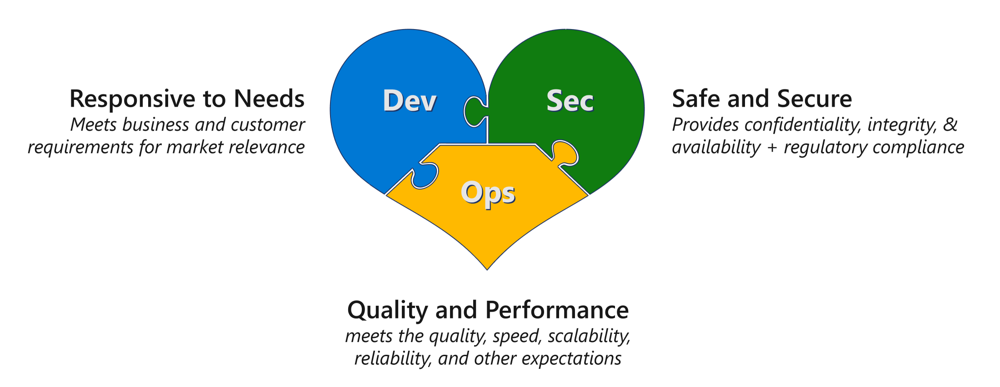
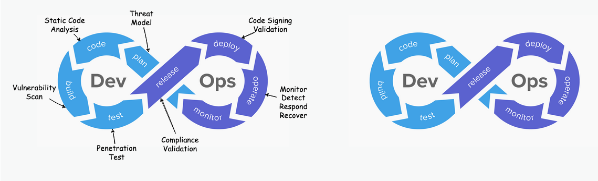
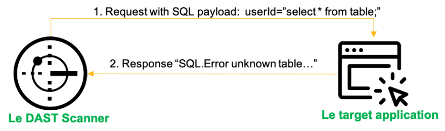
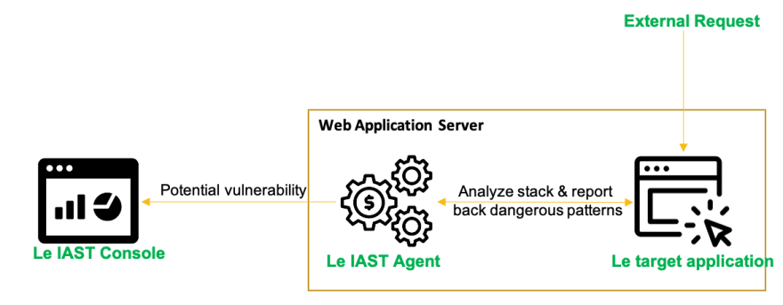
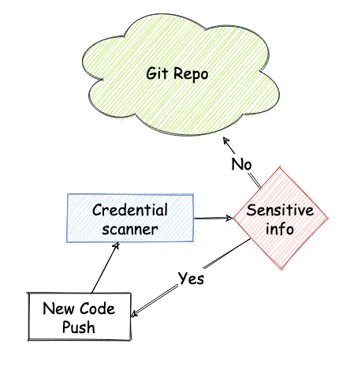
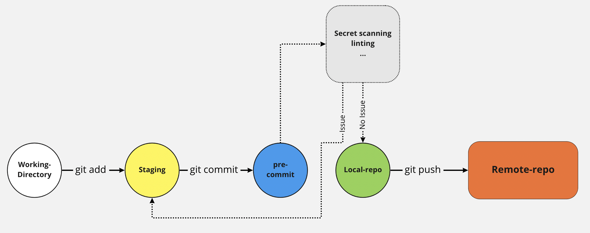
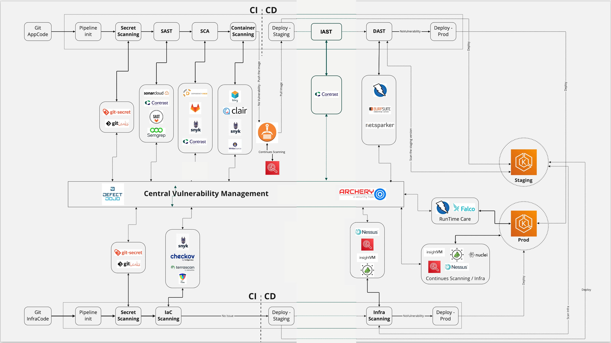

# DevSecOps

## 1. Giới thiệu về DevSecOps

### 1.1 Khái niệm và lợi ích của DevSecOps

DevSecOps được viết tắt từ Development (Phát triển), Security (Bảo Mật) và Operations (Vận hành) là phương pháp phát triển ứng dụng tích hợp an ninh (DevOps) với quy trình bảo mật từ giao đoạn đầu của quá trình phát triển.

  

<i><a href= "https://www.dynatrace.com/news/blog/what-is-devsecops/">DevSecOps</a></i>

 

Mục đích của DevSecOps đó chính là tự động hóa, giám sát và áp dụng bảo mật ở tất cả các giai đoạn của quá trình phát trển phần mềm từ lúc lập kế hoạch, phát triển, xây dựng, thử nghiệm, phát hành, phân phối, triển khai, vận hành đến giám sát phần mềm. Việc áp dụng bảo mật vào tất cả các giai đoạn trong quá trình phát triển phần mềm sẽ hỗ trợ CI/CD, giảm chi phí và phân phối nhanh chóng hơn.

### 1.2 So sánh giữa DevOps và DevSecOps

DevSecOps tích hợp nhóm bảo mật của tổ chức vào tổ chức DevOps truyền thống. Trong khi DevOps tích hợp các nhóm sản xuất và phát triển phần mềm để tạo ứng dụng không có lỗi thì DevSecOps thêm một bước nữa để đảm bảo các ứng dụng đó được an toàn.

DevOps và DevSecOps không phải là lựa chọn loại trừ lẫn nhau. Các tổ chức có thể áp dụng DevOps và dần dần chuyển sang DevSecOps khi bảo mật trở thành ưu tiên lớn hơn.

Đạt được sự cân bằng hợp lý giữa cộng tác, hiệu quả và bảo mật là chìa khóa để mở khóa toàn bộ tiềm năng của các quy trình phát triển phần mềm và cung cấp các giải pháp an toàn và chất lượng cao.

### 1.3 Tầm quan trọng của bảo mật trong quy trình phát triển phần mềm hiện đại

Ngày nay, hầu hết các doanh nghiệp đều mong muốn chuyển đổi số và nó thường bao gồm 3 yếu tố quan trọng quyết định đó là ứng dụng nhiều phần mềm, công nghệ đám mây và phương pháp an ninh mạng (DevOps).

Nhiều phần mềm có nghĩa là các tổ chức có nhiều rủi ro hơn khi chuyển đổi sang kỹ thuật số, đòi hỏi kỹ thuật cao, bảo mật ứng dụng nên đối mặt với nhiều thách thứ để bảo mật tài sản kỹ thuật số.

Công nghệ đám mây là sử dụng công nghệ mới hơn gây ra nhiều rủi ro, thay đổi nhanh, tiếp cận công khai, gây nhiều thách thức về CNTT và cơ sở hạ tầng khi chuyển sang đám mây. Đồng thời việc cấp phép và quản lý quyền truy cập cũng có vai trò quan trọng.

DevOps – Sự thay đổi trong quá trình phát triển và phân phối phần mềm, đẩy nhanh quá trình viết mã đến mang lại giá trị cho khách hàng. Nhóm phát triển ứng dụng được trao quyền cung cấp phần mềm liên tục và nhanh hơn, đưa ra các quyết định về công nghệ và triển khai tự động, không qua trung gian.,..

Khi phần còn lại của tổ chức phát triển, nhóm bảo mật phải đối mặt với các thách thức lớn. Khi thiếu nguồn lực trong phát triển các phần mềm bảo mật khiến cho các ứng dụng mất an toàn, khiến doanh nghiệp đối mặt với nhiều rủi ro. Để giải quyết những thách thức này, DevSecOps được ra đời. Phương pháp DevSecOps đưa tính bảo mật vào trong DevOps, cho phép các nhóm phát triển bảo mật những gì họ xây dựng trong tất cả các giao đoạn phát triển, đồng thời kết nối tốt hơn giữa nhà phát triển và nhóm bảo mật. Cho phép các nhóm bảo mật trở thành một tổ chức hỗ trợ, cung cấp kiến ​​thức chuyên môn và công cụ để tăng cường quyền tự chủ của nhà phát triển trong khi vẫn cung cấp mức độ giám sát. Việc tích hợp DevSecOps và DevOps giúp các nhà phát triển, quản trị viên mạng,.. chú trọng bảo mật hơn phát triển và triển khai ứng dụng.

## 2. Áp dụng Sec vào DevOps

Ngày nay, với việc công nghệ đang thay đổi theo từng ngày, DevOps được triển khai rộng rãi và phổ biến vào các công ty công nghệ, đòi hỏi môi trường cho các sản phẩm Production cũng thay đổi với tốc độ chóng mặt. Thời gian để cung cấp là tính năng đóng vai trò rất quan trọng trong quá trình này, vì thế câu hỏi được đưa ra cho các Chuyên gia bảo mật là "Làm cách nào để đảm bảo an toàn cho quy trình này?" hoặc "Các sản phẩm có được phát hành ra được bảo mật ở mức độ nào?".

Để trả lời cho vấn đề này, đòi hỏi chúng ta phải tích hợp Security vào toàn bộ chu trình DevOps để thử nghiệm, đánh giá toàn bộ các bước Security một cách tự động. Vì vậy, việc đưa văn hóa DevSecOps giúp chúng ta đảm bảo chiến lược shift-left được đề ra trong quá trình hoàn thiện vòng đời của sản phẩm.

  

### 2.1 Chiến lược bảo mật Shift-left

Chiến lược bảo mật shift-left là một cách hoặc giải pháp để nhúng bảo mật như một phần của quá trình phát triển sản phẩm của chúng ta và được quy hoạch các chốt chặn bảo mật từ các bước khởi đầu của ứng dụng hoặc thiết kế hệ thống. Mục đích và ý định của DevSecOps là xây dựng trên suy nghĩ rằng **_'mọi người đều có trách nhiệm về bảo mật'_** với mục tiêu chia sẻ phân tán các chốt kiểm tra bảo mật một cách tự động để đưa ra các quyết định bảo mật với mức độ an toàn hợp lý.

### 2.2 Xây dựng văn hóa DevSecOps

Giả sử rằng đang làm việc trong một nhóm DevOps và đang thực hiện kiểm tra bảo mật theo truyền thống. Quy trình là sản phẩm phải đạt tất cả các bài kiểm tra QA và nhóm develop phải thực hiện fix các bug sau khi test QA thì quá trình kiểm thử bảo mật được diễn ra, sau khi quá trình bảo mật kết thúc, QA phải thực hiện test lại 1 lần nữa, và retest từ phía bảo mật lại diễn ra. Điều đó làm mất thời gian, chi phí và có thể phải bị cuốn sâu vào vòng lặp, thậm chí phải hy sinh một số giai đoạn để đáp ứng các nhu cầu về mặt Business.

Giải pháp là thực hiện theo chiến lược Shift-Left nên xem xét bảo mật từ thiết kế mà mục tiêu là thực hiện việc bảo mật sớm hơn trong quá trình phát triển để có các chốt chặn bảo mật trước ngay từ khi khởi động, để giảm chi phí và thời gian thực hiện ở các giai đoạn sau.

  

#### 2.2.1 Quyền riêng tư​

Quyền riêng tư đã trở thành một chủ đề chính cho các công ty thuộc mọi quy mô, kể từ khi các thông tin các nhân được định nghĩa theo các chuẩn Quốc Tế như: GDPR (Quy định bảo vệ dữ liệu chung của châu Âu), CCPA (Đạo luật bảo mật người tiêu dùng California), LGPD - Lei Geral de Proteção de Dados của Brazil và các luật và quy định khác đang được thực thi trên toàn Thế Giới. Các ứng dụng phải xử lý một khối lượng lớn PII (thông tin nhận dạng cá nhân) buộc chúng ta điều chỉnh, thiết kế quy trình DevSecOps để không bị vi phạm chính sách Quyền Riêng Tư trong toàn bộ vòng đời sản phẩm

#### 2.2.2 Chiến lược kiểm thử phần mềm​

**Positive Testing​**

Thực hiện trong điều kiện bình thường và đầu vào, mọi thứ sẽ hoạt động như mong đợi. Nó được thực hiện với giả định rằng chỉ những điều hợp lệ và có liên quan sẽ xảy ra: tập dữ liệu và tất cả các chức năng khác sẽ như mong đợi.

**Negative Tesing​**

Thực hiện kiểm tra hành vi hệ thống trong điều kiện bất ngờ. Negative Tesing đóng một vai trò quan trọng trong việc phát triển phần mềm hiệu suất cao: nó kiểm tra hành vi phần mềm trong điều kiện và đầu vào bất ngờ.

#### 2.2.3 Các phương pháp kiểm thử phần mềm​

**Static Testing**

Static Testing kiểm tra lỗi phần mềm mà không thực thi mã ứng dụng. Quá trình này, được thực hiện trong giai đoạn đầu của sự phát triển để tránh lỗi, vì nó dễ dàng hơn để tìm mã nguồn có lỗi và nó có thể được khắc phục dễ dàng. Một số vấn đề không thể tìm thấy khi sử dụng Dynamic Testing, có thể dễ dàng tìm thấy bằng Static Testing. Những vấn đề như vậy bao gồm thông tin đăng nhập sử dụng mã hóa đã lỗi thời, không sử dụng các thuật toán mã hóa, các hàm ngẫu nhiên có độ phức tạp yếu, v.v. Hầu hết các công cụ phân tích tĩnh có phạm vi thử nghiệm giới hạn ở một thành phần của mã nguồn.

  

**Dynamic Testing**

Dynamic Testing phân tích hành vi của mã ứng dụng tại thời gian chạy. Công cụ gửi các yêu cầu được viết theo kịch bản đặc biệt để khai thác ứng dụng mục tiêu. Các thông số yêu cầu liên tục được sửa đổi trong quá trình thử nghiệm để kiểm thử và tìm ra một loạt các lỗ hổng. Dựa trên phản hồi của ứng dụng, công cụ sau đó có thể xác định các lỗ hổng tiềm ẩn và báo cáo lại. Một số vấn đề không thể tìm thấy bằng phân tích tĩnh nhưng dễ dàng được phát hiện bằng phân tích động như các lỗ hổng phía khách hàng như xác thực vấn đề phiên làm việc, dữ liệu nhạy cảm được gửi bằng văn bản thuần túy, v.v. Các công cụ phân tích động có khả năng kiểm tra toàn bộ luồng ứng dụng (nhiều thành phần cùng một lúc).

  

**Interactive analysis**

Còn được gọi là Interactive Application Security Testig (IAST) giám sát ứng dụng trong khi các hệ thống khác tương tác với nó và quan sát các lỗ hổng. Các cảm biến có thể nhìn thấy toàn bộ luồng từ yêu cầu HTTP xuống mã đã thực thi, theo dõi dữ liệu thông qua ứng dụng. Tương tự như phân tích tĩnh, nó có thể kiểm tra một thành phần tại một thời điểm, nhưng không phải là đa thành phần cùng một lúc.

  

 

## 3. Đảm bảo thông tin nhạy cảm không lộ trong vòng đời triển khai CI/CD của dự án

Đây là một trong những vấn đề ưu tiên trong OWASP và một số bài viết về bug bounty đã đề cập đến vấn đề này, ví dụ các thông tin đăng nhập user/password, api key bị hardcode ở môi trường production do nhầm lẫn, hoặc do không nhận thức được hành động này là nguy hiểm.

Phải đảm bảo kho lưu trữ của mình không được chứa và đồng thời phát hiện bất kỳ thông tin nhạy cảm nào như mật khẩu, khóa bí mật, bí mật, v.v. theo quy trình bên dưới.

  

Cách phát hiện và ngăn chặn việc lộ lọt với dữ liệu nhạy cảm trước khi chúng truy cập vào repo chứa mã nguồn, bởi vì sau đó chúng sẽ hiển thị trong một số công cụ ghi nhận lịch sử của trang web như web archive.

Trong trường hợp một số nền tảng lưu trữ mã nguồn, mà các thông tin bí mật vẫn có thể tồn tại trên web và có thể tìm kiếm được sau khi xóa chúng khỏi kho lưu trữ. Hãy đảm bảo rằng các thông tin đó phải được vô hiệu hóa và không còn hiệu lực.

Phát hiện các thông tin nhạy cảm ở một số phase:

- **_Phát hiện các thông tin nhạy cảm ở trong repository (hardcode trong mã nguồn)_**
- **_Sử dụng các Pre-commit hook để ngăn chặn hiển thị cleartext ở code_**
- **_Phát hiện trong log quá trình chạy các pipeline mà ko mã hóa thông tin_**
- **_Thực hiện bước kiểm tra Secret Scanning trước khi đưa lên repo để đảm bảo các thông tin đã được mask, mã hóa từ đầu đến cuối trong suốt quá trình_**

  

### 3.1 Các công cụ quản lý lỗ hổng bảo mật

Quản lý lỗ hổng là một quá trình trong CI/CD giúp các tổ chức phát hiện, báo cáo, ưu tiên và khắc phục các lỗ hổng trong phần mềm và nền tảng của họ. Đây là một phần quan trọng của vòng đời DevSecops vì nó cho phép khả năng tổ chức tổng hợp các lỗ hổng bảo mật theo cách có thể quản lý, và có các hành động khắc phục cho toàn bộ vòng đời của sản phẩm.

- [gittyleaks](https://github.com/kootenpv/gittyleaks) - Tìm thông tin nhạy cảm cho git repo
- [git-secrets](https://github.com/awslabs/git-secrets) - Ngăn cam kết bí mật và thông tin đăng nhập vào kho git
- [Repo-supervisor](https://github.com/auth0/repo-supervisor) - Quét mã để định cấu hình sai bảo mật, tìm kiếm mật khẩu và bí mật
- [truffleHog](https://github.com/trufflesecurity/trufflehog) - Tìm kiếm thông qua kho git để tìm các chuỗi và bí mật entropy cao, đào sâu vào lịch sử cam kết
- [Git Hound](https://github.com/ezekg/git-hound) - Git plugin ngăn dữ liệu nhạy cảm được cam kết
- [Github Secret Scanning](https://docs.github.com/en/code-security/secret-scanning) - Github được tích hợp sẵn tính năng cho bí mật Detection

### 3.2 Cách hoạt động của các công cụ quản lý lỗ hổng bảo mật

- **Phát hiện**: Trong chu kỳ phát hiện, chúng tôi tiến hành các nhiệm vụ hỗ trợ kiểm tra lỗ hổng theo những cách cần thiết bằng cách xác định: ai, cái gì, ở đâu, khi nào, lý do tại sao và làm thế nào. Các hoạt động chính tập trung vào việc xác định và tinh chỉnh phạm vi sau mỗi vòng của quy trình, chuẩn bị sẵn sàng và xác minh tính toàn vẹn của chúng, tiến hành kiểm tra và xác minh kết quả.
- **Báo cáo**: Chu kỳ báo cáo nhắm mục tiêu các hoạt động giúp tổ chức hiểu được lỗ hổng theo cách có thể đo lường được. Các hoạt động chính được tập trung vào việc nắm bắt nhanh chóng và chính xác tất cả các hệ thống, lỗ hổng bảo mật, mối đe dọa, rủi ro kỹ thuật và chi tiết rủi ro hoạt động liên quan đến lỗ hổng.
- **Độ ưu tiên**: Quá trình ưu tiên chọn các lỗ hổng và làm việc với các nhóm phát triển để sửa chúng. Một số lỗ hổng có thể đại diện cho rủi ro tối thiểu hoặc không thể khai thác. Rủi ro là một yếu tố chính trong quá trình ưu tiên, nhưng nỗ lực và chuyên môn cần thiết cũng là những yếu tố chính.
- **Khắc phục**: Các hoạt động chính tập trung vào việc xác định các ưu tiên và điều khoản của công việc khắc phục, thảo luận và ghi lại các tình huống false positive (bug giả) và xử lý các ngoại lệ.

### 3.3 Cách để sử dụng công cụ quản lý lỗ hổng bảo mật trong DevSecOps

- Các công cụ sử dụng để tạo quy trình DevSecOps sẽ tạo ra nhiều lỗ hổng và mỗi công cụ sẽ có định dạng riêng.

- Các công cụ Quản lý lỗ hổng hợp nhất các báo cáo được tạo bởi các công cụ và hoạt động khác nhau trong một hoặc một vài bảng thông tin.

Các thành viên trong nhóm có thể theo dõi tiến trình của các nỗ lực khắc phục bằng số liệu, phân loại và ưu tiên các phát hiện trên toàn bộ quy trình và quản lý vòng đời lỗ hổng trong toàn bộ quy trình.

Cuối cùng, các công cụ này cung cấp tích hợp với các thành phần khác để cho phép giao tiếp hai chiều, thông báo, xuất dữ liệu và tạo báo cáo.

  

