# Microservices Author/Authen From Blog

Status: Done

# I. Authen/Author trong Monolithic

- Authorization:  Xác định user có thể làm gì.
    
    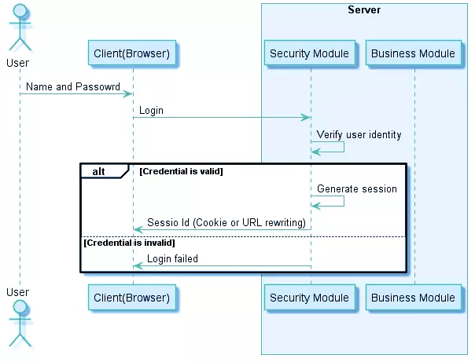
    
- Authentication: Xác định user là ai.
    
    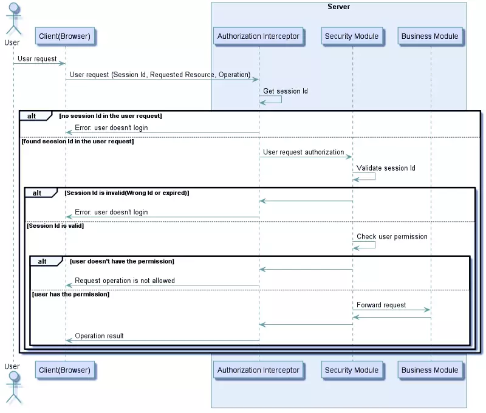
    

# II. Microservices

Vấn đề của xác thực, phân quyền trong microservices.

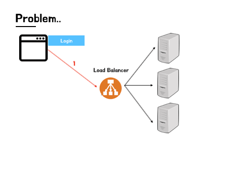

## Authen & Author on each service

Mỗi services cần phải triển khai phần bảo mật riêng biệt và gắn vào mỗi entry-point. 

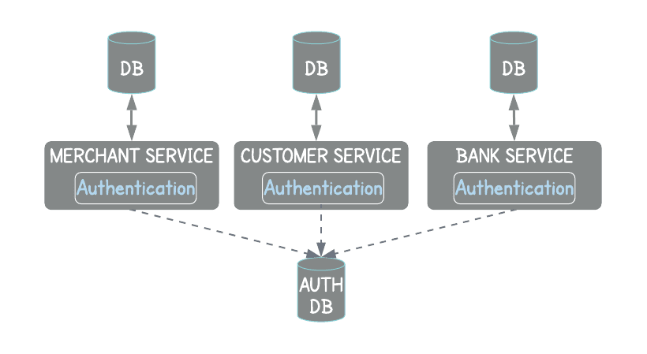

**Ưu:** Giúp các team tự kiểm soát và triển khai giải pháp bảo mật riêng

**Nhược:** 

- Logic được triển khai lặp lại ở trên từng microservices → Code duplication
- Việc phải làm thêm phần bảo mật → không tập trung vào main service.
- Từng service phụ thuộc vào user authentication data - cái mà các service không sở hữu.
- Khó maintain và monitor.
- Authentication nên là một giải pháp toàn cục.

## **Global Authentication & Authorization Service**

Tạo ra một microservice để xử lí authen và author. 

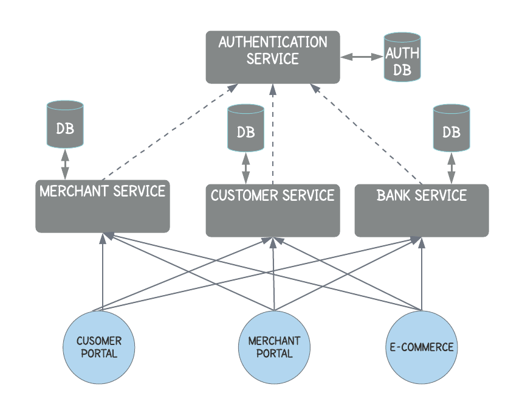

- Tăng latency
- Authorization concern should not be handled in the global.

## **Distributed Session Management**

- **Sticky Session**

Đảm bảo req từ user luôn được gửi đến cùng một server xử lý req đầu tiên của user đó → đảm bảo tính chính xác. 

**Tuy nhiên,** yêu cầu load balancer → vấn đề khi load balancer gửi user đến server khác.

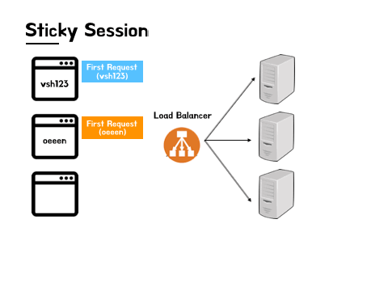

- **Session replication**

Mỗi server lưu hết session và đồng bộ

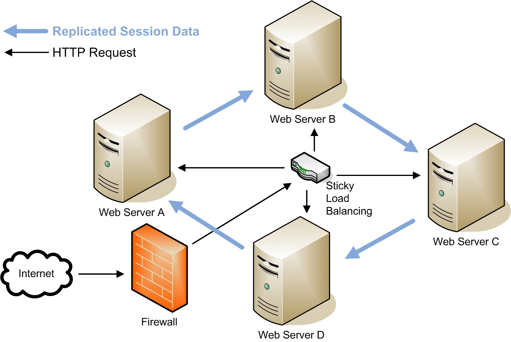

**Vấn đề:** Nhiều server → Đồng bộ có thể dẫn đến tắc nghẽn băng thông.

- **Centralized session storage**

Nghĩa là khi user truy xuất một microservice, dữ liệu người dùng có thể được lấy từ một nơi lưu trữ session chung, để đảm bảo tất cả các microservice đọc được dữ liệu giống nhau.

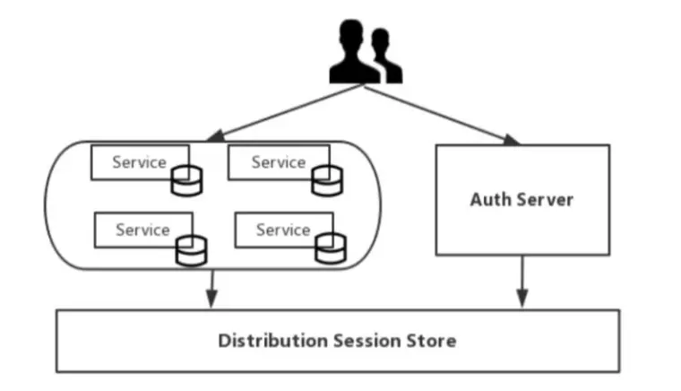

**Vấn đề:** Việc quản lý session tập trung sẽ yêu cầu một cơ chế bảo mật riêng biệt.

## Client Token

Cách truyền thống là dùng session ở phía server để lưu lại trạng thái người dùng. Vì server là statefull, nó sẽ ảnh hưởng đến khả năng *horizontal scaling.*

Giải pháp ở đây là dùng token để lưu trạng thái đăng nhập của người dùng trong kiến trúc microservice.

Khác biệt giữa token và session là *nơi lưu trữ.:*

- Session được lưu ở server
- Token thì được giữ bởi người dùng và được lưu ở trình duyệt theo dạng cookie.

Token được dùng để xác thực định danh của người dùng. Bởi vậy nội dung của token cần được mã hóa để tránh bị giả mạo. →  JWT (Json Web Token)

**JWT:** Có 3 thành phần :

- Header
- Payload
- Signature

JWT = base64encode(Header.Payload.Signature)

**Flow:**

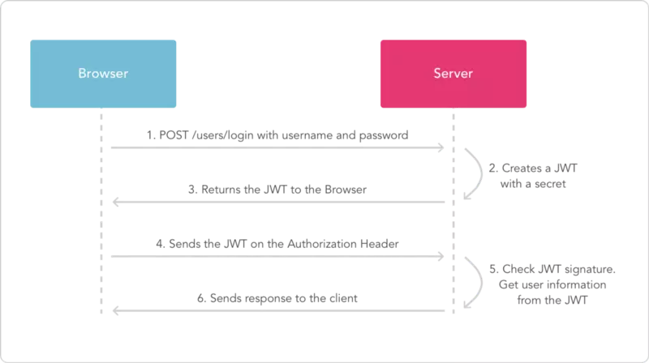

## SSO

Ý tưởng của *single sign-on* rất đơn giản, đó là người dùng chỉ cần đăng nhập 1 lần, và họ có thể truy cập mọi microservice của ứng dụng. Giải pháp này có nghĩa là mỗi service sẽ phải tương tác với *authentication* service như dưới:

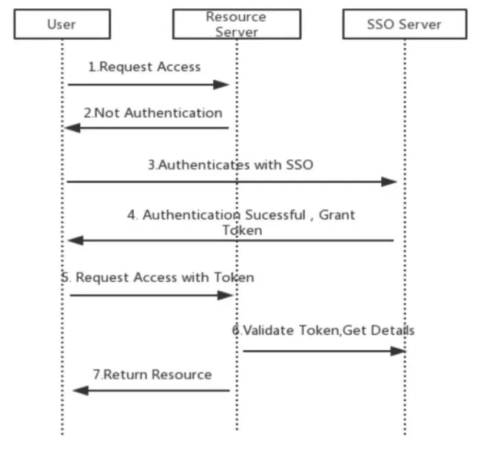

**Vấn đề:** Lặp lại thao tác validate với một lưu lượng mạng rất nhỏ → *single point of failure. *****

## **Global Authentication (API Gateway) and authorization per service**

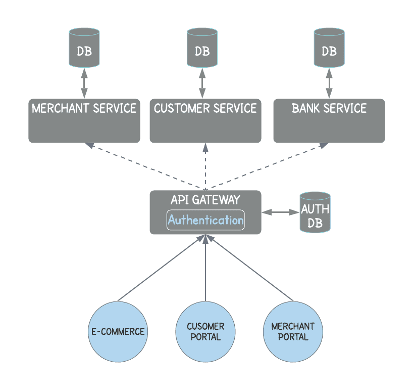

## Client Token với API Gateway

Quá trình xác thực người dùng tương tự như cách sử dụng token.

API Gateway được thêm vào như một cổng chờ các *external request*.

Tất cả các request phải thông qua API Gateway, nhằm mục đích là ẩn đi sự hiện diện của microservice. (Tính trong suốt)

Với mỗi request thì API Gateway sẽ **dịch token của người dùng thành một token riêng mà chỉ nó có thể resolve**:

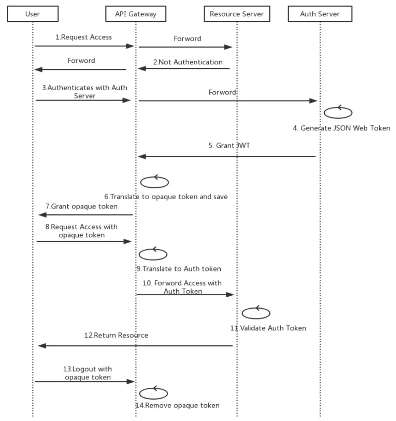

*Log off* không còn là một vấn đề bởi vì API Gateway có thể revoke token của người dùng khi *log out.*

**Vấn đề :** 

1. **Latency**: The added network hop to the architecture accounts for an increase in latency throughout the system.
2. **SPoF**: The API Gateway being the single entry point for all requests acts as a Single Point of Failure(SPoF). This can be mitigated to some end by having multiple API Gateways and split the calls using Load Balancer and Elastic IP.
3. **Added Complexity**: The API Gateway can get complex when the end users can be of various kinds like IoS, Android, Web, etc. In this case we can add multiple configurations for different entry points. This architecture is also known as “Backend for Frontend” pattern.

## **Third-party application access**

### API Token

Ứng dụng bên thứ 3 sử dụng API token để truy cập dữ liệu. Token được sinh bởi người dùng bởi ứng dụng bên thứ 3. Trong trường hợp này UD bên t3 được cho phép truy cập thông tin của chỉ riêng người dùng đó.

### OAuth

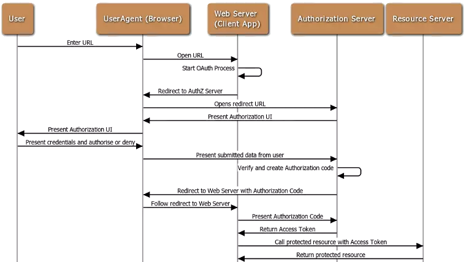

## Một vài note

- **Stateless và Stateful:**
    - Statefull Authentication : Server tạo session cho người dùng sau khi authen. Session id này được client lưu ở cookie và server lưu tại cache hoặc db. Khi mà client cố gắng truy cập server với session id thì server sẽ load session context, kiểm tra xem session có valid không. và quyết định xem client có được truy cập không.
    - Stateless authentication: lưu session ở client-side. Thuật toán mã hoá được ký lên session của người dùng để đảm tính integrity và authority. → Giải phóng chi phí overhead cho việc quản lý session state. → Dễ scale.
- **Vì Sao Server-Base authentication lại ảnh hưởng đến việc scale?**
    
    TL: 
    
    **Sessions** : Every time a user is authenticated, the server will need to create a record somewhere on our server. This is usually done in memory and when there are many users authenticating, the overhead on your server increases.
    
    **Scalability** : Since sessions are stored in memory, this provides problems with scalability. As our cloud providers start replicating servers to handle application load, having vital information in session memory will limit our ability to scale.
    
- **JWT best practice:**
    - Luôn sử dụng HTTPS
    - Giữ cho token size nhỏ. JWT có thể sign bằng JWS hoặc JWE.
    - Sử dụng secret key mạnh.
    - TTL ngắn.
    - JWT không ngăn chặn được CSRF. Sử dụng [synchronizer token pattern](https://cheatsheetseries.owasp.org/cheatsheets/Cross-Site_Request_Forgery_Prevention_Cheat_Sheet.html#General_Recommendation:_Synchronizer_Token_Pattern).
    - JWT không được chứa thông tin nhạy cảm

# III. Implements with Rust

**Một vài lib:** 

- [cookie](https://docs.rs/cookie/latest/cookie/index.html)
    - crate để tạo và parsing HTTP cookies. Dùng để quản lý sessions, encrypting và sign cookies.
    - Production-ready: Yes
    - Async support: No
- [jsonwebtoken](https://docs.rs/jsonwebtoken/latest/jsonwebtoken/index.html)
- [oauth2](https://docs.rs/oauth2/latest/oauth2/index.html)
- [otpauth](https://messense.github.io/otpauth-rs/otpauth/index.html)
- [yup-oauth2](https://docs.rs/yup-oauth2/latest/yup_oauth2/)
- [Asap](https://docs.rs/asap/latest/asap/)
- [JWKS-Client](https://github.com/jfbilodeau/jwks-client)
- [openssl](https://docs.rs/openssl/0.10.30/openssl/)
- [pgen](https://github.com/ctsrc/Pgen)

Session Example: 

Example: https://github.com/Sirneij/rust-auth 

Series: [Authentication system using rust (actix-web) and sveltekit - Backend Intro - DEV Community](https://dev.to/sirneij/full-stack-authentication-system-using-rust-actix-web-and-sveltekit-1cc6)

# IV. References

- [Viblo](https://viblo.asia/p/giai-phap-xac-thuc-va-phan-quyen-cho-microservice-maGK7pdaZj2)
- [Authentication & Authorization in Microservices Architecture - Part I](https://dev.to/behalf/authentication-authorization-in-microservices-architecture-part-i-2cn0)