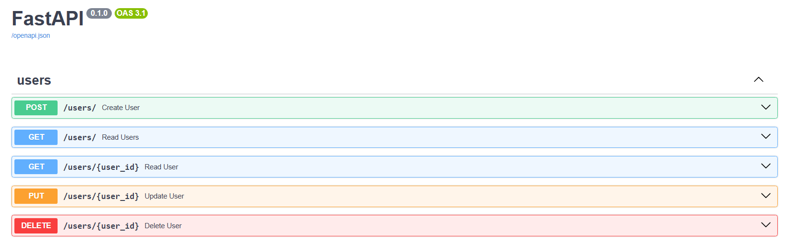
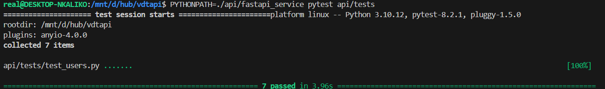
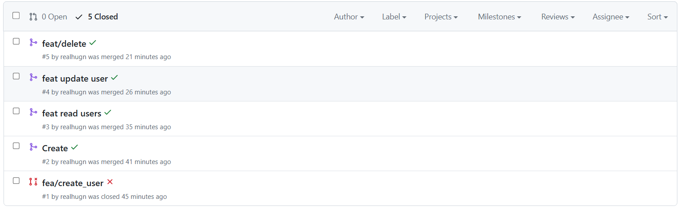
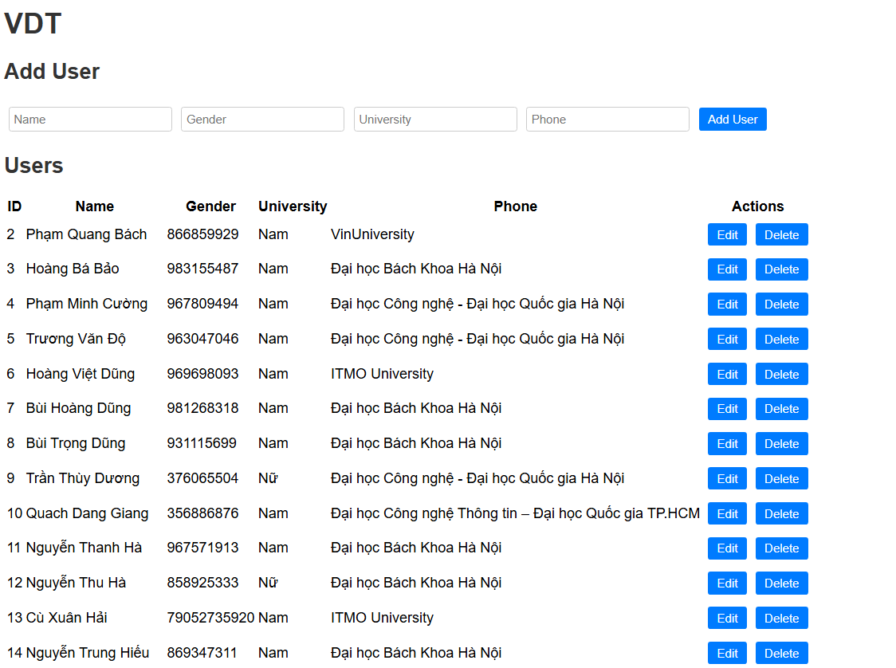
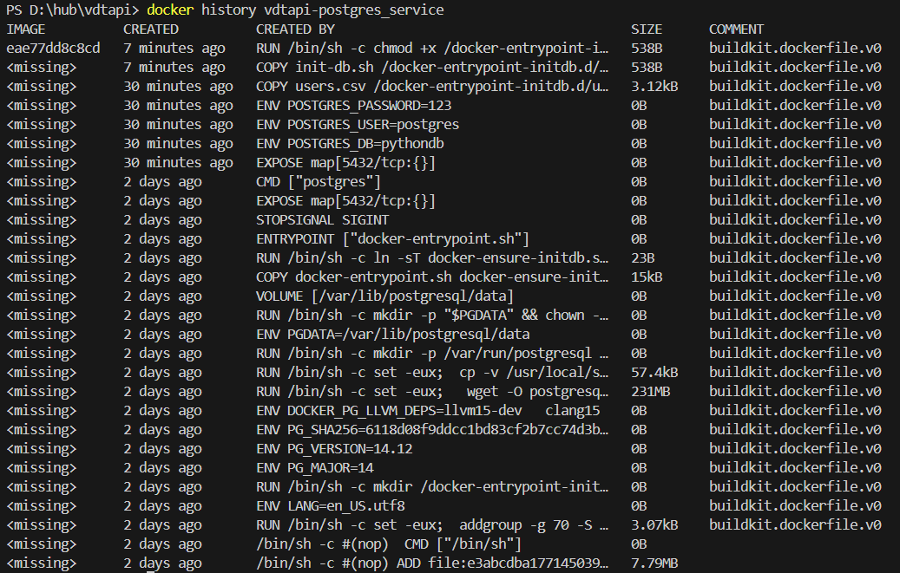
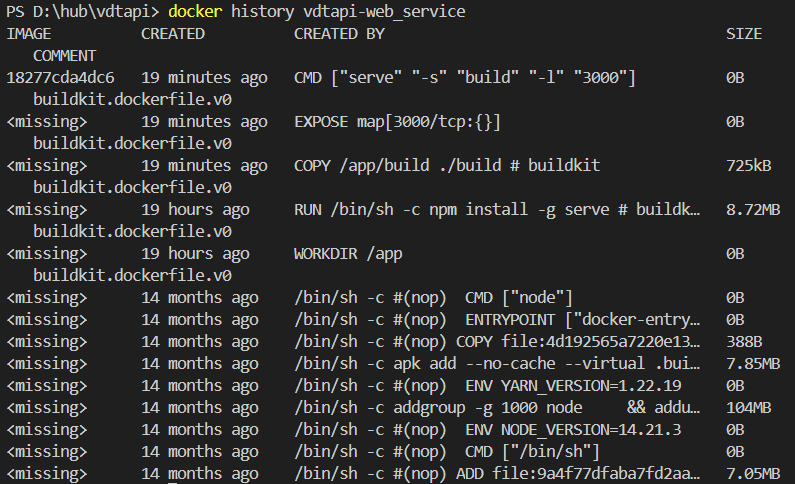
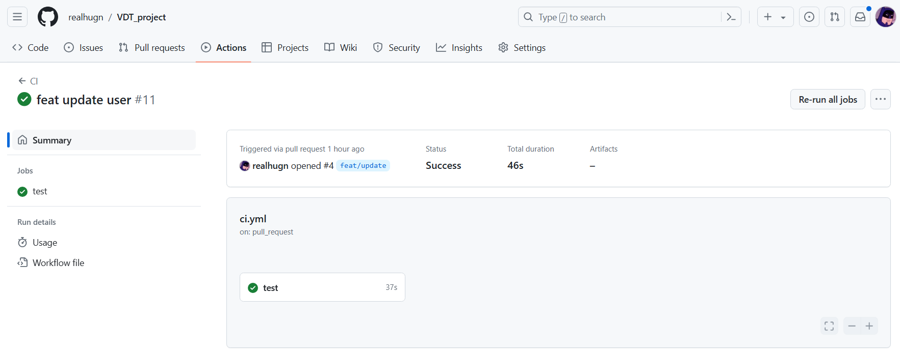
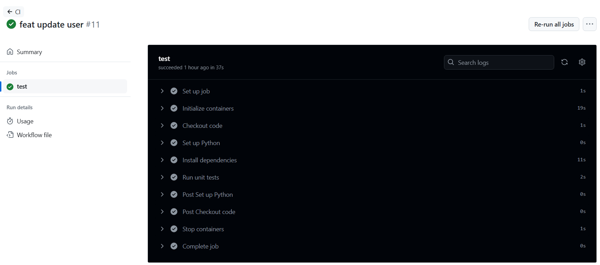
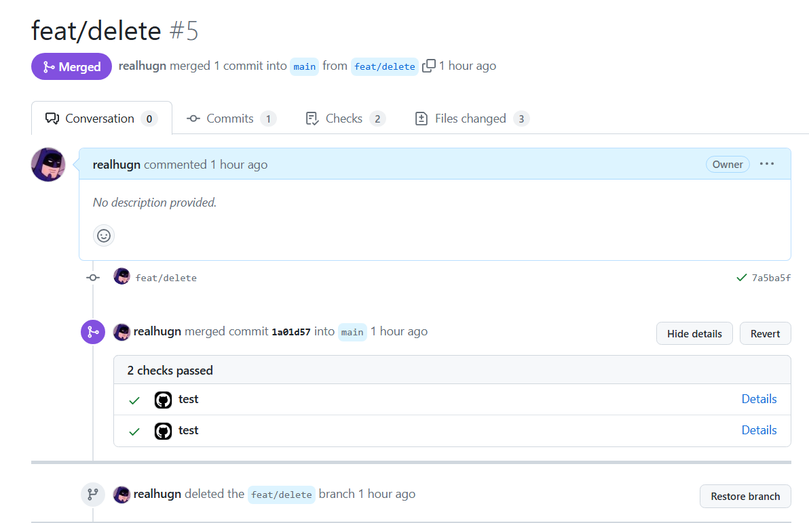
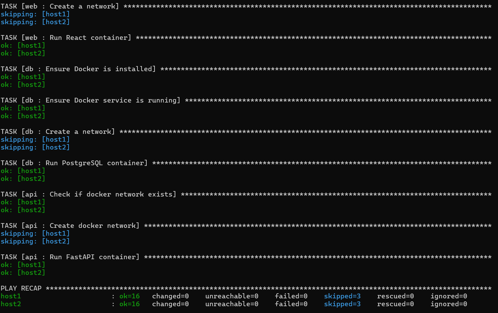

# Bài tập lớn giữa kỳ chương trình VDT 2024 lĩnh vực Cloud

## Phát triển một 3-tier web application đơn giản 
[Source Code](https://github.com/realhugn/VDT_project)
### API
#### Enpoint
- `GET /users/` : Get All Users
- `GET /users/{id}`: Get An User
- `POST /users/` : Create User
- `PUT /users/{id}`: Update User
- `DELETE /users/{id}`: Delete User
 

#### Unit Test

#### Pull Request

### DB
- Postgres
### Web
- React

## Triển khai web application sử dụng các DevOps tools & practices

1. <b>Containerization</b>
 
File Dockerfile cho từng dịch vụ:
- [web](https://github.com/realhugn/VDT_project/tree/main/web/Dockerfile)
- [db](https://github.com/realhugn/VDT_project/tree/main/db/Dockerfile)
- [api](https://github.com/realhugn/VDT_project/tree/main/api/fastapi_service/Dockerfile)

 
Output câu lệnh build và thông tin docker history của từng image

  <i>Pic. 1 - Postgres image docker history</i>

  <i>Pic. 2 - Web image docker history</i>

  <i>Pic. 3 - Api image docker history</i>

2. <b>Continuous Integration</b>
 

- [File setup công cụ CI ](https://github.com/realhugn/VDT_project/tree/main/.github/workflows)
- Output log của luồng CI

- Các hình ảnh demo khác

3. Automation

[Source](https://github.com/realhugn/VDT_project/tree/main/ansible)

- Viết ansible playbooks để triển khai các image docker của các dịch vụ web, api, db, mỗi dịch vụ 1 role
 - [common](https://github.com/realhugn/VDT_project/tree/main/ansible/roles/common)
 - [web](https://github.com/realhugn/VDT_project/tree/main/ansible/roles/web)
 - [api](https://github.com/realhugn/VDT_project/tree/main/ansible/roles/api)
 - [db](https://github.com/realhugn/VDT_project/tree/main/ansible/roles/db)  
- Trong từng role cho phép tuỳ biến cấu hình của các dịch vụ thông qua các variables
 - [common](https://github.com/realhugn/VDT_project/tree/main/ansible/roles/common/vars/)
 - [web](https://github.com/realhugn/VDT_project/tree/main/ansible/roles/web/vars/)
 - [api](https://github.com/realhugn/VDT_project/tree/main/ansible/roles/api/vars/)
 - [db](https://github.com/realhugn/VDT_project/tree/main/ansible/roles/db/vars/)  
- Cho phép triển khai các dịch vụ trên các host khác nhau thông qua file inventory

## Nghiên cứu sâu về một vấn đề, khái niệm trong các chủ đề đã được học

- [API-Gateway](API-Gateway.MD)
- [Authen/Author In Microservices](Micro_Service_Auth.md)