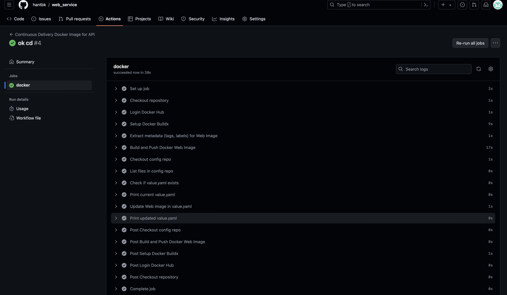
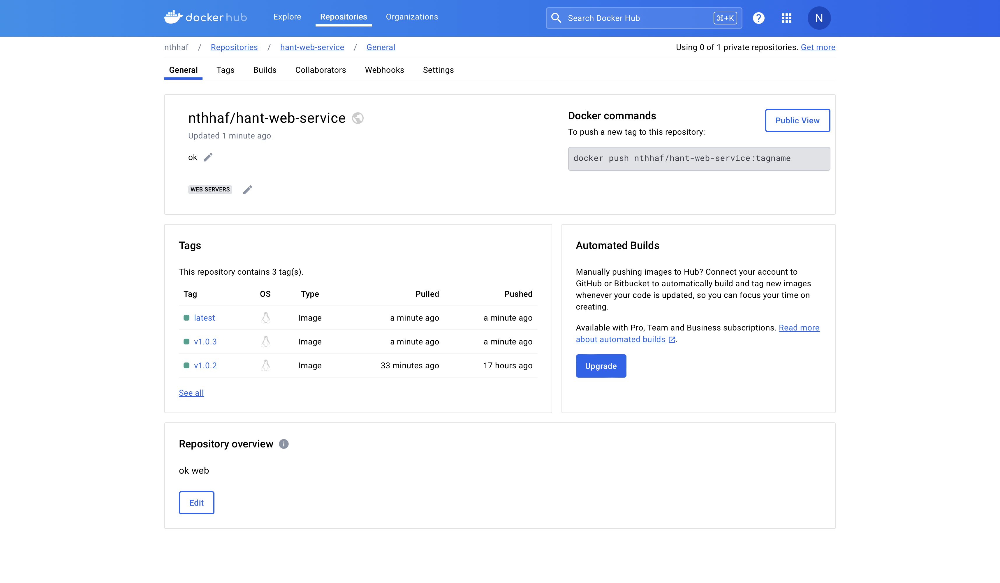
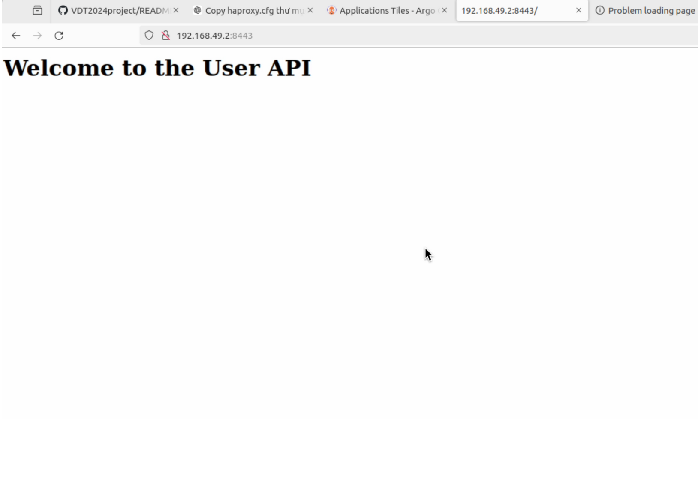
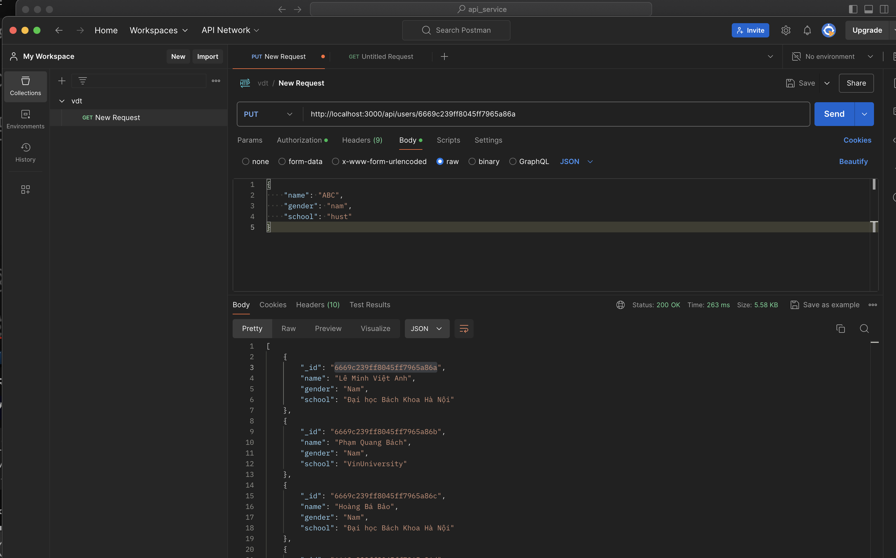

# Bài tập lớn cuối kỳ chương trình VDT 2024 lĩnh vực Cloud - GĐ 1
# Nguyễn Thanh Hà

## 1. Triển khai Kubernetes Cluster 
Đầu tiên ta cần update hệ thống
```bash
sudo apt-get update
sudo apt-get upgrade -y
sudo reboot
```


Sau khi update xong ta cài đặt Docker
```bash
for pkg in docker.io docker-doc docker-compose docker-compose-v2 podman-docker containerd runc; do sudo apt-get remove $pkg; done

# Add Docker's official GPG key:
sudo apt-get update
sudo apt-get install ca-certificates curl
sudo install -m 0755 -d /etc/apt/keyrings
sudo curl -fsSL https://download.docker.com/linux/ubuntu/gpg -o /etc/apt/keyrings/docker.asc
sudo chmod a+r /etc/apt/keyrings/docker.asc

# Add the repository to Apt sources:
echo \
  "deb [arch=$(dpkg --print-architecture) signed-by=/etc/apt/keyrings/docker.asc] https://download.docker.com/linux/ubuntu \
  $(. /etc/os-release && echo "$VERSION_CODENAME") stable" | \
  sudo tee /etc/apt/sources.list.d/docker.list > /dev/null
sudo apt-get update

sudo apt-get install docker-ce docker-ce-cli containerd.io docker-buildx-plugin docker-compose-plugin
```


Thêm user vào group docker
```bash
sudo usermod -aG docker $USER
newgrp docker
```


Cài đặt miniKube
```bash
curl -LO https://storage.googleapis.com/minikube/releases/latest/minikube-linux-arm64
sudo install minikube-linux-arm64 /usr/local/bin/minikube && rm minikube-linux-arm64
minikube --version
```


Cài đặt kubectl
```bash
curl -LO https://storage.googleapis.com/kubernetes-release/release/v1.22.0/bin/linux/arm64/kubectl
chmod +x kubectl
sudo mv kubectl /usr/local/bin/
kubectl version --client
```


Khởi động minikube
```bash
minikube start --driver=docker
```


Kiểm tra hệ thống
```bash
kubectl status
kubectl get nodes -o wide
kubectl cluster-info
```


## 2. Triển khai ứng dụng web application sử dụng DevOps tools 
### 2.1. Triển khai ứng dụng web application lên K8S sử dụng Helm Chart

Thêm repo của Helm để setup ArgoCD
```bash
helm repo add argo https://argoproj.github.io/argo-helm
helm search repo argo
```

Chuyển đổi argo-cd Helm chart thành file K8S manifest
```bash
helm template argo argo/argo-cd --output-dir argocd-manifests
```

Sửa đổi NodePort của service argo-cd-server
```bash
helm show values argo/argo-cd > values.yaml
```

Sửa đổi file values.yaml để thay đổi từ ClusterIP sang NodePort ở service configuration block


Tạo namespace argocd
```bash
kubectl create namespace argocd
```

Cài đặt ArgoCD
```bash
helm install argo argo/argo-cd --namespace argocd --values values.yaml
```
- [values.yaml](https://github.com/hantbk/VDTCK/blob/main/argocd/values.yaml) 

Truy cập ArgoCD UI tại địa chỉ http://192.168.49.2:30080

Thực hiện login vào ArgoCD với username/password mặc định là admin, password lấy từ secret argocd-initial-admin-secret
```bash
kubectl get secret argocd-initial-admin-secret -n argocd -o jsonpath="{.data.password}" | base64 -d
```


### 2.2. Triển khai ứng dụng web application lên K8S sử dụng ArgoCD

Helm Chart của Web Deployment và Api Deployment

- [Web Deployment](https://github.com/hantbk/web_service/tree/main/charts)
- [Api Deployment](https://github.com/hantbk/api_service/tree/main/charts)

File manifest của Web Deployment và Api Deployment
- [Web Manifest](https://github.com/hantbk/web_service/blob/main/charts/manifest.yaml);
- [Api Manifest](https://github.com/hantbk/api_service/blob/main/charts/manifest.yaml);

Repo Config của Web Deployment và Api Deployment

- [Web Config](https://github.com/hantbk/web_config)
- [Api Config](https://github.com/hantbk/api_config)

Sử dụng tính năng multiple sources của ArgoCD để triển khai các service web và api service lên K8S Cluster

- [ArgoCD App of Web Service](https://github.com/hantbk/web_service/blob/main/argo-web-application.yaml)
- [ArgoCD App of Api Service](https://github.com/hantbk/api_service/blob/main/argo-api-application.yaml)

Đảm bảo đã tạo 2 namespace web và api trên K8S Cluster
```bash
kubectl create namespace web
kubectl create namespace api
```

Sau khi triển khai lên ArgoCD, ta sẽ thấy 2 ứng dụng web và api service được triển khai thành công


Kiểm tra thử ứng dụng web và api service


Truy cập vào web và api service thông qua NodePort của service tại địa chỉ http://192.168.49.2:30001 và http://192.168.49.2:30002


## 3. Continuous Deployment 

File setup luồng CD của ứng dụng web và api service
- [Web CD](https://github.com/hantbk/web_service/blob/main/.github/workflows/cd.yaml)
- [Api CD](https://github.com/hantbk/api_service/blob/main/.github/workflows/cd.yml)

Lưu ý: Cần phải tạo Docker Hub Token và lưu vào Secret của Github Repo và My_REPO_TOKEN trong 2 repo config để có thể thực hiện chỉnh sửa tag image của ứng dụng web và api service

Ta thấy sau khi add tag mới vào api_service thì luồng CD sẽ chạy tự động và thực hiện thay đổi tag bên repo config sau đó build lại image và push lên Docker Hub


[Github Action](https://github.com/hantbk/api_service/actions/workflows/cd.yml)

Tương tự với web service





[Github Actions](https://github.com/hantbk/web_service/actions)

Sau khi thay đổi trên repo config, ArgoCD sẽ tự động triển khai lại ứng dụng web và api service

Đầu tiên kết nối 2 repo config với ArgoCD


Tạo web hook để ArgoCD tự động triển khai khi có thay đổi trên repo config. Ở đây sử dụng ngrok để tạo đường hầm để ArgoCD có thể kết nối với Github Repo

```bash
ngrok http http://localhost:8080
```


Thêm địa chỉ url của ngrok vào webhook của Github Repo

Sau khi thay đổi trên repo config, ArgoCD sẽ tự động triển khai lại ứng dụng web service


Tương tự với api service


## 4. Monitoring

Expose metrics của ứng dụng web và api service thông qua service monitor của Prometheus

Đối với ứng dụng api service, cài đặt thư viện prom-client để expose metrics
```bash
npm install prom-client
```

Thêm đoạn code sau vào file server.js của api service để expose metrics
```javascript
const memoryUsage = require("process").memoryUsage;
const cpus = require("os").cpus;

const client = require("prom-client");

//  * CREATES A NEW OBJECT CONTAINING THE METRICS LABEL NAMES
const metric_label_enum = {
  PATH: "path",
  METHOD: "method",
  STATUS_CODE: "status_code",
};
// * CREATES A NEW CLASS FOR ASSIGNING LABELS TO VARIOUS METRICS
class MetricLabelClass {
  constructor(method, pathname, statusCode) {
    this.method = method;
    this.path = pathname;
    this.status_code = statusCode;
  }
}
// * REGISTERS A NEW PROMETHEUS CLIENT
const register = new client.Registry();
// * The http_request counter for measuring the total no of requests made to the application
const http_request_total = new client.Counter({
  name: "node_http_request_total",
  help: "The total number of HTTP requests received",
  labelNames: [
    metric_label_enum.PATH,
    metric_label_enum.METHOD,
    metric_label_enum.STATUS_CODE,
  ],
});
// * The http_response rate histogram for measuring the response rates for each http request
const http_response_rate_histogram = new client.Histogram({
  name: "node_http_duration",
  labelNames: [
    metric_label_enum.PATH,
    metric_label_enum.METHOD,
    metric_label_enum.STATUS_CODE,
  ],
  help: "The duration of HTTP requests in seconds",
  buckets: [
    0.0, 0.05, 0.1, 0.2, 0.3, 0.4, 0.5, 0.6, 0.7, 0.8, 0.9, 1.0, 1.1, 1.2, 1.3,
    1.4, 1.5, 1.6, 1.7, 1.8, 1.9, 2.0, 2.5, 3.0, 3.5, 4.0, 4.5, 5.0, 10,
  ],
});
// * The node_js memory guage for measuring the memory of the application in use
const nodejs_memory = new client.Gauge({
  name: "node_memory_usage_bytes",
  help: "Current memory usage of the Node.js process in bytes",
});
// * The node_js CPU usage guage for measuring the memory of the application in use
const nodejs_cpu_usage = new client.Gauge({
  name: "node_cpu_usage_percent",
  help: "CPU utilization of the Node.js process in percentage",
});

client.collectDefaultMetrics({
  register: register,
  prefix: "node_", // * Prefixes the default app metrics name with the specified string
});
// * Registers the HTTP request counter metric
register.registerMetric(http_request_total);
// * Registers the HTTP response rate metric
register.registerMetric(http_response_rate_histogram);
// * Registers the Node Js memory guage metric
register.registerMetric(nodejs_memory);
// * Registers the Node Js cpu usage guage metric
register.registerMetric(nodejs_cpu_usage);

/**
 * Calculates the current CPU usage
 * @returns number
 */
const calculate_cpu_usage = () => {
  const previousTotalTime = process.hrtime()[0]; // Store previous total CPU time

  // Get current CPU usage data
  const cpusData = cpus();

  // Calculate cumulative CPU times
  const currentTotalTime = cpusData.reduce(
    (acc, cpu) => acc + Object.values(cpu.times).reduce((a, b) => a + b, 0),
    0
  );

  // Calculate CPU usage based on time elapsed and total CPU time
  const idleTime = currentTotalTime - previousTotalTime;
  const cpuUsage = 100 - (idleTime / currentTotalTime) * 100;

  // Store current total CPU time for the next calculation
  process.hrtime()[0] = currentTotalTime;

  return cpuUsage;
};

app.use((req, res, next) => {
  const req_url = new URL(req.url, `http://${req.headers.host}`);
  const endTimer = http_response_rate_histogram.startTimer();
  const used_memory_before = memoryUsage().rss;
  const used_cpu_before = calculate_cpu_usage();

  const original_res_send_function = res.send;

  const res_send_interceptor = function (body) {
    if (!res.headersSent) {
      // Ends the histogram timer for the request
      const timer = endTimer(
        new MetricLabelClass(req.method, req_url.pathname, res.statusCode)
      );
      console.log(`HTTP request took ${timer} seconds to process`);

      const used_memory_after = memoryUsage().rss;
      const used_cpu_after = calculate_cpu_usage();

      http_request_total.inc(
        new MetricLabelClass(req.method, req_url.pathname, res.statusCode)
      );

      nodejs_memory.set(used_memory_after - used_memory_before);
      nodejs_cpu_usage.set(used_cpu_after - used_cpu_before);

      original_res_send_function.call(this, body);
    }
  };

  res.send = res_send_interceptor;
  next();
});

/**
 * Get's the metrics to be fed to the prometheus server
 * @param req The express Js req object
 * @param res The express Js response object
 * @param next The express Js next function
 */
app.get("/metrics", async (req, res, next) => {
  res.setHeader("Content-type", register.contentType);
  res.send(await register.metrics());
  next();
});
```

Các metrics được expose thông qua đường dẫn /metrics bao gồm
- node_http_request_total: Số lượng request được nhận
- node_http_duration: Thời gian xử lý request
- node_memory_usage_bytes: Bộ nhớ sử dụng
- node_cpu_usage_percent: CPU sử dụng
- nodejs_eventloop_lag: Thời gian chờ của event loop


Triển khai Prometheus lên K8S Cluster
```bash
kubectl create namespace monitoring
helm install prometheus prometheus-community/prometheus --namespace monitoring
```

[clusterRole.yaml](https://github.com/hantbk/VDTCK/blob/main/prome/clusterRole.yaml)

[config-map.yaml](https://github.com/hantbk/VDTCK/blob/main/prome/config-map.yaml)

[prometheus-deployment.yaml](https://github.com/hantbk/VDTCK/blob/main/prome/prometheus-deployment.yaml)

[prometheus-service.yaml](https://github.com/hantbk/VDTCK/blob/main/prome/prometheus-service.yaml)


Sử dụng Service Monitor để scrape metrics từ ứng dụng web và api service

[api-service-monitor.yaml](https://github.com/hantbk/VDTCK/blob/main/monitoring/api-service-monitor.yaml)

[web-service-monitor.yaml](https://github.com/hantbk/VDTCK/blob/main/monitoring/web-service-monitor.yaml)

## 5. Logging

Sử dụng Kubernetes DaemonSet để triển khai Fluentd để thu thập log từ các container trên K8S Cluster

[fluentd-daemonset.yaml](https://github.com/hantbk/VDTCK/blob/main/logging/daemonset.yaml)

File config-map của Fluentd để đẩy log vào Elasticsearch và Kibana tập trung

[fluentd-configmap.yaml](https://github.com/hantbk/VDTCK/blob/main/logging/fluent-bit-configmap.yaml)

Have no time to finish this part, will update later

## 6. Security

Dựng HaProxy Load Balancer để bảo vệ ứng dụng web và api service

[HaProxy Config](https://github.com/hantbk/VDTCK/blob/main/haproxy.cfg)

Thực hiện tạo Self-Signed Certificate để bảo vệ ứng dụng web và api service

```bash
openssl req -x509 -newkey rsa:2048 -nodes -keyout example.com.key -out example.com.crt -days 365
sudo mkdir -p /etc/ssl/private
sudo mv example.com.key /etc/ssl/private/
sudo mv example.com.crt /etc/ssl/private/
sudo sh -c 'cat /etc/ssl/private/example.com.crt /etc/ssl/private/example.com.key > /etc/ssl/private/example.com.pem'
sudo chmod 640 /etc/ssl/private/example.com.pem
sudo chown root:haproxy /etc/ssl/private/example.com.pem
```


File ingress.yaml để triển khai Ingress Controller

[Ingress](https://github.com/hantbk/web_service/blob/main/charts/templates/ingress.yaml)

[Ingress](https://github.com/hantbk/api_service/blob/main/charts/templates/ingress.yaml)




Authentication và Authorization cho ứng dụng web và api service

Ta sẽ sử dụng jwt để xác thực và phân quyền cho ứng dụng web và api service như sau:

Đầu tiên tạo authRouter.js để xác thực và phân quyền cho ứng dụng api service

```javascript
const express = require("express");
const {login, register} = require("../controllers/auth.controller");
const router = express.Router();

router.post("/register", register);
router.post("/login", login);

module.exports = router;
```

Tạo authMiddleware.js để xác thực token

```javascript
const jwt = require('jsonwebtoken');
const User = require("../models/auth.model");

const authMiddleware = async (req, res, next) => {
    const authHeader = req.headers.authorization;
    if (!authHeader) {
        return res.status(403).json({ message: "Authorization header is required" });
    }

    const token = authHeader.split(" ")[1];
    if (!token) {
        return res.status(403).json({ message: "Token is required" });
    }

    try {
        const decoded = jwt.verify(token, process.env.JWT_SECRET);
        req.user = decoded;
        next();
    } catch (error) {
        return res.status(403).json({ message: "Invalid token" });
    }
};

module.exports = authMiddleware;
```

Phân quyền cho admin và user

```javascript
const roleMiddleware = (req, res, next) => {
    if(req.user.role !== 'admin') {
        next();
    } else{
        res.status(403).json({ message: "You are not authorized to access this resource" });
    }
};

module.exports = roleMiddleware;
```

Admin có toàn quyền truy cập vào tất cả các resource, user chỉ có quyền truy cập vào quyền chỉ đọc (GET Request) và không được tạo, cập nhật hoặc xóa resource

Get / : Tất cả user có thể truy cập
Get /id : Yêu cầu xác thực token
Post / : Yêu cầu xác thực token và phân quyền admin
Put /id : Yêu cầu xác thực token và phân quyền admin
Delete /id : Yêu cầu xác thực token và phân quyền admin

```javascript
// Get all users
router.get("/", userController.getAllUsers);

// Get a single user by ID
router.get("/:id", authMiddleware, userController.getUserById);

// Create a new user
router.post("/", authMiddleware, roleMiddleware, userController.createUser);

// Update a user by ID
router.put("/:id", authMiddleware, roleMiddleware, userController.updateUser);

// Delete a user by ID
router.delete("/:id", authMiddleware, roleMiddleware, userController.deleteUser);
```

Kiểm thử với Postman

Get all users


Delete user khi chưa có token xác nhận là admin


Get a single user by ID (Yêu cầu xác thực token)


Đăng ký tài khoản với role là admin 


Đăng nhập và lấy token


Get a single user by ID khi có token


Update user khi chưa có token


Update user khi có token là admin


[Link Github](https://github.com/hantbk/api_service/tree/main)

Rate Limiting cho Endpoint của API Service

Sử dụng express-rate-limit để giới hạn số lượng request mà một IP có thể thực hiện trong một khoảng thời gian nhất định
```bash
npm install express-rate-limit
```

```javascript
const rateLimit = require('express-rate-limit');

const rateLimitMiddleware = rateLimit({
    windowMs: 1 * 60 * 1000, // 1 minutes
    max: 10, // limit each IP to 10 requests per windowMs
    handler: (req, res) => {
        return res.status(409).json({ message: "Too many requests, please try again later." });
    },
});

module.exports = rateLimitMiddleware;
```

Fixed Window Counter: Đếm số lượng request trong một khoảng thời gian cố định, nếu vượt quá số lượng request cho phép thì sẽ bị block

Sliding Window Log: Đếm số lượng request trong một khoảng thời gian trượt, nếu vượt quá số lượng request cho phép thì sẽ bị block

Burst Handling: Xử lý số lượng request vượt quá số lượng request cho phép

Sử dụng rateLimitMiddleware cho tất cả các endpoint của API Service

```javascript
const rateLimitMiddleware = require("../middlewares/rateLimit.middleware");

router.use(rateLimitMiddleware);
```

Thử nghiệm với Postman khi vượt quá số lượng request cho phép


Kiểm tra logs của api service


