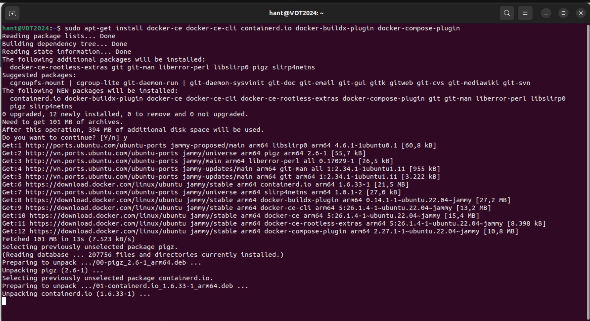
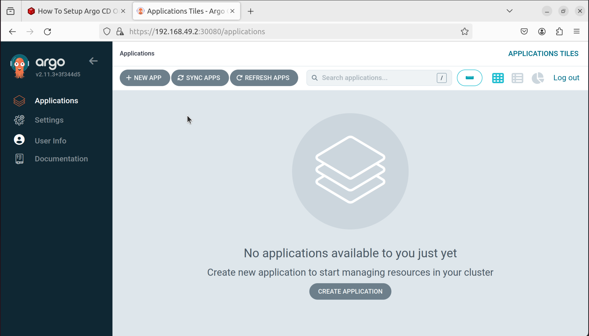

# Bài tập lớn cuối kỳ chương trình VDT 2024 lĩnh vực Cloud - GĐ 1
# Nguyễn Thanh Hà

## 1. Triển khai Kubernetes Cluster 
Đầu tiên ta cần update hệ thống
```bash
sudo apt-get update
sudo apt-get upgrade -y
sudo reboot
```


Sau khi update xong ta cài đặt Docker
```bash
for pkg in docker.io docker-doc docker-compose docker-compose-v2 podman-docker containerd runc; do sudo apt-get remove $pkg; done

# Add Docker's official GPG key:
sudo apt-get update
sudo apt-get install ca-certificates curl
sudo install -m 0755 -d /etc/apt/keyrings
sudo curl -fsSL https://download.docker.com/linux/ubuntu/gpg -o /etc/apt/keyrings/docker.asc
sudo chmod a+r /etc/apt/keyrings/docker.asc

# Add the repository to Apt sources:
echo \
  "deb [arch=$(dpkg --print-architecture) signed-by=/etc/apt/keyrings/docker.asc] https://download.docker.com/linux/ubuntu \
  $(. /etc/os-release && echo "$VERSION_CODENAME") stable" | \
  sudo tee /etc/apt/sources.list.d/docker.list > /dev/null
sudo apt-get update

sudo apt-get install docker-ce docker-ce-cli containerd.io docker-buildx-plugin docker-compose-plugin
```


Thêm user vào group docker
```bash
sudo usermod -aG docker $USER
newgrp docker
```


Cài đặt miniKube
```bash
curl -LO https://storage.googleapis.com/minikube/releases/latest/minikube-linux-arm64
sudo install minikube-linux-arm64 /usr/local/bin/minikube && rm minikube-linux-arm64
minikube --version
```


Cài đặt kubectl
```bash
curl -LO https://storage.googleapis.com/kubernetes-release/release/v1.22.0/bin/linux/arm64/kubectl
chmod +x kubectl
sudo mv kubectl /usr/local/bin/
kubectl version --client
```


Khởi động minikube
```bash
minikube start --driver=docker
```


Kiểm tra hệ thống
```bash
kubectl status
kubectl get nodes -o wide
kubectl cluster-info
```


## 2. Triển khai ứng dụng web application sử dụng DevOps tools 
### 2.1. Triển khai ứng dụng web application lên K8S sử dụng Helm Chart

Thêm repo của Helm để setup ArgoCD
```bash
helm repo add argo https://argoproj.github.io/argo-helm
helm search repo argo
```

Chuyển đổi argo-cd Helm chart thành file K8S manifest
```bash
helm template argo argo/argo-cd --output-dir argocd-manifests
```

Sửa đổi NodePort của service argo-cd-server
```bash
helm show values argo/argo-cd > values.yaml
```

Sửa đổi file values.yaml để thay đổi từ ClusterIP sang NodePort ở service configuration block


Tạo namespace argocd
```bash
kubectl create namespace argocd
```

Cài đặt ArgoCD
```bash
helm install argo argo/argo-cd --namespace argocd --values values.yaml
```
- [values.yaml](https://github.com/hantbk/VDTCK/blob/main/argocd/values.yaml) 

Truy cập ArgoCD UI tại địa chỉ http://192.168.49.2:30080

Thực hiện login vào ArgoCD với username/password mặc định là admin, password lấy từ secret argocd-initial-admin-secret
```bash
kubectl get secret argocd-initial-admin-secret -n argocd -o jsonpath="{.data.password}" | base64 -d
```


### 2.2. Triển khai ứng dụng web application lên K8S sử dụng ArgoCD

Helm Chart của Web Deployment và Api Deployment

- [Web Deployment](https://github.com/hantbk/web_service/tree/main/charts)
- [Api Deployment](https://github.com/hantbk/api_service/tree/main/charts)

Repo Config của Web Deployment và Api Deployment

- [Web Config](https://github.com/hantbk/web_config)
- [Api Config](https://github.com/hantbk/api_config)

Sử dụng tính năng multiple sources của ArgoCD để triển khai các service web và api service lên K8S Cluster

- [ArgoCD App of Web Service](https://github.com/hantbk/web_service/blob/main/argo-web-application.yaml)
- [ArgoCD App of Api Service](https://github.com/hantbk/api_service/blob/main/argo-api-application.yaml)

Đảm bảo đã tạo 2 namespace web và api trên K8S Cluster
```bash
kubectl create namespace web
kubectl create namespace api
```

Sau khi triển khai lên ArgoCD, ta sẽ thấy 2 ứng dụng web và api service được triển khai thành công


Kiểm tra thử ứng dụng web và api service


Truy cập vào web và api service thông qua NodePort của service tại địa chỉ http://192.168.49.2:30001 và http://192.168.49.2:30002


## 3. Continuous Deployment 

File setup luồng CD của ứng dụng web và api service
- [Web CD](https://github.com/hantbk/web_service/blob/main/.github/workflows/cd.yaml)
- [Api CD](https://github.com/hantbk/api_service/blob/main/.github/workflows/cd.yml)

Lưu ý: Cần phải tạo Docker Hub Token và lưu vào Secret của Github Repo và My_REPO_TOKEN trong 2 repo config để có thể thực hiện chỉnh sửa tag image của ứng dụng web và api service


