## Project giữa kỳ
### Nguyễn Thanh Hà

### Phát triển một 3-tier web application đơn giản 
Hiển thị danh sách sinh viên tham gia chương trình VDT2024 dưới dạng bảng với các thông tin sau: Họ và tên, Giới tính, trường đang theo học. 
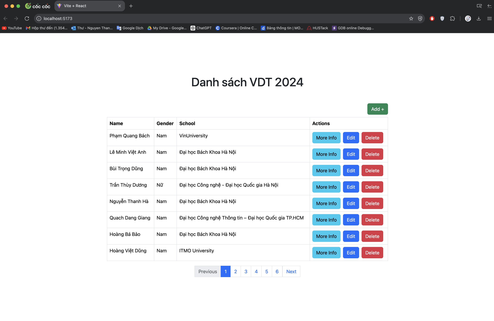
Cho phép xem chi tiết/thêm/xóa/cập nhật thông tin sinh viên.

- Thêm sinh viên
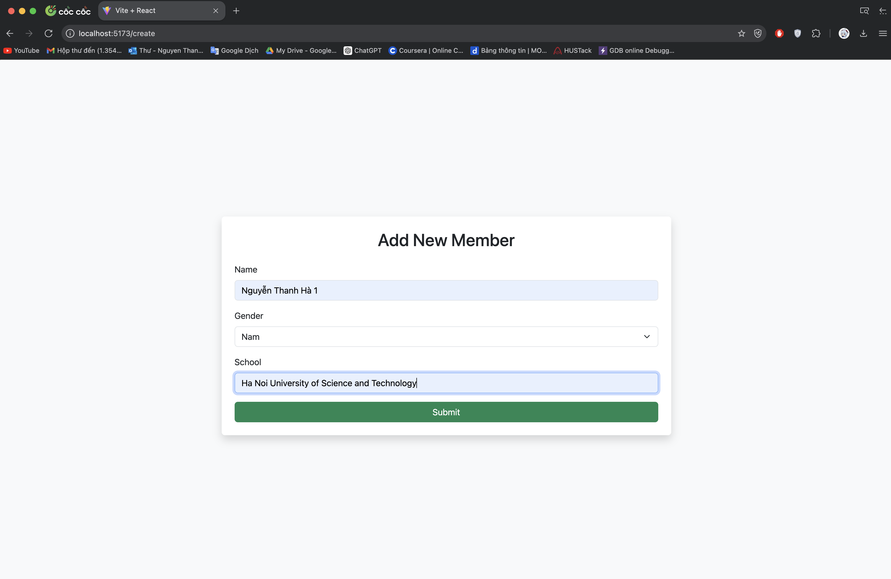
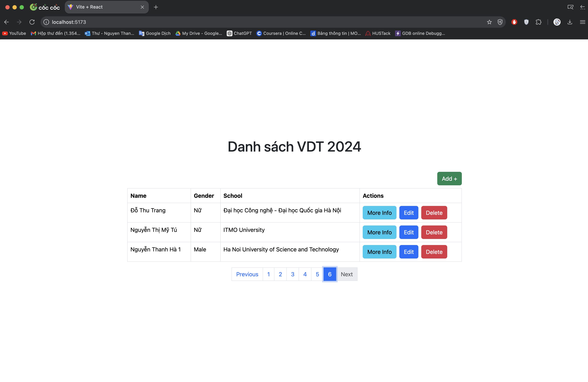

- Xem chi tiết sinh viên
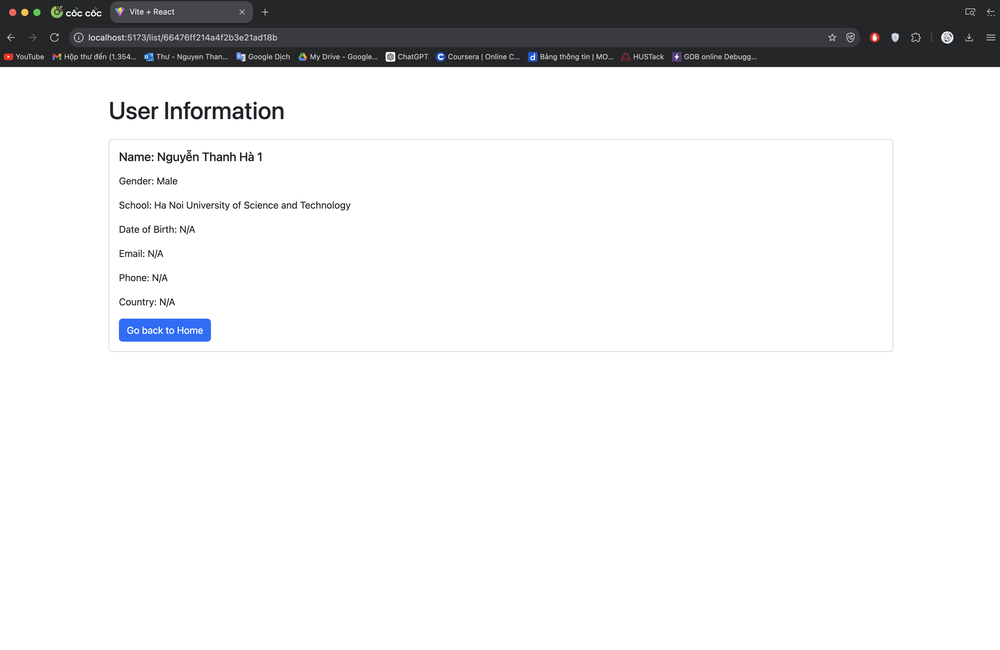

- Cập nhật thông tin sinh viên
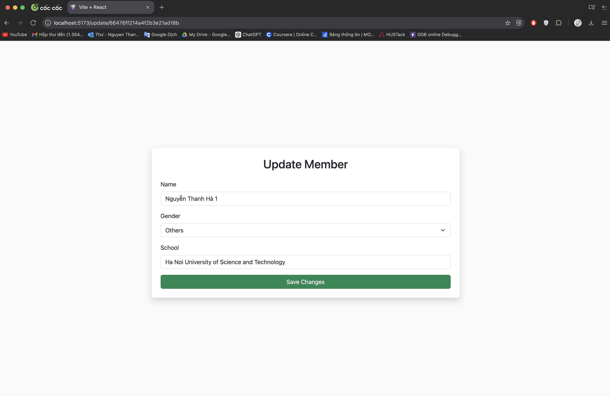


- Xóa sinh viên
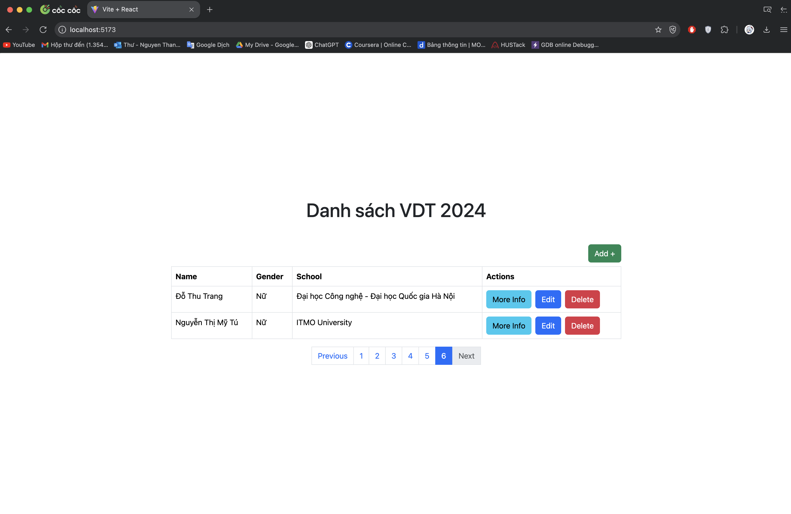

- Kết quả unit test cho các chức năng API: 

 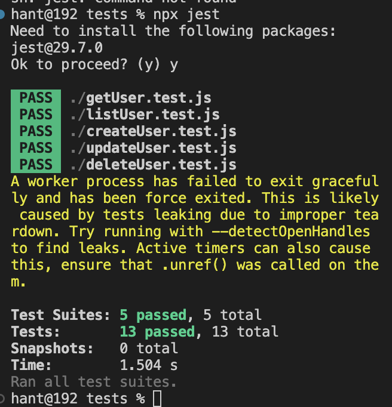

# Mã nguồn web service: [web](https://github.com/hantbk/web_service)
# Mã nguồn api service: [api](https://github.com/hantbk/api_service)

### Triển khai web application sử dụng các DevOps tools & practices

#### 1. Containerization 
 - Dockerfile cho từng dịch vụ: 
- [Web Image](https://github.com/hantbk/web_service/blob/main/Dockerfile) 
    ```Dockerfile
    # Stage 1: Build the React app
    FROM node:lts-alpine AS build

    # Set working directory
    WORKDIR /app

    # Copy package.json and package-lock.json
    COPY package.json .
    COPY package-lock.json .

    # Install dependencies
    RUN npm install

    # Copy the rest of the application code
    COPY . .

    # Build the React app
    RUN npm run build

    # Stage 2: Serve the built React app
    FROM nginx:alpine

    # Copy the built React app from the previous stage
    COPY --from=build /app/dist /usr/share/nginx/html

    # Copy nginx configuration file
    COPY nginx.conf /etc/nginx/conf.d/default.conf

    # Expose port 80
    EXPOSE 80

    # Start nginx
    CMD ["nginx", "-g", "daemon off;"]
    ```
- [Api Image](https://github.com/hantbk/api_service/blob/main/Dockerfile)

    ```Dockerfile
    # Stage 1: Build the application
    FROM node:lts-alpine AS build

    WORKDIR /app

    # Copy package.json and package-lock.json to the working directory
    COPY package*.json ./

    # Install dependencies
    RUN npm ci --only=production

    # Copy the rest of the application code to the working directory
    COPY . .

    # Stage 2: Production-ready image
    FROM node:lts-alpine AS production

    WORKDIR /app

    # Copy only necessary files from build stage
    COPY --from=build /app/package*.json ./
    COPY --from=build /app/node_modules ./node_modules
    COPY --from=build /app/server.js ./

    # Expose the port that app runs on
    EXPOSE 9000

    # Command to run your app
    CMD ["node", "server.js"]

    ```
- [Database Image](https://github.com/hantbk/vdtproject/blob/main/webcrud/db/Dockerfile)

    ```Dockerfile
    FROM mongo:4.4.6

    COPY attendees.json /docker-entrypoint-initdb.d/attendees.json
    COPY init-data.sh /docker-entrypoint-initdb.d/init-data.sh

    RUN chmod +x /docker-entrypoint-initdb.d/init-data.sh

    CMD ["mongod"]

    ```
- Output câu lệnh build và history image web service

    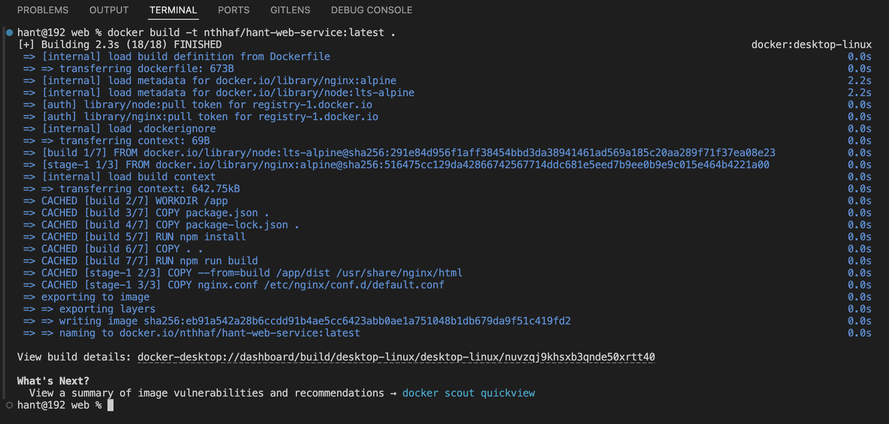

    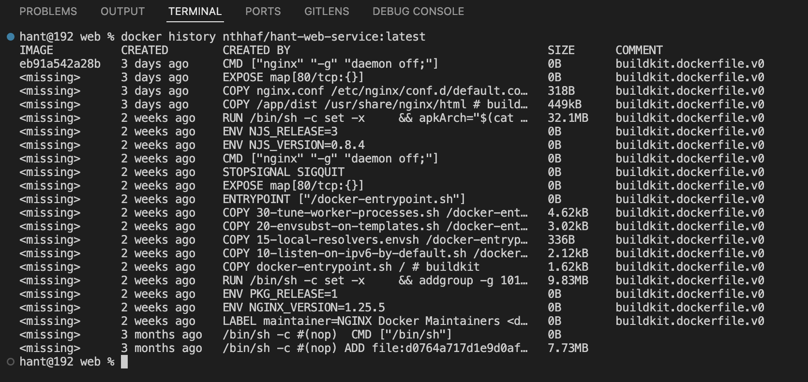

- Output câu lệnh build và history image api service

    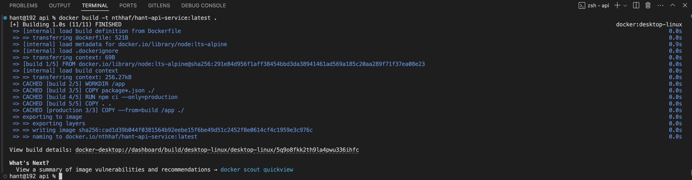

    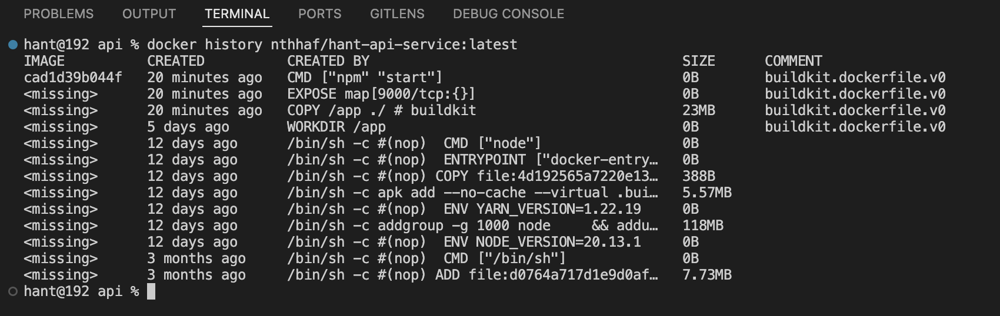

- Output câu lệnh build và history image db service

    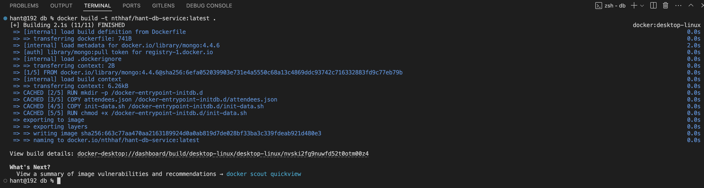

    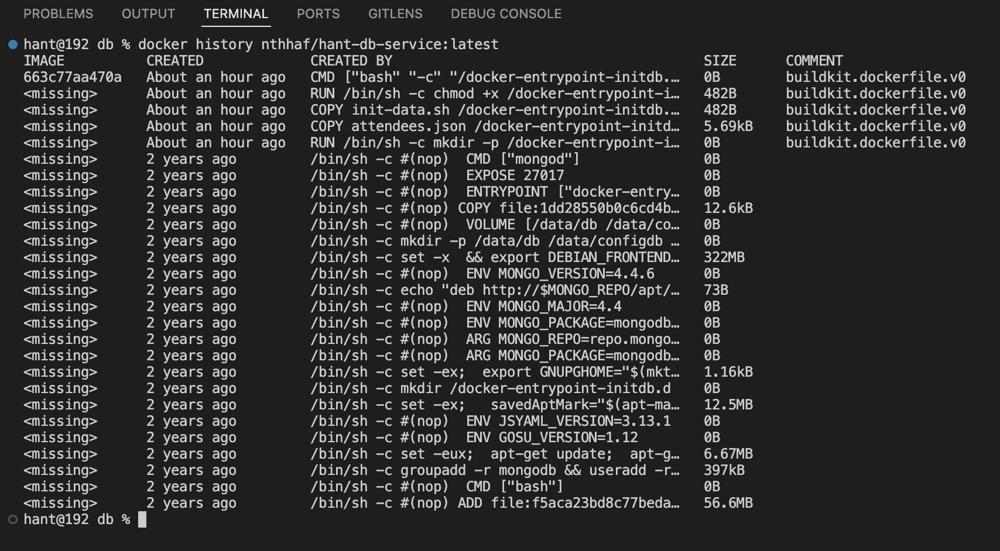
