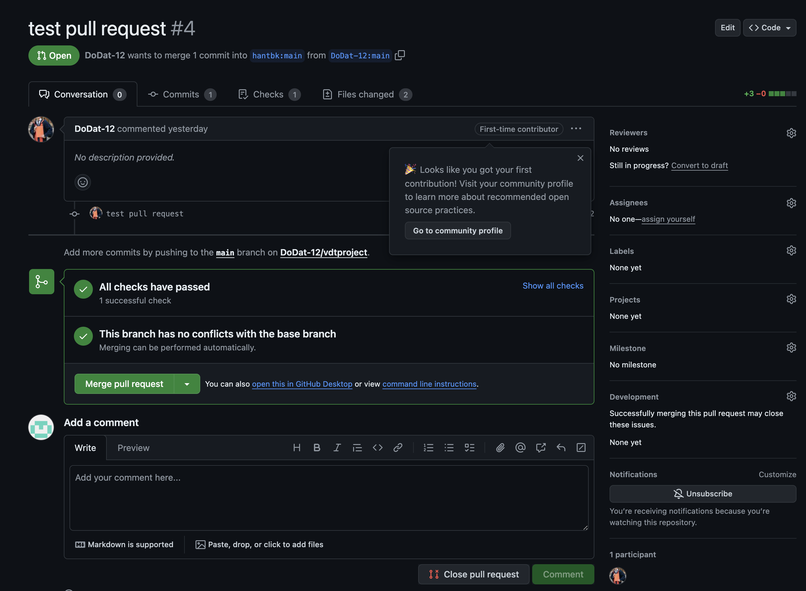
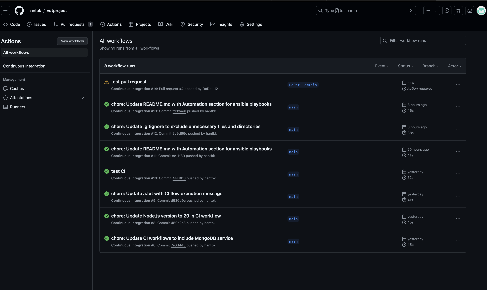
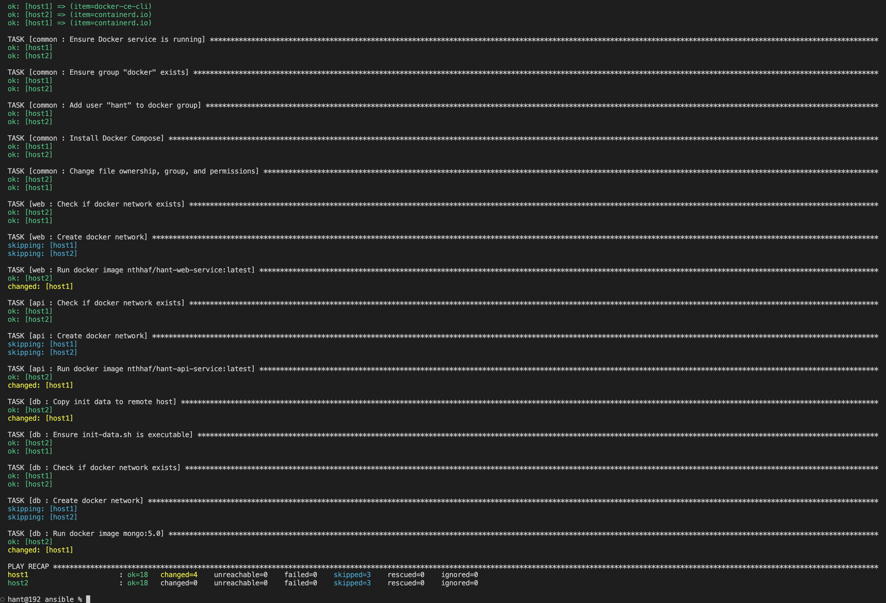

## Project giữa kỳ
### Nguyễn Thanh Hà

### Phát triển một 3-tier web application đơn giản 
Hiển thị danh sách sinh viên tham gia chương trình VDT2024 dưới dạng bảng với các thông tin sau: Họ và tên, Giới tính, trường đang theo học. 

Cho phép xem chi tiết/thêm/xóa/cập nhật thông tin sinh viên.

- Thêm sinh viên


- Xem chi tiết sinh viên


- Cập nhật thông tin sinh viên


- Xóa sinh viên


- Kết quả unit test cho các chức năng API: 

 

# Mã nguồn web service: [web](https://github.com/hantbk/web_service)
# Mã nguồn api service: [api](https://github.com/hantbk/api_service)

### Triển khai web application sử dụng các DevOps tools & practices

#### 1. Containerization 
 - Dockerfile cho từng dịch vụ: 
- [Web Image](https://github.com/hantbk/vdtproject/blob/main/webcrud/web/Dockerfile) 
    ```Dockerfile
    # Stage 1: Build the React app
    FROM node:lts-alpine AS build

    # Set working directory
    WORKDIR /app

    # Copy package.json and package-lock.json
    COPY package.json .
    COPY package-lock.json .

    # Install dependencies
    RUN npm install

    # Copy the rest of the application code
    COPY . .

    # Build the React app
    RUN npm run build

    # Stage 2: Serve the built React app
    FROM nginx:alpine

    # Copy the built React app from the previous stage
    COPY --from=build /app/dist /usr/share/nginx/html

    # Copy nginx configuration file
    COPY nginx.conf /etc/nginx/conf.d/default.conf

    # Expose port 80
    EXPOSE 80

    # Start nginx
    CMD ["nginx", "-g", "daemon off;"]
    ```
- [Api Image](https://github.com/hantbk/vdtproject/blob/main/webcrud/api/Dockerfile)

    ```Dockerfile
    # Stage 1: Build the application
    FROM node:lts-alpine AS build

    WORKDIR /app

    # Copy package.json and package-lock.json to the working directory
    COPY package*.json ./

    # Install dependencies
    RUN npm ci --only=production

    # Copy the rest of the application code to the working directory
    COPY . .

    # Stage 2: Production-ready image
    FROM node:lts-alpine AS production

    WORKDIR /app

    # Copy only necessary files from build stage
    COPY --from=build /app/package*.json ./
    COPY --from=build /app/node_modules ./node_modules
    COPY --from=build /app/server.js ./

    # Expose the port that app runs on
    EXPOSE 9000

    # Command to run your app
    CMD ["node", "server.js"]

    ```
- [Database Image](https://github.com/hantbk/vdtproject/blob/main/webcrud/db/Dockerfile)

    ```Dockerfile
    FROM mongo:4.4.6

    COPY attendees.json /docker-entrypoint-initdb.d/attendees.json
    COPY init-data.sh /docker-entrypoint-initdb.d/init-data.sh

    RUN chmod +x /docker-entrypoint-initdb.d/init-data.sh

    CMD ["mongod"]

    ```
- Output câu lệnh build và history image web service

    

    

- Output câu lệnh build và history image api service

    

    

- Output câu lệnh build và history image db service

    

    

#### 2. Continuous Integration
- Tự động chạy unit test khi tạo Pull request vào nhánh main
- Tự động chạy unit test khi push commit lên một nhánh
 - File setup công cụ CI: [ci](./.github/workflows/ci.yml)

    ```yml
    name: Continuous Integration

    on:
      pull_request: 
        branches: // Quá trình CI sẽ chạy khi có pull request vào nhánh main
          - main 
      push:
        branches: // Quá trình CI sẽ chạy khi có push commit lên mọi nhánh
          - '*'

    jobs:
      test:
        runs-on: ubuntu-latest

        services:
          mongodb:
            image: mongo:latest
            ports:
              - 27017:27017

        steps:
          - name: Checkout code
            uses: actions/checkout@v2

          - name: Set up Node.js
            uses: actions/setup-node@v2
            with:
              node-version: '18'

          - name: Install dependencies
            run: npm install
            working-directory: ./webcrud/api/

          - name: Run unit tests
            run: npm test
            working-directory: ./webcrud/api/

    ```
- Output log của luồng CI
     
     

     

- Lịch sử chạy CI khi push commit

    Success
    
    Fail
    
    
- Tự động chạy test khi Pull request

    

    

- Lịch sử chạy CI khi Pull request

    

- Output log của luồng CI khi Pull request

    

    

#### 3. Automation 
#### Viết ansible playbooks để triển khai các image docker của các dịch vụ web, api, db, mỗi dịch vụ 1 role

Cấu trúc thư mục Ansible:

    ansible/
    ├── roles/
    │   ├── common/
    │   │   ├── tasks/
    │   │   │   └── main.yml
    │   │   └── vars/
    │   │       └── main.yml
    │   ├── web/
    │   │   ├── tasks/
    │   │   │   └── main.yml
    │   │   └── vars/
    │   │       └── main.yml
    │   ├── api/
    │   │   ├── tasks/
    │   │   │   └── main.yml
    │   │   └── vars/
    │   │       └── main.yml
    │   └── db/
    │       ├── tasks/
    │       │   └── main.yml
    │       ├── files/
    │       │   ├── attendees.json
    │       │   └── init-data.sh
    │       └── vars/
    │           └── main.yml
    ├── playbook.yml
    └── inventory.yml


  - Danh sách các roles: 
     
    - [common](./ansible/roles/common/tasks/main.yml)
    - [web](./ansible/roles/web/tasks/main.yml)
    - [api](./ansible/roles/api/tasks/main.yml)
    - [db](./ansible/roles/db/tasks/main.yml)

#### Trong từng role cho phép tuỳ biến cấu hình của các dịch vụ thông qua các variables

- variables cho từng role:
    - [common](./ansible/roles/common/vars/main.yml)
    - [web](./ansible/roles/web/vars/main.yml)
    - [api](./ansible/roles/api/vars/main.yml)
    - [db](./ansible/roles/db/vars/main.yml)

#### Cho phép triển khai các dịch vụ trên các host khác nhau thông qua file inventory
Ví dụ triển khai hệ thống với Ansible: Triển khai lên 2 máy ảo host1 và host2


Sử dụng inventory file là [inventory.yml](./ansible/inventory.yml)
```yaml
---
all:
  hosts:
    host1:
      ansible_host: 192.168.1.22
      ansible_user: hant
      ansible_become: true
      ansible_become_method: sudo
      ansible_become_password: 123

    host2:
      ansible_host: 192.168.1.21
      ansible_user: hant
      ansible_become: true
      ansible_become_method: sudo
      ansible_become_password: 123
```

  Với cấu hình file playbook là [playbook.yml](./ansible/playbook.yml)

  ```yaml
  ---
  - name: hant
    hosts: all
    become: true
    gather_facts: true

    roles:
      - common
      - web
      - api
      - db
  ```

  Sử dụng lệnh sau để chạy Ansible playbook:
  `ansible-playbook -i inventory.yml playbook.yml`

- Output log triển khai hệ thống

    

    

    

- Kết quả triển khai lên máy ảo host1 và host2
    


