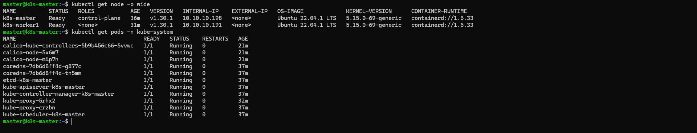

# Bài tập lớn cuối kỳ chương trình VDT 2024 lĩnh vực Cloud - GĐ 1
Nguyễn Thị Ngọc Mai

## Triển khai Kubernetes
- Triển khai được Kubernetes thông qua công cụ kubeadm lên 1 master node VM + 1 worker node VM
### Resources:
- Ubuntu 22.04
- 1 control node
- 1 worker node (at least)
- set hostname và add hostname vào doc cho các node
- Change to 10.10.10.10:
    - Delete existing routes via 10.10.10.1
        
        `sudo ip route del default via 10.10.10.1 dev eth0`

        `sudo ip route del 1.1.1.1 via 10.10.10.1 dev eth0`

        `sudo ip route del 8.8.8.8 via 10.10.10.1 dev eth0`
        
    - Add new routes via 10.10.10.10
        
        `sudo ip route add default via 10.10.10.10 dev eth0`
  
        `sudo ip route add 1.1.1.1 via 10.10.10.10 dev eth0`
  
        `sudo ip route add 8.8.8.8 via 10.10.10.10 dev eth0`
        

### 1. Sudo swapoff -a

`sudo swapoff -a`

### 2. Download container runtime:

- containerd (cài như docker nhưng chỉ tải [containerd.io](http://containerd.io/))

### 3. Config cgroup drivers:

`containerd config default | sed 's/SystemdCgroup = false/SystemdCgroup = true/' | sed 's/sandbox_image = "[registry.k8s.io](http://registry.k8s.io/)\/pause:3.6"/sandbox_image = "[registry.k8s.io](http://registry.k8s.io/)\/pause:3.9"/' | sudo tee /etc/containerd/config.toml`

`sudo systemctl restart containerd`

`sudo systemctl status containerd`

### 4. Tải kubeadm theo doc:

[https://kubernetes.io/docs/setup/production-environment/tools/kubeadm/create-cluster-kubeadm/](https://kubernetes.io/docs/setup/production-environment/tools/kubeadm/create-cluster-kubeadm/)

### 5. Set control node: ///code ở control node

`sudo kubeadm init --pod-network-cidr={10.10.0.0/16} --control-plane-endpoint={hostname}`

- có thể thay đổi 10.10.0.0/16 tùy theo pod, có thể là 192.168.0.0/16

### 6. Truy cập cluster

Sau khi chạy 4 xong sẽ có đoạn code, chạy code trên control node:

`mkdir -p $HOME/.kube`

`sudo cp -i /etc/kubernetes/admin.conf $HOME/.kube/config`

`sudo chown $(id -u):$(id -g) $HOME/.kube/config`

test control-node: `kubectl cluster-info`

### 7. Kết nối worker với control: ///code ở worker node

sau khi chạy 5 xong sẽ có đoạn code cuối có dạng này

- phần trong `{}`:
    - `token`: có thể hết hạn trong vòng vài giờ => cần generate lại nếu hết hạn: `kubeadm token create`
    - `token-ca-cert-hash`: hết hạn trong 24h ⇒ generate lại:
- Chạy code vào các worker-node
`kubeadm join {hostname}:6443 --token {2hour-token} \ --discovery-token-ca-cert-hash {24hour-token-ca-cert-hash}`
- kiểm tra lại trên control-node: `kubectl get nodes`

### 8. Cài Calico Pod network

Cài Calico Pod nếu số node < 50 

///code ở control node

(làm theo [https://nvtienanh.info/blog/cai-dat-kubernetes-cluster-tren-ubuntu-server-22-04](https://nvtienanh.info/blog/cai-dat-kubernetes-cluster-tren-ubuntu-server-22-04))

## Hình ảnh triển khai
- Log các lệnh: kubectl get node -o wide; kubectl get pods -n kube-system

### Tham khảo:

en: https://www.youtube.com/watch?v=wIZamzt7MkM

vie: https://www.youtube.com/watch?v=HxLWMppZb-A

https://kubernetes.io/docs/setup/production-environment/tools/kubeadm/create-cluster-kubeadm/

https://kubernetes.io/docs/setup/production-environment/tools/kubeadm/install-kubeadm/

https://kubernetes.io/docs/setup/production-environment/container-runtimes/