# Bài tập lớp giữa kỳ Viettel Digital Talent 2024 
Nguyễn Thị Ngọc Mai

## A. Phát triển một 3-tier web application đơn giản 
### 1. Hình ảnh thể hiện kết quả đạt được

- Hiển thị danh sách sinh viên dưới dạng bảng
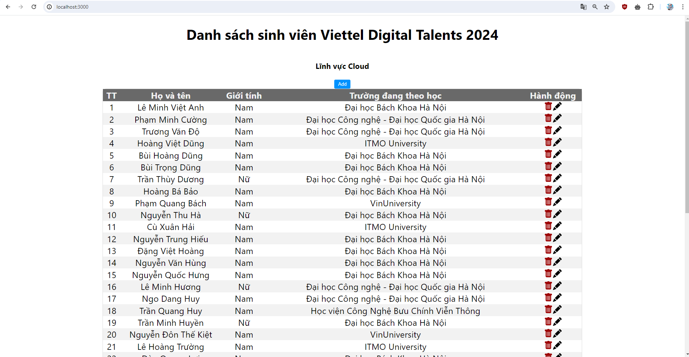

- Xóa thông tin sinh viên khi bấm vào biểu tượng thùng rác

- Cho phép xem chi tiết, cập nhật thông tin sinh viên khi bấm vào biểu tượng bút chì
    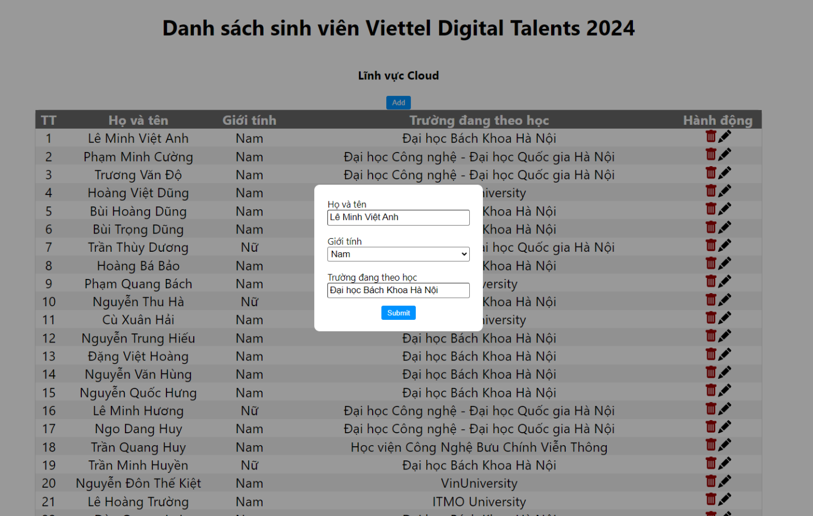

- Cho phép thêm mới một sinh viên
  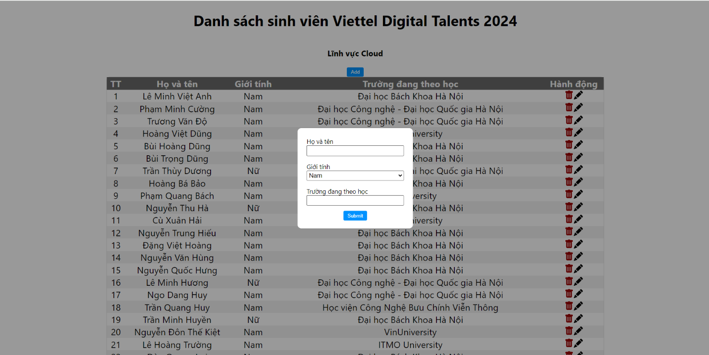

- API unit test: Pass all tests
  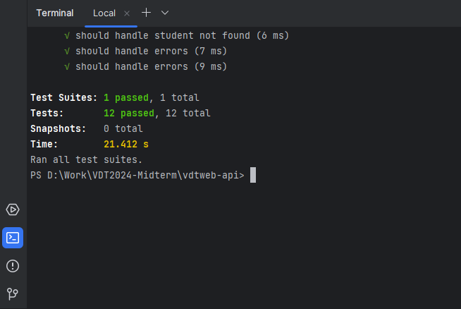
  

### 2. Mã nguồn:
  + Web: https://github.com/maintn24/vdtweb-app.git
  + API: https://github.com/maintn24/vdtweb-api.git

## B. Triển khai web application sử dụng các DevOps tools & practices
### 1. Containerization
Sử dụng Docker và Docker Compose
- Dockerfile cho dịch vụ Web: https://github.com/maintn24/vdtweb-app/blob/master/Dockerfile
- Dockerfile cho dịch vụ API: https://github.com/maintn24/vdtweb-api/blob/master/Dockerfile
- 
- Output câu lệnh build: 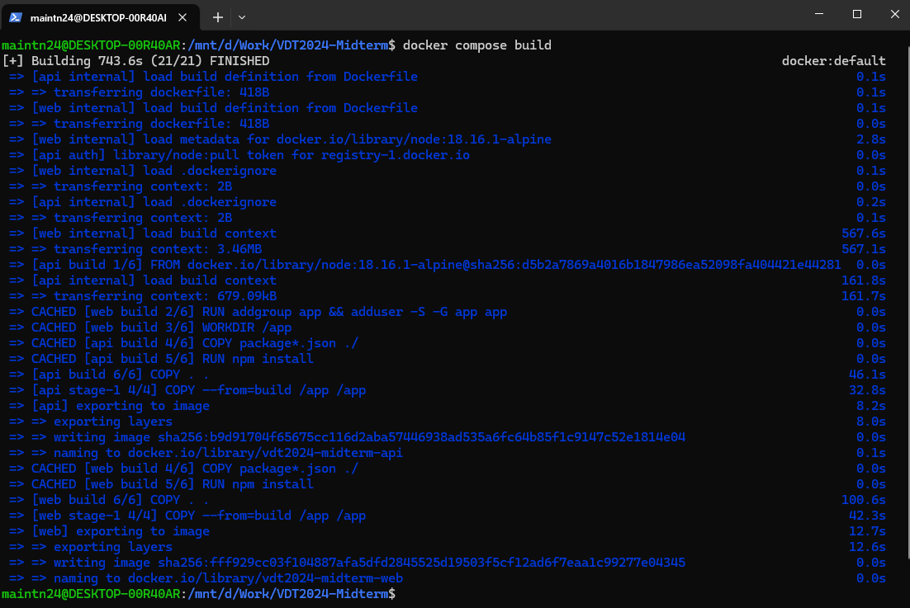
- 
- Docker history của web: 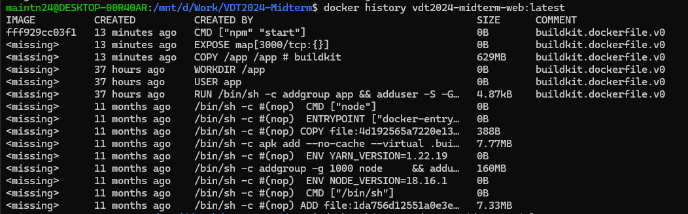
- Docker history của api: 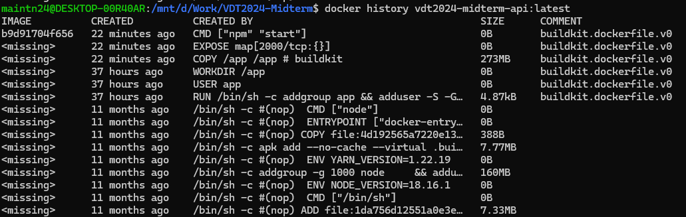
- Docker history của db: 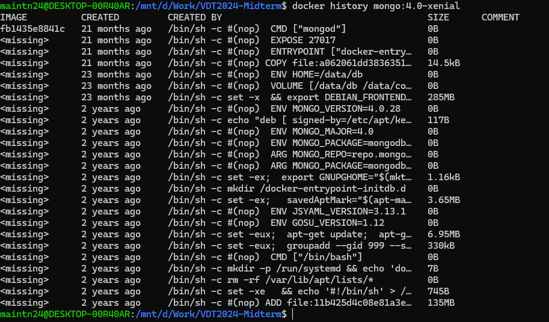

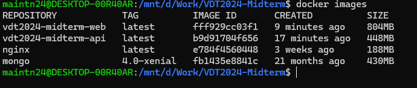
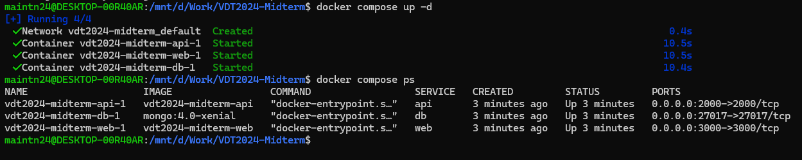

### 2. Continuous Integration
Sử dụng Github Action
- File setup công cụ CI: https://github.com/maintn24/vdtweb-api/blob/master/.github/workflows/CI.yml
- Output log của luồng CI:[build-log-(20.x).txt](build-log-%2820.x%29.txt)
- Hình ảnh demo:
  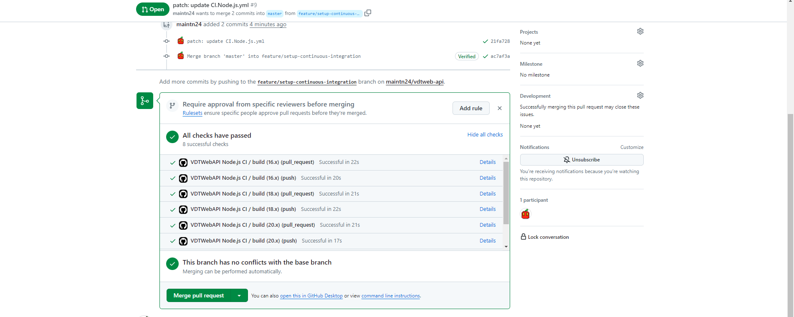
  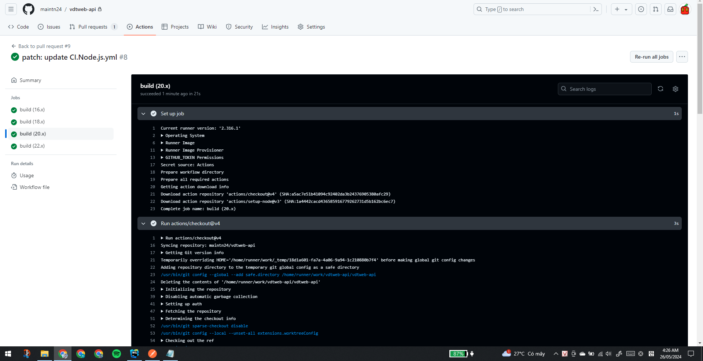

### 3. Automation
Sử dụng Ansible
- Mã nguồn Ansible: https://github.com/maintn24/ansible-docker.git

## C. Nghiên cứu sâu về một vấn đề, khái niệm trong các chủ đề đã học
[midterm-research.pdf](midterm-research.pdf)
