## Bài tập lớn cuối kỳ chương trình VDT 2024 lĩnh vực Cloud - GĐ 1Bài tập lớn cuối kỳ chương trình VDT 2024 lĩnh vực Cloud - GĐ 1lệnh review markdown trong visual studio code

# Mục lục:

- [I. Triển khai Kubernetes qua công cụ kubespray] (#I.-Triển-khai-Kubernetes-qua công-cụ-kubespray:)
- [2. Knowledge](#2-knowledge)
  - [2.1. What is Kubernetes?](#21-what-is-kubernetes)
  - [2.2. What are the benefits of Kubernetes?](#22-what-are-the-benefits-of-kubernetes)
  - [2.3. What is Kubernetes used for?](#23-what-is-kubernetes-used-for)
  - [2.4. Kubernetes Architecture](#24-kubernetes-architecture)
  - [2.5. Deploy using Docker-compose](#25-deploy-using-docker-compose)
- [3. Getting started](#3-getting-started)
  - [3.1. Pre-requisites ](#31-pre-requisites)
- [4. Deploying the application on Kubernetes](#4-deploying-the-application-on-kubernetes)
  - [4.1. Application architecture](#41-application-architecture)
  - [4.2. Deploy backend and frontend](#42-deploy-backend-and-frontend)
  - [4.3. Deploy database - MongoDB](#43-deploy-database---mongodb)
  - [4.4. Thoroughly check the operation of the application.](#44-thoroughly-check-the-operation-of-the-application)
  - [4.5. Deploy application using Helm](#45-deploy-application-using-helm)
- [5. Conclusions](#5-conclusions)
- [6. References](#6-references)

## I. Triển khai Kubernetes qua công cụ kubespray:

[Document for install - It's here](https://www.linuxtechi.com/install-kubernetes-using-kubespray/)

### 1. Chuẩn bị:

- Master Nodes: 2048 MB RAM, 2 CPU and 40 GB free disk space (ubuntu 22.04)
- Worker Nodes: 2048 MB, 2 CPU, 40 GB free disk space
- Ansible Node: 1024 MB, 1CPU and 20 GB disk space
- Internet connectivity on each node
- Regular with sudo admin rights

### 2. Setting

**Bước 1**: Chỉnh cấu hình cho Kubespray node
Trên máy có đã cài ansible thực hiện pull code:

```
$ sudo apt update
$ sudo apt install git python3 python3-pip -y
$ git clone https://github.com/kubernetes-incubator/kubespray.git
$ cd kubespray
$ pip install -r requirements.txt
```

Cấu hình cho inventory file, đặt 1 control node: ip-192.168.56.2 và 1 worker node: ip-192.168.56.

```
$ cp -rfp inventory/sample inventory/mycluster
$ declare -a IPS=(192.168.56.2 192.168.56.3)
$ CONFIG_FILE=inventory/mycluster/hosts.yaml python3 contrib/inventory_builder/inventory.py ${IPS[@]}
```

**Bước 2**: Copy SSH-key từ ansible node đến các máy khác
Tạo key: $ ssh-keygen
Copy key gửi đến các máy khác:

```
$ ssh-copy-id root@192.168.56.2
$ ssh-copy-id root@192.168.56.3
```

Nếu dùng user khác root thì trên các máy khác phải cấp quyền thực thi cho user, để thực hiện:

```
$ echo "user ALL=(ALL) NOPASSWD:ALL" | sudo tee /etc/sudoers.d/user"
```

**Bước 3**: Vô hiệu hóa firewall và tắt swap

```
$ cd kubespray
$ ansible all -i inventory/mycluster/hosts.yaml -m shell -a "sudo systemctl stop firewalld && sudo systemctl disable firewalld"

$ ansible all -i inventory/mycluster/hosts.yaml -m shell -a "echo 'net.ipv4.ip_forward=1' | sudo tee -a /etc/sysctl.conf"
$ ansible all -i inventory/mycluster/hosts.yaml -m shell -a "sudo sed -i '/ swap / s/^\(.*\)$/#\1/g' /etc/fstab && sudo swapoff -a"
```

**Bước 4**: Bắt đầu deploy K8S

```
$ cd kubespray
$ ansible-playbook -i inventory/mycluster/hosts.yaml --become --become-user=root cluster.yml
```

- Lúc này thì nghiên cứu phần khác đợi máy cài xong ạ, kết quả thu được:
<div align="center">
  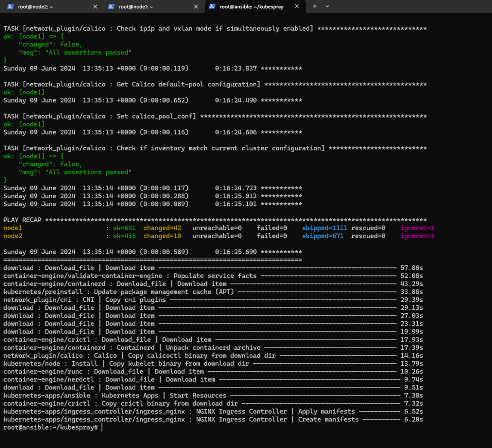
</div>

- Vào máy master để kiểm tra xem 2 node đã được triển khai chưa:
<div align="center">
  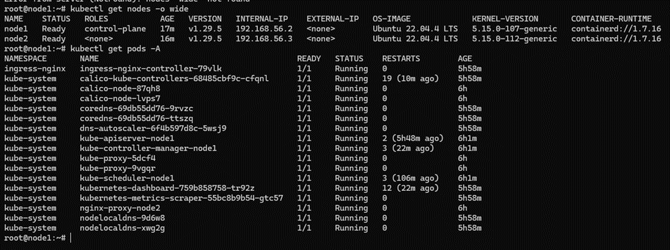
</div>

## II. Triển khai web application sử dụng các DevOps tools & practice

## 2. K8S Helm Chart

### 2.1 Cài đặt ArgoCD

**Bước 1**: Cấu hình trên cụm k8s

- Khởi tạo namespace argocd - mục đích để tạo môi trường chạy riêng cho argocd trên cụm k8s:

```
kubectl create namespace argocd
```

- Cài đặt:

```
# apply the installation manifest
$ kubectl apply \
    --namespace argocd \
    --filename https://raw.githubusercontent.com/argoproj/argo-cd/stable/manifests/install.yaml
```

- Cấu hình service thành loại NodePort - để có thể truy cập bên ngoài cụm K8S:

```
kubectl patch svc -n argocd argocd-server --patch '{"spec": {"type": "NodePort"}}'
```

- Lấy mật khẩu đăng nhập:

```
kubectl -n argocd get secret argocd-initial-admin-secret -o jsonpath="{.data.password}" | base64 -d

```

Kết quả thu được là một đoạn mã tương tự thế này: "h2gum4hcvw2Zf9Zw" cùng username: "admin" chúng ta sẽ đăng nhập được và trình duyệt của argocd

- Nếu muốn thay đổi mật khẩu thì dùng lệnh [" argocd account update-password "]
<div align="center">
  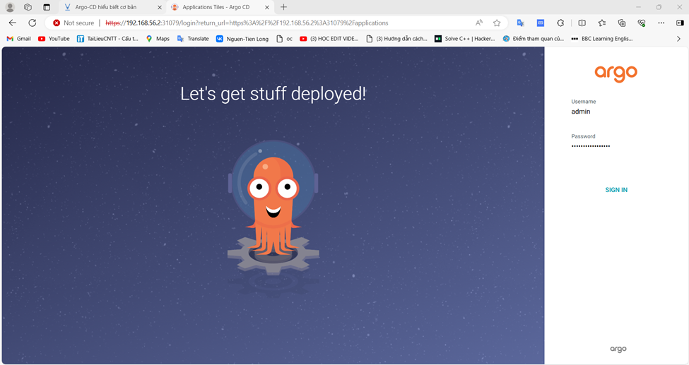 Giao diện đăng nhập của ArgoCD
</div>
<div align="center">
  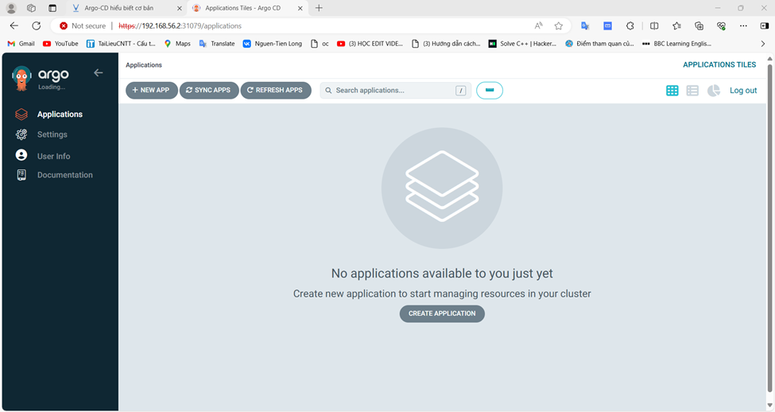
  Giao diện làm việc chính
</div>

### 2.2. Helm chart

- Viết 2 Helm Chart cho web Deployment và api Deployment, để vào 1 folder riêng trong repo web và repo api và tạo 2 Repo Config cho web và api, trong các repo này chứa các file values.yaml với nội dung của cá file values.yaml là các config cần
  thiết để chạy web và api trên k8s bằng Helm Chart:

<b>Repo api</b>: [VDT-GK-API/helmchart](https://github.com/nguyentienlong1106/VDT_GK_API/tree/main/helmchart)

<b>Repo web</b>: [VDT-GK-Frontend/helmchart](https://github.com/nguyentienlong1106/VDT_GK_FE/tree/main/helmchart)

<b>Repo config api</b>: [Config API](https://github.com/nguyentienlong1106/VDT_Config_api/blob/main/values.yaml)

<b>Repo config web</b>: [Config FE](https://github.com/nguyentienlong1106/VDT_Config_web/blob/main/values.yaml)

- Sử dụng tính năng multiple sources của ArgoCD để triển khai các service web và api service lên K8S Cluster:

File manifest của ArgoCD cho BE:

```yaml
apiVersion: argoproj.io/v1alpha1
kind: Application
metadata:
  name: api
spec:
  project: default
  destination:
    server: https://kubernetes.default.svc
    namespace: vdt-final
  sources:
    - repoURL: "https://github.com/nguyentienlong1106/VDT_GK_API.git"
      targetRevision: main
      path: helmchart
      helm:
        valueFiles:
          - $values/values.yaml
    - repoURL: "https://github.com/nguyentienlong1106/VDT_Config_api.git"
      targetRevision: main
      ref: values
syncPolicy:
  automated: {} # Dòng này giúp ArgoCD tự động nhập biết thay đổi từ repo để khởi chạy lại hệ thống.
```

File manifest của ArgoCD cho FE:

```yaml
apiVersion: argoproj.io/v1alpha1
kind: Application
metadata:
  name: web
spec:
  project: default
  destination:
    server: https://kubernetes.default.svc
    namespace: vdt-final
  sources:
    - repoURL: "https://github.com/nguyentienlong1106/VDT_GK_FE.git"
      targetRevision: main
      path: helmchart
      helm:
        valueFiles:
          - $values/values.yaml
    - repoURL: "https://github.com/nguyentienlong1106/VDT_Config_web.git"
      targetRevision: main
      ref: values
syncPolicy:
  automated: {} # Dòng này giúp ArgoCD tự động nhập biết thay đổi từ repo để khởi chạy lại hệ thống.
```

**NOTE**: Trước khi chạy ứng dụng trên máy gặp lỗi truy cập đường link nội bộ như thế này:

<div align="center">
  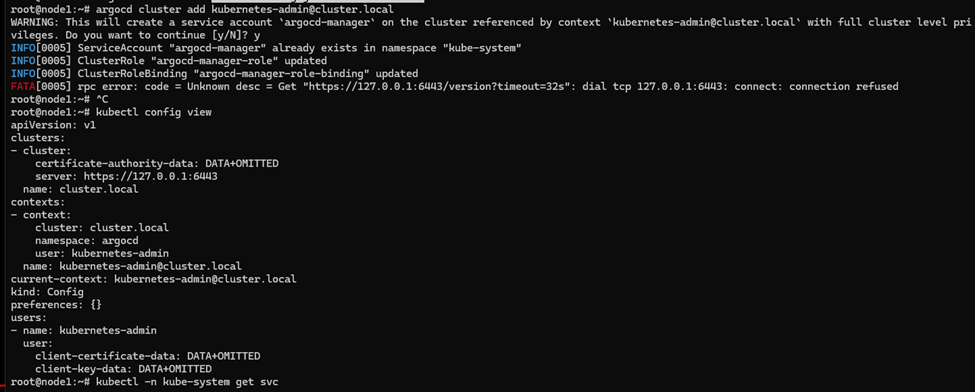
</div>

- Chúng ta cần vào ["vi ~/.kube/config"] để thay thế link server trong clusters và sử ["http://127.0.0.1"] -> link host của bạn.

<div align="center">
  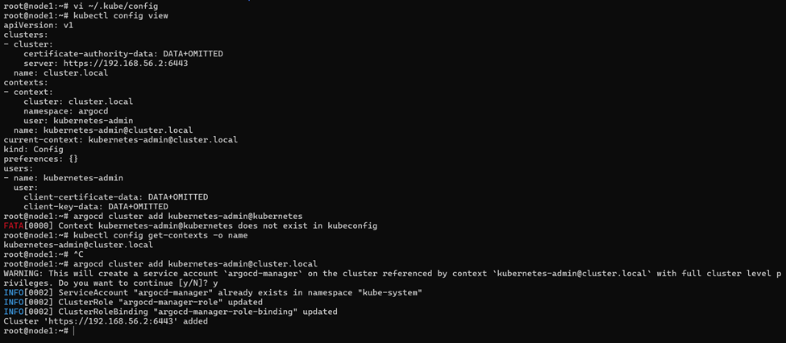
</div>

- Ảnh chụp giao diện màn hình hệ thống ArgoCD trên trình duyệt
<div align="center">
  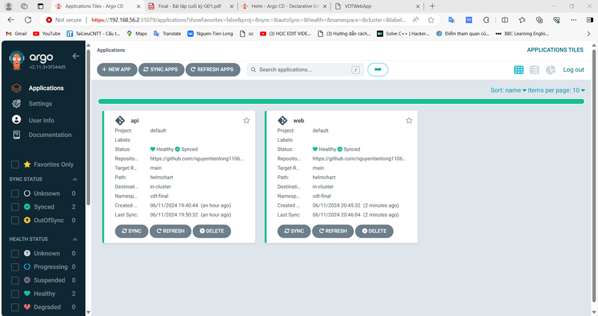
</div>

<div align="center">
  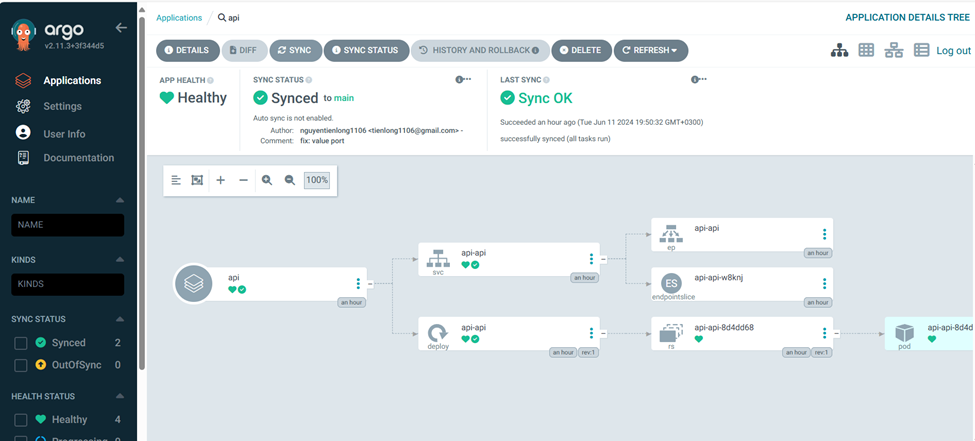
</div>

- Ảnh chụp giao diện màn hình trình duyệt khi truy cập vào Web URL, API URL
<div align="center">
  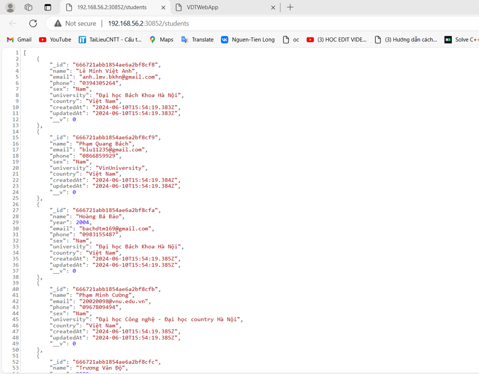
</div>

<div align="center">
  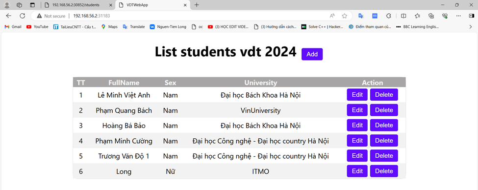
</div>

## 3 Continuous Delivery

- Luồng làm việc CICD sẽ tương tự hình dưới dây chỉ khác là ở Deployment Repo chỉ chứa file values.yaml còn lại đều được lưu trên Source Code Repo
<div align="center">
  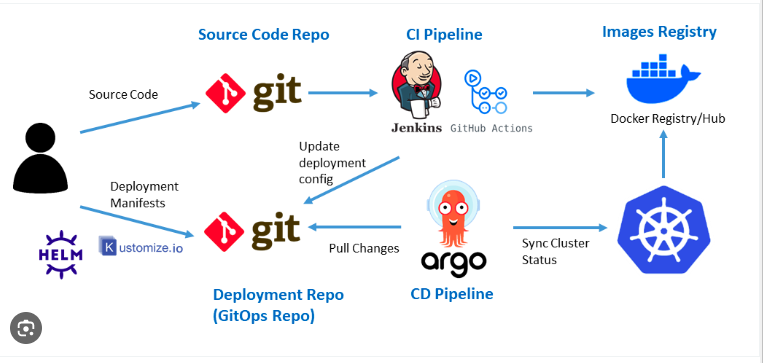
</div>

- Ở đây tôi sử dụng GitHub Action và ArgoCD, các file setup công cụ của 2 luồng CD :

```yaml
name: CI/CD Pipeline

on:
  push:
    tag:
      - "*"
jobs:
  push_to_registry:
    name: Push Docker image to Docker Hub
    runs-on: ubuntu-latest
    if: startsWith(github.ref, 'refs/tags/') # Only run on tag creation
    outputs:
      tag_name: ${{ steps.extract_tag.outputs.tag_name }}
    steps:
      - name: Check out the repo
        uses: actions/checkout@v2

      - name: Login to Docker Hub
        uses: docker/login-action@v2
        with:
          username: ${{ secrets.DOCKERHUB_USERNAME }}
          password: ${{ secrets.DOCKERHUB_ACCESS_TOKEN }}

      - name: Extract tag name
        id: extract_tag
        run: echo "tag_name=${GITHUB_REF_NAME}" >> $GITHUB_OUTPUT

      - name: Build and push Docker image
        uses: docker/build-push-action@v2
        with:
          context: .
          push: true
          tags: |
            tienlong1106/git_cicd_fe:${{ steps.extract_tag.outputs.tag_name }}

  update_config_repo:
    name: Update Config Repo with New Image Version
    runs-on: ubuntu-latest
    needs: push_to_registry # Ensure this job runs after push_to_registry

    steps:
      - name: Checkout config repo
        uses: actions/checkout@v2
        with:
          repository: nguyentienlong1106/VDT_Config_web
          ref: "main"
          token: ${{ secrets.G_TOKEN }}

      - name: Update image tag in values.yaml
        run: |
          sed -i 's/^  *tag:.*/  tag: ${{ needs.push_to_registry.outputs.tag_name }}/g' values.yaml

      - name: Commit and push changes
        run: |
          git config --global user.name "nguyentienlong1106"
          git config --global user.email "tienlong1106@gmail.com"
          git add values.yaml
          git commit -m "Update image tag to ${{ needs.push_to_registry.outputs.tag_name }}"
          git push
```

- Output log của 2 luồng CD khi tạo tag mới trên repo web và repo api

  - [`Link log repo web`](https://github.com/nguyentienlong1106/VDT_GK_FE/actions/runs/9475594368/job/26107127300)
    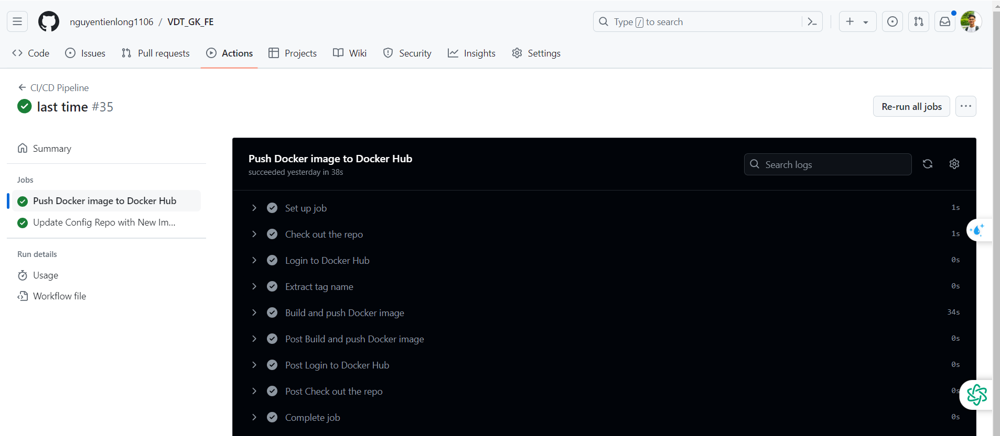

  - [`Link log repo api`](https://github.com/nguyentienlong1106/VDT_GK_API/actions/runs/9476023102/job/26108272315)
    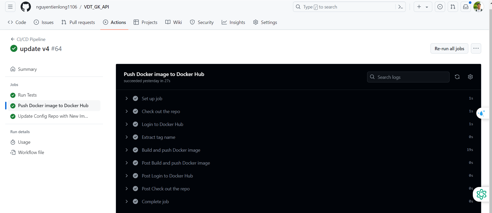

- Đẩy images lên Docker Hub
  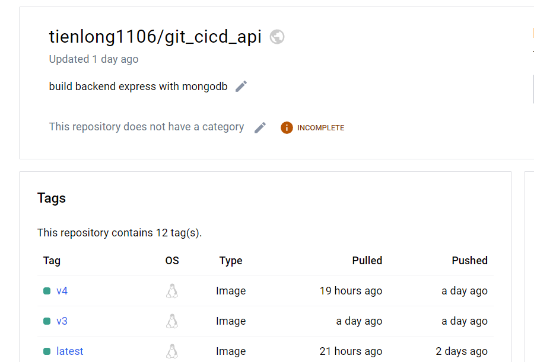
  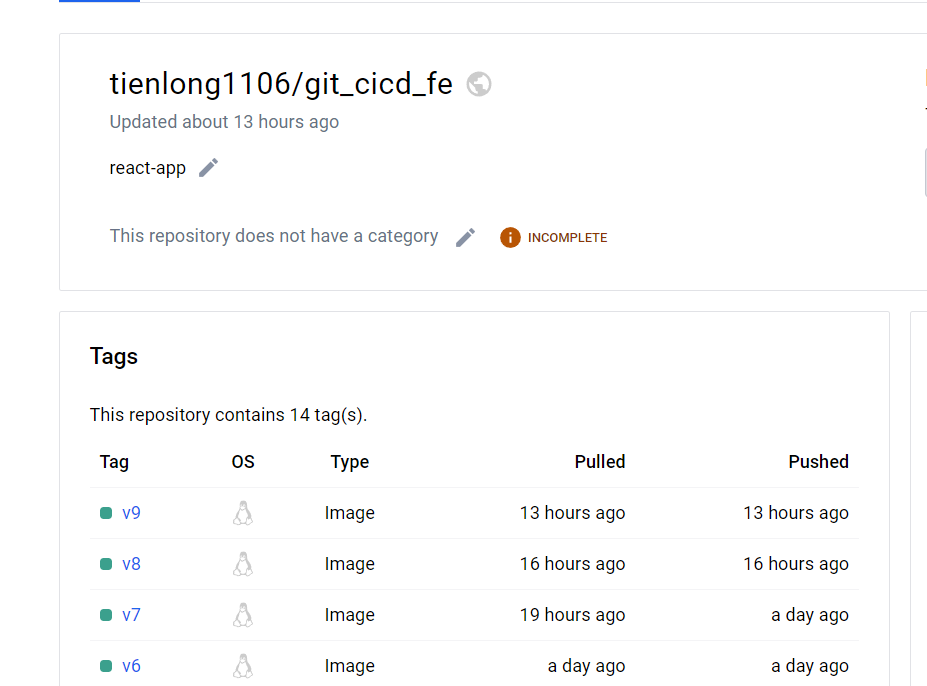

- Hình ảnh history của ArgoCD khi có sự thay đổi trên web config repo và api config repo
  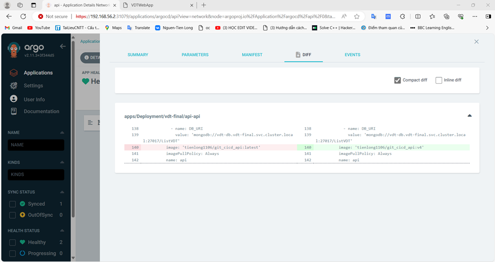
  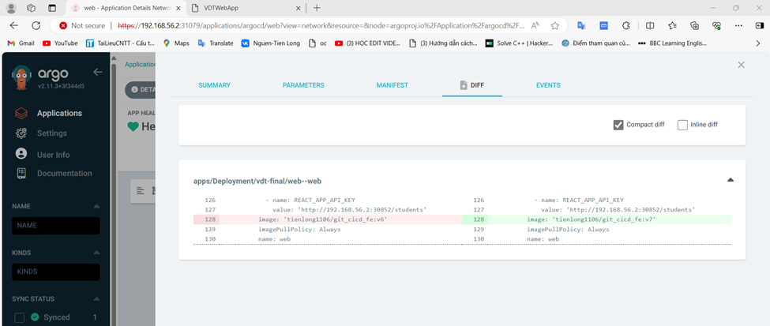

## 4. Monitoring

- [Document for install - It's here](https://prometheus-operator.dev/docs/prologue/quick-start/#:~:text=The%20easiest%20way%20of%20starting%20with%20the%20Prometheus,is%20access%20to%20a%20Kubernetes%20cluster%20with%20kubectl%21)

- [Link github setup Prometheus lên Kubernetes Cluster](https://github.com/prometheus-operator/kube-prometheus/tree/main/manifests)

- File manifests để tạo Servicemonitor cho ứng dụng web:

```yaml
apiVersion: monitoring.coreos.com/v1
kind: ServiceMonitor
metadata:
  labels:
    app.kubernetes.io/name: web-service
  name: web-prometheus
  namespace: monitoring
spec:
  selector:
    matchLabels:
      app: service-web
  endpoints:
    - port: web
      path: /metrics
      interval: 15s
```

- và cho api:

```yaml
apiVersion: monitoring.coreos.com/v1
kind: ServiceMonitor
metadata:
  labels:
    app.kubernetes.io/name: api-service
  name: api-prometheus
  namespace: monitoring
spec:
  selector:
    matchLabels:
      app: service-api
  endpoints:
    - port: api
      path: /metrics
      interval: 15s
```

**NOTE**: Các file service-prometheus.yaml có liên hệ chặt chẽ với các file services triển khai api và web. Ngoài việc **kind: ServicesMonitor** là bắt buộc và dịch vụ triển khai phải có cùng **namespace** với nơi dịch vụ prometheus được chạy, các biến phải liên kết như hình dưới đây:

<div align="center">
  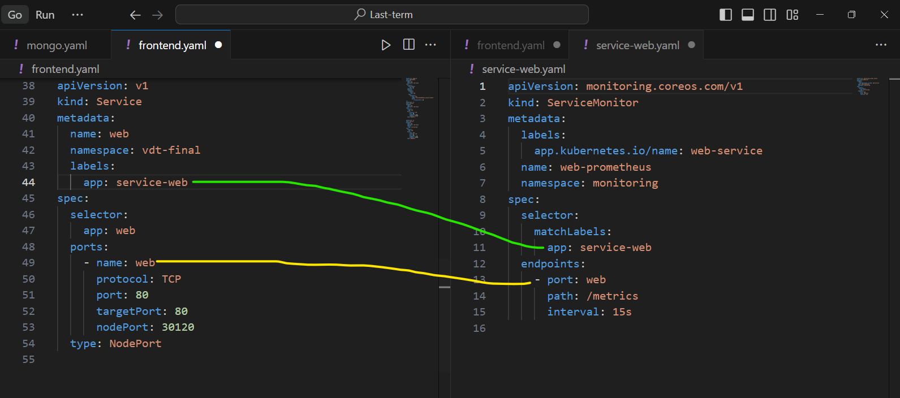
</div>

- Hình ảnh khi truy cập vào Prometheus UI thông qua trình duyệt và các dịch dụ mornitoring được cài thành công (web-prometheus và api-prometheus):
  
  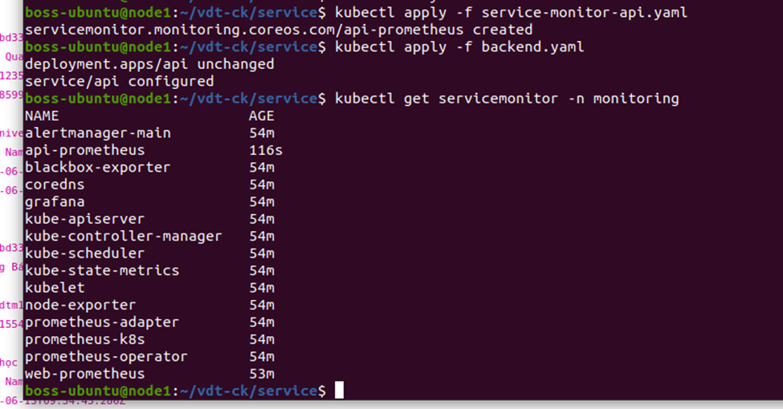

## 5. Logging

## 6. Security

### 6.3.

[Document for install - It's here](https://www.npmjs.com/package/express-rate-limit)

- Giải pháp của tôi là thêm thư viện ["express-rate-limit"] vào source code api, Đây là phần mềm trung gian giới hạn tốc độ cơ bản cho Express. Sử dụng để hạn chế các yêu cầu lặp lại đối với các API công khai và/hoặc điểm cuối, chẳng hạn như đặt lại mật khẩu. Trương trình sẽ tự động chặn tương tác khi phát hiện vượt quá 10 requests trong 1 phút.

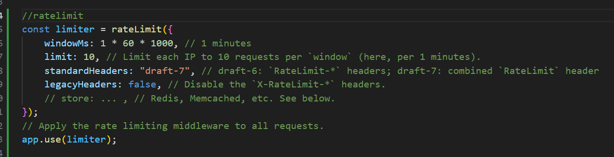

<div align="center">
<video width="660" height="440" controls loop>
  <source src="images/10.mp4" type="">
</video>
</div>

## Tài liệu:

- [`kubectl`](https://kubernetes.io/docs/tasks/tools/)
- [`kubespray`](https://github.com/kubernetes-sigs/kubespray)
- [`Prometheus Operator`](https://prometheus-operator.dev/)
- [`Argocd`](https://argoproj.github.io/cd/)
- [`Github Action`](https://docs.github.com/en/actions/learn-github-actions/contexts)
- [`express-rate-limit`](https://www.npmjs.com/package/express-rate-limit)
