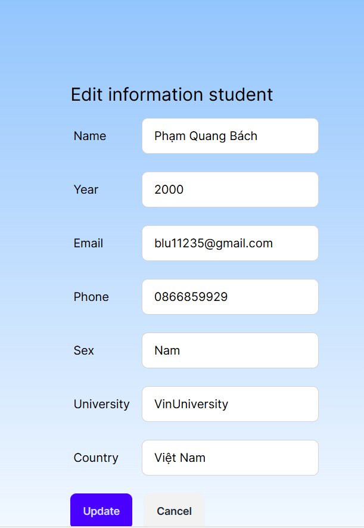
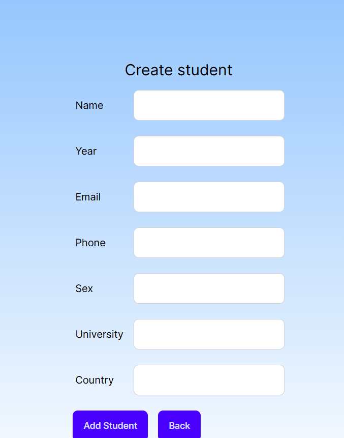
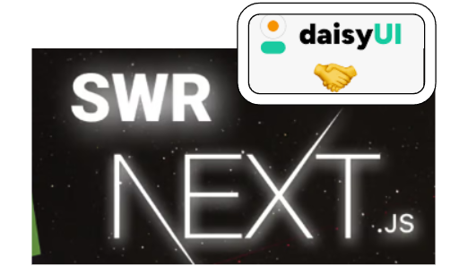
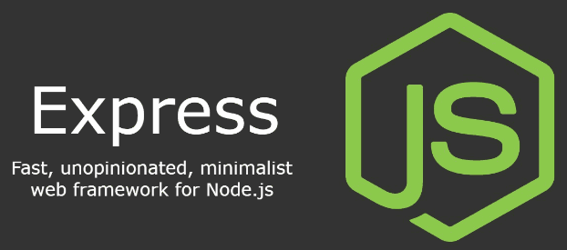
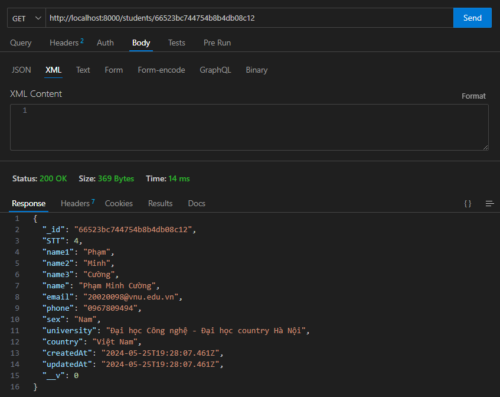
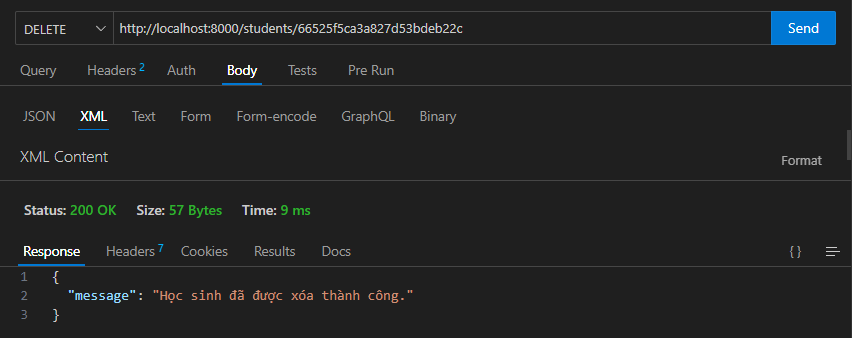

# Phát triển một 3-tier web application đơn giản

## 1. Mô tả

- Hiển thị danh sách sinh viên tham gia chương trình VDT2024 dưới dạng bảng với các thông tin sau: Họ và tên, Giới tính, trường đang theo học.

  

    
  

- Với các chức năng được thực hiện khi click các buttons như:

- Edit: Xuất hiện form thực hiện "get" xem thông tin chi tiết và có thể "update" thông tin.

  

    
  

- Delete: Xóa sinh viên

- Create: Thêm sinh viên

  

    
  

## 2. Dịch vụ sử dụng

### Web:

- Dịch vụ web_ui được phát triển dự trên framework Next.js viết theo TypeScript kết hợp cùng TailwindCSS và DaisyUI; sử dụng SWR để quản lý trạng thái dữ liệu trong ứng dụng.

  

### API

- Dịch vụ api được phát triển dựa trên Express.js là một framework nhẹ nhàng nhưng mạnh mẽ cho Node.js, giúp đơn giản hóa việc xây dựng ứng dụng web và API bằng JavaScript ở phía máy chủ.

  

### Database

- MongoDB được sử dụng cho dịch vụ Database, MongoDB là một hệ thống quản lý cơ sở dữ liệu NoSQL dựa trên mô hình tài liệu, cho phép lưu trữ dữ liệu dưới dạng các tài liệu JSON-like. Hệ thống này nổi tiếng với khả năng mở rộng, linh hoạt và hiệu suất cao, đặc biệt phù hợp với việc xử lý lượng dữ liệu lớn và không xác định trước cấu trúc.

  

## 3 Kết quả

<b>Repo api</b>: [VDT-GK-API](https://github.com/nguyentienlong1106/VDT_GK_API)

- Pull requests:
  - [Feature/createApi](https://github.com/nguyentienlong1106/VDT_GK_API/pull/3)
  - [Feature/docker](https://github.com/nguyentienlong1106/VDT_GK_API/pull/4)
  - [Feature/test](https://github.com/nguyentienlong1106/VDT_GK_API/pull/5)
  - [Feature/pipeline-ci-cd](https://github.com/nguyentienlong1106/VDT_GK_API/pull/6)

<b>Repo web</b>: [VDT-GK-Frontend](https://github.com/nguyentienlong1106/VDT_GK_Frontend)

- Pull requests:
  - [Feature/ui-callapi](https://github.com/nguyentienlong1106/VDT_GK_Frontend/pull/1)
  - [Feature/docker](https://github.com/nguyentienlong1106/VDT_GK_Frontend/pull/2)
  - [Feature/pipelineCiCd](https://github.com/nguyentienlong1106/VDT_GK_Frontend/pull/3)

<b>Test api</b>:
Jest và Supertest là hai công cụ quan trọng trong quy trình kiểm thử cho các ứng dụng Node.js, mỗi công cụ có vai trò riêng biệt nhưng cùng hướng tới mục tiêu đảm bảo chất lượng và ổn định của ứng dụng.

- Jest là một framework kiểm thử JavaScript được thiết kế để chạy nhanh và dễ dàng. Nó hỗ trợ việc viết các bài kiểm thử đơn vị, kiểm thử hàm, và kiểm thử component. Jest cung cấp nhiều tính năng hữu ích như mocking, snapshot testing, và coverage reporting, giúp nhà phát triển dễ dàng phát hiện và khắc phục lỗi trong codebase của họ. Jest được biết đến với cấu hình đơn giản, dễ dàng tùy chỉnh để phù hợp với mọi yêu cầu kiểm thử.
- Supertest là một thư viện kiểm thử dành cho Node.js, cho phép bạn kiểm tra các API RESTful một cách dễ dàng. Supertest hoạt động trên cơ sở của HTTP client, cho phép gửi các yêu cầu HTTP đến ứng dụng của bạn và kiểm tra phản hồi. Nó hỗ trợ việc kiểm tra các endpoint, kiểm tra trạng thái HTTP, kiểm tra header, và kiểm tra body của phản hồi. Supertest cần một framework kiểm thử như Jest hoặc Mocha để chạy các bài kiểm thử, và nó được tích hợp chặt chẽ với cả hai framework này.

#### Kết quả chạy test trên terminal và Thunder Client(tool vscode):

  
 <h3>api get: /:id</h3>
  
 <h3>api list: /</h3>
  
   <h3>api create: /add</h3>
  
  <h3>api put: /:id</h3>
  
   <h3>api delete: /:id</h3>
  

