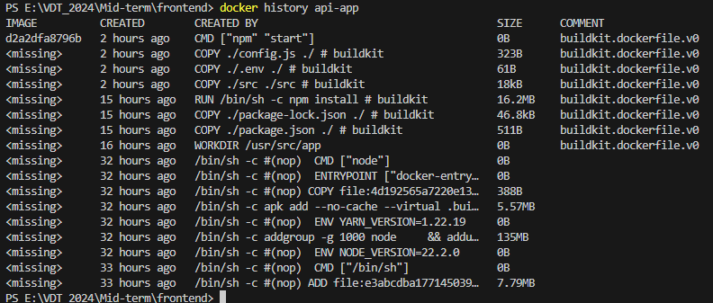
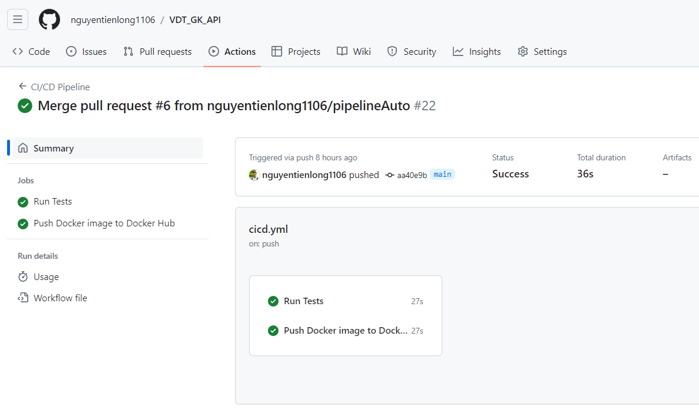
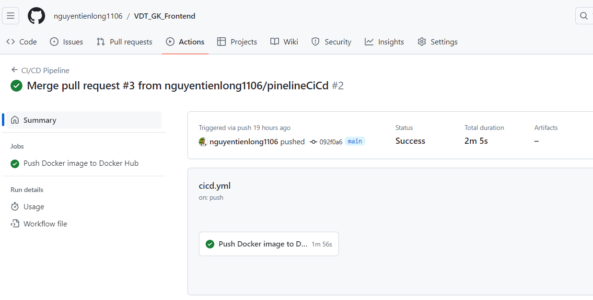
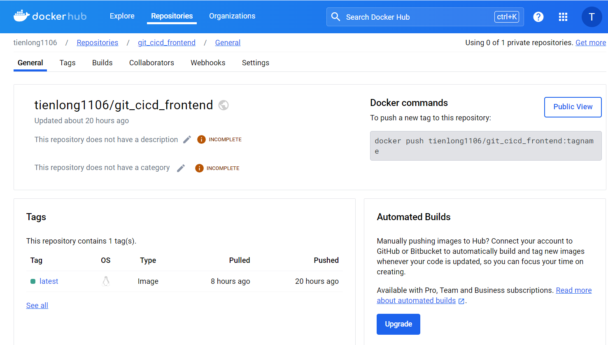
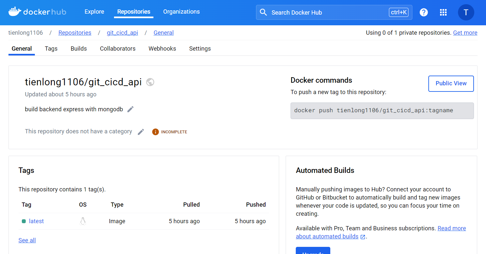
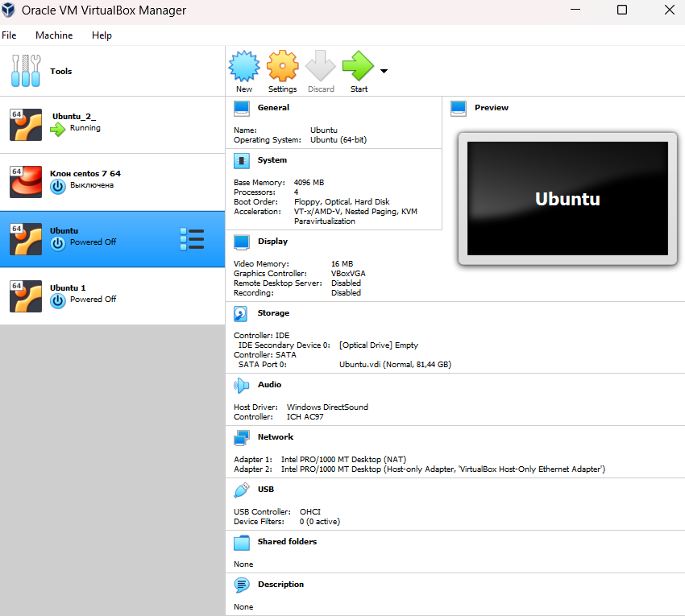
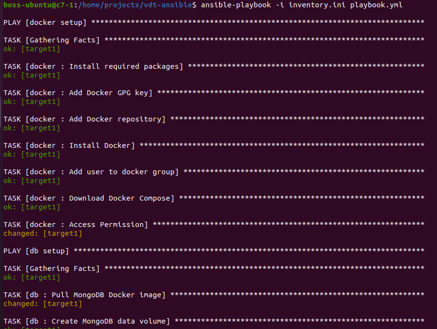

# Triển khai web application sử dụng các DevOps tools & practices

## 1. Containerization

- Viết Dockerfile để ở từng repo để đóng gói các dịch vụ trên thành các container image (1đ)

File docker cho dịch vụ api, ở đây tôi chỉ chọn những file thư mục thực sự cần thiết để chạy dịch vụ chứ không COPY . . tất cả, loại bỏ các file test cũng như cấu hình test, file ./github:

```Dockerfile
FROM node:alpine
WORKDIR /usr/src/app
COPY ./package.json ./
COPY ./package-lock.json ./
RUN npm install
COPY ./src ./src
COPY ./.env ./
COPY ./config.js ./
CMD ["npm", "start"]
```

File docker-compose để chạy mongodb và api:

```docker-compose.yml
version: "3.8"

services:
  #MongoDB
  mongo_db:
    image: mongo:latest
    restart: always
    volumes:
      - mongo_db:/data/db
    ports:
      - "27017:27017"

  app:
    build: .
    ports:
      - 8000:8000
    environment:
      APP_NAME: ListVDT
      PORT: 8000
      DB_URI: mongodb://mongo_db:27017
    depends_on:
      - mongo_db

volumes:
  mongo_db:
    driver: local
```

File docker cho dịch vụ web, ở đây tôi đã sử dụng multi-Stage builds và chỉ thực sự cài những file cần thiêt để chạy:

```Dockerfile
# Stage 1:
FROM node:latest AS builder
WORKDIR /app
COPY package.json package-lock.json ./
RUN npm install
COPY . .
RUN npm run build

# Stage 2:
FROM node:latest
WORKDIR /app

COPY --from=builder /app/.next ./.next
COPY --from=builder /app/public ./public
COPY --from=builder /app/package.json ./
COPY --from=builder /app/node_modules ./node_modules

EXPOSE 3000

CMD ["npm", "start"]
```

File docker-compose để chạy dịch vụ web:

```docker-compose.yml

version: "3.8"

services:
  nextjs:
    build:
      context: .
      dockerfile: Dockerfile
    ports:
      - "3000:3000"
    volumes:
      - ./src:/app/src
    restart: always
```

- Output:

Output câu lệnh build và thông tin docker history của từng image:

  <div align="center">
    
  </div>
  <div align="center">
    Log run docker-compose for API and Mongodb
  </div>

  <br>

   <div align="center">
    
  </div>
  <div align="center">
    Docker history for API 
  </div>

  <br>

   <div align="center">
    
  </div>
  <div align="center">
    Docker history for Mongo 
  </div>

  <br>

  <div align="center">
    
  </div>
  <div align="center">
    Log run docker-compose for WEB
  </div>

   <br>

   <div align="center">
    
  </div>
  <div align="center">
    Docker history for WEB
  </div>

## 2. Continuous Integration (1.5đ)

- Mô tả thực hiện CI bằng GitHub Action:

  Lý thuyết: GitHub Actions là một nền tảng tích hợp liên tục (CI) và phát triển liên tục (CD) cho phép bạn tự động hóa quá trình xây dựng, kiểm thử, và triển khai của bạn. Nó cho phép bạn tạo các quy trình làm việc (workflows) trực tiếp trong kho lưu trữ GitHub của bạn, giúp tự động hóa các tác vụ như xây dựng mã nguồn, chạy kiểm thử, và thậm chí triển khai ứng dụng khi có sự kiện nhất định xảy ra, như khi có mã mới được đẩy lên kho lưu trữ hoặc khi có pull request mới được tạo.

- Triển khai trên repo [VDT_GK_API](https://github.com/nguyentienlong1106/VDT_GK_API/pull/3):

  Tạo file cicd.yml trong thư mục .github/workflows để GitHub Action tự động thực hiện 2 công việc chạy test và build&push image:

  ```.yml

  name: CI/CD Pipeline

  on:
  push: # Trigger on push events
      branches:
      - "*" # All branches
  pull_request: # Trigger on pull request events
      branches:
      - main

  jobs:
  test:
      name: Run Tests
      runs-on: ubuntu-latest

      services:
      mongodb:
          image: mongo:latest
          ports:
          - 27017:27017

      steps:
      - name: Checkout code
          uses: actions/checkout@v2

      - name: Set up Node.js
          uses: actions/setup-node@v2
          with:
          node-version: "20.11.1"

      - name: Clear npm cache
          run: npm cache clean --force

      - name: Install dependencies
          run: npm install

      - name: Run tests
          run: npm test

  push_to_registry:
      name: Push Docker image to Docker Hub
      runs-on: ubuntu-latest
      if: github.ref == 'refs/heads/main' # Only run on the main branch

      steps:
      - name: Check out the repo
          uses: actions/checkout@v2

      - name: Login to Docker Hub
          uses: docker/login-action@v2
          with:
          username: ${{ secrets.DOCKERHUB_USERNAME }}
          password: ${{ secrets.DOCKERHUB_ACCESS_TOKEN }}

      - name: Build and push Docker image
          uses: docker/build-push-action@v2
          with:
          push: true
          tags: tienlong1106/git_cicd_api:latest

  ```

  - Tương tự sẽ triển khai auto build and push to Docker Hub trên repo [VDT-GK-Frontend](https://github.com/nguyentienlong1106/VDT_GK_Frontend)

- Output

    <div align="center">
    
  </div>
  <div align="center">
    Kết quả chạy GitHub Action trên repo <a title="" href="https://github.com/nguyentienlong1106/VDT_GK_API/actions/runs/9242974177" > VDT_GK_API </a>
  </div>

  File log cho từng job:

  - Auto [Run Tests](https://github.com/nguyentienlong1106/VDT_GK_API/actions/runs/9242974177/job/25426495271),

  - Auto [Build and push Docker image to DockerHub](https://github.com/nguyentienlong1106/VDT_GK_API/actions/runs/9242974177/job/25426495325)

- Các hình ảnh demo khác:
    <div align="center">
    
  </div>
  <div align="center">
    Kết quả chạy GitHub Action trên repo <a title="" href="https://github.com/nguyentienlong1106/VDT_GK_Frontend/actions/runs/9239451452" > VDT_GK_Frontend </a>
  </div>
  <br>
    <div align="center">
    
  </div>
  <div align="center">
     Public image : <a title="" href="https://hub.docker.com/r/tienlong1106/git_cicd_frontend" >tienlong1106/git_cicd_frontend</a>
  </div>
    <br/>
    <div align="center">
        
    </div>
    <div align="center">
         Public image : <a title="" href="https://hub.docker.com/r/tienlong1106/git_cicd_api" >tienlong1106/git_cicd_api</a>
    </div>

## 3. Automation (1.5đ)

### 3.1 Chuẩn bị tài nguyên

Tạo hai máy ảo trên virtualbox (<a href="https://funix.edu.vn/chia-se-kien-thuc/cach-cai-dat-ubuntu-tren-virtualbox/">hướng dẫn</a>)

<div align="center">

</div>

## Note: Cấu hình "NETWORK" để hai máy tương tác được với nhau và bật kết nối cho cổng SSH

Tổng quan công việc: Máy 1 có IP: 192.168.56.103 - làm nơi cài đặt ansible dùng để các cấu hình cho máy thứ 2 có IP: 192.168.56.102 tự động chạy các dịch vụ WEB, API, DB trên docker.

### 3.2 Cấu hình inventory

Trên máy 1 - trong thư mục làm việc với ansible tạo file "inventory.ini" và nội dung như sau:

```
[all_hosts]
target1 ansible_ssh_host=192.168.56.102 ansible_user=long ansible_become=yes

[webservers]
target1
```

Tiếp đó tạo keygen của tài khoản máy 1 sang máy thứ 2 và nhập password máy 2 - Mục đích để có thể thực hiện các tác vụ từ máy 1 mà không cần nhập lại mật khẩu để truy cập máy 2 và cấp quyền làm việc cho user máy 2 trong "visudo" thêm dòng "username ALL=(ALL) NOPASSWD

```bash
$ ssh-key -t rsa
$ ssh-copy-id long@192.168.56.102
```

<br/>

### 3.3 Viết ansible playbooks để triển khai các image docker của các dịch vụ web, api, db

 <div align="center">
        
    </div>
    <div align="center">
        Cấu trúc thư mục role trong ansible
    </div>

- Đầu tiên viết role để cài đặt docker rồi đến DB, API và cuối cùng là WEB

Thêm lệnh thực hiện và file "roles/tasks/main.yml" và đưa các biến vào trong file "roles/handlers/mail.yml" còn các tệp còn lại hiện chưa cấu hình.

- Tạo file playbook.yml

```
---
- name: docker setup
  hosts: webservers
  become: true
  roles:
    - docker

- name: db setup
  hosts: webservers
  become: true
  roles:
    - db

- name: api service
  hosts: webservers
  become: true
  roles:
    - api

- name: web service
  hosts: webservers
  become: true
  roles:
    - web

```

- RUN:

```bash
$ ansible-playbook -i inventory.ini playbook.yml
```

Output:

 <div align="center">
        
    </div>
 <div align="center">
        
    </div>

<br/>

- Kiểm tra docker trên máy 2:

 <div align="center">
        
    </div>

## Link github [VDT_ansible](https://github.com/nguyentienlong1106/VDT_ansible): source code của ansible playbooks
