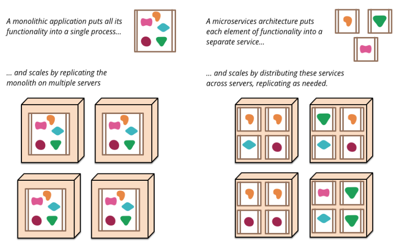
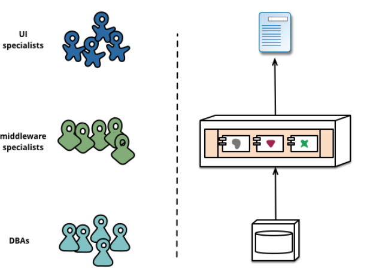
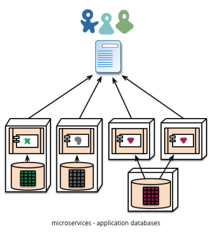

# MICROSERVICES

## 1 Tổng quan về Microservices

Microservices, một xu hướng phát triển phần mềm ngày càng phổ biến, đại diện cho một cách tiếp cận kiến trúc mạnh mẽ và linh hoạt trong việc xây dựng ứng dụng. Khác với các phương pháp truyền thống tập trung vào một ứng dụng monolithic, microservices tách biệt ứng dụng thành nhiều dịch vụ nhỏ, mỗi dịch vụ chạy độc lập trong quy trình riêng và giao tiếp với nhau thông qua các giao thức nhẹ như HTTP.

Đây là một chiến lược phát triển phần mềm dựa trên nhu cầu kinh doanh cụ thể, cho phép mỗi dịch vụ được phát triển, triển khai và mở rộng độc lập. Điều này mang lại nhiều lợi ích, bao gồm khả năng tăng tốc độ phát triển, nâng cao độ linh hoạt và khả năng mở rộng, cũng như giảm thiểu rủi ro khi cập nhật hoặc thay đổi một phần của ứng dụng mà không ảnh hưởng đến phần còn lại.

Các dịch vụ microservices có thể được viết bằng nhiều ngôn ngữ lập trình khác nhau và sử dụng các công nghệ lưu trữ dữ liệu phù hợp, điều này tạo ra một môi trường phát triển đa dạng và linh hoạt. Việc quản lý trở nên tối thiểu hóa hơn, tập trung vào việc đảm bảo rằng mỗi dịch vụ hoạt động hiệu quả và đáp ứng yêu cầu kinh doanh.

## 2 So sánh với cấu trúc Monolith

Để bắt đầu nói về cấu trúc microservices, chúng ta đơn giản so sánh nó với cấu trúc nguyên khối: một ứng dụng được xây dựng dưới dạng một tổng thể duy nhất. Các ứng dụng doanh nghiệp thường bao gồm ba phần chính: giao diện người dùng (thường bao gồm các trang HTML và JavaScript), cơ sở dữ liệu (thường là quan hệ, có nhiều bảng) và máy chủ. Phần máy chủ xử lý các yêu cầu HTTP, thực hiện logic miền, yêu cầu và cập nhật dữ liệu trong cơ sở dữ liệu, điền vào các trang HTML, sau đó được gửi đến trình duyệt của khách hàng. Bất kỳ thay đổi nào trong hệ thống đều dẫn đến việc xây dựng lại và triển khai phiên bản mới của máy chủ ứng dụng.

Một máy chủ nguyên khối là một cách khá rõ ràng để xây dựng những hệ thống như vậy. Tất cả logic xử lý yêu cầu được thực thi trong một quy trình duy nhất và bạn có thể sử dụng các khả năng của ngôn ngữ lập trình của mình để chia ứng dụng thành các lớp, hàm và không gian tên. Chúng ta có thể chạy và kiểm tra ứng dụng trên máy phát triển và sử dụng quy trình triển khai tiêu chuẩn để kiểm tra các thay đổi trước khi phát hành chúng vào sản xuất. Chúng ta có thể mở rộng quy mô ứng dụng nguyên khối theo chiều ngang bằng cách chạy nhiều máy chủ vật lý phía sau bộ cân bằng tải.

Các ứng dụng nguyên khối có thể thành công nhưng ngày càng có nhiều người vỡ mộng về chúng, đặc biệt khi ngày càng có nhiều ứng dụng được triển khai lên đám mây. Bất kỳ thay đổi nào, ngay cả những thay đổi nhỏ nhất, đều yêu cầu toàn bộ khối nguyên khối phải được lắp ráp lại và triển khai. Theo thời gian, việc duy trì cấu trúc mô-đun tốt trở nên khó khăn hơn, những thay đổi về logic của một mô-đun có xu hướng ảnh hưởng đến mã trong các mô-đun khác. Toàn bộ ứng dụng phải mở rộng quy mô, ngay cả khi nó chỉ được yêu cầu cho một mô-đun của ứng dụng.

Những bất tiện này đã dẫn đến phong cách kiến ​​trúc microservices: xây dựng các ứng dụng như một tập hợp các dịch vụ. Ngoài khả năng triển khai và mở rộng quy mô một cách độc lập, mỗi dịch vụ còn có ranh giới vật lý rõ ràng cho phép các dịch vụ khác nhau được viết bằng các ngôn ngữ lập trình khác nhau. Chúng cũng có thể được phát triển bởi các nhóm khác nhau.

## 3 Thuộc tính của kiến ​​trúc microservice

### 3.1 Phân vùng thông qua dịch vụ

Khi nói về các thành phần, chúng ta gặp phải khó khăn trong việc xác định thành phần là gì. Bạn hãy hình dung đến việc độ cho một chiếc xe oto đẹp và mạnh mẽ hơn, bạn cần thay thế các phụ tùng, linh kiện từ các nhà máy sản xuất riêng biệt và trong một phần mềm cũng có những thành phần bạn muốn nâng cấp. Định nghĩa của tôi là thế này: một thành phần là một phần mềm có thể được thay thế hoặc nâng cấp một cách độc lập.

Kiến trúc microservices sử dụng các thư viện, nhưng cách chính để chia nhỏ một ứng dụng là chia nó thành các dịch vụ. Chúng tôi định nghĩa thư viện là các thành phần được kết nối và gọi bởi một chương trình trong cùng một quy trình, trong khi dịch vụ là các thành phần chạy trong một quy trình riêng biệt và giao tiếp với nhau thông qua các yêu cầu web hoặc lệnh gọi thủ tục từ xa (RPC).

Lý do chính để sử dụng dịch vụ thay vì thư viện là việc triển khai độc lập. Nếu bạn đang phát triển một ứng dụng bao gồm nhiều thư viện chạy trong cùng một quy trình thì bất kỳ thay đổi nào đối với các thư viện đó sẽ khiến toàn bộ ứng dụng phải được triển khai lại. Nhưng nếu ứng dụng của bạn được chia thành nhiều dịch vụ thì những thay đổi ảnh hưởng đến bất kỳ dịch vụ nào trong số đó sẽ chỉ yêu cầu triển khai lại dịch vụ đã thay đổi. Tất nhiên, một số thay đổi sẽ ảnh hưởng đến giao diện, do đó sẽ yêu cầu sự phối hợp giữa các dịch vụ khác nhau, nhưng mục tiêu của một kiến ​​trúc vi dịch vụ tốt là giảm thiểu nhu cầu phối hợp đó bằng cách thiết lập ranh giới thích hợp giữa các vi dịch vụ, cũng như cơ chế để sự phát triển của hợp đồng dịch vụ.

Một hệ quả khác của việc sử dụng dịch vụ làm thành phần là giao diện rõ ràng hơn giữa chúng. Hầu hết các ngôn ngữ lập trình đều không có cơ chế tốt để khai báo một Giao diện xuất bản . Thông thường, chỉ có tài liệu và kỷ luật mới ngăn chặn việc đóng gói thành phần bị phá vỡ. Các dịch vụ tránh điều này bằng cách sử dụng cơ chế gọi từ xa rõ ràng.

Tuy nhiên, sử dụng dịch vụ theo cách này cũng có nhược điểm. Lệnh gọi từ xa chậm hơn lệnh gọi trong quá trình và do đó API phải ít chi tiết hơn (thô hơn), điều này thường dẫn đến sự bất tiện khi sử dụng. Nếu bạn cần thay đổi tập hợp trách nhiệm giữa các thành phần thì việc thực hiện sẽ khó khăn hơn vì bạn cần vượt qua các ranh giới của quy trình.

### 3.2 Tổ chức dựa theo nhu cầu kinh doanh

Khi một ứng dụng lớn được chia thành nhiều phần, việc quản lý thường tập trung vào công nghệ, dẫn đến thành lập nhóm UI, nhóm máy chủ và nhóm DB. Khi các nhóm được cấu trúc như thế này, ngay cả những thay đổi nhỏ cũng có thể mất nhiều thời gian do yêu cầu phải có sự giao tiếp giữa các nhóm. Điều này dẫn đến việc các nhóm đặt bất kỳ logic nào họ có vào các lớp mà họ có quyền truy cập.

“Bất kỳ tổ chức nào thiết kế bất kỳ hệ thống nào (theo nghĩa rộng) sẽ nhận được một thiết kế có cấu trúc sao chép cấu trúc của các nhóm trong tổ chức đó” - Melvyn Conway,

Cách tiếp cận phân vùng của microservice bao gồm việc phân chia thành các dịch vụ theo nhu cầu kinh doanh . Các dịch vụ như vậy bao gồm tập hợp đầy đủ các công nghệ cần thiết cho nhu cầu kinh doanh này, bao gồm giao diện người dùng, lưu trữ dữ liệu và mọi tương tác bên ngoài. Điều này dẫn đến việc hình thành các nhóm đa chức năng với đầy đủ các kỹ năng cần thiết: trải nghiệm người dùng, cơ sở dữ liệu và quản lý dự án.

### 3.3 Sản phẩm, không phải dự án

Hầu hết các công ty phát triển phần mềm mà chúng tôi thấy đều sử dụng mô hình dự án với mục tiêu là phát triển một số phần chức năng và sau đó coi như nó đã hoàn thiện. Sau khi hoàn thành, phần này được bàn giao cho nhóm hỗ trợ và nhóm dự án giải tán.

Nhưng phát triển theo microservice thì nên tránh mô hình này, chúng ta phải nghĩ rằng nhóm nên sở hữu sản phẩm suốt đời. Điều này dẫn đến việc các nhà phát triển thường xuyên quan sát cách sản phẩm của họ hoạt động trong quá trình sản xuất và tiếp xúc nhiều hơn với người dùng, bởi vì họ phải đảm nhận ít nhất một số trách nhiệm hỗ trợ.

### 3.4 Bộ nhận tin nhắn thông minh và các kênh truyền tải câm

Các ứng dụng được xây dựng bằng kiến ​​trúc microservices cố gắng tách rời và gắn kết nhất có thể: chúng chứa logic miền riêng và hoạt động giống các bộ lọc hơn theo nghĩa Unix cổ điển - nhận yêu cầu, áp dụng logic và gửi phản hồi. Thay vì các giao thức phức tạp như WS-\* hoặc BPEL, họ sử dụng các giao thức REST đơn giản.

### 3.5 Kiểm soát phi tập trung

Một hệ quả của quản lý tập trung là xu hướng tiêu chuẩn hóa các nền tảng được sử dụng. Chúng ta muốn sử dụng công cụ phù hợp cho từng công việc cụ thể. Thay vì sử dụng một bộ tiêu chuẩn được xác định trước do ai đó viết, họ thích ý tưởng xây dựng các công cụ hữu ích mà các nhà phát triển khác có thể sử dụng để giải quyết các vấn đề tương tự. Những công cụ này thường được trích xuất từ ​​mã của một trong các dự án và được chia sẻ giữa các nhóm khác nhau, đôi khi sử dụng mô hình nguồn mở nội bộ.

### 3.6 Quản lý dữ liệu phi tập trung

Quản lý dữ liệu phi tập trung có nhiều hình thức khác nhau. Điều này có nghĩa là mô hình khái niệm về dữ liệu sẽ lưu trữ khác nhau giữa các hệ thống.

Việc phân cấp trách nhiệm về dữ liệu giữa các vi dịch vụ có tác động đến cách dữ liệu đó thay đổi. Cách tiếp cận phổ biến để thay đổi dữ liệu là sử dụng các giao dịch để đảm bảo tính nhất quán khi thay đổi dữ liệu trên nhiều tài nguyên. Cách tiếp cận này thường được sử dụng trong các ứng dụng nguyên khối.

Việc sử dụng các giao dịch này đảm bảo tính nhất quán, nhưng dẫn đến sự ghép nối tạm thời đáng kể , do đó, dẫn đến các vấn đề khi làm việc với nhiều dịch vụ. Việc triển khai các giao dịch phân tán cực kỳ phức tạp và do đó, kiến ​​trúc microservice nhấn mạnh sự phối hợp giữa các dịch vụ mà không cần sử dụng giao dịch, với chỉ định rõ ràng rằng tính nhất quán chỉ có thể là tính nhất quán cuối cùng và các vấn đề phát sinh sẽ được giải quyết bằng các hoạt động đền bù.

### 3.7 Design for failure

Hậu quả của việc sử dụng dịch vụ làm thành phần là các ứng dụng phải được thiết kế để hoạt động khi các dịch vụ riêng lẻ bị lỗi. Mọi truy vấn đến dịch vụ có thể không thực hiện được do không có sẵn. Đây là nhược điểm của microservice so với monolith, bởi vì điều này đưa thêm sự phức tạp vào ứng dụng.

Vì dịch vụ có thể bị lỗi bất cứ lúc nào nên điều quan trọng là có thể nhanh chóng phát hiện sự cố và nếu có thể, hãy tự động khôi phục dịch vụ. Kiến trúc microservice tập trung nhiều vào việc giám sát ứng dụng trong thời gian thực, kiểm tra cả yếu tố kỹ thuật (ví dụ: cơ sở dữ liệu nhận được bao nhiêu yêu cầu mỗi giây) và số liệu kinh doanh (ví dụ: ứng dụng nhận được bao nhiêu đơn hàng mỗi phút). Giám sát ngữ nghĩa có thể cung cấp một hệ thống cảnh báo sớm cho các tình huống có vấn đề, cho phép nhóm phát triển tham gia điều tra vấn đề ở giai đoạn sớm nhất.

Điều này đặc biệt quan trọng trong trường hợp kiến ​​trúc microservice, bởi vì chia nhỏ thành các quy trình riêng biệt và giao tiếp thông qua các sự kiện dẫn đến hành vi không mong muốn. Giám sát là điều cần thiết để xác định các trường hợp không mong muốn của hành vi này và nhanh chóng giải quyết chúng.

### 3.8 Khả năng phát triển

Trang web Guardian là một ví dụ điển hình về một ứng dụng được thiết kế và xây dựng dưới dạng nguyên khối nhưng sau đó phát triển theo hướng dịch vụ vi mô. Cốt lõi của trang web vẫn là nguyên khối nhưng các tính năng mới được thêm vào bằng cách xây dựng các dịch vụ vi mô sử dụng API của nguyên khối. Cách tiếp cận này đặc biệt hữu ích cho các chức năng vốn chỉ mang tính tạm thời. Một ví dụ về chức năng như vậy là các trang chuyên đưa tin về các sự kiện thể thao. Những phần như vậy của trang web có thể được tập hợp nhanh chóng bằng các ngôn ngữ lập trình nhanh và bị xóa sau khi sự kiện kết thúc. Chúng ta đã thấy cách tiếp cận tương tự trong các hệ thống tài chính, nơi các dịch vụ mới được thêm vào để giải quyết các cơ hội thị trường và bị loại bỏ hàng tháng hoặc thậm chí vài tuần sau khi chúng được tạo ra.

Sự nhấn mạnh vào khả năng thay thế này là một trường hợp đặc biệt của nguyên tắc chung hơn của thiết kế mô-đun, đó là tính mô-đun được xác định bởi tốc độ thay đổi về chức năng. Những thứ thay đổi cùng nhau nên được giữ trong cùng một mô-đun. Các bộ phận của hệ thống hiếm khi thay đổi không nên đặt cùng vị trí với các dịch vụ đang phát triển nhanh chóng. Nếu bạn thường xuyên trao đổi hai dịch vụ với nhau, hãy cân nhắc việc hợp nhất chúng.

Việc đặt các thành phần vào dịch vụ sẽ tăng thêm khả năng lập kế hoạch phát hành chi tiết hơn. Với nguyên khối, mọi thay đổi đều yêu cầu phải xây dựng lại và triển khai toàn bộ ứng dụng. Với microservices, bạn chỉ cần triển khai lại những dịch vụ đã thay đổi. Điều này cho phép bạn đơn giản hóa và tăng tốc quá trình phát hành. Nhược điểm của phương pháp này là bạn phải lo lắng về những thay đổi đối với một dịch vụ sẽ phá vỡ các dịch vụ truy cập vào dịch vụ đó. Cách tiếp cận truyền thống để tích hợp là giải quyết các vấn đề như vậy thông qua việc lập phiên bản, nhưng các dịch vụ vi mô chỉ thích sử dụng phiên bản khi thực sự cần thiết . Chúng ta có thể tránh việc lập phiên bản bằng cách thiết kế các dịch vụ sao cho có thể chấp nhận được những thay đổi đối với các dịch vụ lân cận nhất có thể.

Sự thành công của bất kỳ nỗ lực nào nhằm xây dựng một hệ thống thành phần đều phụ thuộc vào mức độ phù hợp của các thành phần đó với ứng dụng. Thật khó để hiểu chính xác ranh giới thành phần nên nằm ở đâu. Thiết kế tiến hóa thừa nhận sự khó khăn trong việc vẽ ra những ranh giới phù hợp và tầm quan trọng của việc dễ dàng thay đổi chúng. Khi các thành phần của bạn là các dịch vụ giao tiếp với nhau từ xa, việc tái cấu trúc sẽ khó khăn hơn nhiều so với trường hợp các thư viện chạy trong cùng một quy trình. Việc di chuyển mã qua ranh giới dịch vụ và thay đổi giao diện phải được phối hợp giữa các nhóm khác nhau. Các lớp phải được thêm vào để duy trì khả năng tương thích ngược. Tất cả điều này cũng làm phức tạp quá trình thử nghiệm.
Một lời khuyên là bạn không nên bắt đầu phát triển bằng kiến ​​trúc vi dịch vụ. Bắt đầu với một khối nguyên khối, giữ nó theo mô-đun và chia nó thành các vi dịch vụ khi khối nguyên khối gặp vấn đề.

### Cảm ơn vì đã xem!
