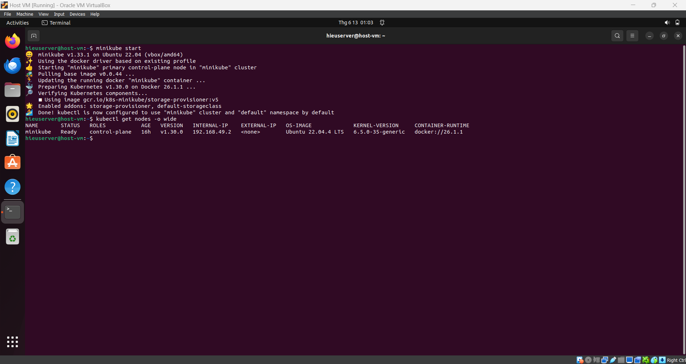
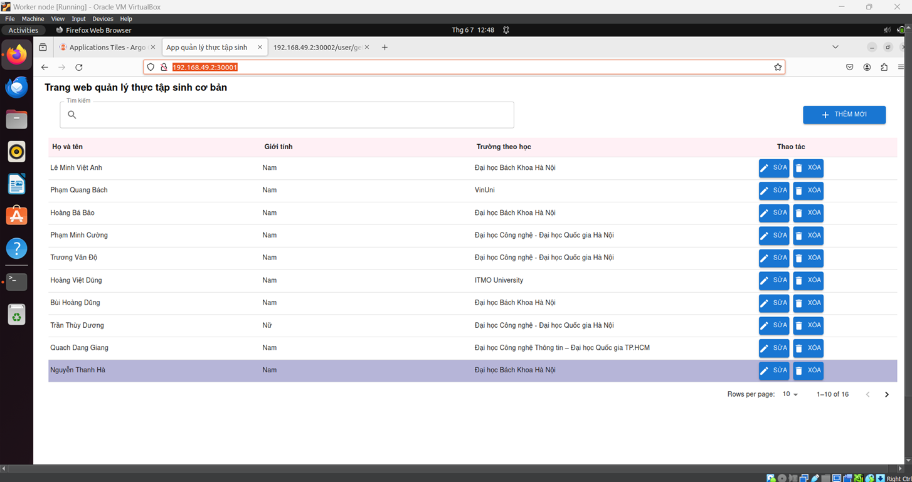
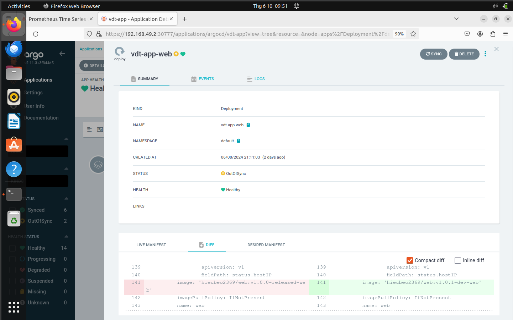

# Bài tập lớn cuối kỳ chương trình VDT 2024 lĩnh vực Cloud - Giai đoạn 1
Sinh viên: Nguyễn Trung Hiếu.
## I. Triển khai Kubernetes:

### 1. Đề bài:

Yêu cầu:

- Triển khai được Kubernetes thông qua công cụ minikube trên 1 node: 0.5 điểm

Hoặc:

- Triển khai được Kubernetes thông qua công cụ kubeadm hoặc kubespray lên 1 master node VM và 1 worker node VM: 1 điểm

Output: 

- Tài liệu cài đặt
- Log của các lệnh kiểm tra hệ thống như: kubectl get nodes - o wide

### 2. Kết quả:

Sử dụng tài liệu chính thức của kubernetes để cài đặt kubectl và minikube trên ubuntu desktop 22.04:

- Cài đặt kubectl: https://kubernetes.io/docs/tasks/tools/install-kubectl-linux/
- Cài đặt minikubes: https://kubernetes.io/vi/docs/tasks/tools/ install-minikube/

Cụ thể gồm các bước sau: 
1. Cập nhật apt package index và cài đặt các gói cần thiết để sử dụng k8s:

```
sudo apt-get update

sudo apt-get install -y apt-transport-https ca-certificates curl gnupg
```

2. Tải về khóa ký công khai cho các kho lưu trữ gói Kubernetes:
```
sudo mkdir -p -m 755 /etc/apt/keyrings

curl -fsSL https://pkgs.k8s.io/core:/stable:/v1.30/deb/Release.key | sudo gpg --dearmor -o /etc/apt/keyrings/kubernetes-apt-keyring.gpg

sudo chmod 644 /etc/apt/keyrings/kubernetes-apt-keyring.gpg

```

3. Thêm kho lưu trữ apt Kubernetes thích hợp cho phiên bản mới nhất (1.3.0) của k8s:
```
echo 'deb [signed-by=/etc/apt/keyrings/kubernetes-apt-keyring.gpg] https://pkgs.k8s.io/core:/stable:/v1.30/deb/ /' | sudo tee /etc/apt/sources.list.d/kubernetes.list

sudo chmod 644 /etc/apt/sources.list.d/kubernetes.list
```

4. Cập nhật apt package index lần nữa, sau đó cài đặt kubectl:
```
sudo apt-get update

sudo apt-get install -y kubectl
```

5. Cài đặt Minikube thông qua tải xuống trực tiếp 
```
curl -Lo minikube https://storage.googleapis.com/minikube/releases/latest/minikube-linux-amd64 \ && chmod +x minikube
```

6. Thêm Minikube vào biến môi trường path:
```
sudo mkdir -p /usr/local/bin/

sudo install minikube /usr/local/bin/
```

- Kết quả sau khi chạy lệnh minikube start và log của lệnh kiểm tra hệ thống:
 


## II. K8S Helm Chart:
### 1. Đề bài 1:
Yêu cầu 1:

-	Cài đặt ArgoCD lên Kubernetes Cluster, expose được ArgoCD qua NodePort
-	Trong trường hợp sử dụng cụm Lab trên Viettel Cloud, cài đặt Loadbalancer lên Bastion Node thông qua công cụ docker-compose, expose port ArgoCD ra môi trường public thông qua một trong số các port đã được cấp cho từng sinh viên

Output 1:
-	File manifests sử dụng để triển khai ArgoCD lên K8S  Cluster
-	File config, docker-compose.yaml sử dụng để triển khai loadbalancer của ArgoCD lên Bastion Node (trong trường hợp sử dụng cụm lab trên Viettel Cloud)
-	Ảnh chụp giao diện màn hình hệ thống ArgoCD khi truy cập qua trình duyệt trình duyệt

### 2. Kết quả 1:

- File manifest: sử dụng file manifest chính thức của agrocd ở trong đường dẫn: https://github.com/argoproj/argo-cd/blob/master/manifests/install.yaml

    - Sau đó, dùng các lệnh sau để lưu file manifest vào argocd-install.yaml và chạy AgroCD lên cổng 30777:
    ```
    curl -o argocd-install.yaml https://raw.githubusercontent.com/argoproj/argo-cd/stable/manifests/install.yaml

    kubeclt apply -f argo-services.yaml

    kubectl apply -f argocd-install.yaml
    ```
    - File argo-services.yaml để expose ArgoCD ra cổng 30777 sử dụng nodePort:
    ```
    apiVersion: v1
    kind: Service
    metadata:
    name: argocd-server
    namespace: argocd
    labels:
        app.kubernetes.io/name: argocd-server
    spec:
    type: NodePort
    ports:
        - port: 80
        targetPort: 8080
        nodePort: 30777
    selector:
        app.kubernetes.io/name: argocd-server
    ```


- Kết quả sau khi chạy file manifest trên cổng 30777:


### 3. Đề bài 2:
Yêu cầu 2: 
- Viết 2 Helm Chart cho web Deployment và api Deployment, để vào 1 folder riêng trong repo web và repo api
- Tạo 2 Repo Config cho web và api, trong các repo này chứa các file values.yaml với nội dung của cá file values.yaml là các config cần thiết để chạy web và api trên k8s bằng Helm Chart 
- Sử dụng tính năng multiple sources của ArgoCD để triển khai các service web và api service lên K8S Cluster  theo hướng dẫn của ArgoCD, expose các service này dưới dạng NodePort
- Trong trường hợp sử dụng cụm Lab trên Viettel Cloud, cài đặt Loadbalancer lên Bastion Node thông qua công cụ docker-compose, expose 2 port của Web ra môi trường public thông qua một trong số các port đã được cấp cho từng sinh viên

Output 2:
- Các Helm Chart sử dụng để triển khai web Deployment và api Deployment lên K8S Cluster 
- Các file values.yaml trong 2 config repo của  của web service và api service
Manifest của ArgoCD Application
- File config, docker-compose.yaml sử dụng để triển khai loadbalancer của ArgoCD lên Bastion Node (trong trường hợp sử dụng cụm lab trên Viettel Cloud)
- Ảnh chụp giao diện màn hình hệ thống ArgoCD trên trình duyệt
- Ảnh chụp giao diện màn hình trình duyệt khi truy cập vào Web URL, API URL

### 4. Kết quả 2:
- Helm chart:
  - Cho api Deployment: https://github.com/HieuNT-2306/cloud_final_helm_api/
  - Cho web Deployment: https://github.com/HieuNT-2306/cloud_final_helm_web/
- File values.yaml:
  - Cho web service: https://github.com/HieuNT-2306/cloud_final_helm_web/blob/master/web/values.yaml 
  - Cho api service: https://github.com/HieuNT-2306/cloud_final_helm_api/blob/master/api/values.yaml 
- Manifest của ArgoCD Application:
```                                                      
apiVersion: argoproj.io/v1alpha1
kind: Application
metadata:
  name: vdt-app
  namespace: argocd
spec:
  project: default
  sources:
    - repoURL: 'https://github.com/HieuNT-2306/cloud_final_helm_api'
      path: api
      targetRevision: HEAD
      helm:
        valueFiles:
          - values.yaml
    - repoURL: 'https://github.com/HieuNT-2306/cloud_final_helm_web'
      path: web
      targetRevision: HEAD
      helm:
        valueFiles:
          - values.yaml
  destination:
    server: 'https://kubernetes.default.svc'
    namespace: default
  syncPolicy:
    automated:
      prune: true
      selfHeal: true
    syncOptions:
      - CreateNamespace=true
```

- Ảnh chụp giao diện màn hình AgroCD trên trình duyệt: 


- Ảnh chụp giao diện màn hình trình duyệt khi truy cập vào Web URL, API URL:
  - Web url được expose qua cổng 30001:
   
  - Api url được expose qua cổng 30002:
  

## III. Continuous delivery: 

### 1. Đề bài:
Yêu cầu:
- Viết 2 luồng CD cho 2 repo web và api, khi có 1 tag mới được tạo ra trên trên 1 trong 2 repo này thì luồng deploy tương ứng của repo đó thực hiện các công việc sau:
  - Build docker image với image tag là tag name đã được tạo ra trên gitlab
  - Push docker image sau khi build xong lên Docker Hub
  -  Sửa giá trị Image version trong file values.yaml  trong config repo và push thay đổi lên config repo. Tham khảo: https://stackoverflow.com/a/72696837
- Cấu hình ArgoCD tự động triển khai lại web Deployment và api Deployment khi có sự thay đổi trên config repo.
                           
Output:
- Các file setup công cụ của 2 luồng CD
- Output log của 2 luồng CD khi tạo tag mới trên repo web và repo api
- Hình ảnh history của ArgoCD khi có sự thay đổi trên web config repo và api config repo

### 2. Kết quả:

- Sử dụng công cụ github actions để triển khai luồng CD: 

- File github/workflows của api: https://github.com/HieuNT-2306/cloud_midterm_api/blob/main/.github/workflows/main.yml
  - Thêm các actions sau vào trong file main.yaml:

```
    ....
    #Build docker image với tag mới và đẩy lên trên docker hub
    - name: Build and push
      uses: docker/build-push-action@v2
      with:
        context: .
        push: true
        tags: hieubeo2369/api:${{ github.ref_name }}


    #Đi đến repo chứa helm chart của api
    - name: Checkout helm config repo
      uses: actions/checkout@v2
      with:
        repository: HieuNT-2306/cloud_final_helm_api
        token: ${{ secrets.PERSONAL_ACCESS_TOKEN }}
        path: cloud_final_helm_api

    # Sửa tag của file helm-chart
    - name: Update values.yaml
      run: |
        sed -i 's/tag: .*/tag: ${{ github.ref_name }}/' cloud_final_helm_api/api/values.yaml
 
    # Đẩy thay đổi lên trên repo helm chart
    - name: Commit and push changes
      env:
        GITHUB_TOKEN: ${{ secrets.PERSONAL_ACCESS_TOKEN }}
      run: |
        cd cloud_final_helm_api
        git config --global user.name '${{ secrets.USER_NAME }}'
        git config --global user.email '${{ secrets.USER_EMAIL }}'
        git add -A
        git commit -m "Update image tag to ${{ github.ref_name }}"
        git push origin master
``` 


- Tương tự, file github/workflows của web: https://github.com/HieuNT-2306/cloud_midterm_web/blob/main/.github/workflows/main.yml
- Thêm các actions sau vào trong file main.yaml:

```
    ....
    #Build docker image với tag mới và đẩy lên trên docker hub
    - name: Build and push
      uses: docker/build-push-action@v2
      with:
        context: .
        push: true
        tags: hieubeo2369/web:${{ github.ref_name }}


    #Đi đến repo chứa helm chart của web
    - name: Checkout helm config repo
      uses: actions/checkout@v2
      with:
        repository: HieuNT-2306/cloud_final_helm_web
        token: ${{ secrets.PERSONAL_ACCESS_TOKEN }}
        path: cloud_final_helm_api

    # Sửa tag của file helm-chart
    - name: Update values.yaml
      run: |
        sed -i 's/tag: .*/tag: ${{ github.ref_name }}/' cloud_final_helm_web/web/values.yaml 
 
    # Đẩy thay đổi lên trên repo helm chart
    - name: Commit and push changes
      env:
        GITHUB_TOKEN: ${{ secrets.PERSONAL_ACCESS_TOKEN }}
      run: |
        cd cloud_final_helm_api
        git config --global user.name '${{ secrets.USER_NAME }}'
        git config --global user.email '${{ secrets.USER_EMAIL }}'
        git add -A
        git commit -m "Update image tag to ${{ github.ref_name }}"
        git push origin master
``` 
- Output của 2 luồng CD mới:
  - api services: 
   
  - web services:
  

- Hình ảnh diff ở trong ArgoCD: 
  - api services:    

  - web services:



## IV. Monitoring:

### 1. Đề bài: 
Yêu cầu:
- Expose metric của web service và api service ra 1 http path. Tham khảo:
https://github.com/korfuri/django-prometheus
- Triển khai Prometheus lên Kubernetes Cluster thông qua Prometheus Operator, phơi ra ngoài dưới dạng NodePort: 
- Expose Prometheus dưới dạng Nodeport
- Trong trường hợp sử dụng cụm lab của Viettel Cloud, tạo 1 load balancer với backend là NodePort Service của Prometheus, để expose Prometheus UI ra Public Internet 
- Sử dụng Service Monitor của Prometheus Operator để giám sát Web Deployment và API Deployment

Output:
- Các file setup để triển khai Prometheus lên Kubernetes Cluster
- Hình ảnh khi truy cập vào Prometheus UI thông qua trình duyệt
- Hình ảnh danh sách target của Web Deployment và API Deployment được giám sát bởi Prometheus, ví dụ:

### 2. Kết quả:

Triển khai prometheus lên trên cổng 30090 thông qua nodePort:
- File prometheus-config.yaml để áp dụng cấu hình prometheus:
```                                                         
apiVersion: v1
kind: ConfigMap
metadata:
  name: prometheus-server-conf
  namespace: prometheus
data:
  prometheus.yml: |
    global:
      scrape_interval: 15s
      evaluation_interval: 15s
    scrape_configs:
      - job_name: 'prometheus'
        static_configs:
          - targets: ['localhost:9090']
        # Export riêng metric của api:
      - job_name: 'api'
        kubernetes_sd_configs:
          - role: endpoints
        relabel_configs:
          - source_labels: [__meta_kubernetes_service_name, __meta_kubernetes_namespace]
            action: keep
            regex: vdt-app-api;default
        # Sử dụng cAdvisor để lấy metrics từ các containers chứa web và api.
      - job_name: 'container-vdt-app'
        kubernetes_sd_configs:
          - role: endpoints
        relabel_configs:
          - source_labels: [__meta_kubernetes_service_name, __meta_kubernetes_namespace]
            action: keep
            regex: cadvisor;prometheus
```
- Áp dụng các role sau để prometheus có thể lấy metrics tại các endpoints của cAdvisor và api:
    - prometheus-clusterrole.yaml:
    ```
    apiVersion: rbac.authorization.k8s.io/v1
    kind: ClusterRole
    metadata:
    name: prometheus-clusterrole
    rules:
    - apiGroups: [""]
    resources:
    - pods
    - endpoints
    - services
    verbs:
    - get
    - list
    - watch
    ```
    - prometheus-clusterrole-binding.yaml
    ```
    apiVersion: rbac.authorization.k8s.io/v1
    kind: ClusterRoleBinding
    metadata:
    name: prometheus-clusterrolebinding
    roleRef:
    apiGroup: rbac.authorization.k8s.io
    kind: ClusterRole
    name: prometheus-clusterrole
    subjects:
    - kind: ServiceAccount
    name: default
    namespace: prometheus
    ```
- File prometheus-services.yaml để chạy prometheus lên cổng 30090:
```
apiVersion: v1
kind: Service
metadata:
  name: prometheus-service
  namespace: prometheus
spec:
  selector:
    app: prometheus-server
  ports:
    - protocol: TCP
      port: 80
      targetPort: 9090
      nodePort: 30090
  type: LoadBalancer
```

- File prometheus-deployment.yaml để deploy prometheus:
```
apiVersion: apps/v1
kind: Deployment
metadata:
  name: prometheus-server
  namespace: prometheus
spec:
  replicas: 1
  selector:
    matchLabels:
      app: prometheus-server
  template:
    metadata:
      labels:
        app: prometheus-server
    spec:
      containers:
        - name: prometheus
          image: prom/prometheus
          ports:
            - containerPort: 9090
          volumeMounts:
            - name: config-volume
              mountPath: /etc/prometheus
      volumes:
        - name: config-volume
          configMap:
            name: prometheus-server-conf
            defaultMode: 420
```

- Áp dụng lần lượt các cấu hình để deploy thành công prometheus:
```
kubectl apply -f prometheus-config.yaml -f prometheus-clusterrole.yaml
-f prometheus-clusterrole-binding.yaml -f prometheus-services.yaml
-f prometheus-deployment.yaml
```

- Hình ảnh truy cập vào prometheus qua trình duyệt:


- Hình ảnh danh sách target của Web Deployment và API Deployment được giám sát bởi Prometheus


- Ảnh một vài metric của web:


- Ảnh một vài metric của api:


 
## V. Logging:

### 1. Đề bài:

Yêu cầu:
-	Sử dụng Kubernetes DaemonSet triển khai fluentd hoặc fluentbit lên kubernetes đẩy log của các Deployment Web Deployment và API Deployment lên cụm ElasticSearch tập trung với prefix index dưới dạng tên_sinh_viên_viết_tắt_sdt: Ví dụ: conghm_012345678
- Thông tin cụm ES tập trung:
  -	Username: elastic
  -	Password: iRsUoyhqW-CyyGdwk6V_
  -	Elastic Search URL: https://116.103.226.146:9200
  -	Kibana URL: http://116.103.226.146:5601/login?next=%2Fapp%2Fdiscover#/
-	Cấu hình logging cho web service và api service, đảm bảo khi có http request gửi vào web service hoặc api service thì trong các log mà các service này sinh ra, có ít nhất 1 log có các thông tin:
  -	Request Path(VD: /api1/1, /api2/3 ..)
  -	HTTP Method VD: (GET PUT POST…)
  -	Response Code: 302, 200, 202, 201…

Output:
-	Hình ảnh chụp màn hình Kibana kết quả tìm kiếm log của các Service Web và Service API theo url path

2. Kết quả:

Các file setup fluentbit lên trên cụm k8s:

- File cấu hình configmap:
```
apiVersion: v1
kind: ConfigMap
metadata:
  name: fluent-bit-config
  namespace: logging
data:
  fluent-bit.conf: |

    [SERVICE]
        Flush        1
        Log_Level    info
        Parsers_File parsers.conf


    [INPUT]
        Name          tail
        Path          /var/log/containers/*.log
        Parser        docker
        Tag           kube.*
        Refresh_Interval 5


    [FILTER]
        Name kubernetes
        Match kube.*
        Kube_URL https://kubernetes.default.svc:443
        Merge_Log On
        K8S-Logging.Parser On
        K8S-Logging.Exclude Off

    [OUTPUT]
        Name  es
        Match *
        Host  116.103.226.146
        Port  9200
        HTTP_User elastic
        HTTP_Passwd iRsUoyhqW-CyyGdwk6V_
        Index hieunt_0869347311
        Time_Key @timestamp
        Logstash_Prefix vdt-logs
        Logstash_DateFormat %d.%m.%Y
        Suppress_Type_Name On
        Replace_Dots On
        tls  On
  parsers.conf: |
    [PARSER]
        Name        docker
        Format      json
        Time_Key    time
        Time_Format %Y-%m-%dT%H:%M:%S.%L
```
- File cấu hình daemonset để chạy pod lên trên các cluster nodes phù hợp:
```                                                         
apiVersion: apps/v1
kind: DaemonSet
metadata:
  name: fluent-bit
  namespace: logging
spec:
  selector:
    matchLabels:
      k8s-app: fluent-bit
  template:
    metadata:
      labels:
        k8s-app: fluent-bit
    spec:
      serviceAccountName: fluent-bit
      containers:
      - name: fluent-bit
        image: fluent/fluent-bit:latest
        ports:
          - containerPort: 2020
            name: monitor
        volumeMounts:
          - name: config
            mountPath: /fluent-bit/etc
          - name: varlog
            mountPath: /var/log
          - name: varlibdockercontainers
            mountPath: /var/lib/docker/containers
            readOnly: true
      volumes:
        - name: config
          configMap:
            name: fluent-bit-config
        - name: varlog
          hostPath:
            path: /var/log
        - name: varlibdockercontainers
          hostPath:
            path: /var/lib/docker/containers
```
- File services của fluentbit:
```
apiVersion: v1
kind: ServiceAccount
metadata:
  name: fluent-bit
  namespace: logging
---
apiVersion: rbac.authorization.k8s.io/v1
kind: ClusterRole
metadata:
  name: fluent-bit-role
rules:
- apiGroups: [""]
  resources: ["pods", "namespaces"]
  verbs: ["get", "list", "watch"]
---
apiVersion: rbac.authorization.k8s.io/v1
kind: ClusterRoleBinding
metadata:
  name: fluent-bit-role-binding
roleRef:
  apiGroup: rbac.authorization.k8s.io
  kind: ClusterRole
  name: fluent-bit-role
subjects:
- kind: ServiceAccount
  name: fluent-bit
  namespace: logging
```

Chạy 3 file sau để thiết lập fluentbit lên k8s cluster bằng lệnh:
```
kubectl apply -f fluentbit-configmap.yaml -f fluentbit-daemonset.yaml -f fluentbit-service.yaml
```

Kết quả sau khi lấy log ở trên Kibana:
- Log api:

- Log web:


## VI. Security:

### 1. HAProxy:

### 2. Authen/Authorization:
Ứng dụng này sử dụng JWT (Json Web Token) để thiết lập token cho việc xác thực và phân quyền.

JWT là một tiêu chuẩn mã nguồn mở (RFC 7519) dùng để truyền tải thông giữa các bên tham gia dưới format JSON, được sử dụng rộng rãi trong các ứng dụng ngày nay.

JWT gồm 3 phần chính, và phần tách nhau bằng một dấu chấm (.):
- Header: chứa kiểu dữ liệu, thuật toán sử dụng để mã hóa ra chuỗi JWT
- Payload: chứa các thông tin chính của token.
- Signature: tạo ra bằng cách mã hóa phần header, payload kèm theo một chuỗi khóa bí mật do người quản trị đặt nhằm xác thực danh tính của người gửi.

VD về 1 jwt token:


Lý do sử dụng JWT trong bài tập này là do khả năng dễ dàng triển khai, tính gọn nhẹ và phổ thông của JWT do được sử dụng dựa trên JSON, 1 dạng dữ liệu phổ biến.

#### Các bước triển khai:

1. Sử dụng npm để cài đặt các gói tin cần thiết:
```
npm install jsonwebtoken bcrypt express cookie-parser
```
2. Tạo middleware để xác thực và phân quyền: 

```
import jwt from 'jsonwebtoken';
import dotenv from 'dotenv';
import User from '../models/user.js';

dotenv.config();

const { JWT_SECRET } = process.env;

export const generateToken = (user) => {
    return jwt.sign({ id: user._id, role: user.role }, JWT_SECRET, { expiresIn: '1h' });
};

export const authenticateToken = (req, res, next) => {
    const token = req.cookies.token;
    if (!token) {
        return res.status(403).json({ message: 'No token provided' });
    }

    jwt.verify(token, JWT_SECRET, (err, user) => {
        if (err) {
            return res.status(403).json({ message: 'Failed to authenticate token' });
        }
        req.user = user;
        next();
    });
};

export const authorizeRoles = (...roles) => {
    return (req, res, next) => {
        if (!roles.includes(req.user.role)) {
            return res.status(403).json({ message: 'Access denied' });
        }
        next();
    };
};
------------------------------------------------------------------------
// Tạo user token mỗi khi login bằng cách thêm lệnh sau và auth.controller:

const user = await User.findOne({ username });
const token = generateToken(user);
res.cookie('token', token, { httpOnly: true });

```
3. Cập nhật lại route, áp dụng các middleware:
```
router.get("/get",authenticateToken, authorizeRoles('admin', 'user'), getUsers);
router.get("/get/:id", authenticateToken, authorizeRoles('admin', 'user'),  getUserById);
router.post("/post/", authenticateToken, authorizeRoles('admin'), postUser);
router.delete("/:id", authenticateToken, authorizeRoles('admin'), deleteUser);
```

#### Kết quả chạy:
- Với role user:
  - Khi đăng nhập:
   
  - Khi truy cập vào GET request:
  
  - Khi truy cập vào POST request:
  
  - Khi truy cập vào DELETE request:
  

- Với role admin
  - Khi đăng nhập: 
  
  - Khi truy cập vào GET request:
  
  - Khi truy cập vào POST request:
  
  - Khi truy cập vào DELETE request:
  

File Postman collection để kiểm tra các api: [Cloud-VDT2024.postman_collection.json](/files/Cloud-VDT2024.postman_collection.json)

### 3. Ratelimit:

Ứng dụng này sử dụng express-rate-limit để giới hạn truy cập đến Endpoint của từng máy tính.

Express-rate-limit là một middleware cho Express giúp bạn giới hạn số lượng yêu cầu mà API của bạn có thể nhận được trong một khoảng thời gian nhất định. Nó là một công cụ hữu ích để bảo vệ API của bạn khỏi các cuộc tấn công DDoS và đảm bảo hiệu suất cho tất cả người dùng.

- Link của express-rate-limit trên npmjs: https://www.npmjs.com/package/express-rate-limit

Cách triển khai giải pháp:

1. Cài đặt express-rate-limit với npm:
```
npm i express-rate-limit
```

2. Cấu hình cho rate-limiting-middleware: 
```
import rateLimit from 'express-rate-limit';
import logger from './logger.js';
//Lấy địa chỉ IP của client.
const getClientIp = (req) => {
    const ip = req.headers['x-forwarded-for'] || req.connection.remoteAddress;
    return ip;
};

const limiter = rateLimit({
    windows: 1 * 60 * 1000, //Tính theo ms
    max: 10, 
    handler: (req, res) => {
        const clientIpv6 = getClientIp(req);
        //Tạo log khi có sự kiện sảy ra.
        logger.error({
            message: 'Rate limit exceeded for user with IP: ' + clientIpv6,
            path: req.originalUrl,
            method: req.method,
            responseCode: 409
        });
        res.status(409).json({
            message: 'You have reached your limit of 10 request/minute, please try again later.' ,
            requestCount: req.rateLimit.current,
            clientIp: clientIpv6
        });
    }
});

export default limiter;
```
3. Đặt middleware vào trong app express:

```
import limiter from './helper/rateLimit.js';
...
app.use(limiter);
...
```

- Kết quả sau khi cấu hình thành công express-rate-limit:

  - Kiểm tra trên postman:
  
  - Kiểm tra ở trong log của api:
  
  - Kiểm tra ở trên browser:
  
  - Kiểm tra log ở trên kibana: 
  
