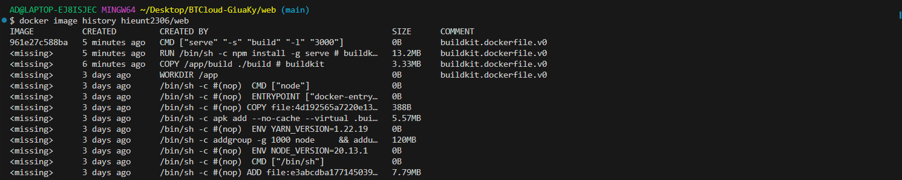

# Báo cáo bài tập lớn giữa kì chương trình Viettel Digital Talent 2024, Lĩnh vực Cloud.


## I. Phát triển một 3-tier web application đơn giản:

### 1. Yêu cầu đề bài:

* Phát triển web application có các chức năng sau (0.5đ):
    - Hiển thị danh sách sinh viên tham gia chương trình VDT2024 dưới dạng bảng với các thông tin sau: Họ và tên, Giới tính, trường đang theo học.
    - Cho phép xem chi tiết/thêm/xóa/cập nhật thông tin sinh viên.
* Thiết kế hệ thống với ba dịch vụ (1đ):
    - web: Giao diện web, tuỳ chọn ngôn ngữ, framework.
    - api: RESTful API viết bằng ngôn ngữ lập trình tùy chọn, có đầy đủ các chức năng: list, get, create, update, delete.
    - db: Database SQL hoặc NoSQL lưu trữ thông tin sinh viên.
* Viết unit tests cho các chức năng APIs, mỗi API tối thiếu 1 testcase (0.5đ).
* Maintain source code của api và web ở 2 repo khác nhau, mỗi feature là 1 Pull Request (1đ).

### 2. Kết quả chương trình:

Web application trong bài báo cáo này được xây dựng sử dụng MERN Stack - một tập hợp các công nghệ JavaScript phổ biến được sử dụng để phát triển các ứng dụng web toàn ngăn xếp. Tên "MERN" là viết tắt của:

* MongoDB: Cơ sở dữ liệu NoSQL linh hoạt và dễ mở rộng.
* Express.js: Framework JavaScript nhẹ cho phép xây dựng API RESTful.
* React.js: Thư viện JavaScript để tạo giao diện người dùng (UI) động và hiệu quả.
* Node.js: Môi trường runtime JavaScript cho phép thực thi JavaScript bên ngoài trình duyệt web.
 
#### WEB: 

* Sử dụng react.js để viết giao diện nguời dùng: 
* [Link Github chứa mã nguồn](https://github.com/HieuNT-2306/cloud_midterm_web)
* Các hình ảnh của giao diện:

<div style="text-align: center;">
    
    <p>Hình ảnh giao diện web</p>
    
    <p>Form để thêm thực tập sinh, sau khi ấn vào thêm mới</p>
    
    <p>Validate cơ bản cho form</p>
    
    <p>Thông báo khi thêm bản ghi mới thành công</p>
    
    <p>Ấn vào sửa để xem thông tin và sửa thông tin thực tập sinh</p>
    
    <p>Thông báo khi sửa thông tin thực tập sinh</p>
    
    <p>Popup để xác nhận khi ấn vào nút xóa sinh viên</p>
    
    <p>Thông báo khi xóa sinh viên mới thành công</p>
    
    <p>Tìm kiếm theo tên cơ bản</p>
</div>

#### API: 

* Sử dụng Express.js, thông qua môi trường Node.js để xây dựng các api, và sử dụng framework jest cùng với thư viện supertest để viết unit tests và kiểm thử cho từng Api:
* [Link Github chứa mã nguồn](https://github.com/HieuNT-2306/cloud_midterm_api)
* Các hình ảnh demo API và chạy unit test:   
<div style="text-align: center;">
    
    <p>Demo api lấy tất cả thực tập sinh</p>
    
    <p>Demo api lấy 1 thực tập sinh theo id</p>
    
    <p>Demo api thêm 1 thực tập sinh (nếu không có trường _id trong request body) </p>
    
    <p>Demo api sửa 1 thực tập sinh (nếu có trường _id trong request body) </p>
    
    <p>Demo api xóa 1 thực tập sinh theo id </p>
    
    <p>Kết quả sau khi chạy unit tests bằng jesst và supertest</p>
</div>

* [Files postman collections cho việc chạy thử api lên postman](/NguyenTrungHieu/files/Cloud-GiuaKy.postman_collection.json)


#### Database:

* Sử dụng một hệ cơ sở dữ liệu NoSQL là mongodb, được thiết lập bằng cách tạo một docker container thông qua docker image của [Mongo](https://hub.docker.com/_/mongo)

## II. Triển khai web application sử dụng các DevOps tools & practices:

### 1. Containerization (2đ):

#### 1.1 Yêu cầu đề bài:

* Yêu cầu:
  - Viết Dockerfile để ở từng repo để đóng gói các dịch vụ trên thành các container image (1đ)
  - Yêu cầu image đảm bảo tối ưu thời gian build và kích thước chiếm dụng, khuyến khích sử dụng các thủ thuật build image đã được giới thiệu (layer-caching, optimized RUN instructions, multi-stage build, etc.) (1đ)
* Output:
  - File Dockerfile cho từng dịch vụ
  - Output câu lệnh build và thông tin docker history của từng image


#### 1.2 Kết quả:

#### WEB: 

* File Dockerfile của dịch vụ web:

```
#Sử dụng multi-stage build:
#Giai đoạn 1: Build ứng dụng React

#Sử dụng image node:20-alpine, chứa sẵn Node.js version 20
FROM node:20-alpine as build

WORKDIR /app

COPY package*.json ./

# Cài đặt các dependencies và loại bỏ các file không cần thiết
RUN npm install 

COPY . .

RUN npm run build

# Giai đoạn 2: Chạy ứng dụng React
FROM node:20-alpine

WORKDIR /app

COPY --from=build /app/build ./build

#Cài đặt gói serve để khởi động và quản lý web server
RUN npm install -g serve

#Khởi động web server serve
CMD ["serve", "-s", "build", "-l", "3000"] 
```

* Các hình ảnh build và history

<div style="text-align: center;">
    
    <p>Kết quả sau khi chạy lệnh build</p>
    
    <p>Docker history của image</p>
</div>
 
#### API:

* File Dockerfile của dịch vụ api:

```
# Sử dụng image node:20-alpine làm base
FROM node:20-alpine

WORKDIR /app

COPY package*.json ./

# Cài đặt các dependencies 
RUN npm install

COPY . .

CMD ["npm", "run", "start"]
```
* Các hình ảnh build và history:

<div style="text-align: center;">
    
    <p>Kết quả sau khi chạy lệnh build</p>
    
    <p>Docker history của image</p>
</div>

#### Database

* Giải thích:
  - Database của ứng dụng web này sử dụng mongodb, bằng cách kéo docker image của mongodb về để tạo một database riêng lên cổng 27017.

* File Dockerfile của dịch vụ database:

```
# Sử dụng image mongo từ Docker Hub
FROM mongo:latest

# Thiết lập biến môi trường cho MongoDB
ENV MONGO_INITDB_ROOT_USERNAME=admin
ENV MONGO_INITDB_ROOT_PASSWORD=password

# Tạo thư mục để chứa script khởi tạo
WORKDIR /docker-entrypoint-initdb.d

# Copy script khởi tạo vào thư mục
COPY ./init-mongo.js .

# Chạy MongoDB khi container được khởi động
CMD ["mongod"]
```
* File init-mongo.js: 
``` 
db = db.getSiblingDB(<Tên database>);
db.createUser(
  {
    user: <Tên user>,
    pwd: <Mật khẩu>,
    roles: [ { role: "readWrite", db: <Tên database> } ]
  }
);
```
* Các hình ảnh build và history:

<div style="text-align: center;">
    
    <p>Kết quả sau khi chạy lệnh build</p>
    
    <p>Docker history của image</p>
</div>

#### Docker-compose:

Thay vì phải chạy từng Dockerfile một, ta có thể sử dụng file [docker-compose.yml](/NguyenTrungHieu/files/docker-compose.yml) thông qua các bước cài đặt sau:

* Tải file [docker-compose.yml](/NguyenTrungHieu/files/docker-compose.yml) và file [init-mongo.js](/NguyenTrungHieu/files/init-mongo.js) về, cho vào cùng 1 thư mục:
* Cấu hình như sau:
    - Trong init-mongo.yml:
        ```
        db = db.getSiblingDB(<Tên database>);
        db.createUser(
        {
            user: <Tên user>,
            pwd: <Mật khẩu>,
            roles: [ { role: "readWrite", db: <Tên database> } ]
        }
        );
        ```
    - Trong docker-compose.yml:
        ```
        version: '3.8'
            services:
            web:
                image: hieubeo2369/web:latest
                ports:
                - 3000:3000
                depends_on:
                - api
            api:
                image: hieubeo2369/api:latest
                ports:
                - 5003:5003
                depends_on:
                - db
                environment:
                MONGO_URL: mongodb://<Tên user>:<Mật khẩu>@db:27017/<Tên database>
            db:
                image: mongo:latest
                ports:
                - 27017:27017
                environment:
                MONGO_INITDB_ROOT_USERNAME: <Tên user>
                MONGO_INITDB_ROOT_PASSWORD: <Mật khẩu>
                volumes:
                - ./init-mongo.js:/docker-entrypoint-initdb.d/init-mongo.js
        ```


* Chạy lệnh docker-compose up:

    <div style="text-align: center;">
        
        <p>Kết quả sau khi chạy lệnh docker compose</p>
    </div> 

* Sau đó, truy cập vào localhost:3000, ta sẽ thấy được ứng dụng đã được khởi tạo đầy đủ:

    <div style="text-align: center;">
        
        <p>Hình ảnh khi truy cập vào localhost:3000</p>
    </div> 


### 2. Continuous Integration (1.5đ)
#### 2.1 Yêu cầu đề bài:
* Yêu cầu
  - Tự động chạy unit test khi tạo PR vào branch main (0.5đ)
  - Tự động chạy unit test khi push commit lên một branch (1đ)
* Output:
  - File setup công cụ CI
  - Output log của luồng CI
  - Các hình ảnh demo khác

#### 2.2 Kết quả

* Công cụ sử dụng cho CI: [Github Actions](https://docs.github.com/en/actions)
* File setup các công cụ CI:

#### WEB: [Link file workflows](https://github.com/HieuNT-2306/cloud_midterm_web/blob/main/.github/workflows/main.yml) 

```
name: Build and Deploy

on:
  push:
    branches: [ '*' ]
  pull_request:
    branches: [ main ]

jobs:
  build:
    runs-on: ubuntu-latest

    steps:
    - uses: actions/checkout@v2

    - name: Use Node.js
      uses: actions/setup-node@v2
      with:
        node-version: '20'

    - name: Install Dependencies
      run: npm ci

  deploy:
    needs: build
    runs-on: ubuntu-latest

    steps:
    - uses: actions/checkout@v2

    - name: Set up Docker Buildx
      uses: docker/setup-buildx-action@v1

    - name: Login to DockerHub
      uses: docker/login-action@v1 
      with:
        username: ${{ secrets.DOCKERHUB_USERNAME }}
        password: ${{ secrets.DOCKERHUB_TOKEN }}

    - name: Build and push
      uses: docker/build-push-action@v2
      with:
        context: .
        push: true
        tags: hieubeo2369/web:latest

    - name: Run Docker container on port 3000 on local
      run: |
        docker run -d -p 3000:3000 hieubeo2369/web:latest
```

* Kết quả sau khi chạy file CI web: 
<div style="text-align: center;">
    
    
    
    <p>Trên github actions</p>
    
    <p>Gửi notification email cho người dùng</p>
</div> 

#### API: [Link file workflows](https://github.com/HieuNT-2306/cloud_midterm_api/blob/main/.github/workflows/main.yml) 
```
    name: API CI

    on:
    push:
        branches: [ '*' ]
    pull_request:
        branches: [ main ]

    jobs:
    build-and-test:
        runs-on: ubuntu-latest

        steps:
        - uses: actions/checkout@v2

        - name: Use Node.js
        uses: actions/setup-node@v2
        with:
            node-version: '20'

        - name: Install Dependencies
        run: npm ci

        - name: Run Tests
        run: npm test


    deploy-local:
        needs: build-and-test
        runs-on: ubuntu-latest

        steps:
        - uses: actions/checkout@v2

        - name: Set up Docker Buildx
        uses: docker/setup-buildx-action@v1

        - name: Login to DockerHub
        uses: docker/login-action@v1 
        with:
            username: ${{ secrets.DOCKERHUB_USERNAME }}
            password: ${{ secrets.DOCKERHUB_TOKEN }}

        - name: Build and push
        uses: docker/build-push-action@v2
        with:
            context: .
            push: true
            tags: hieubeo2369/api:latest

        - name: Run Docker container on port 5003 on local
        run: |
            docker run -d -p 5003:5003 hieubeo2369/api:latest
```
* Kết quả sau khi chạy file CI api: 
<div style="text-align: center;">
    
    
    
    <p>Trên github actions</p>
    
    <p>Gửi notification email cho người dùng</p>
</div> 

### 3. Automation (1.5đ)

#### 3.1 Yêu cầu đề bài:
* Yêu cầu:
  - Viết ansible playbooks để triển khai các image docker của các dịch vụ web, api, db, mỗi dịch vụ 1 role (0.5đ).
  - Trong từng role cho phép tuỳ biến cấu hình của các dịch vụ thông qua các variables (0.5đ).
  - Cho phép triển khai các dịch vụ trên các host khác nhau thông qua file inventory (0.5đ).

* Output:
  - Link github source code của ansible playbooks

#### 3.2 Kết quả:

* Trong ansible playbook này sẽ có 4 role:
   -  setup: Để cài đặt các module cần thiết để triển khai lên server
   -  web: Triển khai dịch vụ web
   -  api: Triển khai dịch vụ api
   -  db: Triển khai dịch vụ db thông qua docker image mongo


<div style="text-align: center;">
    
    <p>Cấu trúc của file ansible</p>
</div> 

* [Link github của ansible playbooks](https://github.com/HieuNT-2306/cloud_midterm_ansible)

* Trong bài tập này, dịch vụ sẽ được triển khai lên 2 virtual machine ảo được tạo bởi [Oracle VM VirtualBox](https://www.virtualbox.org/), được cấu hình như sau: 
  -  OS: Ubuntu-server 22.04
  -  Processors: 1 CPU
  -  Ram: 2048 MB
  -  Storage: 15 GB 
  -  Network adapter:
     - Adapter 1: Host only Adapter
     - Adapter 2: NAT

<div display="flex" style="text-align: center;"> 
  
  
  <p>Cấu hình cụ thể của 2 máy<p>
</div>

* Chạy lệnh ansible-playbook -i inventory.ini playbook.yml để triển khai các image docker lên các server trong inventory.ini:

<div style="text-align: center;">
    
    
    <p>Kết quả sau khi chạy lệnh.</p>
    
    <p>Kiểm tra container trên các máy ảo.</p>
</div> 
