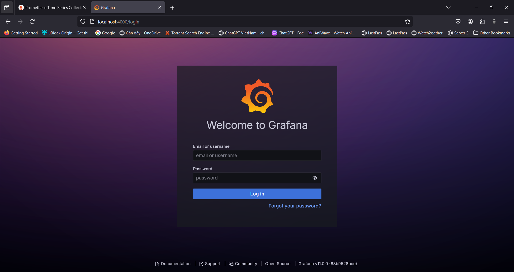
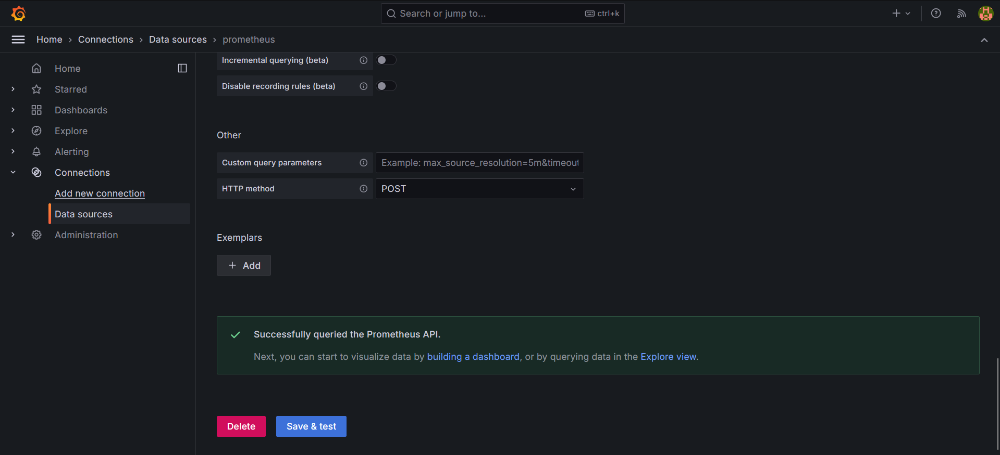

# Nghiên cứu giữa kì: Monitoring, Logging và tầm quan trọng của nó trong quá trình CI/CD

## I. Giới thiệu:

### 1. Khái niệm CI/CD:

CI/CD là cụm từ viết tắt của Continuous Integration (Tích hợp liên tục) và Continuous Delivery/Continuous Deployment (Giao hàng liên tục/Triển khai liên tục). Đây là những phương pháp phát triển phần mềm hiện đại giúp tự động hóa các quy trình xây dựng, kiểm tra và triển khai phần mềm.

CI đề cập đến việc tích hợp thường xuyên các thay đổi mã từ nhiều nhà phát triển vào một kho lưu trữ trung tâm. Sau mỗi lần tích hợp, mã sẽ được tự động xây dựng và kiểm tra để đảm bảo chất lượng.

CD mở rộng CI bằng cách tự động hóa việc triển khai mã đã được kiểm tra sang môi trường sản xuất hoặc thử nghiệm. Điều này cho phép các nhà phát triển phát hành phần mềm mới một cách nhanh chóng và đáng tin cậy hơn.
<div style="text-align: center;">
    
</div>

### 2. CI/CD Pipline:

[Theo IBM](https://www.ibm.com/think/topics/ci-cd-pipeline), 
CI/CD Pipline (tích hợp/phân phối liên tục) là một quy trình làm việc DevOps nhanh nhẹn tập trung vào việc cung cấp phần mềm thường xuyên và đáng tin cậy. Phương pháp này theo dạng lặp lại thay vì tuyến tính, cho phép các nhóm DevOps viết mã, tích hợp mã, chạy thử nghiệm, phân phối các bản phát hành và triển khai các thay đổi cho phần mềm một cách cộng tác và theo thời gian thực.

Một đặc điểm chính của CI/CD pipeline là việc sử dụng tự động hóa để đảm bảo chất lượng mã. Khi các thay đổi của phần mềm tiến qua pipeline, tự động hóa kiểm thử được sử dụng để xác định các phụ thuộc và các vấn đề khác sớm hơn, đẩy các thay đổi mã lên các môi trường khác nhau và phân phối ứng dụng đến môi trường sản xuất. Ở đây, nhiệm vụ của tự động hóa là thực hiện kiểm soát chất lượng, đánh giá mọi thứ từ hiệu suất đến sử dụng API và bảo mật. Điều này đảm bảo các thay đổi được thực hiện bởi tất cả các thành viên nhóm được tích hợp toàn diện và hoạt động như mong đợi.

Khả năng tự động hóa các giai đoạn khác nhau của CI/CD pipeline giúp các nhóm phát triển cải thiện chất lượng, làm việc nhanh hơn và cải thiện các số liệu DevOps khác.

Cấu trúc cơ bản của một luồng CI/ CD thường sẽ có 4 pha sau:

* Build (Xây dựng): Giai đoạn này là một phần của quá trình tích hợp liên tục, bao gồm việc tạo và biên dịch mã nguồn. Các nhóm cộng tác xây dựng dựa trên mã nguồn và tích hợp mã mới, đồng thời nhanh chóng xác định bất kỳ vấn đề hoặc xung đột nào.

* Test (Kiểm thử): Ở giai đoạn này, các nhóm tiến hành kiểm thử mã. Kiểm thử tự động diễn ra trong cả triển khai và phân phối liên tục. Các bài kiểm thử này có thể bao gồm kiểm thử tích hợp, kiểm thử đơn vị và kiểm thử hồi歸 (hồi quy).

* Deliver (Phân phối): Tại đây, một kho mã được phê duyệt được gửi đến môi trường sản xuất. Giai đoạn này được tự động hóa trong triển khai liên tục và chỉ được tự động hóa trong phân phối liên tục sau khi được nhà phát triển phê duyệt.

* Deploy (Triển khai): Cuối cùng, các thay đổi được triển khai và sản phẩm cuối cùng được đưa vào sản xuất. Trong phân phối liên tục, sản phẩm hoặc mã được gửi đến các kho lưu trữ và sau đó được chuyển vào sản xuất hoặc triển khai bằng sự chấp thuận của con người. Trong triển khai liên tục, bước này được tự động hóa.

### 3. Tầm quan trọng của CI/CD trong phát triển phần mềm hiện đại

CI/CD đóng vai trò quan trọng trong phát triển phần mềm hiện đại vì những lý do sau:

* Tăng tốc độ phát triển: CI/CD giúp tự động hóa các quy trình thủ công, tiết kiệm thời gian và cho phép các nhà phát triển tập trung vào việc viết mã.
* Cải thiện chất lượng phần mềm: CI/CD giúp phát hiện lỗi sớm hơn trong quy trình phát triển, dẫn đến phần mềm chất lượng cao hơn.
* Tăng hiệu quả triển khai: CI/CD giúp triển khai phần mềm mới nhanh chóng và dễ dàng hơn, giảm thiểu thời gian chết và rủi ro.
* Tăng cường sự hài lòng của khách hàng: CI/CD giúp phát hành phần mềm mới thường xuyên hơn, đáp ứng nhu cầu của khách hàng nhanh chóng và hiệu quả hơn.
* Phù hợp với môi trường DevOps: CI/CD là một phần thiết yếu của DevOps, một phương pháp phát triển phần mềm kết hợp phát triển và vận hành.

## II. Monitoring và Logging trong CI/CD

### 1. Monitoring (Giám sát)
Định nghĩa: 

* Monitoring (Giám sát) là quá trình theo dõi và thu thập dữ liệu về hiệu suất của hệ thống CI/CD. Quá trình này bao gồm việc theo dõi các chỉ số như thời gian xây dựng, thời gian kiểm tra, tỷ lệ thành công của kiểm thử, tỷ lệ sử dụng tài nguyên, v.v.

Mục đích:

* Phát hiện và giải quyết sự cố nhanh chóng: Bằng cách theo dõi các chỉ số hiệu suất, các nhà phát triển có thể nhanh chóng xác định các vấn đề tiềm ẩn và giải quyết chúng trước khi chúng ảnh hưởng đến quá trình CI/CD.
* Nâng cao hiệu quả hoạt động của pipeline CI/CD: Bằng cách theo dõi hiệu suất của pipeline, các nhà phát triển có thể xác định các điểm nghẽn và tối ưu hóa pipeline để cải thiện hiệu quả.
* Đảm bảo chất lượng phần mềm được triển khai: Bằng cách theo dõi tỷ lệ thành công của kiểm thử, các nhà phát triển có thể đảm bảo rằng chỉ có phần mềm chất lượng cao mới được triển khai đến môi trường sản xuất.

Một vài công cụ Monitoring phổ biến:

* [Prometheus](https://prometheus.io/): Hệ thống giám sát mã nguồn mở, tập trung vào việc thu thập dữ liệu thời gian thực từ các mục tiêu giám sát thông qua các bộ thu thập dữ liệu (scrapers).
*  [Grafana](https://grafana.com/): Bảng điều khiển và hệ thống phân tích dữ liệu mã nguồn mở, được sử dụng để trực quan hóa dữ liệu thu thập bởi Prometheus và các nguồn dữ liệu khác.

### 2. Logging (Giám sát):

Định nghĩa: 
* Logging (Ghi nhật ký) là quá trình ghi lại các sự kiện và hoạt động diễn ra trong pipeline CI/CD. Các nhật ký này có thể bao gồm thông tin về các bước xây dựng, kết quả kiểm thử, thông tin lỗi, v.v.

Mục đích:

* Xác định nguyên nhân gây ra lỗi và sự cố: Khi xảy ra lỗi, các nhà phát triển có thể xem xét các nhật ký để xác định nguyên nhân gốc rễ của vấn đề.
* Theo dõi tiến trình của pipeline CI/CD: Bằng cách theo dõi các nhật ký, các nhà phát triển có thể theo dõi tiến trình của pipeline và đảm bảo rằng mọi thứ đang diễn ra như mong đợi.
* Tuân thủ các yêu cầu về kiểm toán: Nhiều quy định yêu cầu các tổ chức phải ghi lại các hoạt động của hệ thống CI/CD. Các nhật ký có thể được sử dụng để đáp ứng các yêu cầu này.

Một vài công cụ Logging phổ biến:

* [ELK Stack](https://www.elastic.co/) (Elasticsearch, Logstash, Kibana): Bộ công cụ mã nguồn mở sử dụng để thu thập, xử lý, phân tích và trực quan hóa dữ liệu nhật ký.
  - [Elasticsearch](https://www.elastic.co/elasticsearch) là một công cụ tìm kiếm và phân tích dữ liệu.
  - [Logstash](https://www.elastic.co/logstash) là một công cụ thu thập và xử lý dữ liệu.
  - [Kibana](https://www.elastic.co/kibana) là một bảng điều khiển và hệ thống phân tích dữ liệu.
* [Splunk](https://www.splunk.com/): Nền tảng phân tích dữ liệu doanh nghiệp cung cấp một bộ công cụ toàn diện để thu thập, xử lý, phân tích và trực quan hóa dữ liệu nhật ký.
* [Graylog](https://graylog.org/): Hệ thống quản lý thông tin bảo mật (SIEM) mã nguồn mở được sử dụng để thu thập, lưu trữ và phân tích dữ liệu nhật ký.

## III. Demo Monitoring sử dụng Prometheus và Grafana để monitor ứng dụng api và database:

### 1. Giới thiệu:
Prometheus là một hệ thống giám sát mã nguồn mở được sử dụng để thu thập và lưu trữ dữ liệu thời gian thực từ các ứng dụng và hệ thống. Nó sử dụng mô hình kéo dữ liệu (pull model), trong đó Prometheus chủ động truy vấn các nguồn dữ liệu (exporter) để lấy dữ liệu. Dữ liệu được thu thập được lưu trữ trong bộ nhớ cục bộ của Prometheus và có thể được truy vấn bằng ngôn ngữ truy vấn PromQL (Prometheus Query Language).

Grafana là một bảng điều khiển và công cụ phân tích dữ liệu được sử dụng để hiển thị và phân tích dữ liệu thời gian thực. Nó hỗ trợ nhiều nguồn dữ liệu khác nhau, bao gồm Prometheus, InfluxDB, Elasticsearch và Graphite. Grafana cung cấp nhiều loại biểu đồ và bảng điều khiển khác nhau để giúp bạn trực quan hóa dữ liệu của mình.

Kết hợp Prometheus và Grafana là một giải pháp mạnh mẽ để giám sát ứng dụng và hệ thống. Prometheus thu thập dữ liệu thời gian thực từ các ứng dụng và hệ thống, trong khi Grafana hiển thị và phân tích dữ liệu đó. Điều này cho phép bạn theo dõi hiệu suất của ứng dụng và hệ thống của mình, cũng như xác định và khắc phục sự cố.

### 2. Cài đặt Prometheus, Grafana:

Ta sẽ cài đặt sử dụng docker-compose.yml như sau:

* Cài đặt Prometheus và expose ra cổng 9090:
```
  prometheus: 
    image: prom/prometheus
    container_name: prometheus
    command: 
      - '--config.file=/etc/prometheus/prometheus.yml'
    ports:
      - "9090:9090"
    restart: unless-stopped
    volumes:
      - ./prometheus:/etc/prometheus
      - prom_data:/prometheus
```

* Cài đặt Grafana và expose ra cổng 4000:
```
  grafana:
    image: grafana/grafana
    container_name: grafana
    restart: unless-stopped
    ports:
      - "4000:3000"
    volumes:
      - grafana-storage:/var/lib/grafana
```
* Ngoài ra, chúng ta còn cần phải cài thêm 1 vài thư viện xporters từ bên thứ 3 để ta có thể lấy được nhiều số liệu hơn: 
*  [Link chứa document về third party exporters của Prometheus](https://prometheus.io/docs/instrumenting/exporters/)

Ở trong bài báo cáo này, 3 thư viện sẽ được sử dụng:
   - [cAdvisor](https://github.com/google/cadvisor): một công cụ giám sát và thu thập số liệu về container, được phát triển bởi Google. Nó cung cấp thông tin về tài nguyên sử dụng của các container như CPU, bộ nhớ, file system, mạng, v.v. và các số liệu khác như số lượng container đang chạy, số lượng images, v.v.
   - [node exporter](https://github.com/prometheus/node_exporter): Công cụ xuất số liệu đo lường về hệ thống Linux, chẳng hạn như CPU, bộ nhớ, disk, network, v.v.
   - [mongo exporter](https://github.com/percona/mongodb_exporter)Công cụ xuất các số liệu đo lường về các trạng thái và hoạt động của MongoDB, chẳng hạn như số lượng kết nối, số lượng yêu cầu, tốc độ đọc/ghi, sử dụng bộ nhớ, v.v.

 Và để cài thêm 3 thư viện này, ta sẽ cần phải bổ sung thêm vào docker-compose.yml như sau:
   - Cho cAdvisor
 ```
  cadvisor:
    image: gcr.io/cadvisor/cadvisor:latest
    container_name: cadvisor
    ports:
      - 8080:8080
    volumes:
      - /:/rootfs:ro
      - /var/run:/var/run:rw
      - /sys:/sys:ro
      - /var/lib/docker/:/var/lib/docker:ro
```
  - Cho node exporter
```
  node_exporter:
    image: prom/node-exporter:latest
    container_name: node_exporter
    restart: unless-stopped
    volumes:
      - /proc:/host/proc:ro
      - /sys:/host/sys:ro
      - /:/rootfs:ro
    command:
      - '--path.procfs=/host/proc'
      - '--path.rootfs=/rootfs'
      - '--path.sysfs=/host/sys'
      - '--collector.filesystem.mount-points-exclude=^/ (sys|proc|dev|host|etc) ($$|/)'
```
- Cho mongodb_exporter 
```
  mongodb_exporter:
    image: bitnami/mongodb-exporter:latest
    container_name: mongodb_exporter
    command:
      - '--mongodb.uri=mongodb://hieu:123@db:27017/vtsStudent'
    ports:
      - 9216:9216
    depends_on:
      - db
 ```

Cuối cùng, vào thư mục /prometheus/, ta tạo 1 file [prometheus.yml](/NguyenTrungHieu/files/prometheus/prometheus.yml) để cấu hình cho prometheus như sau:
```
global:
  scrape_interval: 15s
  scrape_timeout: 10s
  evaluation_interval: 15s

alerting: 
  alertmanagers:
  - static_configs:
    - targets: []
    scheme: http
    timeout: 10s
    api_version: v1

scrape_configs:
  - job_name: 'api && database'
    honor_timestamps: true
    scheme: http
    static_configs:
      - targets: 
        - api:5003
        - mongodb_exporter:9216

  - job_name: 'prometheus && exporters'
    honor_timestamps: true
    scheme: http
    static_configs:
      - targets: 
        - prometheus:9090
        - cadvisor:8080
        - node_exporter:9100
```
#### Giải thích sơ qua về cấu hình của file prometheus.yml:
1. Global Configuration:
- scrape_interval: 15s: Định cấu hình Prometheus thu thập các số liệu đo lường từ các mục tiêu (targets) mỗi 15 giây.
- scrape_timeout: 10s: Nếu quá trình thu thập số liệu đo lường từ một mục tiêu mất quá 10 giây, Prometheus sẽ coi đó là thất bại.
- evaluation_interval: 15s: Định cấu hình Prometheus đánh giá các quy tắc cảnh báo mỗi 15 giây.
2. Alerting Configuration:
- alertmanagers: Định cấu hình địa chỉ của AlertManager, nơi Prometheus sẽ gửi các cảnh báo.
- scheme: http: Sử dụng giao thức HTTP để kết nối với AlertManager.
- timeout: 10s: Nếu kết nối với AlertManager mất quá 10 giây, Prometheus sẽ coi đó là thất bại.
- api_version: v1: Sử dụng phiên bản API v1 của AlertManager.
3. Scrape Configs:
- job_name: 'api && database': Định cấu hình "api && database" để thu thập số liệu đo lường.
- honor_timestamps: true: Sử dụng thời gian của các mục tiêu khi lưu trữ số liệu đo lường.
- scheme: http: Sử dụng giao thức HTTP để kết nối với các mục tiêu.
static_configs: Định cấu hình danh sách các mục tiêu cố định, bao gồm "api:5003" và "mongodb_exporter:9216".
- Tương tự với prometheus && exporters, chứa prometheus, cadvisor và node-exporter

Sau đó, ta chỉ cần chạy lệnh docker-compose up, ta sẽ có được các ứng dụng prometheus và grafana trên localhost:9090 và localhost:4000:

<div style="text-align: center;">
    
  <p>Kết quả sau khi chạy docker-compose<p>
  
  <p>Màn hình chính của prometheus<p>
</div>

Tuy nhiên, khi ta truy cập vào localhost:4000, màn hình đăng nhập của grafana sẽ hiện ra:

<div style="text-align: center;">
    
</div>

Ta sẽ đăng nhập bằng tài khoản có sẵn của grafana khi tạo lần đầu tiên:
- username: admin
- password: admin

Sau khi đăng nhập thành công, đây sẽ là màn hình chính của grafana:

<div style="text-align: center;">
    
  <p>Màn hình chính của grafana<p>
</div>

Để kết nối Prometheus với grafana, ta cần làm những bước sau:

1. Vào Home > Connection > Datasource, rồi ta tìm kiếm 'Prometheus':
<div style="text-align: center;">
    
  <p>Kết quả sau khi tìm kiếm<p>
</div>

2. Vào prometheus, tìm kiếm đến trường connection, ta thêm url của prometheus vào đây, cụ thể là prometheus.
<div style="text-align: center;">
    
</div>

3. Kéo xuống dưới, ấn vào `Save & test`, ta sẽ thêm connection thành công:

<div style="text-align: center;">
    
</div>

4. Ta cần quay lại Home > Dashboards để bắt đầu thêm 1 bảng quản lý vào trong grafana

<div style="text-align: center;">
    
</div>

5. Ở đây, ta có thể tự do tạo dashboard mới, hoặc import các dashboard của  người khác:
- [Thư viện các dashboard của grafana](https://grafana.com/grafana/dashboards/)
- Bài báo cáo này sẽ sử dụng 2 mẫu dashboard sau:
  - [Node Exporter Full](https://grafana.com/grafana/dashboards/1860-node-exporter-full/), id: 1860
  - [MongoDB](https://grafana.com/grafana/dashboards/2583-mongodb/), id: 2583

<div style="text-align: center;">
    
</div>

6. Cuối cùng, ta chọn vào Prometheus:
<div style="text-align: center;">
    
</div>

Ta sẽ cài đặt thành công prometheus lên trên grafana.

### 3. Kết quả:
Sau khi cài đặt thành công tất cả các bước, ta sẽ tìm kiếm được các metrics có ở trong thư viện cAdvisor, node exporter và mongo exporter tai đây:
<div style="text-align: center;">
    
  <p>Biểu đồ của các metrics<p>
</div>

Tai đây, ta có thể lấy ra các metrics tiêu biểu như:

* cAdvisor:

  - container_cpu_usage_seconds_total: Tổng thời gian CPU được sử dụng bởi container
  - container_memory_usage_bytes: Bộ nhớ được sử dụng bởi container
  - container_network_receive_bytes_total: Tổng lưu lượng mạng được nhận bởi container
  - container_network_transmit_bytes_total: Tổng lưu lượng mạng được gửi bởi container
  - container_fs_usage_bytes: Dung lượng file system được sử dụng bởi container
* Node Exporter:

  - node_cpu_utilization: Tỷ lệ sử dụng CPU
  - node_memory_utilization: Tỷ lệ sử dụng bộ nhớ
  - node_disk_read_bytes_total: Tổng lượng dữ liệu đọc từ đĩa
  - node_disk_write_bytes_total: Tổng lượng dữ liệu ghi vào đĩa
  - node_network_receive_bytes_total: Tổng lượng dữ liệu nhận trên mạng
  - node_network_transmit_bytes_total: Tổng lượng dữ liệu gửi trên mạng
* MongoDB Exporter:

  - mongodb_mongod_asserts_total: Tổng số lượng các exception được phát hiện
  - mongodb_mongod_connections_current: Số kết nối hiện tại
  - mongodb_mongod_connections_available: Số kết nối còn trống
  - mongodb_mongod_cursors_totalOpen: Tổng số lượng cursor mở
  - mongodb_mongod_opcounters_command: Tổng số lượng command được thực thi
  - mongodb_mongod_oplog_window_sec: Khoảng thời gian tồn tại của oplog

Kết quả ở status > target:

<div style="text-align: center;">
    
  <p>Chạy các luồng monitor thành công<p>
</div>

Ở bên grafana, ta có thể thấy được bảng quản lý chứa đầy đủ các metrics:
<div style="text-align: center;">
    
  <p>Bảng quản lý chứa các metrics của các dịch vụ  <p>
</div>


## IV. Vai trò của monitoring và loging trong các luồng CI/ CD:
### 1. Trong quá trình xây dựng và tích hợp liên tục (CI):
* Monitoring:
  - Theo dõi các lỗi và exception được báo cáo trong quá trình build, test tự động. Nhanh chóng xác định và khắc phục các vấn đề.
  - Giám sát tình trạng và sự ổn định của các môi trường build, test tự động. Đảm bảo các môi trường luôn sẵn sàng.
* Logging:
  -  Ghi lại các bước thực hiện, tình trạng, lỗi và cảnh báo trong quá trình build, test tự động.
  - Lưu trữ logs để hỗ trợ debug khi phát sinh vấn đề, cũng như phân tích xu hướng và cải thiện quy trình CI.
### 2. Trong quá trình triển khai liên tục (CD):
* Monitoring:
  - Theo dõi các chỉ số hiệu suất như thời gian triển khai, tỷ lệ fail/success, tỷ lệ rollback, etc. Phát hiện sớm các vấn đề trong quá trình triển khai.
  - Giám sát trạng thái và hoạt động của ứng dụng sau khi triển khai, chẳng hạn như tải lượng, lỗi, exception, etc. Đảm bảo ứng dụng hoạt động ổn định.
  - Theo dõi các chỉ số về khả năng đáp ứng, sự ổn định của hạ tầng sau khi triển khai. Kịp thời phát hiện và xử lý các vấn đề về hạ tầng.
* Logging:
  - Ghi lại các bước triển khai, tình trạng, lỗi và cảnh báo trong quá trình CD.
  - Lưu trữ logs để hỗ trợ debug khi có sự cố, cũng như phân tích và cải thiện quy trình triển khai.
### 3. Trong quá trình bảo trì và vận hành liên tục:
* Monitoring:
  - Theo dõi các chỉ số hiệu suất, tải lượng và hoạt động của ứng dụng sau khi triển khai. Phát hiện sớm các vấn đề và đảm bảo ứng dụng hoạt động ổn định.
  - Giám sát các nguồn lực hạ tầng như CPU, bộ nhớ, disk, network, etc. Đảm bảo hạ tầng đáp ứng nhu cầu vận hành.
  - Theo dõi các cảnh báo, sự kiện và lỗi phát sinh trong quá trình vận hành. Kịp thời phát hiện và xử lý các sự cố.
* Logging:
  - Ghi lại các thông tin, sự kiện và lỗi phát sinh trong quá trình vận hành ứng dụng.
  - Lưu trữ logs để hỗ trợ debug, phân tích nguyên nhân sự cố và cải thiện hiệu suất vận hành.

## V. Kết luận:

Quy trình CI/CD (Continuous Integration/Continuous Delivery) đóng vai trò then chốt trong việc phát triển và triển khai phần mềm nhanh chóng, hiệu quả. Tuy nhiên, để đảm bảo thành công cho CI/CD, việc theo dõi và chẩn đoán các vấn đề tiềm ẩn trong quy trình là vô cùng quan trọng. Do đó, monitoring và logging trở thành những yếu tố không thể thiếu trong CI/CD, giúp nâng tầm hiệu quả và chất lượng phần mềm.
