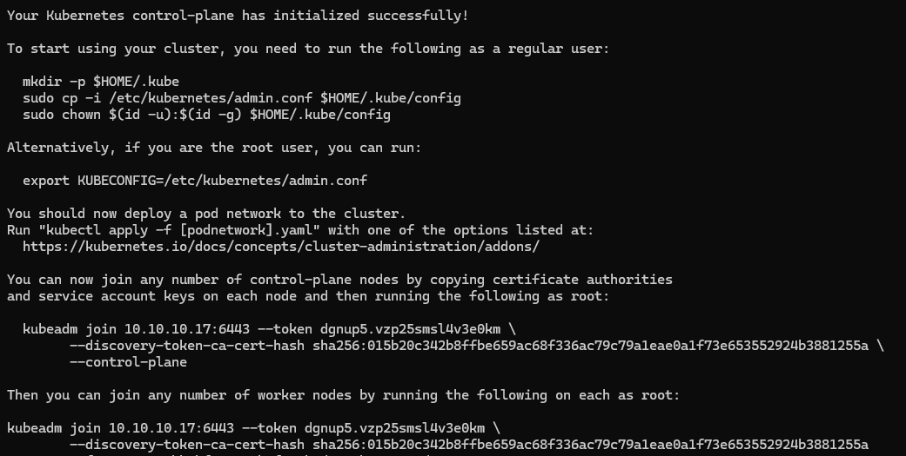
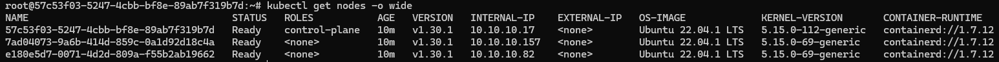
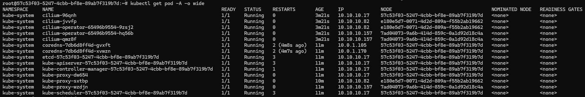

# 1. Triển khai Kubernetes
## 1.1. Triển khai cụm k8s bằng **kubeadm**
### Cài đặt containerd (trên control plane và worker node)
```bash
cat <<EOF | sudo tee /etc/modules-load.d/containerd.conf
overlay
br_netfilter
EOF
sudo modprobe overlay
sudo modprobe br_netfilter
cat <<EOF | sudo tee /etc/sysctl.d/99-kubernetes-cri.conf
net.bridge.bridge-nf-call-iptables  = 1
net.ipv4.ip_forward                 = 1
net.bridge.bridge-nf-call-ip6tables = 1
EOF
sudo sysctl --system
sudo apt install containerd -y
mkdir /etc/containerd
containerd config default > /etc/containerd/config.toml

## Cài đặt cgroup driver systemd cho containerd
sed -i 's/SystemdCgroup = false/SystemdCgroup = true/g' /etc/containerd/config.toml
systemctl restart containerd
```

### Cài đặt kubeadm, kubelet, kubectl (trên control plane và worker node)
```bash
apt-get update
apt-get install -y apt-transport-https ca-certificates curl gpg
mkdir -p /etc/apt/keyrings
curl -fsSL https://pkgs.k8s.io/core:/stable:/v1.30/deb/Release.key | gpg --dearmor -o /etc/apt/keyrings/kubernetes-apt-keyring.gpg
echo 'deb [signed-by=/etc/apt/keyrings/kubernetes-apt-keyring.gpg] https://pkgs.k8s.io/core:/stable:/v1.30/deb/ /' | tee /etc/apt/sources.list.d/kubernetes.list
apt-get update
apt-get install -y kubelet kubeadm kubectl
apt-mark hold kubelet kubeadm kubectl

# Tắt swap memory và khởi động kubelet
swapoff -a
sed -i '/ swap / s/^\(.*\)$/#\1/g' /etc/fstab
systemctl enable --now kubelet
```

### Khởi tạo cluster (trên control plane)
```bash
# 10.10.10.17 là địa chỉ của node control plane
kubeadm init --control-plane-endpoint=10.10.10.17:6443 --pod-network-cidr=10.0.0.0/8
export KUBECONFIG=/etc/kubernetes/admin.conf
```

Log khi chạy câu lệnh kubeadm:



Trong cuối đoạn log có in ra câu lệnh để thêm worker node cho cụm k8s.

### Thêm các worker node vào cluster (chạy trên worker node)
```bash
# Câu lệnh cuối đoạn log phía trên
kubeadm join 10.10.10.17:6443 --token dgnup5.vzp25smsl4v3e0km \
        --discovery-token-ca-cert-hash sha256:015b20c342b8ffbe659ac68f336ac79c79a1eae0a1f73e653552924b3881255a
```

### Cài đặt helm (trên control plane)
```bash
curl https://baltocdn.com/helm/signing.asc | gpg --dearmor | tee /usr/share/keyrings/helm.gpg > /dev/null
apt-get install apt-transport-https --yes
echo "deb [arch=$(dpkg --print-architecture) signed-by=/usr/share/keyrings/helm.gpg] https://baltocdn.com/helm/stable/debian/ all main" | tee /etc/apt/sources.list.d/helm-stable-debian.list
apt-get update
apt-get install helm
```

### Cài đặt Container Network Interface **cilium** (trên control plane)
```bash
helm repo add cilium https://helm.cilium.io/
helm install cilium cilium/cilium --version 1.11.6 --namespace kube-system
```

## 1.2. Các log kiểm tra hệ thống




