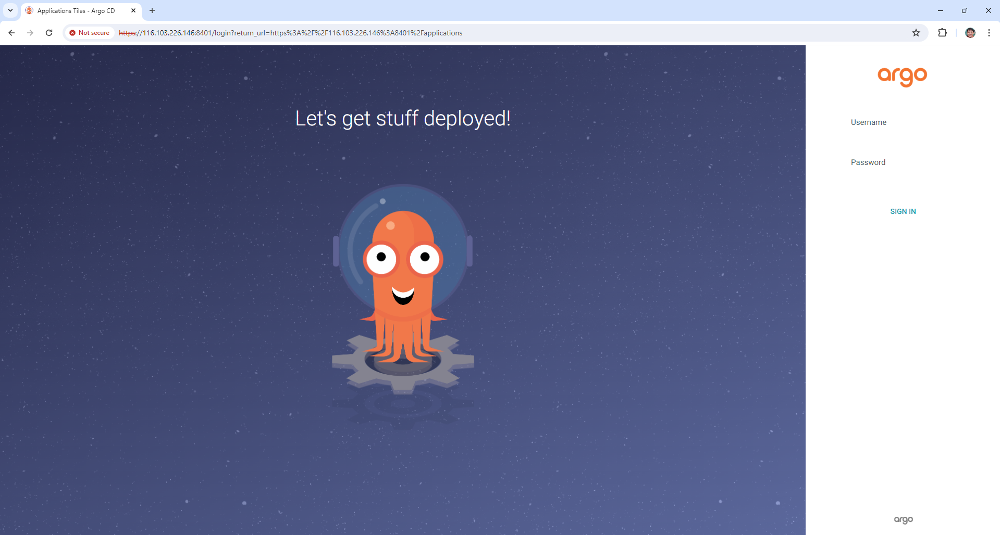
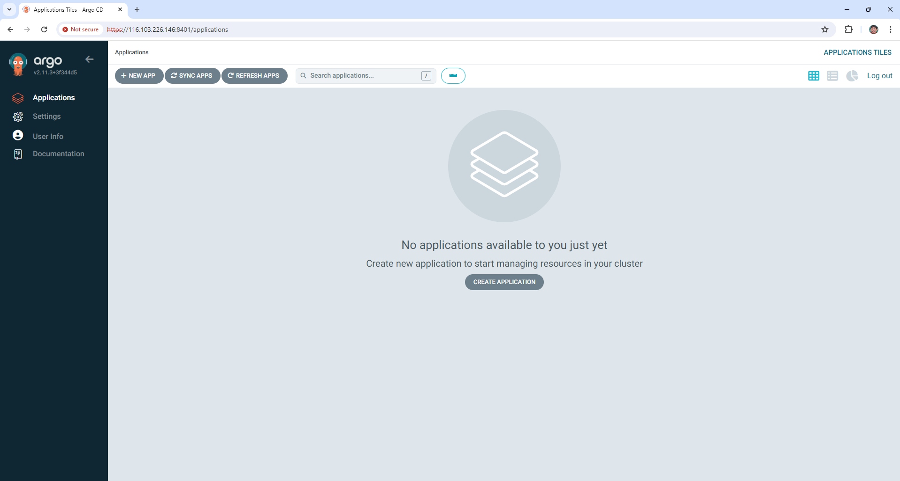
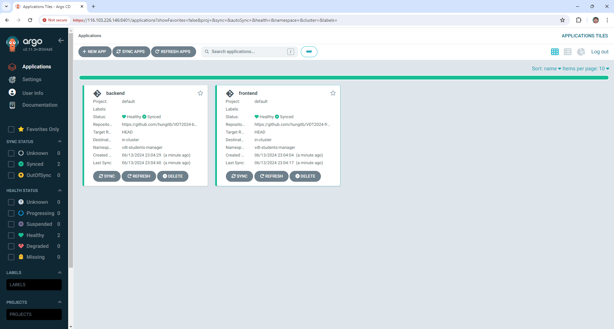
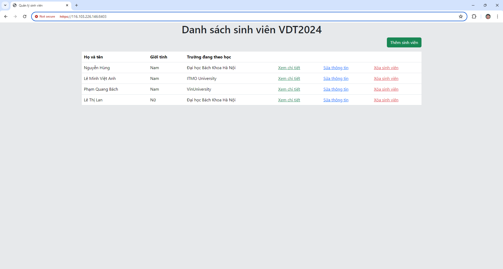

# 2. K8S Helm Chart
## 2.1. Yêu cầu 1
### Cài đặt ArgoCD lên Kubernetes Cluster
```bash
kubectl create namespace argocd
kubectl apply -n argocd -f https://raw.githubusercontent.com/argoproj/argo-cd/stable/manifests/install.yaml # File manifest
```

### Expose ArgoCD dưới dạng NodePort
Tạo 1 file manifest có nội dung sau:
```yaml
# expose-argocd-node-port.yaml
---
apiVersion: v1
kind: Service
metadata:
  name: argocd-server-node-port
  namespace: argocd
spec:
  type: NodePort
  selector:
    app.kubernetes.io/name: argocd-server
  ports:
  - name: be-port
    protocol: TCP
    port: 8080
    targetPort: 8080
    nodePort: 31001
```

Sau đó apply file này:
```bash
kubectl apply -f expose-argocd-np.yaml
```

Bây giờ có thể truy cập vào argocd bằng địa chỉ IP **10.10.10.17** (IP của control plane) hoặc **10.10.10.157**, **10.10.10.82** (IP của worker node) và port là **31001**.

### Cài đặt Load Balancer lên Bastion Node (sử dụng nginx)
Để có thể đăng nhập được **argocd** trên trình duyệt thì cần phải truy cập bằng giao thức **https**. Vậy nên đầu tiên cần phải tạo chứng chỉ **ssl** tự ký bằng câu lệnh sau:
```
openssl req -x509 -nodes -days 365 -newkey rsa:2048 -keyout argocd-nginx-selfsigned.key -out argocd-nginx-selfsigned.crt
```
Câu lệnh sẽ tạo ra 2 file **argocd-nginx-selfsigned.key** và **argocd-nginx-selfsigned.crt** sẽ được mount vào nginx container vào bước sau.

Tạo 1 file cấu hình cho nginx (cùng folder với 2 file vừa tạo):
```nginx
# default.conf
upstream k8s-cluster {
    # 31001 là port của service NodePort mở ở trên
    server 10.10.10.17:31001;
    server 10.10.10.157:31001;
    server 10.10.10.82:31001;
}

server {
    listen 8401 ssl;

    ssl_certificate /argocd-nginx-selfsigned.crt;
    ssl_certificate_key /argocd-nginx-selfsigned.key;

    location / {
        proxy_pass https://k8s-cluster;
        proxy_redirect http:// https://;

        proxy_set_header X-Real-IP .$remote_addr;
        proxy_set_header X-Forwarded-For .$proxy_add_x_forwarded_for;
        proxy_set_header Host $http_host;
    }
}
```

Và file docker-compose, cũng cùng folder các file trước:
```yaml
# docker-compose.yaml
services:
  load-balancer:
    image: nginx
    volumes:
        # Mount file cấu hình nginx và 2 file cho chứng chỉ ssl vào container
      - ./default.conf:/etc/nginx/conf.d/default.conf
      - ./argocd-nginx-selfsigned.crt:/argocd-nginx-selfsigned.crt
      - ./argocd-nginx-selfsigned.key:/argocd-nginx-selfsigned.key
    ports:
      - 8401:8401
```

Cuối cùng, đứng tại folder chứa docker-compose.yaml trên node bastion để chạy lệnh sau:
```bash
docker compose up -d
```

Bây giờ đã có thể truy cập vào giao diện **Argocd** bằng giao thức **https** thông qua IP **116.103.226.146** (IP node bastion) và port **8401**: [https://116.103.226.146:8401](https://116.103.226.146:8401).

### Giao diện hệ thống Argocd trên trình duyệt ([https://116.103.226.146:8401](https://116.103.226.146:8401))





## 2.2 Yêu cầu 2

### Helm Chart cho Web Deployment

Helm chart cho Web nằm trong thư mục `helm` của repo [VDT2024-midterm-frontend](https://github.com/hungitb/VDT2024-midterm-frontend) có cấu trúc như sau:
```
helm
├── Chart.yaml
└── templates
    ├── deployment-nginx-prometheus-exporter.yaml
    ├── deployment-nginx.yaml
    ├── service-nginx-prometheus-exporter.yaml
    └── service-nginx.yaml
```

File `Chart.yaml` ghi một vài thông tin cơ bản về chart:
```yaml
apiVersion: v2
name: vdt-students-manager-frontend-chart
description: Chart for app frontend
type: application
version: 1.0.0
```

File `templates/deployment-nginx.yaml` dùng để deploy các Pod để triển khai ứng dụng:
```yaml
apiVersion: v1
kind: ConfigMap
metadata:
  name: frontend-config-file
data:
  nginx.conf: |
    server {
        listen 80;

        location / {
            root   /var/www/html;
            index  index.html index.htm;
        }

        location /api {
            proxy_pass http://{{ .Values.backend.host }}:{{ .Values.backend.port }};

            proxy_set_header X-Real-IP .$remote_addr;
            proxy_set_header X-Forwarded-For .$proxy_add_x_forwarded_for;
            proxy_set_header Host $host;
            proxy_set_header X-NginX-Proxy true;
        }
    }

    server {
        listen 8081;

        location /stub_status {
            stub_status;
        }
    }
  haproxy.cfg: |
    defaults
      mode http
      timeout client 10s
      timeout connect 5s
      timeout server 10s 
      timeout http-request 10s
    frontend https-in
      bind *:22222 ssl crt /usr/local/etc/haproxy-cert/ssl.crt
      default_backend localhost-frontend
    frontend http-in
      bind *:8080
      default_backend localhost-frontend-metrics
    backend localhost-frontend
      mode http
      server localhost 127.0.0.1:80
    backend localhost-frontend-metrics
      mode http
      server localhost-metrics 127.0.0.1:8081
---
apiVersion: apps/v1
kind: Deployment
metadata:
  name: frontend-deployment
spec:
  replicas: {{ .Values.frontend.replicaCount }}
  selector:
    matchLabels: {{ .Values.frontend.service.selectorLabels | nindent 6 }}
  template:
    metadata:
      labels: {{ .Values.frontend.service.selectorLabels | nindent 8 }}
    spec:
      containers:
      - name: fe-server
        image: {{ .Values.frontend.image }}
        ports:
        - containerPort: 8081 # port for metrics
        - containerPort: 80 # http
        volumeMounts:
        - name: frontend-nginx-config-file-mount-volumn
          mountPath: /etc/nginx/conf.d
      - name: haproxy-sidecar-frontend
        image: haproxy:2.4.9
        ports:
        - containerPort: 8080 # port for metrics
        - containerPort: 22222 # https
        volumeMounts:
        - name: frontend-haproxy-config-file-mount-volumn
          mountPath: /usr/local/etc/haproxy
        - name: haproxy-sidecar-secret-mount-volumn
          mountPath: /usr/local/etc/haproxy-cert
          readOnly: true
      volumes:
      - name: frontend-nginx-config-file-mount-volumn
        configMap:
          name: frontend-config-file
          items:
          - key: nginx.conf
            path: nginx.conf
      - name: frontend-haproxy-config-file-mount-volumn
        configMap:
          name: frontend-config-file
          items:
          - key: haproxy.cfg
            path: haproxy.cfg
      - name: haproxy-sidecar-secret-mount-volumn
        secret: # Trước khi install chart thì cần phải tạo ra Secret này rồi, có 2 key là ssl.crt, ssl.key
          secretName: haproxy-sidecar-secret
          items:
          - key: ssl.crt
            path: ssl.crt
          - key: ssl.crt.key
            path: ssl.crt.key
```

Trong mỗi pod, ngoài container chạy dịch vụ web (nginx) ra thì sẽ bao gồm thêm cả 1 container chạy **HAProxy sidecar**. Container bổ sung này có nhiệm vụ expose service của container chạy dịch vụ web để có thể truy cập bằng **https**.

Trước phần định nghĩa Deployment thì có phần định nghĩa tài nguyên **ConfigMap** để cấu hình nginx của dịch vụ web và cấu hình cho cả **HAProxy**.

Dịch vụ web còn mở thêm 1 cổng 8081 (rồi sau đó được **HAProxy** expose qua cổng 8080) để **nginx-prometheus-exporter** truy vấn lấy thông tin về tài nguyên, tải, ...

File `templates/service-nginx.yaml`, triển khai service dạng NodePort để sau này public ra ngoài internet. Nó chỉ expose các cổng của haproxy, chứ không expose trực tiếp các cổng của dịch vụ web:
```yaml
apiVersion: v1
kind: Service
metadata:
  name: {{ .Values.frontend.service.name }}
  labels: {{ .Values.frontend.service.selectorLabels | nindent 4 }}
spec:
  type: NodePort
  selector: {{ .Values.frontend.service.selectorLabels | nindent 4 }}
  ports:
  - name: https
    protocol: TCP
    port: 22222
    nodePort: {{ .Values.frontend.service.nodePort }}
  - name: metrics
    port: 8080
```


File `templates/deployment-nginx-prometheus-exporter.yaml`, triển khai các pod cho **nginx-prometheus-exporter** dùng để export các metric cho **prometheus**.
```yaml
apiVersion: apps/v1
kind: Deployment
metadata:
  name: nginx-prometheus-exporter-deployment
spec:
  replicas: {{ .Values.nginxPrometheusExporter.replicaCount }}
  selector:
    matchLabels: {{ .Values.nginxPrometheusExporter.service.selectorLabels | nindent 6 }}
  template:
    metadata:
      labels: {{ .Values.nginxPrometheusExporter.service.selectorLabels | nindent 8 }}
    spec:
      containers:
      - name: nginx-frontend-prometheus-exporter
        image: {{ .Values.nginxPrometheusExporter.image }}
        ports:
        - name: metrics
          containerPort: 9113
        env:
        - name: NGINX_SCRAPE_URI
          value: http://{{ .Values.frontend.service.name }}:8080/stub_status
        args:
        - "--nginx.scrape-uri=$(NGINX_SCRAPE_URI)"
```

File cuối cùng `templates/service-nginx-prometheus-exporter.yaml`, expose dịch vụ **nginx-prometheus-exporter** dưới dạng **ClusterIP**, mở cổng 9113 để sau này **prometheus** chọc vào lấy dữ liệu.

```yaml
apiVersion: v1
kind: Service
metadata:
  name: {{ .Values.nginxPrometheusExporter.service.name }}
  labels: {{ .Values.nginxPrometheusExporter.service.selectorLabels | nindent 4 }}
spec:
  selector: {{ .Values.nginxPrometheusExporter.service.selectorLabels | nindent 4 }}
  ports:
  - name: metrics
    port: 9113
```

File cấu hình giá trị cho chart trên nằm ở repo [VDT2024-frontend-config](https://github.com/hungitb/VDT2024-frontend-config):  `values.yaml` có nội dung như sau:
```yaml
frontend:
  replicaCount: 2
  image: hungitb/fe:v45
  service:
    name: frontend-service
    selectorLabels: |-
      app: vdt-students-manager
      role: frontend
    nodePort: 31003

backend:
  host: 116.103.226.146
  port: 8404

nginxPrometheusExporter:
  replicaCount: 2
  image: nginx/nginx-prometheus-exporter:1.1.0
  service:
    name: frontend-prometheus-exporter-service
    selectorLabels: |-
      app: vdt-students-manager
      role: frontend-prometheus-exporter
```

Nó chứa một vài thông tin như host của backend (116.103.226.146) và port của backend, ngoài ra còn một số thông tin cơ bản để triển khai cho helm chart. Và chú ý là node port của dịch vụ web là **31003**.

### Helm Chart cho API Deployment

Helm chart cho API nằm trong thư mục `helm` của repo [VDT2024-midterm-backend](https://github.com/hungitb/VDT2024-midterm-backend) có cấu trúc như sau:
```
helm
├── Chart.yaml
└── templates
    ├── deployment-mysql.yaml
    ├── deployment-nodejs.yaml
    ├── service-mysql.yaml
    └── service-nodejs.yaml
```

File `Chart.yaml` chứa thông tin cơ bản về chart:
```yaml
apiVersion: v2
name: vdt-students-manager-backend-chart
description: Chart for App backend
type: application
version: 1.0.0
```

File `templates/deployment-mysql.yaml` deploy các pod cho database:
```yaml
apiVersion: apps/v1
kind: Deployment
metadata:
  name: mysql-deployment
spec:
  selector:
    matchLabels: {{ .Values.database.service.selectorLabels | nindent 6 }}
  template:
    metadata:
      labels: {{ .Values.database.service.selectorLabels | nindent 8 }}
    spec:
      containers:
      - name: mysql
        image: {{ .Values.database.image }}
        ports:
        - containerPort: 3306
        env:
        - name: MYSQL_ROOT_PASSWORD
          value: {{ .Values.database.password }}
```

File `tempaltes/service-mysql.yaml` triển khai dịch vụ database dưới dạng ClusterIP:
```yaml
apiVersion: v1
kind: Service
metadata:
  name: {{ .Values.database.service.name }}
  labels: {{ .Values.database.service.selectorLabels | nindent 4 }}
spec:
  selector: {{ .Values.database.service.selectorLabels | nindent 4 }}
  ports:
  - protocol: TCP
    port: {{ .Values.database.service.port }}
    targetPort: 3306
```

File `templates/deployment-nodejs.yaml`, cũng như dịch vụ web, dịch vụ api sẽ được expose thông qua haproxy trong cùng pod để có thể truy cập vào bằng https, ngoài ra còn có một **ConfigMap** chứa file cấu hình cho haproxy:
```yaml
apiVersion: v1
kind: ConfigMap
metadata:
  name: haproxy-sidecar-config-file
data:
  haproxy.cfg: |
    defaults
      mode http
      timeout client 10s
      timeout connect 5s
      timeout server 10s 
      timeout http-request 10s
    frontend https-in
      bind *:22222 ssl crt /usr/local/etc/haproxy-cert/ssl.crt
      default_backend localhost-backend
    frontend http-in
      bind *:11111
      default_backend localhost-backend
    backend localhost-backend
      mode http
      server localhost localhost:44444
---
apiVersion: apps/v1
kind: Deployment
metadata:
  name: backend-deployment
spec:
  replicas: {{ .Values.backend.replicaCount }}
  selector:
    matchLabels: {{ .Values.backend.service.selectorLabels | nindent 6 }}
  template:
    metadata:
      labels: {{ .Values.backend.service.selectorLabels | nindent 8 }}
    spec:
      containers:
      - name: be-server
        image: {{ .Values.backend.image }}
        env:
        - name: PORT
          value: "44444" # Port này chỉ dùng để haproxy-sidecar chọc vào qua localhost
        - name: MYSQL_HOST
          value: {{ .Values.database.service.name }}
        - name: MYSQL_USER
          value: {{ .Values.database.user }}
        - name: MYSQL_PORT
          value: "{{ .Values.database.service.port }}"
        - name: MYSQL_PASSWORD
          value: {{ .Values.database.password }}
        - name: MYSQL_DATABASE_NAME
          value: {{ .Values.database.name }}
      - name: haproxy-sidecar
        image: haproxy:2.4.9
        ports:
        - containerPort: 11111 # http
        - containerPort: 22222 # https
        volumeMounts:
        - name: haproxy-sidecar-config-file-mount-volumn
          mountPath: /usr/local/etc/haproxy
        - name: haproxy-sidecar-secret-mount-volumn
          mountPath: /usr/local/etc/haproxy-cert
          readOnly: true
      volumes:
      - name: haproxy-sidecar-secret-mount-volumn
        secret: # Trước khi install chart thì cần phải tạo ra Secret này rồi, có 2 key là ssl.crt, ssl.key
          secretName: haproxy-sidecar-secret
          items:
          - key: ssl.crt
            path: ssl.crt
          - key: ssl.crt.key
            path: ssl.crt.key
      - name: haproxy-sidecar-config-file-mount-volumn
        configMap:
          name: haproxy-sidecar-config-file
```

Cuối cùng là file `templates/service-nodejs.yaml`, expose dịch vụ API dưới dạng NodePort để có thể truy cập vào. Tất nhiên nó expose các port của haproxy chứ không phải qua các port thực sự mà api đang chạy.
```yaml
apiVersion: v1
kind: Service
metadata:
  name: backend-service
  labels: {{ .Values.backend.service.selectorLabels | nindent 4 }}
spec:
  type: NodePort
  selector: {{ .Values.backend.service.selectorLabels | nindent 4 }}
  ports:
  - name: backend-service-port-https
    protocol: TCP
    port: 22222
    nodePort: {{ .Values.backend.service.nodePort }}
  - name: backend-service-port-http
    protocol: TCP
    port: 11111
```

File cấu hình giá trị cho chart trên nằm ở repo [VDT2024-backend-config](https://github.com/hungitb/VDT2024-backend-config):  `values.yaml` có nội dung như sau:
```yaml
backend:
  replicaCount: 2
  image: hungitb/be:v1
  service:
    selectorLabels: |-
      app: vdt-students-manager
      role: backend
    port: 3000
    nodePort: 31004

database:
  image: mysql
  user: root
  password: root
  name: vdt_students
  service:
    name: mysql-service
    selectorLabels: |-
      app: vdt-students-manager
      role: database
    port: 3307
```

Nó chứa một vài thông tin như image backend (được build từ nodejs), image mysql, service database, ngoài ra còn một số thông tin cơ bản để triển khai cho helm chart. Chú ý là node port của dịch vụ API là **31004**.

### Manifest của ArgoCD Application

Đối với dịch vụ web:
```yaml
apiVersion: argoproj.io/v1alpha1
kind: Application
metadata:
  name: frontend
  namespace: argocd
  finalizers:
    - resources-finalizer.argocd.argoproj.io
spec:
  destination:
    namespace: vdt-students-manager
    server: https://kubernetes.default.svc
  sources:
    - repoURL: https://github.com/hungitb/VDT2024-frontend-config.git
      targetRevision: HEAD
      ref: values
    - repoURL: https://github.com/hungitb/VDT2024-midterm-frontend.git
      path: helm
      targetRevision: HEAD
      helm:
        valueFiles:
        - $values/values.yaml
  project: default
  syncPolicy:
    automated:
      prune: true
      selfHeal: true
    syncOptions:
      - CreateNamespace=true
```

Đối với dịch vụ api:
```yaml
apiVersion: argoproj.io/v1alpha1
kind: Application
metadata:
  name: backend
  namespace: argocd
  finalizers:
    - resources-finalizer.argocd.argoproj.io
spec:
  destination:
    namespace: vdt-students-manager
    server: https://kubernetes.default.svc
  sources:
    - repoURL: https://github.com/hungitb/VDT2024-backend-config.git
      targetRevision: HEAD
      ref: values
    - repoURL: https://github.com/hungitb/VDT2024-midterm-backend.git
      path: helm
      targetRevision: HEAD
      helm:
        valueFiles:
        - $values/values.yaml
  project: default
  syncPolicy:
    automated:
      prune: true
      selfHeal: true
    syncOptions:
      - CreateNamespace=true
```

Tuy nhiên trước khi apply 2 file manifest này, cần phải tạo 1 **Secret** để chứa chứng chỉ ssl cho **haproxy sidecar** trong cùng namespace với các dịch vụ. Trong file manifest argocd của 2 dịch vụ trên đã khai báo name space là **vdt-students-manager** nên ta cũng sẽ sử dụng namespace này.

```bash
openssl req -x509 -nodes -days 365 -newkey rsa:2048 -keyout ssl.crt.key -out ssl.crt
kubectl create secret generic haproxy-sidecar-secret --from-file=ssl.crt.key --from-file=ssl.crt -n vdt-students-manager
```

### Kết quả đạt được


### Cài đặt Loadbalancer lên Bastion Node expose 2 port của Web ra Internet
Như trước đó đã đề cập, ta đã expose được 2 dịch vụ Web và API dưới dạng NodePort và giao thức https. Trong đó node port của dịch vụ web là 31003, của API là 31004.

Cũng tương tự như cách đã expose Argocd, sử dụng nginx để làm Load Balancer. Bắt đầu tự việc tự tạo chứng chỉ SSL, tạo file cấu hình nginx, chạy container nginx và mount các file cấu hình ssl, cấu hình nginx vào container. Thu được kết quả như sau:

Cấu hình nginx:
```nginx
# default.conf
upstream k8s-cluster-fe {
    server 10.10.10.17:31003;
    server 10.10.10.157:31003;
    server 10.10.10.82:31003;
}

upstream k8s-cluster-be {
    server 10.10.10.17:31004;
    server 10.10.10.157:31004;
    server 10.10.10.82:31004;
}

server {
    listen 8403 ssl;

    ssl_certificate /argocd-nginx-selfsigned.crt;
    ssl_certificate_key /argocd-nginx-selfsigned.key;

    location / {
        proxy_pass https://k8s-cluster-fe;

        proxy_set_header X-Real-IP .$remote_addr;
        proxy_set_header X-Forwarded-For .$proxy_add_x_forwarded_for;
        proxy_set_header Host $http_host;
    }
}

server {
    listen 8404 ssl;

    ssl_certificate /argocd-nginx-selfsigned.crt;
    ssl_certificate_key /argocd-nginx-selfsigned.key;

    location / {
        proxy_pass https://k8s-cluster-be;

        proxy_set_header X-Real-IP .$remote_addr;
        proxy_set_header X-Forwarded-For .$proxy_add_x_forwarded_for;
        proxy_set_header Host $http_host;
    }
}
```

File docker-compose:
```yaml
# docker-compose.yaml
services:
  load-balancer:
    image: nginx
    volumes:
        # Mount file cấu hình nginx và 2 file cho chứng chỉ ssl vào container
      - ./default.conf:/etc/nginx/conf.d/default.conf
      - ./argocd-nginx-selfsigned.crt:/argocd-nginx-selfsigned.crt
      - ./argocd-nginx-selfsigned.key:/argocd-nginx-selfsigned.key
    ports:
      - 8403:8403
      - 8404:8404
```

Sau khi chạy, ta có thể truy cập 2 dịch vụ theo đường dẫn:
- **Web**: [https://116.103.226.146:8403](https://116.103.226.146:8403)
- **API**: [https://116.103.226.146:8404/api/students](https://116.103.226.146:8404/api/students)




