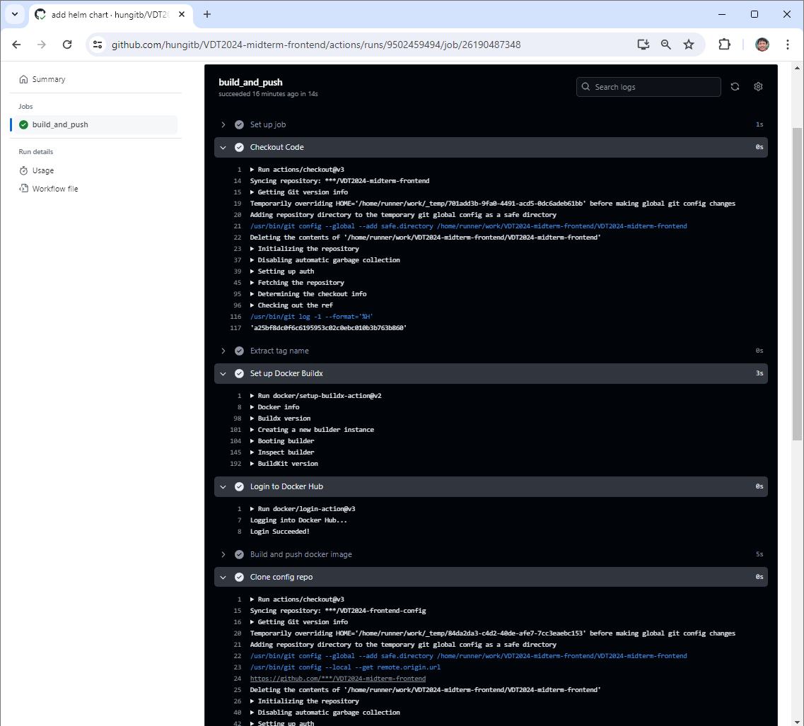
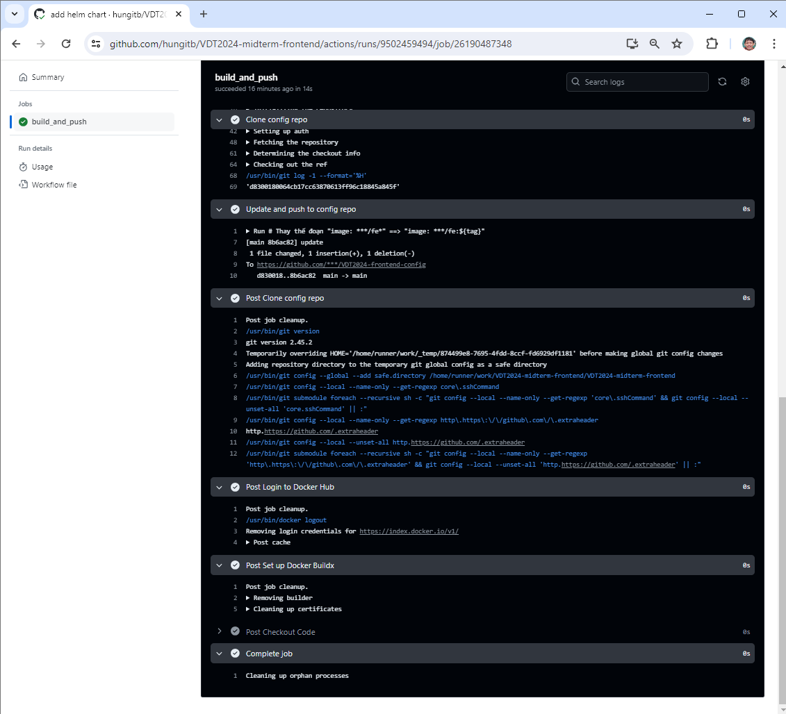
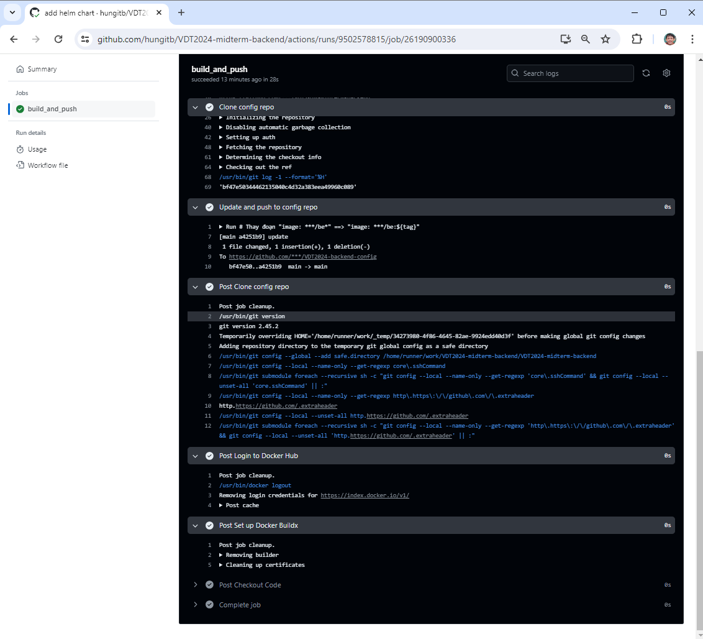
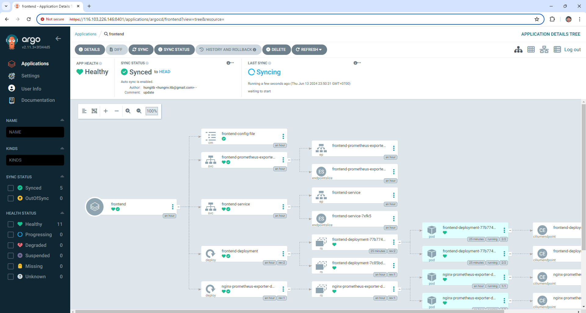
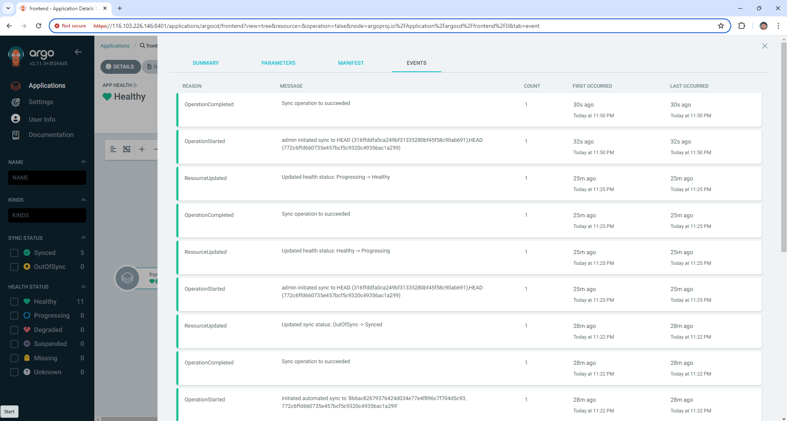

# 3. Continous Delivery
## 3.1. File setup 2 luồng CD

### Dịch vụ Web
Nội dung file `tag.yaml` nằm trong thư mục `.github/workflows` của repo [Web](https://github.com/hungitb/VDT2024-midterm-frontend):
```yaml
name: CI
on:
  push:
    tags:
    - '*'
jobs:
  build_and_push:
    runs-on: ubuntu-latest

    steps:
      - name: Checkout Code
        uses: actions/checkout@v3

      - name: Extract tag name
        id: tag
        run: echo "::set-output name=tag::${GITHUB_REF#refs/tags/}"

      - name: Set up Docker Buildx
        uses: docker/setup-buildx-action@v2

      - name: Login to Docker Hub
        uses: docker/login-action@v3
        with:
          username: ${{ secrets.DOCKERHUB_USERNAME }}
          password: ${{ secrets.DOCKERHUB_TOKEN }}

      - name: Build and push docker image
        run: |
          docker build -t ${{ secrets.DOCKERHUB_USERNAME }}/fe:${{ steps.tag.outputs.tag }} .
          docker push ${{ secrets.DOCKERHUB_USERNAME }}/fe:${{ steps.tag.outputs.tag }}

      - name: Clone config repo
        uses: actions/checkout@v3
        with:
          repository: hungitb/VDT2024-frontend-config
          ref: 'main'
          token:  ${{ secrets.ACTIONS_GITHUB_TOKEN }}

      - name: Update and push to config repo
        run: |
          # Thay thế đoạn "image: hungitb/fe*" ==> "image: hungitb/fe:${tag}"
          sed -i 's/image: hungitb\/fe.*/image: hungitb\/fe:${{ steps.tag.outputs.tag }}/' values.yaml
          git config user.name "hungitb" && git config user.email "hungnv.itb@gmail.com"
          git add . && git commit -m update && git push origin main
```

### Dịch vụ API
Nội dung file `tag.yaml` nằm trong thư mục `.github/workflows` của repo [API](https://github.com/hungitb/VDT2024-midterm-backend):
```yaml
name: CI
on:
  push:
    tags:
    - '*'
jobs:
  build_and_push:
    runs-on: ubuntu-latest

    steps:
      - name: Checkout Code
        uses: actions/checkout@v3

      - name: Extract tag name
        id: tag
        run: echo "::set-output name=tag::${GITHUB_REF#refs/tags/}"

      - name: Set up Docker Buildx
        uses: docker/setup-buildx-action@v2

      - name: Login to Docker Hub
        uses: docker/login-action@v3
        with:
          username: ${{ secrets.DOCKERHUB_USERNAME }}
          password: ${{ secrets.DOCKERHUB_TOKEN }}

      - name: Build and push docker image
        run: |
          docker build -t ${{ secrets.DOCKERHUB_USERNAME }}/be:${{ steps.tag.outputs.tag }} .
          docker push ${{ secrets.DOCKERHUB_USERNAME }}/be:${{ steps.tag.outputs.tag }}

      - name: Clone config repo
        uses: actions/checkout@v3
        with:
          repository: hungitb/VDT2024-backend-config
          ref: 'main'
          token:  ${{ secrets.ACTIONS_GITHUB_TOKEN }}

      - name: Update and push to config repo
        run: |
          # Thay đoạn "image: hungitb/be*" ==> "image: hungitb/be:${tag}"
          sed -i 's/image: hungitb\/be.*/image: hungitb\/be:${{ steps.tag.outputs.tag }}/' values.yaml
          git config user.name "hungitb" && git config user.email "hungnv.itb@gmail.com"
          git add . && git commit -m update && git push origin main
```

## 3.2. Output log của 2 luồng CD khi tạo tag mới

### Dịch vụ web




### Dịch vụ API




## 3.3. Hình ảnh thay đổi của Argocd




