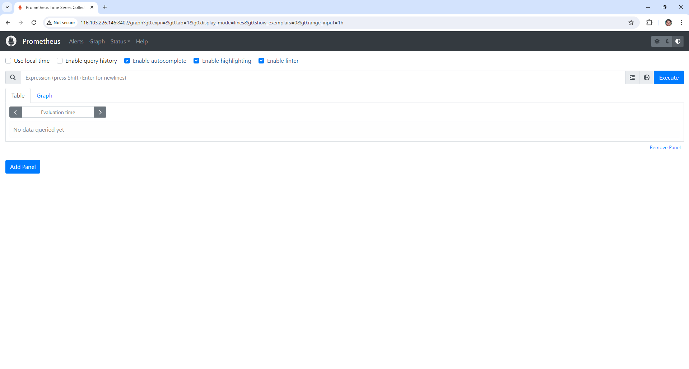
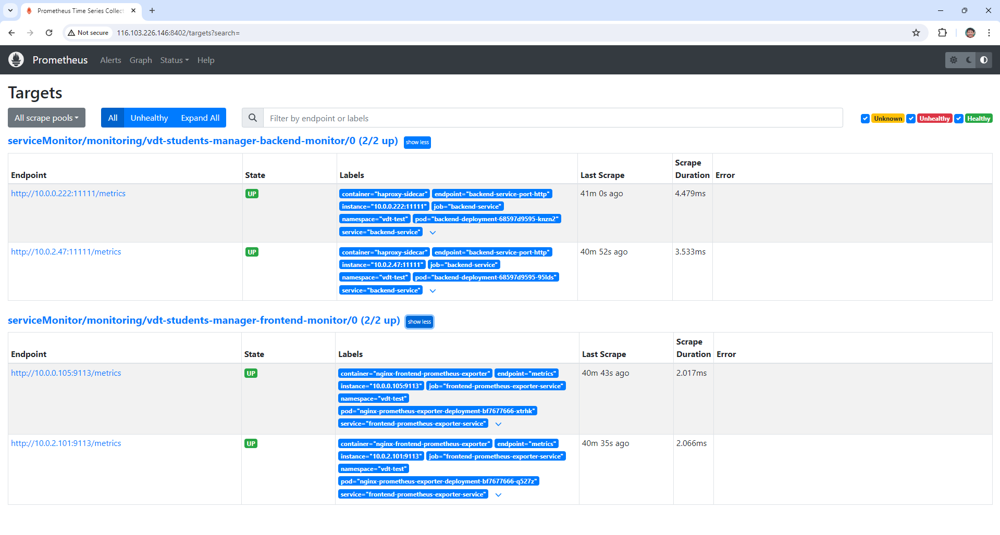

# 4. Monitoring
## 4.1. Cài đặt Prometheus lên Kubernetes Cluster
Chạy các câu lệnh sau để cài đặt prometheus:
```bash
helm repo add prometheus-community https://prometheus-community.github.io/helm-charts
helm repo update
kubectl create namespace monitoring
helm install kube-prometheus-stack prometheus-community/kube-prometheus-stack -n monitoring
```
## 4.2. Expose Prometheus UI ra public internet

### Expose Prometheus UI dưới dạng NodePort
Tạo 1 file manifest có nội dung sau:
```yaml
# expose-prometheus-ui-np.yaml
apiVersion: v1
kind: Service
metadata:
  name: kube-prometheus-stack-prometheus-node-port
  namespace: monitoring
spec:
  type: NodePort
  selector:
    app.kubernetes.io/name: prometheus
    operator.prometheus.io/name: kube-prometheus-stack-prometheus
  ports:
  - protocol: TCP
    port: 9090
    targetPort: 9090
    nodePort: 31002
```

Sau đó apply file này:
```bash
kubectl apply -f expose-prometheus-ui-np.yaml
```

Bây giờ có thể truy cập vào **Prometheus UI** bằng địa chỉ IP **10.10.10.17** (IP của control plane) hoặc **10.10.10.157**, **10.10.10.82** (IP của worker node) và port là **31002**.

### Cài đặt Load Balancer lên Bastion Node (sử dụng nginx)

Tạo 1 file cấu hình cho nginx:
```nginx
# default.conf
upstream k8s-cluster {
    # 31002 là port của service NodePort mở ở trên
    server 10.10.10.17:31002;
    server 10.10.10.157:31002;
    server 10.10.10.82:31002;
}

server {
    listen 8402;

    location / {
        proxy_pass http://k8s-cluster;

        proxy_set_header X-Real-IP .$remote_addr;
        proxy_set_header X-Forwarded-For .$proxy_add_x_forwarded_for;
        proxy_set_header Host $http_host;
    }
}
```

Và file docker-compose, cũng cùng folder các file cấu hình vừa tạo:
```yaml
# docker-compose.yaml
services:
  load-balancer:
    image: nginx
    volumes:
        # Mount file cấu hình nginx
      - ./default.conf:/etc/nginx/conf.d/default.conf
    ports:
      - 8402:8402
```

Cuối cùng, đứng tại folder chứa docker-compose.yaml trên node bastion để chạy lệnh sau:
```bash
docker compose up -d
```

Bây giờ đã có thể truy cập vào **Prometheus UI** bằng giao thức **http** thông qua IP **116.103.226.146** (IP node bastion) và port **8402**: [http://116.103.226.146:8402](http://116.103.226.146:8402).

### Giao diện truy cập Prometheus UI



## 4.3. Sử dụng Service Monitor của để giám sát Web Deployment và API Deployment

Clone file value mặc định của **Prometheus** bằng lệnh:
```bash
helm show values prometheus-community/kube-prometheus-stack > my-prometheus-values.yaml
```

Sau đó sửa lại giá trị của `prometheus.prometheusSpec.serviceMonitorSelector` trong file vừa tạo như sau:
```yaml
# my-prometheus-values.yaml
    serviceMonitorSelector:
      matchLabels:
        app: vdt-students-manager
```

Tiếp theo là cập nhật cho **Prometheus** bằng lệnh:
```bash
helm upgrade kube-prometheus-stack -n monitoring -f my-prometheus-values.yaml prometheus-community/kube-prometheus-stack
```

File manifest ServiceMonitor của dịch vụ web:
```yaml
apiVersion: monitoring.coreos.com/v1
kind: ServiceMonitor
metadata:
  name: vdt-students-manager-frontend-monitor
  namespace: monitoring
  labels:
    app: vdt-students-manager
spec:
  endpoints:
  - port: metrics
    path: /metrics
  selector:
    matchLabels:
      app: vdt-students-manager
      role: frontend-prometheus-exporter
  namespaceSelector:
    matchNames:
    - "vdt-students-manager"
```

File manifest ServiceMonitor của dịch vụ API:
```yaml
apiVersion: monitoring.coreos.com/v1
kind: ServiceMonitor
metadata:
  name: vdt-students-manager-frontend-monitor
  namespace: monitoring
  labels:
    app: vdt-students-manager
spec:
  endpoints:
  - port: metrics
    path: /metrics
  selector:
    matchLabels:
      app: vdt-students-manager
      role: frontend-prometheus-exporter
  namespaceSelector:
    matchNames:
    - "vdt-students-manager"
```

## 4.4. Hình ảnh các Target được giám sát bởi Prometheus

