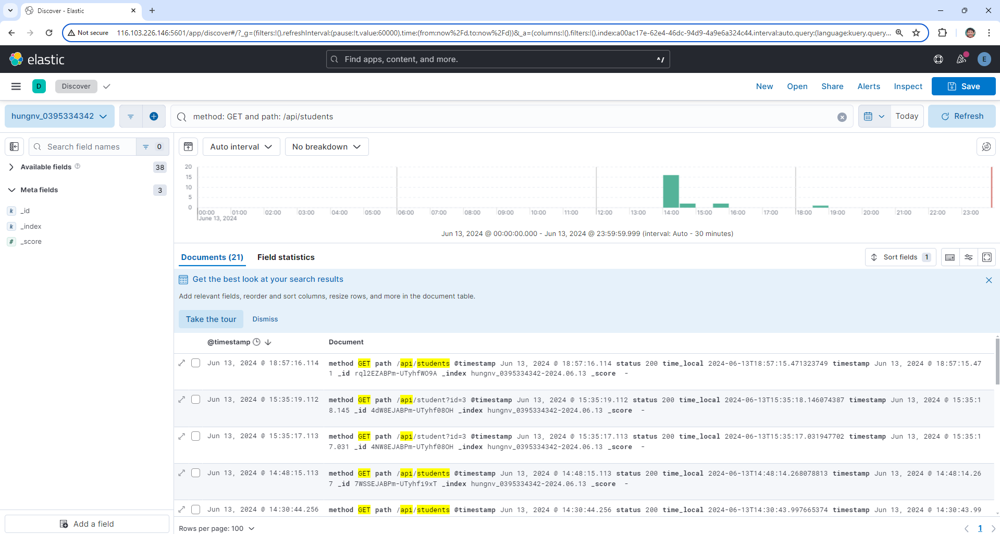

# 5. Logging
## 5.1. Cấu hình ConfigMap cho fluentd:
```yaml
apiVersion: v1
kind: ConfigMap
metadata:
  name: fluentd-config
data:
  fluent.conf: |
    <source>
      @type tail
      path /var/log/containers/backend-deployment-*vdt-students*.log
      pos_file /var/log/fluentd-containers.log-be.pos
      tag kubernetes.*
      read_from_head true

      <parse>
        @type regexp
        expression /^(?<time_local>\d{4}-\d{2}-\d{2}T\d{2}:\d{2}:\d{2}\.\d+)\+\d{2}:\d{2} \w+ \w+ \[(?<timestamp>[^\]]*)\] (?<method>[^ ]*) "(?<path>[^"]*)" ==> (?<status>[^ ]*)$/
      </parse>
    </source>

    <source>
      @type tail
      path /var/log/containers/frontend-deployment-*vdt-students*.log
      pos_file /var/log/fluentd-containers.log-fe.pos
      tag kubernetes.*
      read_from_head true

      <parse>
        @type regexp
        expression /^(?<time_local>\d{4}-\d{2}-\d{2}T\d{2}:\d{2}:\d{2}\.\d+)\+\d{2}:\d{2} \w+ \w+ (?<remote_addr>\S+) - (?<remote_user>\S+) \[(?<timestamp>[^\]]+)\] "(?<method>\S+)? (?<path>\S+) (?<request_protocol>\S+)" (?<status>\d+) (?<body_bytes_sent>\d+) "(?<http_referer>[^\"]*)" "(?<http_user_agent>[^\"]*)" "(?<http_x_forwarded_for>[^\"]*)"$/
      </parse>
    </source>

    <match **>
      @type elasticsearch
      ssl_verify false

      host "#{ENV['FLUENT_ELASTICSEARCH_HOST']}"
      port "#{ENV['FLUENT_ELASTICSEARCH_PORT']}"
      scheme "#{ENV['FLUENT_ELASTICSEARCH_SCHEME']}"
      user "#{ENV['FLUENT_ELASTICSEARCH_USER']}"
      password "#{ENV['FLUENT_ELASTICSEARCH_PASSWORD']}"
      logstash_prefix "#{ENV['FLUENT_ELASTICSEARCH_LOGSTASH_PREFIX']}"
      logstash_format true
      include_timestamp true
    </match>
```

## 5.2. Cấu hình DaemonSet cho Fluentd

```yaml
apiVersion: apps/v1
kind: DaemonSet
metadata:
  name: fluentd-logging
spec:
  selector:
    matchLabels:
      name: fluentd
  template:
    metadata:
      labels:
        name: fluentd
    spec:
      containers:
      - name: fluentd
        image: hungitb/fluentd:v1.17
        env:
        - name: FLUENT_ELASTICSEARCH_HOST
          value: 116.103.226.146
        - name: FLUENT_ELASTICSEARCH_PORT
          value: "9200"
        - name: FLUENT_ELASTICSEARCH_SCHEME
          value: https
        - name: FLUENT_ELASTICSEARCH_USER
          value: elastic
        - name: FLUENT_ELASTICSEARCH_PASSWORD
          value: iRsUoyhqW-CyyGdwk6V_
        - name: FLUENT_ELASTICSEARCH_LOGSTASH_PREFIX
          value: hungnv_0395334342
        volumeMounts:
        - name: varlog
          mountPath: /var/log
        - name: fluentd-config
          mountPath: /fluentd/etc/
      terminationGracePeriodSeconds: 30
      volumes:
      - name: varlog
        hostPath:
          path: /var/log
      - name: fluentd-config
        configMap:
          name: fluentd-config
```

# 5.3. Hình ảnh demo tìm kiếm trên Kibana



