# Triển khai web application sử dụng các DevOps tools & practices
## 1. Containerization
### 1.1. Frontend
Do phần frontend chỉ sử dụng Jquery và Bootstrap nên chỉ cần copy các file html, css, javascript vào thư mục **/var/www/html**. File config nginx về sau sẽ dùng ansible copy sang server và mount vào container.
```Dockerfile
FROM nginx
COPY . /var/www/html
```
Build image:
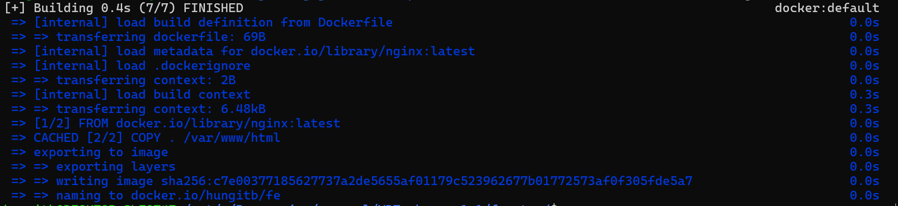

History image:
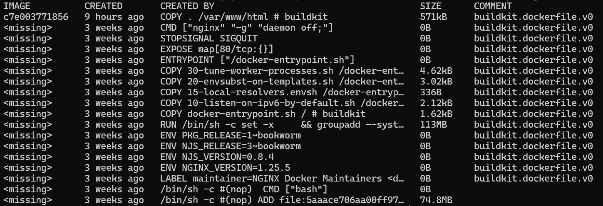

### 1.2. Backend
Dockerfile
```Dockerfile
FROM node
WORKDIR /app
COPY package*.json .
RUN npm install --only=production
COPY . .
CMD [ "npm", "start" ]
```

Build image:
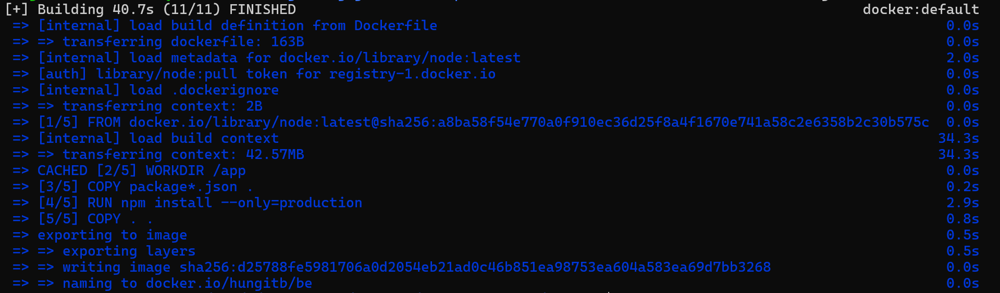

History image:
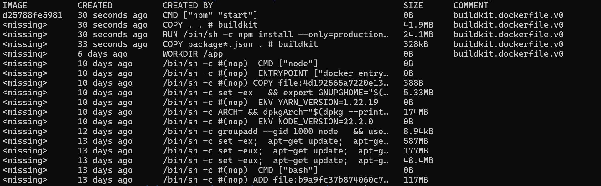

### 1.3. Database
Sử dụng image gốc của **mysql**. Do việc khởi tạo bảng sẽ do backend đảm nhận nên không cần phải custom lại image nữa.

## 2. Continuous Integration
Trong project [backend](https://github.com/hungitb/VDT2024-midterm-backend) có thư mục **.github/workflows** có file **main.yml** cấu hình việc tự động chạy test khi có các sự kiện đối với project (khi có commit vào 1 branch và pull request vào nhánh main). Nội dung file này như sau:

```yaml
name: CI
on:
  pull_request: 
    branches:
      - main 
  push:
    branches:
      - '*'
jobs:
  tests:
    runs-on: ubuntu-latest

    strategy:
      matrix:
        node-version: [14.x, 16.x, 18.x]

    steps:
      - uses: actions/checkout@v2
      - name: Use Node.js ${{ matrix.node-version }}
        uses: actions/setup-node@v1
        with:
          node-version: ${{ matrix.node-version }}
      - name: npm install
        run: npm i
      - name: tests
        run: npm test
```

### 2.1. Push commit
Log của luồng CI
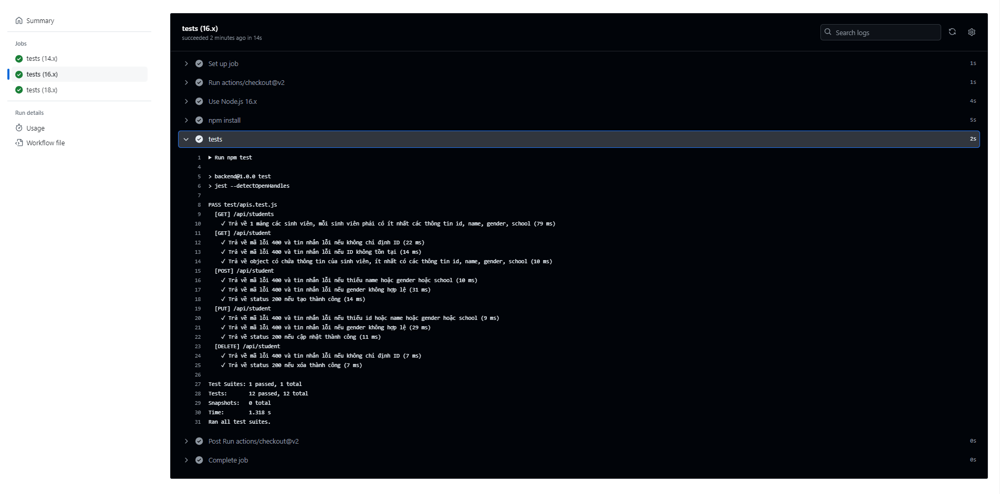

Các hình ảnh demo khác
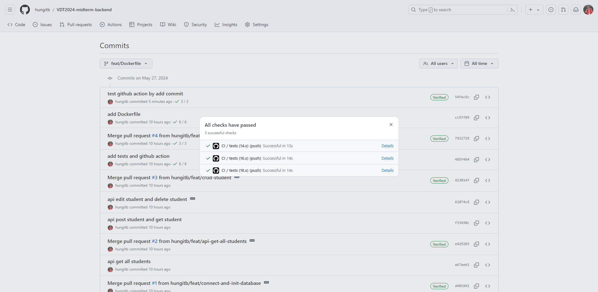

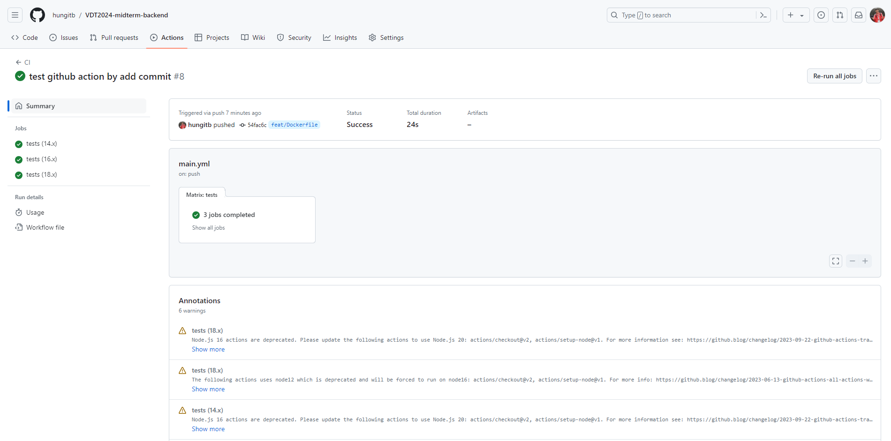

### 2.2. Pull request vào branch main
Log của luồng CI
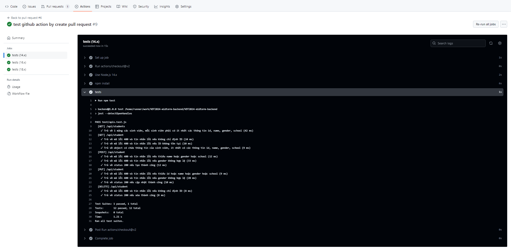

Các hình ảnh demo khác
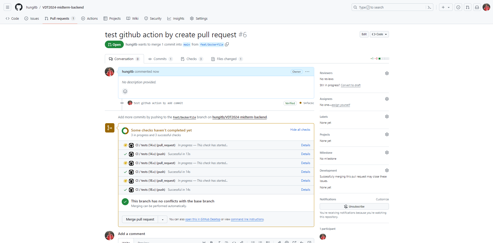

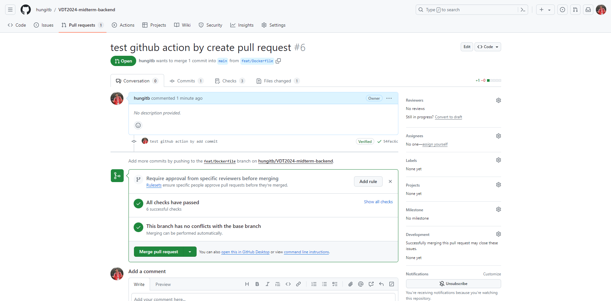

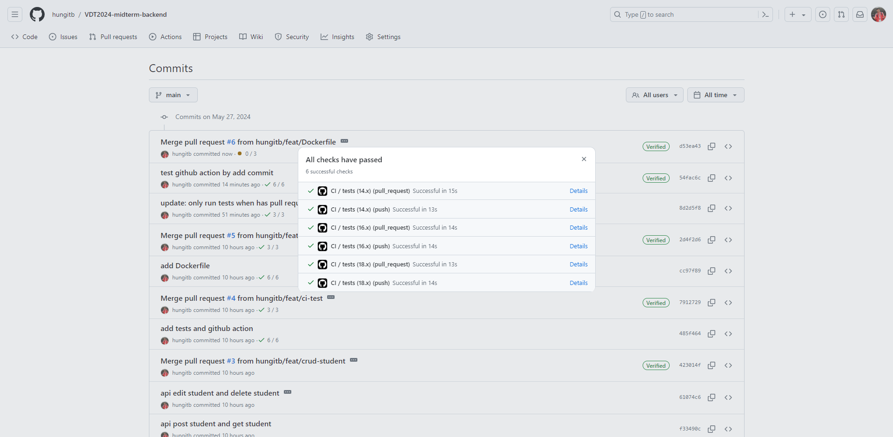

## 3. Automation
Mã nguồn Ansible: [VDT2024-midterm-ansible](https://github.com/hungitb/VDT2024-midterm-ansible).

Cấu trúc project:
```
ansible/
├── README.md
├── inventory
├── main.yml
├── roles
│   ├── apiservice
│   │   └── tasks
│   │       └── main.yml
│   ├── docker
│   │   └── tasks
│   │       └── main.yml
│   ├── mysql
│   │   └── tasks
│   │       └── main.yml
│   └── webservice
│       ├── tasks
│       │   └── main.yml
│       └── templates
│           └── default.conf
├── setup-server.yml
└── vars
    └── main.yml
```

Mục tiêu: Có 3 server, mỗi server đều cài docker. Và mỗi server đó chạy duy nhất một dịch vụ.

### 3.1. File Inventory
```yaml
[tosetup]
sv1 ansible_host=172.17.0.2 ansible_user=root
sv2 ansible_host=172.17.0.3 ansible_user=root
sv3 ansible_host=172.17.0.4 ansible_user=root

[webserver]
webserver1 ansible_host=172.17.0.2 ansible_user=hungitb

[dbserver]
dbserver1 ansible_host=172.17.0.3 ansible_user=hungitb

[beserver]
beserver1 ansible_host=172.17.0.4 ansible_user=hungitb
```

Group **tosetup** thực chất chỉ là các server ở phía dưới, nhưng sẽ khác ở **ansible_user**. Group **tosetup** được sử dụng trong playbook **setup-server.yml** để khởi tạo một server trắng trơn, bao gồm việc nâng cấp các package, setup firewall và quan trọng nhất và tạo người dùng **hungitb** được phân quyền để ở các playbook khác sẽ sử dụng người dùng mới tạo này.

### 3.2. File vars/main.yml
```yaml
fe_docker_image: hungitb/fe

be_docker_image: hungitb/be
backend_port: 3000

mysql_docker_image: mysql
mysql_port: 3307
mysql_database_name: vdt_students
mysql_user: root
mysql_password: root
```

Đây là nơi quản lý tập chung tất cả các cấu hình của tất cả các server.

### 3.3. Thông tin về các role
Role **docker**: Có nhiệm vụ cài đặt docker và đảm bảo docker daemon chạy.

Role **webservice**: Chạy container tương ứng image frontend. Cung cấp các file html, css, javascript và chuyển tiếp các lời gọi api tới **apiservice**.

Role **apiservice**: Chạy container tương ứng image backend.

Role **mysql**: Chạy container mysql.

### 3.4. File playbook chính
```yaml
- hosts: webserver
  become: true
  roles:
  - docker
  - webservice
  vars_files:
    - vars/main.yml
  vars:
    docker_image: "{{ fe_docker_image }}"
    backend_host: "{{ hostvars[groups['beserver'][0]]['ansible_host'] }}"
    backend_port: "{{ backend_port }}"

- hosts: dbserver
  become: true
  roles:
  - docker
  - mysql
  vars_files:
    - vars/main.yml
  vars:
    docker_image: "{{ mysql_docker_image }}"
    mysql_port: "{{ mysql_port }}"
    mysql_password: "{{ mysql_password }}"

- hosts: beserver
  become: true
  roles:
  - docker
  - apiservice
  vars_files:
    - vars/main.yml
  vars:
    docker_image: "{{ be_docker_image }}"
    backend_port: "{{ backend_port }}"
    mysql_host: "{{ hostvars[groups['dbserver'][0]]['ansible_host'] }}"
    mysql_port: "{{ mysql_port }}"
    mysql_user: "{{ mysql_user }}"
    mysql_password: "{{ mysql_password }}"
    mysql_database_name: "{{ mysql_database_name }}"
```

Các biến mặc dù đã được khai báo trong file **vars/main.yml**, tuy nhiên vẫn được khai báo lại để tường minh rằng các role sử dụng những biến nào.

### 3.5. Các log khi chạy playbook main.yml
#### hosts: webserver
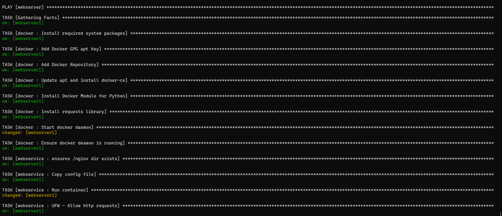
#### hosts: dbserver
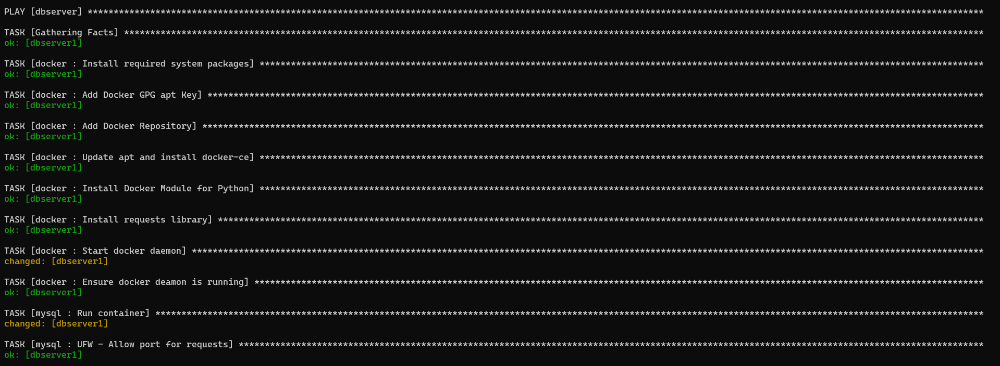
#### hosts: apiserver
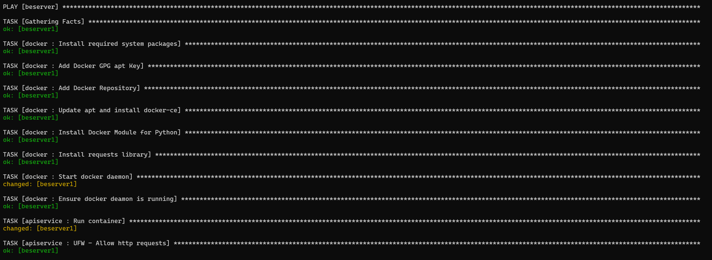
#### Tổng kết
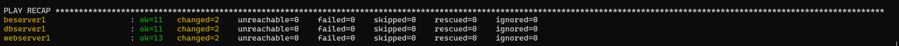
