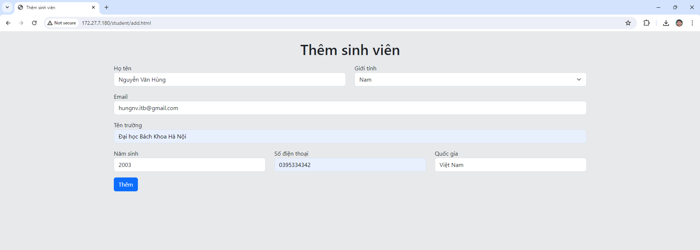
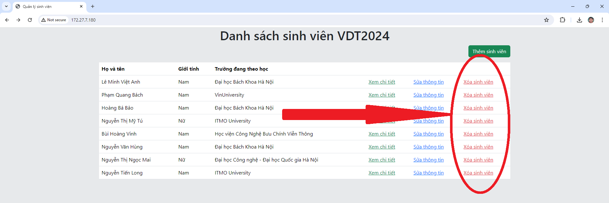

# Phát triển một 3-tier web application đơn giản
## 1. Mô tả
Kiến trúc ứng dụng

Server nginx nhận các request từ trình duyệt, phục vụ các file tĩnh html, css, javascript. Trình duyệt cũng gửi lời gọi api tới chính server nginx, sau đó server nginx sẽ chuyển tiếp request tới server backend.

Mã nguồn frontend: [VDT2024-midterm-frontend](https://github.com/hungitb/VDT2024-midterm-frontend) (công nghệ: Jquery, Bootstrap).

Mã nguồn backend: [VDT2024-midterm-backend](https://github.com/hungitb/VDT2024-midterm-backend) (công nghệ: Nodejs, database MySQL).

## 2. Một số hình ảnh về kết quả đạt được

### 2.1. Xem danh sách sinh viên


### 2.2. Xem thông tin chi tiết một sinh viên


### 2.3. Thêm sinh viên


### 2.4. Sửa thông tin sinh viên


### 2.5. Xóa sinh viên


## 3. Viết các unit test
Công nghệ sử dụng: Jest && Supertest.

Một đoạn mã ngắn về test api thêm sinh viên
```
describe('[POST] /api/student', () => {
    it('Trả về mã lỗi 400 và tin nhắn lỗi nếu thiếu name hoặc gender hoặc school', async () => {
        const inputs = [
            {name: 'Me', gender: 'Nam'},
            {name: 'Me', school: 'HUST'},
            {gender: 'Nam', school: 'HUST'}
        ]
        inputs.forEach(async (input) => {
            const res = await request(app).post('/api/student').send(input).expect('Content-Type', /json/).expect(400)
            expect(res.body).toHaveProperty('message')
            expect(res.body?.message).toBe('Missing values!')
        })
    })

    it('Trả về mã lỗi 400 và tin nhắn lỗi nếu gender không hợp lệ', async () => {
        const input = {name: 'Me', gender: 'Giới tính thứ 3', school: 'HUST'}
        const res = await request(app).post('/api/student').send(input).expect('Content-Type', /json/).expect(400)
        expect(res.body).toHaveProperty('message')
        expect(res.body?.message).toBe('Invalid gender!')
    })

    it('Trả về status 200 nếu tạo thành công', async () => {
        const input = {name: 'Me', gender: 'Nam', school: 'HUST'}
        const res = await request(app).post('/api/student').send(input).expect('Content-Type', /json/).expect(200)
    })
})
```

Kết quả chạy thử các bài test
