# Viettel Digital Talent 2024 - Project
Author: **Nguyen Thu Ha**

## Table of Contents 
- [1. Kubernetes deployment](#1-kubernetes-deployment)
- [2. K8S helm chart](#2-k8s-helm-chart)
- [3. Continuous delivery](#3-continuous-delivery)
- [4. Monitoring](#4-monitoring)
- [5. Logging](#5-logging)
- [6. Security](#6-security)


## 1. Kubernetes deployment
### Yêu cầu
- Triển khai được Kubernetes thông qua công cụ minikube trên 1 node: 0.5 điểm
Hoặc
- Triển khai được Kubernetes thông qua công cụ kubeadm hoặc kubespray lên 1 master node VM + 1 worker node VM: 1 điểm

### Output
- Ở project này em thực hiện triển khai trên minikube. Em tham khảo ở [link](https://www.youtube.com/watch?v=e4z7vsF9zzU&list=PLr-PP5L0xQ48kVe_wcqM8N9O5hIhM9V68)

- Đầu tiên cần cài đặt `kubectl`. Em cài đặt máy ảo chạy hệ điều hành ubuntu 22.04 trên VirtualBox và chạy các câu lệnh dưới đây:

```shell
# Download the latest release
curl -LO "https://dl.k8s.io/release/$(curl -L -s https://dl.k8s.io/release/stable.txt)/bin/linux/amd64/kubectl"
# Validate the binary
curl -LO "https://dl.k8s.io/$(curl -L -s https://dl.k8s.io/release/stable.txt)/bin/linux/amd64/kubectl.sha256"
# Install kubectl
sudo install -o root -g root -m 0755 kubectl /usr/local/bin/kubectl
```
- Trước khi cài đặt kubectl, cần tiến hành cài đặt curl bằng câu lệnh:
```shell
sudo apt-get install curl
```
- Kiểm tra version của '`kubectl`:
```shell
kubectl version --client
```

- Kết quả:
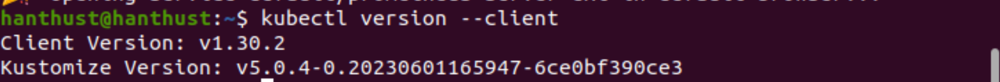

- Tiếp theo ta set up Minikube dựa trên các câu lệnh sau:
```shell
curl -LO https://storage.googleapis.com/minikube/releases/latest/minikube-linux-amd64

sudo install minikube-linux-amd64 /usr/local/bin/minikube && rm minikube-linux-amd64
```

- Kiểm tra xem đã cài đặt minikube thành công chưa:
```shell
minikube version
```


- Chạy minikube trên docker:
```shell
minikube start --driver=docker
```
- Kết quả:
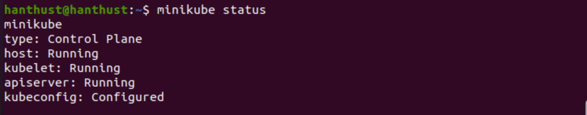


- Log của lệnh kiểm tra hệ thống:
```shell
kubectl get nodes -o wide
```

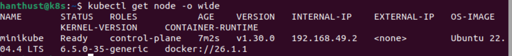

## 2. K8S helm chart
### ArgoCD
- Cài đặt argoCD theo [link](https://github.com/argoproj/argo-helm)

- File manifests sử dụng để triển khai ArgoCD lên K8S  Cluster ở [link](https://github.com/nguyenha-meiii/vdt2024/blob/main/argoCD/manifest.yaml)

- Giao diện ArgoCD:

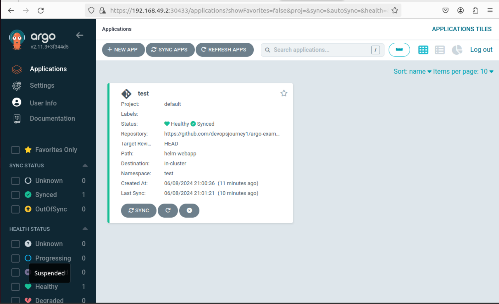
### Helm Chart

Folder helm charts cho web deployment và api deployment:
- [web](https://github.com/nguyenha-meiii/vdt_midterm_web/tree/main/helm_web)
- [api](https://github.com/nguyenha-meiii/vdt_midterm_api/tree/main/helm-api)

Config repository cho web và api:
- [web config](https://github.com/nguyenha-meiii/web_config)
- [api config](https://github.com/nguyenha-meiii/api_config)

Manifest file cho web and api:
- [web manifest](https://github.com/nguyenha-meiii/vdt_midterm_web/blob/main/helm_web/manifest.yaml)
- [api manifest](https://github.com/nguyenha-meiii/vdt_midterm_api/blob/main/helm-api/manifest.yaml)

Ảnh triển khai api và web trên argoCD:

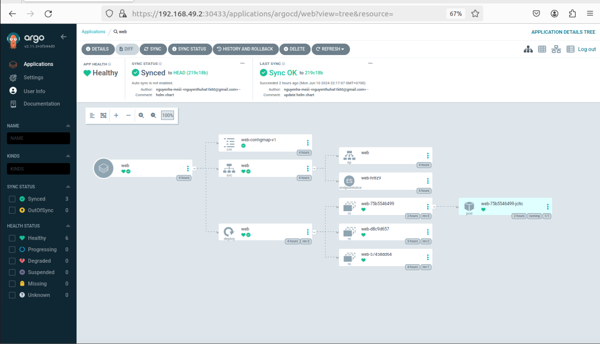

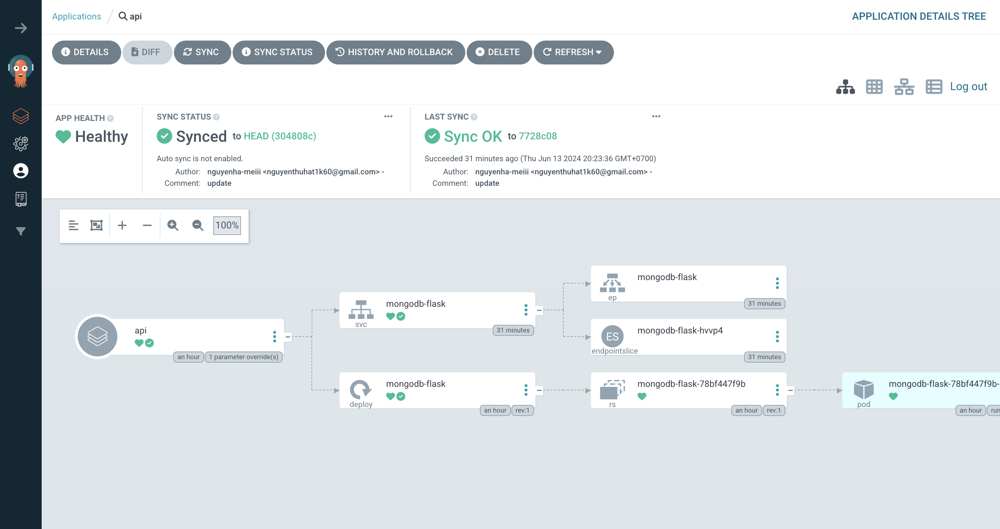

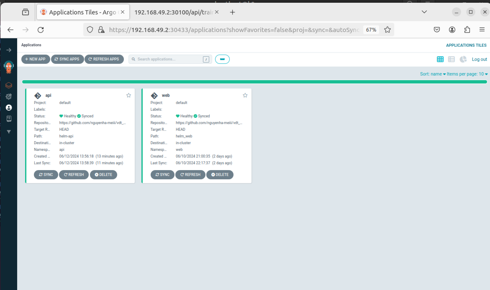


- Web có thể truy cập ở địa chỉ [http://192.168.49.2:30456/](http://192.168.49.2:30456/).
- API có thể truy cập ở địa chỉ [ http://192.168.49.2:30100/]( http://192.168.49.2:30100/).
- Ảnh màn hình trình duyệt:

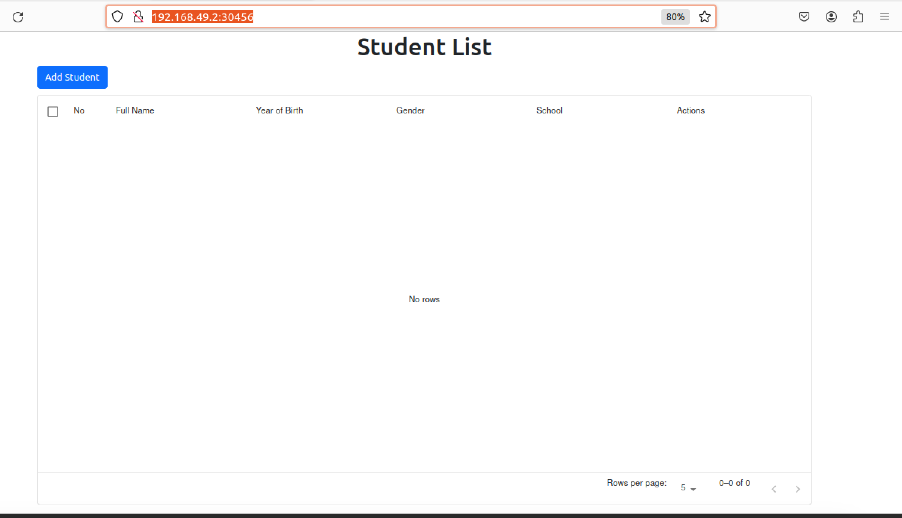

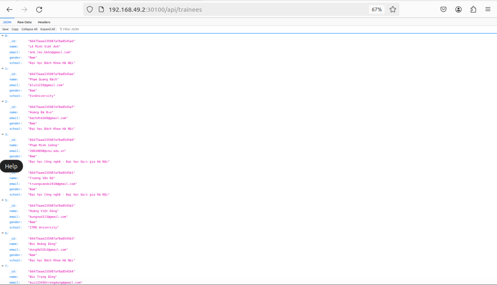

## 3. Continuous delivery 
File setup công cụ của 2 luồng CD:
- [web_cd.yaml](https://github.com/nguyenha-meiii/vdt_midterm_web/blob/main/.github/workflows/cd.yaml)
- [api_cd.yaml](https://github.com/nguyenha-meiii/vdt_midterm_api/blob/main/.github/workflows/cd.yaml)

Output log của 2 luồng CD:
- [web_cd.log](https://github.com/nguyenha-meiii/vdt_midterm_web/blob/main/.github/workflows/cd.log)
- [api_cd.log](https://github.com/nguyenha-meiii/vdt_midterm_api/blob/main/.github/workflows/cd.log)
- Ảnh chụp
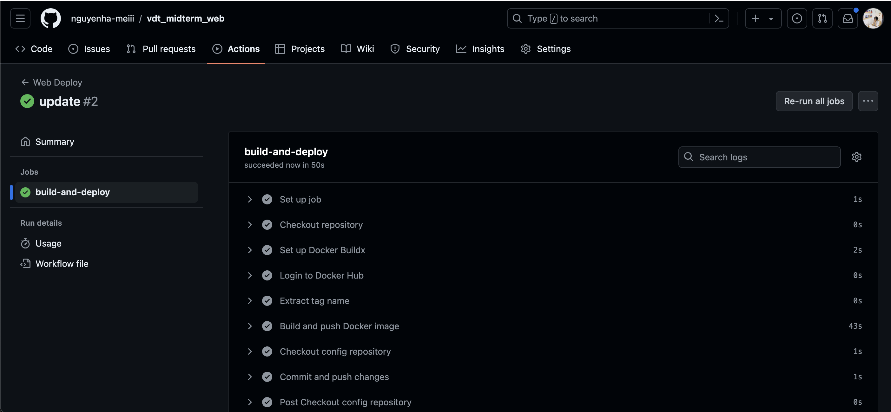
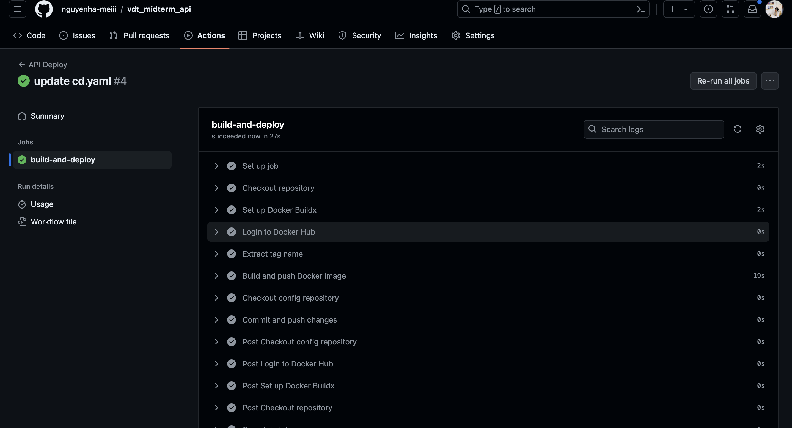


Hình ảnh diff khi argoCD phát hiện thay đổi ở config repo:

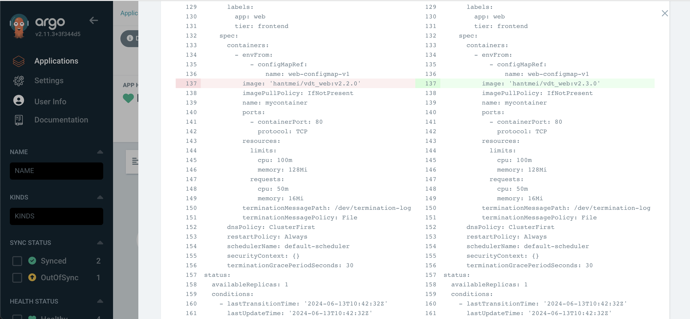

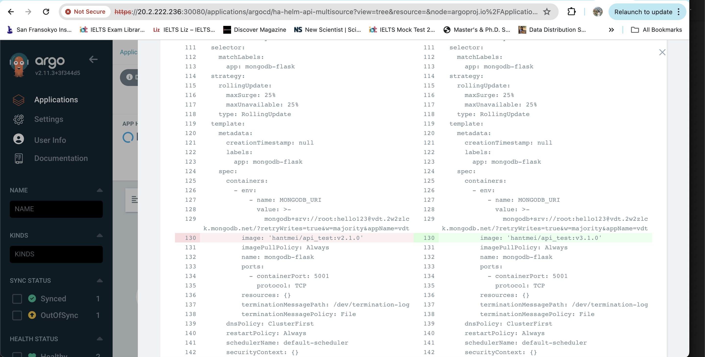

Danh sách event trong app
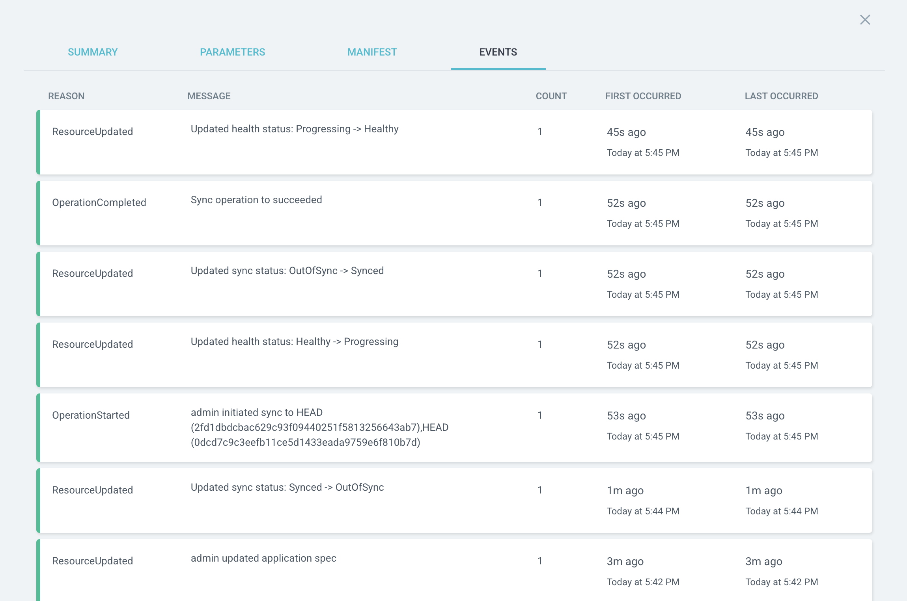


## 4. Monitoring

### Yêu cầu
- Expose metric của web service và api service ra 1 http path. 
- Triển khai Prometheus lên Kubernetes Cluster thông qua Prometheus Operator, phơi ra ngoài dưới dạng NodePort: 
- Expose Prometheus dưới dạng Nodeport
- Trong trường hợp sử dụng cụm lab của Viettel Cloud, tạo 1 load balancer với backend là NodePort Service của Prometheus, để expose Prometheus UI ra Public Internet 
- Sử dụng Service Monitor của Prometheus Operator để giám sát Web Deployment và API Deployment

### Set up Prometheus

```shell

helm repo add prometheus-community https://prometheus-community.github.io/helm-charts

helm install prometheus prometheus-community/prometheus

helm install prometheus-operator prometheus-community/kube-prometheus-stack

kubectl expose service prometheus-server --type=NodePort --target-port=9090 --name=prometheus-server-ext

minikube service prometheus-server-ext
```
- Kết quả:

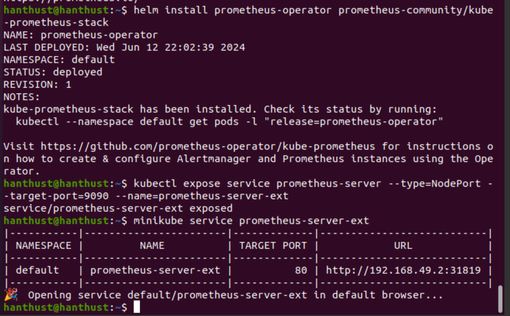

- Prometheus website được triển khia ở địa chỉ [http://192.168.49.2:31819](http://192.168.49.2:31819).

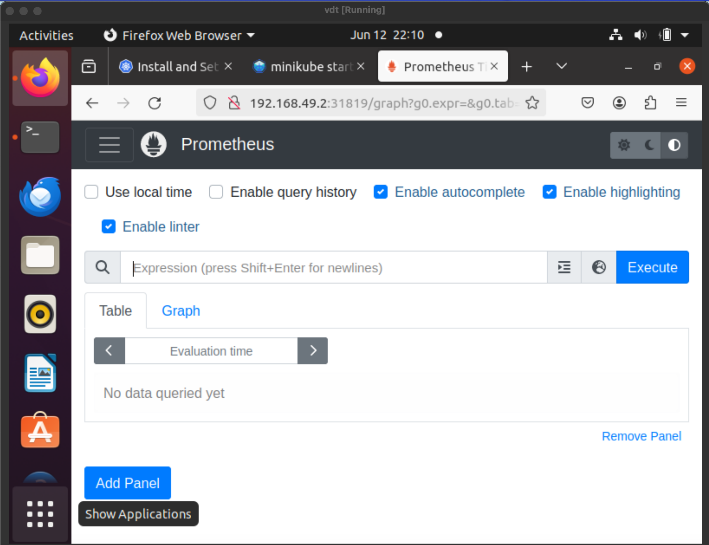

## 5. Logging
## 6. Security
### Yêu cầu 1: HAProxy Load balancer

- File HAproxy config ở [link](https://github.com/nguyenha-meiii/vdt2024/blob/main/HAProxy/haproxy.cfg).

The address to access the website will be:
- web: [https://192.168.227.48:4001/](https://192.168.227.48:4001/)
- api: [https://192.168.227.48:5002/](https://192.168.227.48:5002/) 

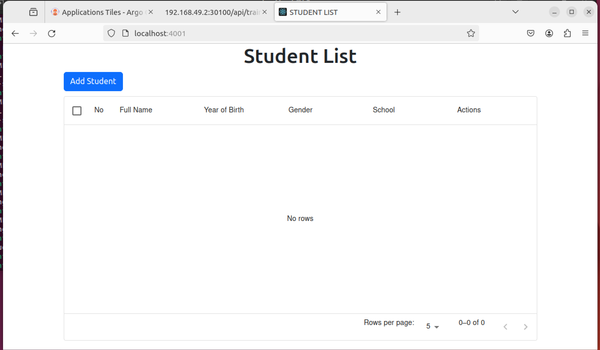

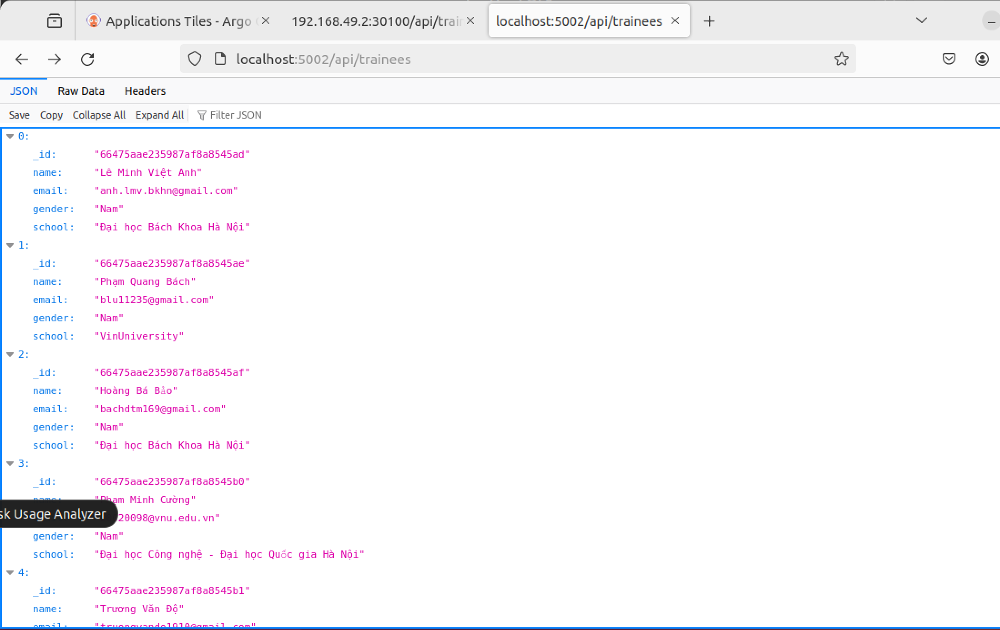
### Yêu cầu 2: Authentication

### Yêu cầu 3: Endpoint rate limitation

- Giải pháp: Sử dụng package Flask-Limiter. Đây là một extension của Flask giúp thực hiện rate limiting dễ dàng.

```shell
# Install package
pipx install flask-limiter
```

- Source code ở [link]().

- Khởi tạo Limiter với các thông số cấu hình:

```python
# Initialize Limiter
limiter = Limiter(
    key_func=get_remote_address,           # Use client IP address as key
    default_limits=["10 per minute"],      # Limit to 10 requests per minute
    storage_uri="memory://"                # Store limit data in memory
)

# Attach Limiter to the Flask app
limiter.init_app(app)                      # Apply rate limiting to the app
```
- Giải thích:
    - `Limiter` được khởi tạo với các thông số: key_func là get_remote_address (dùng để lấy địa chỉ IP của người dùng) và default_limits là ["10 per minute"] (giới hạn 10 yêu cầu mỗi phút).

    - Các route được trang bị decorator @limiter.limit("10 per minute") để áp đặt giới hạn. Ví dụ, route @app.route('/') có @limiter.limit("10 per minute") nghĩa là nó sẽ bị giới hạn 10 yêu cầu mỗi phút.

    ```python
    @app.route('/api/trainees', methods=['GET'])
    @limiter.limit("10 per minute")
    def get_trainees():

        # BEGIN

        # Connect to the database and retrieve the trainees collection

        # Fetch all trainees, projecting only specific fields and convert the ObjectId to string

        # Format the response as a JSON array and set the content type to application/json

        # Exception handling to catch and log any errors that occur while fetching trainees
        
        # END
    ```

    - Khi số yêu cầu vượt quá giới hạn (10 yêu cầu mỗi phút), Flask-Limiter sẽ tự động trả về mã trạng thái HTTP 429 (Too Many Requests). Kết quả khi test ở Postman
    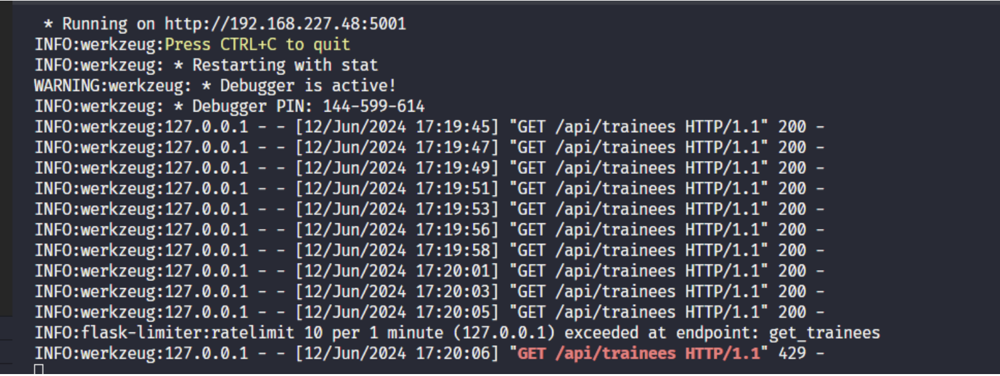

    - Theo như em tìm hiểu, mã 429 là mã mặc định của ứng dụng Flask trả về khi có "TOO_MANY_REQUESTS". Thông tin về các loại mã lỗi của ứng dụng flask ở [link](https://flask-api.github.io/flask-api/api-guide/status-codes/#client-error-4xx)

    - Em đã chuyển error code sang 409 bằng cách thêm các dòng lệnh sau:

        ```python
        # Custom error handler for rate limit exceeded.
        # Returns a JSON response with a 409 status code instead of the default 429.
        def rate_limit_exceeded(e):
            return jsonify({"error": "Too many requests"}), 409

        limiter = Limiter(
            key_func=get_remote_address,
            default_limits=["10 per minute"],
            storage_uri="memory://"
        )

        # Enable rate limit headers to be sent in responses.
        app.config['RATELIMIT_HEADERS_ENABLED'] = True

        # Register the custom error handler to handle rate limit errors.
        # When a rate limit error (HTTP 429) occurs, use the rate_limit_exceeded function.
        app.register_error_handler(429, rate_limit_exceeded)

        limiter.init_app(app)
        ```

    - Kết quả:
    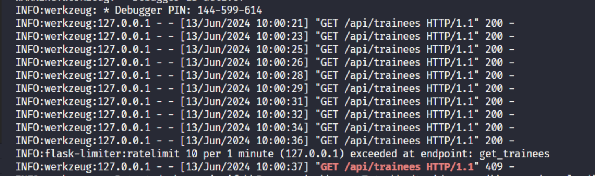


