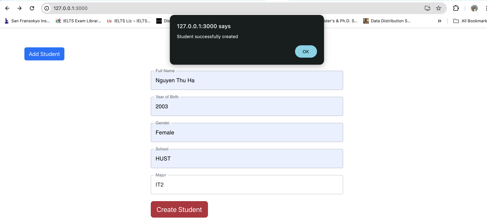
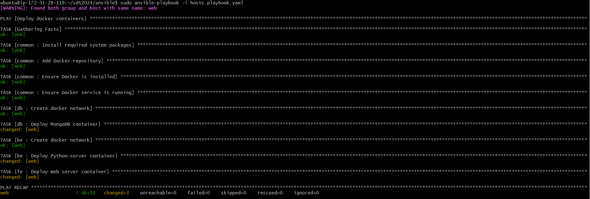

# Midterm Project <!-- omit in toc -->

## **Author: Nguyen Thu Ha**


## Table of Contents <!-- omit in toc -->

- [0. Build a 3-tier web application](#0-build-a-3-tier-web-application)
- [1. Containerization](#1-containerization)
- [2. Continuous Integration](#2-continuous-integration)
- [3. Automation](#3-automation)

## 0. Build a 3-tier web application
### Requirements
- Phát triển web application có các chức năng sau (0.5đ):
    - Hiển thị danh sách sinh viên tham gia chương trình VDT2024 dưới dạng bảng với các thông tin sau: Họ và tên, Giới tính, trường đang theo học. 
    - Cho phép xem chi tiết/thêm/xóa/cập nhật thông tin sinh viên.
- Thiết kế hệ thống với ba dịch vụ (1đ): 
    - web: Giao diện web, tuỳ chọn ngôn ngữ, framework.
    - api: RESTful API viết bằng ngôn ngữ lập trình tùy chọn, có đầy đủ các chức năng: list, get, create, update, delete.
    - db: Database SQL hoặc NoSQL lưu trữ thông tin sinh viên.
- Viết unit tests cho các chức năng APIs, mỗi API tối thiếu 1 testcase (0.5đ).
- Maintain source code của api và web ở 2 repo khác nhau, mỗi feature là 1 Pull Request (1đ). 


### Output

- View student list:
    
- Create student
    
- Edit student
    
- Delete student
    

- Unit test API (source code can be found in [here](https://github.com/nguyenha-meiii/vdt_midterm_api/blob/main/unit_test.py)):
  - Sử dụng thư viện unittest của python (mock testing)
  - To chạy unittest, sử dụng lệnh: 
    ```shell
    python -m unittest unit_test.py
    ```
    Result: 
   

- Maintain source code:
    - Repo của Web: [vdt_midterm_web](https://github.com/nguyenha-meiii/vdt_midterm_web)
    - Repo của API: [vdt_midterm_api](https://github.com/nguyenha-meiii/vdt_midterm_api)

## 1. Containerization

### Requirements
- Viết Dockerfile để ở từng repo để đóng gói các dịch vụ trên thành các container image (1đ)
- Yêu cầu image đảm bảo tối ưu thời gian build và kích thước chiếm dụng, khuyến khích sử dụng các thủ thuật build image đã được giới thiệu (layer-caching, optimized RUN instructions, multi-stage build, etc.) (1đ)


### Output

- Xây dựng docker-compose file để chạy nhiều container trong cùng một thời điểm với câu lệnh dưới đây:
    - Build command:
        ```shell
        docker-compose up -d
        ```

    - Kết quả:
     

### Web
- Dockerfile:
  - [web](https://github.com/nguyenha-meiii/vdt2024/blob/main/web/Dockerfile)
  - Build command:
    ```shell
    docker build -t web . | tee web_build.log
    ```
  - Kết quả:
  

  - Docker history command:
     ```shell
    docker history web | tee web_history.log
    ```
  - Kết quả: [web_history](https://github.com/nguyenha-meiii/vdt2024/blob/main/web/web_history.log)


### API
-Dockerfile:
  - [api](https://github.com/nguyenha-meiii/vdt2024/blob/main/API/Dockerfile)
  - Build command:
    ```shell
    docker build -t api . | tee api_build.log
    ```
  - Kết quả: 
  

  - Docker history command:
     ```shell
    docker history api | tee api_history.log
    ```
  - Kết quả: [api_history](https://github.com/nguyenha-meiii/vdt2024/blob/main/API/api_history.log)

### Optimization
- Sử dụng multi-stage build và layer-caching để tối ưu hoá thời gian build và kích thước chiếm dụng. Kết quả cho thấy thời gian chạy đã giảm đáng kể:
    - Docker layer caching:
    
    Ví dụ: Dockerfile của front-end + Nginx server:
    ```yml
    FROM node:alpine AS build
    WORKDIR /app
    COPY package*.json ./
    RUN npm install
    COPY . .
    RUN npm run build

    FROM nginx:1.22.0-alpine
    COPY ./nginx.conf /etc/nginx/conf.d/default.conf
    COPY --from=build /app/build /usr/share/nginx/html
    EXPOSE 80
    CMD ["nginx", "-g", "daemon off;"]
    ```

    Kết quả: 
    
    

    - Multi-stage build: Bằng cách sử dụng xây dựng đa giai đoạn (multi-stage build), chúng ta chỉ cần một Dockerfile để tối ưu hóa kích thước ảnh. Ảnh cuối cùng chỉ chứa những gì cần thiết để chạy ứng dụng, giảm thiểu kích thước so với việc sử dụng hai Dockerfile riêng biệt.

     ```yml
      COPY --from=build /app/build /usr/share/nginx/html
    ```

## 2. Continuous Integration
### Requirements
- Tự động chạy unit test khi tạo PR vào branch main (0.5đ)
- Tự động chạy unit test khi push commit lên một branch (0.5đ)
### Output
- File set up công cụ CI: [ci.yaml](https://github.com/nguyenha-meiii/vdt2024/blob/main/.github/workflows/ci.yaml)

- Demo CI:

- Output log: [ci.log](https://github.com/nguyenha-meiii/vdt2024/blob/main/.github/workflows/ci.log)


## 3. Automation

### Requirements
- Viết ansible playbooks để triển khai các image docker của các dịch vụ web, api, db, mỗi dịch vụ 1 role (0.5đ).
- Trong từng role cho phép tuỳ biến cấu hình của các dịch vụ thông qua các variables (0.5đ).
- Cho phép triển khai các dịch vụ trên các host khác nhau thông qua file inventory (0.5đ).

### Directory layout

- Source code: [ansible](https://github.com/nguyenha-meiii/vdt2024/tree/main/ansible)
- Source code architecture:
  ```bash
  ansible
  . 
  ├── roles
  │   ├── be
  │   │   ├── defaults
  │   │   |   └── main.yaml
  │   │   ├── tasks
  │   │   |   └── main.yaml
  │   ├── common
  │   │   └── tasks
  │   │       └── main.yaml
  │   ├── db
  │   │   ├── defaults
  │   │   |   └── main.yaml
  │   │   ├── tasks
  │   │   |   └── main.yaml
  │   └── fe
  │       ├── defaults
  │       |   └── main.yaml
  │       └── tasks
  │           └── main.yaml
  │── playbook.yaml
  │
  │── clientkey.pem
  │
  │── hosts
  ```

Run ansible playbook to deploy system by command:
```shell
$ ansible-playbook -i hosts playbook.yaml
```

- Ban đầu, em có thử xây dựng ansible ở hệ điều hành Macos và đã gặp lỗi trong bước cài đặt docker ở role common với home brew.
  - Kết quả: 
  

  - Chi tiết lỗi ở link sau, em đã tham khảo điều chỉnh code nhưng không sửa được lỗi: 
  [Brew_cask_installation](https://github.com/ansible-collections/community.general/issues/1524)

- Sau đó, em đã chuyển qua máy ảo ubuntu để chạy lại và nhận được kết quả như sau:
    - Kết quả: 
    
    
    - Docker container: 
    


## 4. Research
- Tìm hiểu về công cụ giám sát hệ thống Prometheus, khả năng tích hợp với Grafana và minh hoạ trong việc giám sát OpenStack cloud platform.
- Report: [Research](https://github.com/nguyenha-meiii/vdt2024/blob/main/research/VDT_midterm_research.pdf)
- Tài liệu cài đặt và cấu hình các thành phần trong Prometheus: [Document](https://github.com/hocchudong/ghichep-prometheus-v2/tree/master/docs)