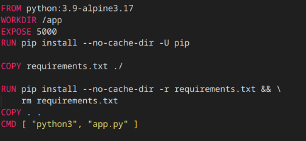
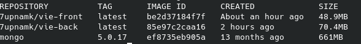

# Midterm assignment for VDT Cloud 2024
## I. Web development
Display a list of students in VDT2024 in a table with the following information: Full name, Gender, and School they are attending.

**Source code:**

Allow viewing details, adding, deleting, and updating student information.

- web: ReactJs <https://github.com/smugikity/vie-front> 
- api: Flask <https://github.com/smugikity/vie-back> 
- db: MongoDB

Web application architecture:

**Demo web application:**

## II. DevOps tools implementations
### 1. Containerization
Requirements:

-   Write a Dockerfile for each repository to package the services into container images.
-   The image should ensure optimized build time and minimal disk space usage, utilizing recommended image building techniques (layer-caching, optimized RUN instructions, multi-stage build, etc.)

Output:
**Dockerfile backend:**

**Dockerfile frontend:**

**Docker compose file:**

**Docker history information of each image:**

` `- Docker images:

` `- Docker history information:

### 2. Continuous Integration
Requirements:

-   Automatically run unit test when creating a PR on the main branch.
-   Automatically run unit tests when pushing a commit to a branch.

Output:
**Workflow github actions:**

**Workflow log:**

### 3. Automation
Requirements:
- Write ansible playbooks to deploy docker images of web services, api, db, each role for each service.
- In each role, it is possible to customize the configuration of services through variables.
- Allows deploying services on different hosts through the inventory file.

Ouput:
**Source code of Ansible:** <https://github.com/smugikity/Viettel-Digital-Talent-2024/tree/main/PhamManhTuan/ansible> 

**Deployment:**

## III. Article research
**Article:** <https://github.com/smugikity/Viettel-Digital-Talent-2024/blob/main/PhamManhTuan/article.pdf> 
