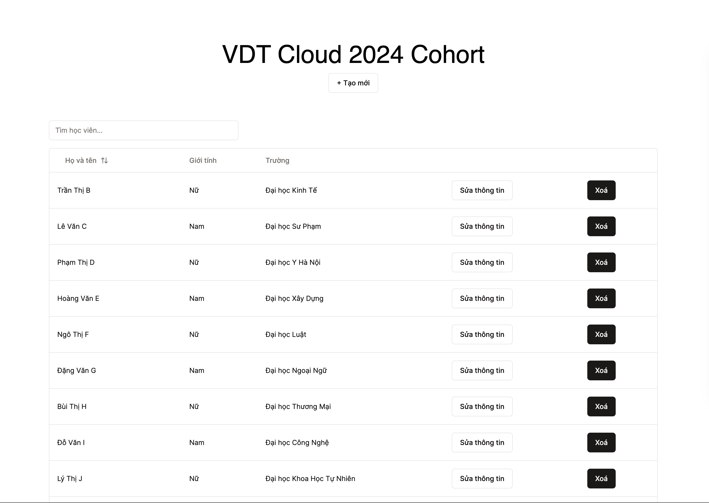
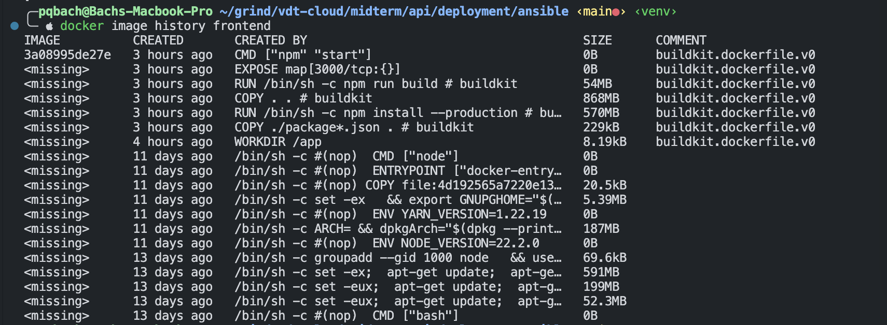
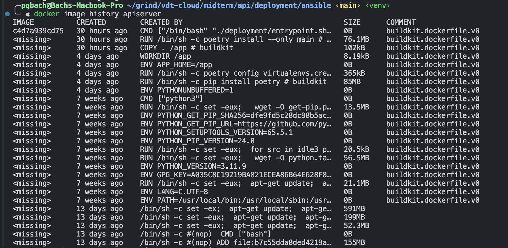
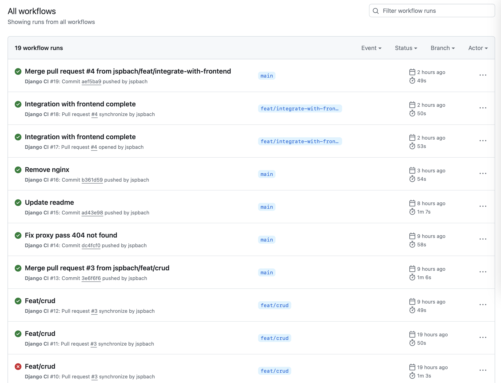

# Nộp bài giữa kì

## R1

- Frontend: https://github.com/jspbach/vdt-frontend
- Backend & Database service: https://github.com/jspbach/vdt-backend
- Test cases for API backend: https://github.com/jspbach/vdt-backend/blob/main/apiserver/members/tests.py

Website accessible from `http://localhost:3000`:

## R2

- Frontend dockerfile: https://github.com/jspbach/vdt-frontend/blob/main/deployment/Dockerfile

- Backend dockerfile: https://github.com/jspbach/vdt-backend/blob/main/deployment/Dockerfile

- Docker compose file for all services: https://github.com/jspbach/vdt-backend/blob/main/docker-compose.yaml
- [BONUS] Ansible playbook already includes building steps for each service. Link in R4.

## R3

- CI workflow: https://github.com/jspbach/vdt-backend/blob/main/.github/workflows/apiserver.yml

## R4

- Ansible playbooks: https://github.com/jspbach/vdt-playbooks

## R5: Research

