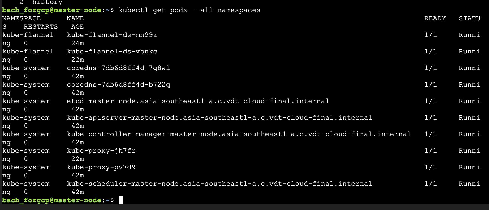
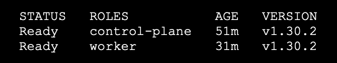

# Problem 1: Deploy a Kubernetes cluster with a master node and a worker node

Chọn đề bài: **Triển khai được Kubernetes thông qua công cụ kubeadm hoặc kubespray lên 1 master node VM + 1 worker node VM: 1 điểm**

## Network & Instances

K8s cluster được triển khai trên GCP Compute Engine với configuration như sau:

- Master node: 1 vCPU, 2GB RAM
- Worker node: 2 vCPU, 4GB RAM

Hai VM được đặt trong subnet `10.0.0.0/29` của VPC và không có external IP.

## Triển khai cluster bằng kubeadm

1. Cài đặt containerd  Debian trên cả hai node dùng tài liệu của [Docker Engine](https://github.com/containerd/containerd/blob/main/docs/man/containerd-config.toml.5.md). Tạo config.yaml và edit `systemdCgroup = true` dưới `[plugins."io.containerd.grpc.v1.cri".containerd.runtimes.runc.options]`
2. Trên cả hai node, cài đặt `kubeadm, kubelet, kubectl` theo [hướng dẫn](https://kubernetes.io/docs/setup/production-environment/tools/kubeadm/install-kubeadm/)
3. Trên master node, chạy `kubeadm init --pod-network-cidr=10.244.0.0/16`. Subnet này không overlap với subnet của instance nên sẽ không xảy ra xung đột IP. Làm theo hướng dẫn của kubeadm để `chown` kube config.
4. Cài đặt Flannel bằng `kubectl apply -f https://raw.githubusercontent.com/coreos/flannel/master/Documentation/kube-flannel.yml`
5. Verify Flannel và CoreDNS đang chạy bằng `kubectl get pods --all-namespaces`:

6. Trên worker node, paste lệnh join với token được cho sau khi chạy `kubeadm init.`
7. Sau khi join thành công, check trên master node bằng `kubectl get nodes`:

(tên node được redacted).
