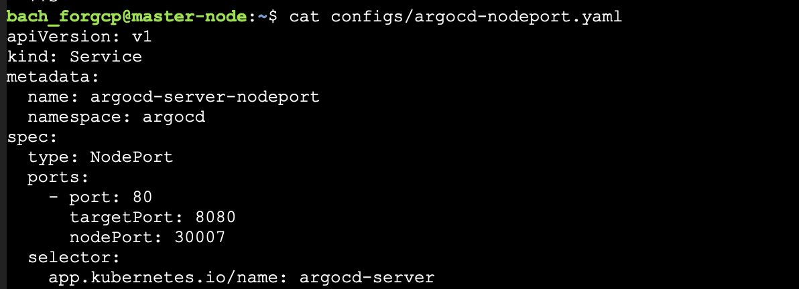
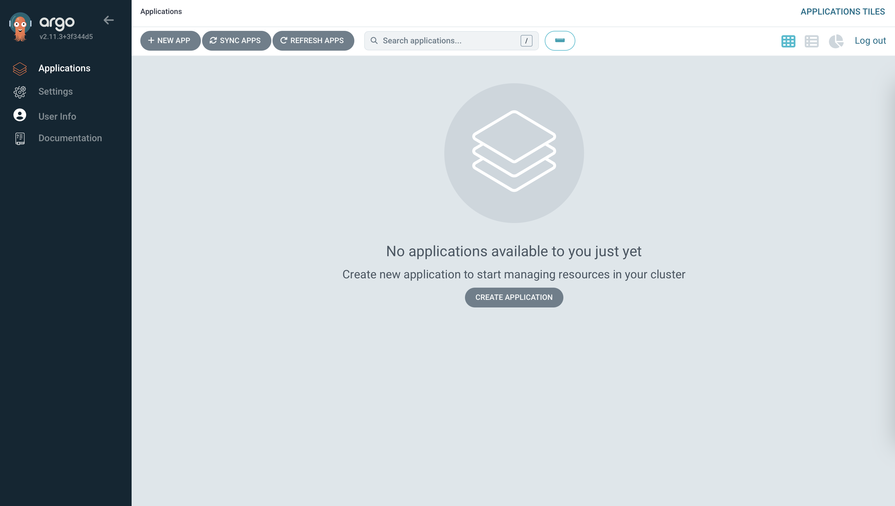
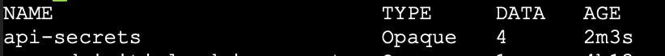

# Problem 2

## Yêu cầu 1

1. Trên cơ sở bài 1, cài đặt ArgoCD dùng lệnh `kubectl apply -n argocd -f https://raw.githubusercontent.com/argoproj/argo-cd/stable/manifests/install.yaml` trên master node.
2. Viết manifest cho NodePort mới của ArgoCD:



3. Configure firewall của VPC để allow traffic từ `0.0.0.0/0` (internet) đến port 30007 của instance.


4. Lấy default password trong secrets và enter dashboard.

```bash
kubectl -n argocd get secret argocd-initial-admin-secret -o jsonpath="{.data.password}" | base64 -d
```



## Yêu cầu 2

### Tạo secrets



```bash
kubectl create secret generic api-secrets \
  --from-literal=db_user=$(echo -n $DB_USER | base64) \
  --from-literal=db_password=$(echo -n $DB_PASSWORD | base64) \
  --from-literal=secret_key=$(echo -n $SECRET_KEY | base64) \
  --from-literal=db_prod=$(echo -n $DB_PROD | base64)
```

### Helm chart

API server: https://github.com/jspbach/vdt-backend/blob/main/deployment/helm/api
