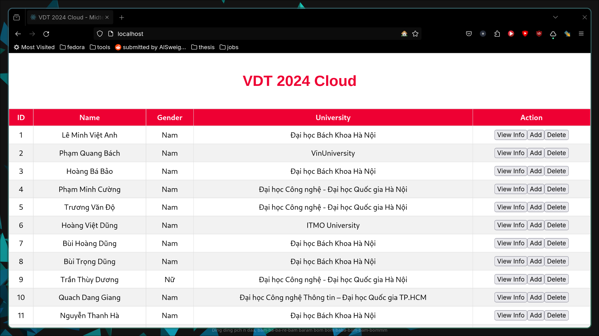
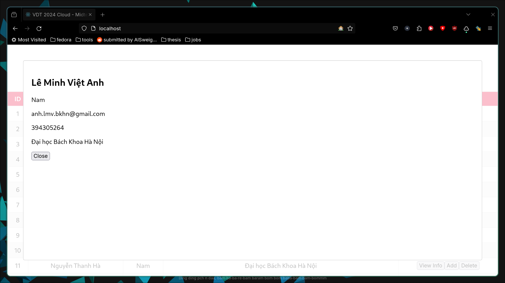
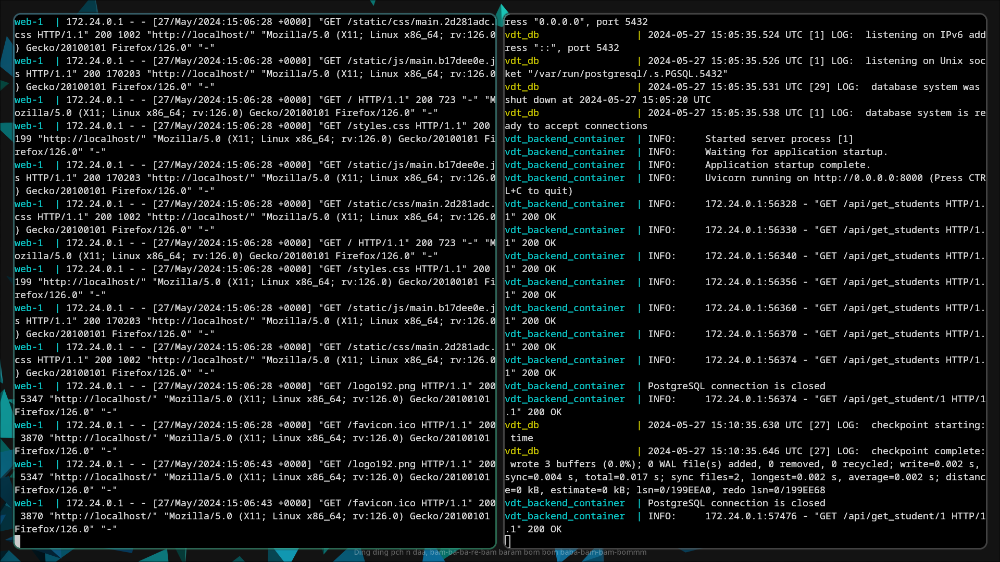
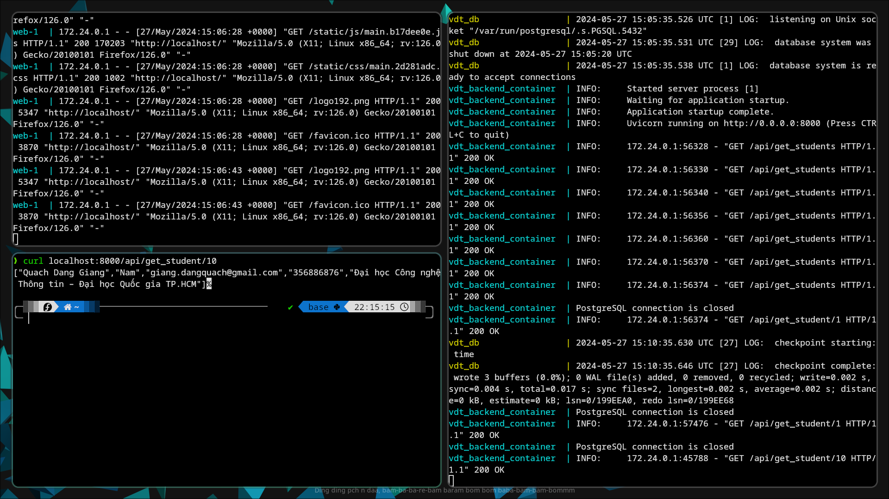
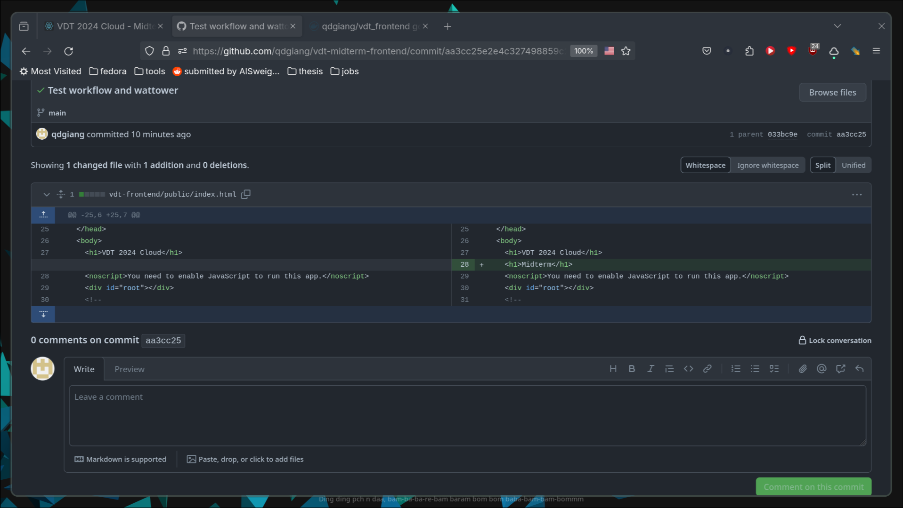
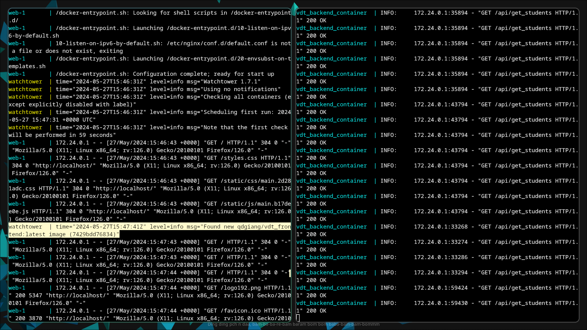
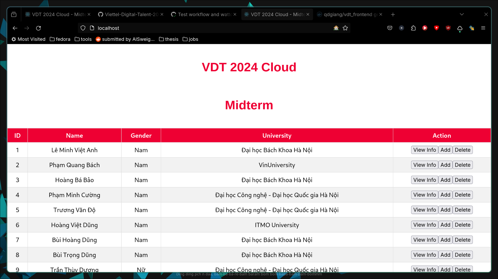

# Project

Frontend is map to localhost:80, which we can access to see the frontend and the connection to backend







Backend, which is based on the FastAPI library, is mapped to localhost:8000, which we can directly access in browser, or via `curl` to quickly check if our implementation is correct. Furthermore, because we setup the docker-compose.yml of both frontend and backend repository to use the same external network `vdt_network`, which was created before hand using the command
```
docker network create -d bridge vdt_network
```

Both services can talk to each other using the service names defined in the compose file, instead of through localhost if run outside container.



Database is based on Postgres image, with neccesary environment variables provided based on the Dockerhub documentation in order to initialise our target database and table. We also mount the `/var/lib/postgresql/data` folder, so that the container can retain the data between multiple runs.

Using Github Actions, we are able to automatically build and push a new Docker image to Dockerhub if we detect any changes happend to a designated branch, which in this case is the branch `main`

For example, when we add a minor commit, adding another H1 header to the frontend like this



The GitHub Actions will automatically run the workflow located at `.github/workflows`, and thus will build and then push the new frontend image `qdgiang/vdt_frontend` to Dockerhub on our behalf. By using GitHub secrets, out login credentials will not be revealed after running our workflow.

Finally, using Watchtower, we are able to automatically detact the latest change in the Docker image. 



To be more specific, the frontend is based on our own image `qdgiang/vdt_frontend`, which the Watchtower container will try to keep track of. When it detects a new version of `qdgiang/vdt_frontend` on Dockerhub, which happens as a result of our previous Github Actions workflow run, it will pull the latest image, resulting in a new frontend UI as below



# Building commands and history

Frontend code: https://github.com/qdgiang/vdt-midterm-frontend

```
FROM node:14-alpine AS build
WORKDIR /app
COPY package*.json ./
RUN npm install
COPY . .
RUN npm run build

FROM nginx:1.19.0-alpine
COPY --from=build /app/build /usr/share/nginx/html
RUN rm /etc/nginx/conf.d/default.conf
COPY nginx.conf /etc/nginx/conf.d
EXPOSE 80
CMD ["nginx", "-g", "daemon off;"]
```

```
❯ docker compose build
WARN[0000] /home/giang/Downloads/vdt-midterm-frontend/docker-compose.yml: `version` is obsolete 
[+] Building 29.9s (16/16) FINISHED                                  docker:default
 => [web internal] load build definition from Dockerfile                       0.0s
 => => transferring dockerfile: 339B                                           0.0s
 => [web internal] load metadata for docker.io/library/nginx:1.19.0-alpine     7.6s
 => [web internal] load metadata for docker.io/library/node:14-alpine          7.5s
 => [web internal] load .dockerignore                                          0.0s
 => => transferring context: 2B                                                0.0s
 => [web internal] load build context                                          2.1s
 => => transferring context: 3.43MB                                            2.0s
 => [web build 1/6] FROM docker.io/library/node:14-alpine@sha256:434215b487a3  0.0s
 => CACHED [web stage-1 1/4] FROM docker.io/library/nginx:1.19.0-alpine@sha25  0.0s
 => CACHED [web build 2/6] WORKDIR /app                                        0.0s
 => CACHED [web build 3/6] COPY package*.json ./                               0.0s
 => CACHED [web build 4/6] RUN npm install                                     0.0s
 => [web build 5/6] COPY . .                                                  10.2s
 => [web build 6/6] RUN npm run build                                          8.8s
 => [web stage-1 2/4] COPY --from=build /app/build /usr/share/nginx/html       0.0s 
 => [web stage-1 3/4] RUN rm /etc/nginx/conf.d/default.conf                    0.2s 
 => [web stage-1 4/4] COPY nginx.conf /etc/nginx/conf.d                        0.1s 
 => [web] exporting to image                                                   0.0s 
 => => exporting layers                                                        0.0s 
 => => writing image sha256:cacd62c811fdc7304b7db89589243be2d7c7d316e8ee2cf3d  0.0s
 => => naming to docker.io/qdgiang/vdt_frontend  
 ```

```
❯ docker image history qdgiang/vdt_frontend
IMAGE          CREATED         CREATED BY                                      SIZE      COMMENT
cacd62c811fd   5 minutes ago   CMD ["nginx" "-g" "daemon off;"]                0B        buildkit.dockerfile.v0
<missing>      5 minutes ago   EXPOSE map[80/tcp:{}]                           0B        buildkit.dockerfile.v0
<missing>      5 minutes ago   COPY nginx.conf /etc/nginx/conf.d # buildkit    170B      buildkit.dockerfile.v0
<missing>      5 minutes ago   RUN /bin/sh -c rm /etc/nginx/conf.d/default.…   0B        buildkit.dockerfile.v0
<missing>      5 minutes ago   COPY /app/build /usr/share/nginx/html # buil…   678kB     buildkit.dockerfile.v0
<missing>      3 years ago     /bin/sh -c #(nop)  CMD ["nginx" "-g" "daemon…   0B        
<missing>      3 years ago     /bin/sh -c #(nop)  STOPSIGNAL SIGTERM           0B        
<missing>      3 years ago     /bin/sh -c #(nop)  EXPOSE 80                    0B        
<missing>      3 years ago     /bin/sh -c #(nop)  ENTRYPOINT ["/docker-entr…   0B        
<missing>      3 years ago     /bin/sh -c #(nop) COPY file:cc7d4f1d03426ebd…   1.04kB    
<missing>      3 years ago     /bin/sh -c #(nop) COPY file:b96f664d94ca7bbe…   1.96kB    
<missing>      3 years ago     /bin/sh -c #(nop) COPY file:d68fadb480cbc781…   1.09kB    
<missing>      3 years ago     /bin/sh -c set -x     && addgroup -g 101 -S …   15.6MB    
<missing>      3 years ago     /bin/sh -c #(nop)  ENV PKG_RELEASE=1            0B        
<missing>      3 years ago     /bin/sh -c #(nop)  ENV NJS_VERSION=0.4.1        0B        
<missing>      3 years ago     /bin/sh -c #(nop)  ENV NGINX_VERSION=1.19.0     0B        
<missing>      4 years ago     /bin/sh -c #(nop)  LABEL maintainer=NGINX Do…   0B        
<missing>      4 years ago     /bin/sh -c #(nop)  CMD ["/bin/sh"]              0B        
<missing>      4 years ago     /bin/sh -c #(nop) ADD file:b91adb67b670d3a6f…   5.61MB  
```


Backend code: https://github.com/qdgiang/vdt-midterm-backend

```
FROM python:3.10-slim
WORKDIR /backend
COPY requirements.txt .
RUN pip install --no-cache-dir -r requirements.txt
COPY main.py .
CMD [ "python","main.py" ]
```


```
❯ docker compose build
[+] Building 3.7s (10/10) FINISHED                                   docker:default
 => [backend internal] load build definition from Dockerfile                   0.0s
 => => transferring dockerfile: 194B                                           0.0s
 => [backend internal] load metadata for docker.io/library/python:3.10-slim    2.7s
 => [backend internal] load .dockerignore                                      0.0s
 => => transferring context: 2B                                                0.0s
 => [backend 1/5] FROM docker.io/library/python:3.10-slim@sha256:31b1e4b1c4a1  0.0s
 => [backend internal] load build context                                      1.0s
 => => transferring context: 2.15kB                                            1.0s
 => CACHED [backend 2/5] WORKDIR /backend                                      0.0s
 => CACHED [backend 3/5] COPY requirements.txt .                               0.0s
 => CACHED [backend 4/5] RUN pip install --no-cache-dir -r requirements.txt    0.0s
 => CACHED [backend 5/5] COPY main.py .                                        0.0s
 => [backend] exporting to image                                               0.0s
 => => exporting layers                                                        0.0s
 => => writing image sha256:0e7b1031cd151c851a9906ea8004b5aaef649f0e04db2c48b  0.0s
 => => naming to docker.io/qdgiang/vdt-backend   
 ```

```
❯ docker image history qdgiang/vdt-backend
IMAGE          CREATED        CREATED BY                                      SIZE      COMMENT
0e7b1031cd15   11 hours ago   CMD ["python" "main.py"]                        0B        buildkit.dockerfile.v0
<missing>      11 hours ago   COPY main.py . # buildkit                       2.05kB    buildkit.dockerfile.v0
<missing>      22 hours ago   RUN /bin/sh -c pip install --no-cache-dir -r…   64.3MB    buildkit.dockerfile.v0
<missing>      22 hours ago   COPY requirements.txt . # buildkit              23B       buildkit.dockerfile.v0
<missing>      22 hours ago   WORKDIR /backend                                0B        buildkit.dockerfile.v0
<missing>      2 months ago   CMD ["python3"]                                 0B        buildkit.dockerfile.v0
<missing>      2 months ago   RUN /bin/sh -c set -eux;   savedAptMark="$(a…   12.2MB    buildkit.dockerfile.v0
<missing>      2 months ago   ENV PYTHON_GET_PIP_SHA256=dfe9fd5c28dc98b5ac…   0B        buildkit.dockerfile.v0
<missing>      2 months ago   ENV PYTHON_GET_PIP_URL=https://github.com/py…   0B        buildkit.dockerfile.v0
<missing>      2 months ago   ENV PYTHON_SETUPTOOLS_VERSION=65.5.1            0B        buildkit.dockerfile.v0
<missing>      2 months ago   ENV PYTHON_PIP_VERSION=23.0.1                   0B        buildkit.dockerfile.v0
<missing>      2 months ago   RUN /bin/sh -c set -eux;  for src in idle3 p…   32B       buildkit.dockerfile.v0
<missing>      2 months ago   RUN /bin/sh -c set -eux;   savedAptMark="$(a…   31.9MB    buildkit.dockerfile.v0
<missing>      2 months ago   ENV PYTHON_VERSION=3.10.14                      0B        buildkit.dockerfile.v0
<missing>      2 months ago   ENV GPG_KEY=A035C8C19219BA821ECEA86B64E628F8…   0B        buildkit.dockerfile.v0
<missing>      2 months ago   RUN /bin/sh -c set -eux;  apt-get update;  a…   9.24MB    buildkit.dockerfile.v0
<missing>      2 months ago   ENV LANG=C.UTF-8                                0B        buildkit.dockerfile.v0
<missing>      2 months ago   ENV PATH=/usr/local/bin:/usr/local/sbin:/usr…   0B        buildkit.dockerfile.v0
<missing>      2 weeks ago    /bin/sh -c #(nop)  CMD ["bash"]                 0B        
<missing>      2 weeks ago    /bin/sh -c #(nop) ADD file:5aaace706aa00ff97…   74.8MB    
```


# Docker
## What is Docker

Docker is an open-source platform that automates the deployment, scaling, and management of applications. It uses containerization technology to package an application along with its runtime environment into a container, which can then be run on any system that supports Docker - "Build once, run anywhere".

## What is the difference between container and virtual environment

A container and a virtual machine (VM) are both methods to isolate an application and its dependencies into a self-contained unit that can run anywhere. However, they work at different levels and provide different degrees of isolation.

### Container

A container packages an application along with its runtime environment. This includes the application's code, runtime, system tools, libraries, and settings. **Containers share the host system's OS kernel and do not require a full OS per application**, making them lightweight and fast.

Key features of containers:

- Share the host system's OS kernel
- Start up quickly
- Use less memory

### Virtual Machine:

A VM emulates a complete computer system, with a full guest operating system, along with the associated overhead of the binaries and libraries of the guest OS. **Each VM runs not just a full copy of an operating system, but a virtual copy of all the hardware that the operating system needs to run**.

Key features of virtual machines:

- Run a complete OS stack, including the kernel
- Provide strong isolation
- Use more system resources
- Take longer to start up

In summary, while both containers and VMs provide isolation, containers are lighter weight and more portable, while VMs are more powerful and provide stronger isolation.

Note: As a direct rsult of containers having a direct access to your own Operating Systems kernel and resources, the resource usage overhead of using containers is **minimized**, and as Docker is using Linux kernels, Mac and Windows can't run it without a few hoops and each have their own solutions on how to run Docker. For example, in Windows, Docker will run based on Windows Subsystem for Linux (WSL)

## Some useful Docker commands
`docker image prune` removes dangling images. Dangling images are images that do not have a name and are not used

`docker container prune` removes dangling/stopped container

`docker system prune` removes almost everything

`docker run -[FLAG] [IMAGE] [COMMAND TO RUN INSIDE CONTAINER]`
- `-t` tty
- `-i` interactive
- `-d` detached
- `--name [NAME]` set container name as `[NAME]`
- `--rm` ensures that there are no garbage containers left behind. → `docker start` cannot start container after it has exited.

Some notable differences between `docker run` and `docker start`:
1. Run: create a new container of an image, and execute the container. You can create N clones of the same image. The command is: `docker run IMAGE_ID` **and not** `docker run CONTAINER_ID`
2. Start: Launch a container previously stopped. For example, if you had stopped a database with the command `docker stop CONTAINER_ID`, you can relaunch the same container with the command `docker start CONTAINER_ID`, and the data and settings will be the same.

We can then exec into a running container `docker exec -it [CONTAINER_NAME] /bin/sh`, for example to debug an application while it's running inside the container.

And finally we want to stop a container, we have 2 choices between `stop` and `kill`
1. Stop: When you issue a `docker stop` command a hardware signal is sent to the process inside of that container. In the case of docker stop we send a **SIGTERM** message which is short for terminate signal. It's a message that's going to be received by the process telling it essentially to shut down on its own time.

**SIGTERM** is used any time that you want to stop a process inside of your container and shut the container down, and you want to give that process inside there a little bit of time to shut itself down and do a little bit of clean up.

2. Kill: the `docker kill` command issue is a **SIGKILL** or kills signal to the primary running process inside the container, so kill it essentially means you have to shut down right now and you do not get to do any additional work. 

So ideally we always stop a container with the docker stop command in order to get the running process inside of it a little bit of time to shut itself down, otherwise if it feels like the container has locked up and it's not responding to the docker stop command then we could issue docker kill instead.

These are simple commands that interact directly with containers itself. The Docker Engine CLI also provides us with many other tools such as `network`, `volume`, `image`... in order to deal with a large variety of tasks related to running container according to our specification (running inside a pre-defined network, mounting volume for subsequent runs, running based on different versions of images)
