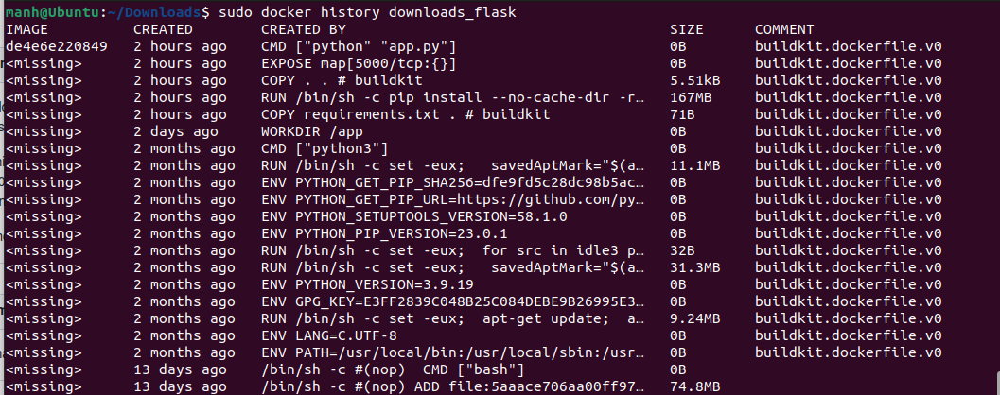

## Project giữa kỳ Viettel Digital Talent 2024
### Đỗ Dương Mạnh

### Phát triển một 3-tier web application đơn giản 
Hiển thị danh sách sinh viên tham gia chương trình VDT2024 dưới dạng bảng với các thông tin sau: Họ và tên, Giới tính, trường đang theo học. 

Cho phép xem chi tiết/thêm/xóa/cập nhật thông tin sinh viên.

- Thêm sinh viên


- Xem chi tiết sinh viên


- Cập nhật thông tin sinh viên


- Xóa sinh viên


- Kết quả unit test cho các chức năng API: 

 

# Mã nguồn web service: [web](https://github.com/Maybenex1ime/VDT-React-Frontend)
# Mã nguồn api service: [api](https://github.com/Maybenex1ime/VDT-Flask-Backend)
# Mã nguồn test api service: [test_api](https://github.com/Maybenex1ime/VDT-Flask-Backend/blob/main/simp_3tier_appw/api/tests.py)

### Triển khai web application sử dụng các DevOps tools & practices

#### 1. Containerization 
 - Dockerfile cho từng dịch vụ: 
- [Web](https://github.com/Maybenex1ime/VDT_Midterm/blob/main/frontend/Dockerfile) 
    ```Dockerfile
    FROM node:18.2.0-alpine

    # Set the working directory inside the container
    WORKDIR /app

    # Copy package.json and package-lock.json files separately to utilize layer caching
    COPY package.json package-lock.json ./

    RUN npm install

    # Copy the entire application code to the container
    COPY . .

    # Build the application
    RUN npm run build

    EXPOSE 3000

    # Specify the default command to run the application
    CMD ["npm", "start"]
    ```
- [API](https://github.com/Maybenex1ime/VDT_Midterm/blob/main/api/Dockerfile)

    ```Dockerfile
   # Sử dụng image Python chính thức
    FROM python:3.9-slim

    WORKDIR /app

    COPY requirements.txt .

    RUN pip install --no-cache-dir -r requirements.txt

    COPY . .

    EXPOSE 5000

    CMD ["python", "app.py"]
    ```
- [Docker-compose](https://github.com/Maybenex1ime/VDT_Midterm/blob/main/docker-compose.yml)

    ```Dockerfile
    version: '3.8'
    services:
      react:
      build: frontend
      container_name: web
      hostname: react
      restart: unless-stopped
      ports:
        - "3000:3000"
      links:
        - flask

    flask:
      build: api
      container_name: flask
      restart: unless-stopped
      ports:
        - "5000:5000"
      environment:
        - FLASK_ENV=development
        - FLASK_APP=app.py
        - DB_URI=sqlite:///data/sqlite.db
      depends_on:
        - sqlite3

    sqlite3:
      image: keinos/sqlite3:latest
      container_name: data
      volumes:
        - ./data:/data
    ```
- Output câu lệnh history image web service và api service

    

    

#### 2. Continuous Integration
- Tự động chạy unit test khi tạo Pull request vào nhánh main
- Tự động chạy unit test khi push commit lên một nhánh
 - File setup công cụ CI: [ci](https://github.com/Maybenex1ime/VDT_Midterm/blob/main/.github/workflows/cicd.yml)

    ```yml
    name: CI/CD Pipeline

    on:
      push: # Trigger on push events
        branches:
        - "*" # All branches
      pull_request: # Trigger on pull request events
        branches:
        - main

    env:
      REGISTRY: docker.io
      IMAGE_NAME: ${{github.repository}}

    jobs:
      test:
        runs-on: ubuntu-latest
        steps:
        - name: Checkout code
          uses: actions/checkout@v2

        - name: Create fresh env to test
          run: docker-compose -f docker-compose.yml up -d sqlite3

        - name: Install local dependencies
          run: pip install -r api/requirements.txt

        - name: Run unit test
          run: python api/tests.py

    ```
Lịch sử chạy CI : [CI History](https://github.com/hantbk/api_service/actions)
- Output log của luồng CI
     
     

- Lịch sử log của luông CI khi push : [Push](https://github.com/Maybenex1ime/VDT_Midterm/actions)

- Output log của luồng CI khi Pull request

    

- Lịch sử log của luông CI khi pull request : [PR](https://github.com/Maybenex1ime/VDT_Midterm/actions)

=> Luồng CI/CD của repo hoạt động bình thường khi nhận được lệnh pull request đến main và push đến mọi branch
#### 3. Automation 

- Viết ansible playbooks để triển khai các image docker của các dịch vụ web, api, db, mỗi dịch vụ 1 role
- Trong từng role cho phép tuỳ biến cấu hình của các dịch vụ thông qua các variables 
- Cho phép triển khai các dịch vụ trên các host khác nhau thông qua file inventory

  - Danh sách các roles: 
     
    - [common](https://github.com/Maybenex1ime/VDT_Midterm/blob/main/ansible/roles/common/tasks/main.yml)
    - [web](https://github.com/Maybenex1ime/VDT_Midterm/blob/main/ansible/roles/web/tasks/main.yml)
    - [api](https://github.com/Maybenex1ime/VDT_Midterm/blob/main/ansible/roles/api/tasks/main.yml)
    - [db](https://github.com/Maybenex1ime/VDT_Midterm/blob/main/ansible/roles/db/tasks/main.yml)

- [Full source code Ansiblie playbooks](https://github.com/Maybenex1ime/VDT_Midterm/tree/main/ansible)

- Logs khi chạy playbook 
    

    

### Research Report