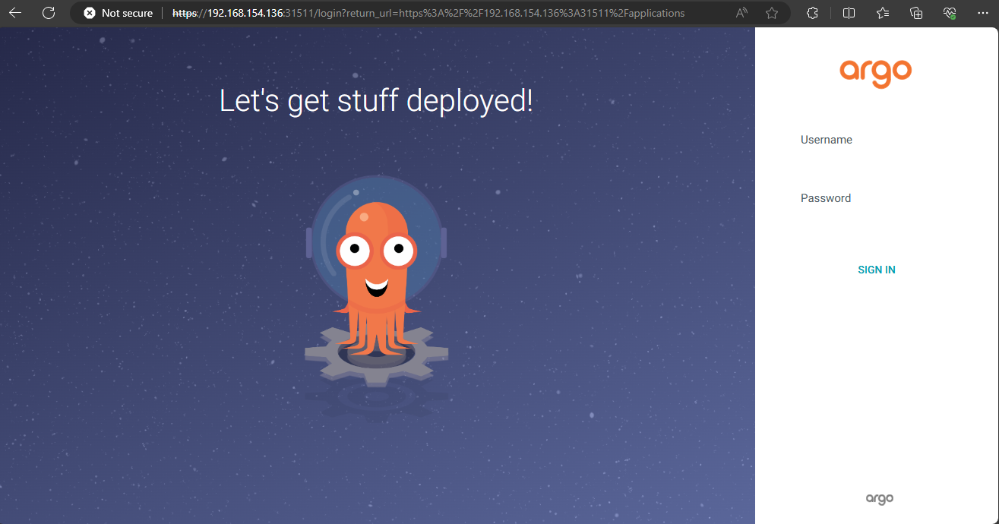
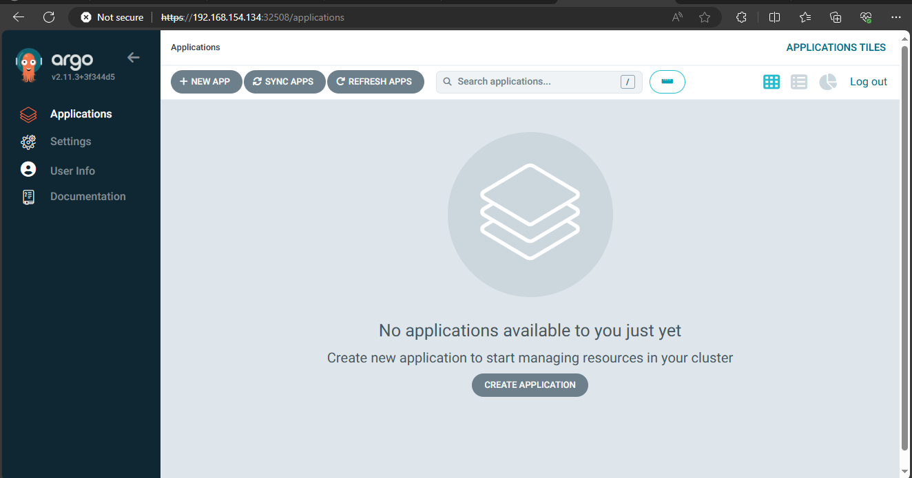
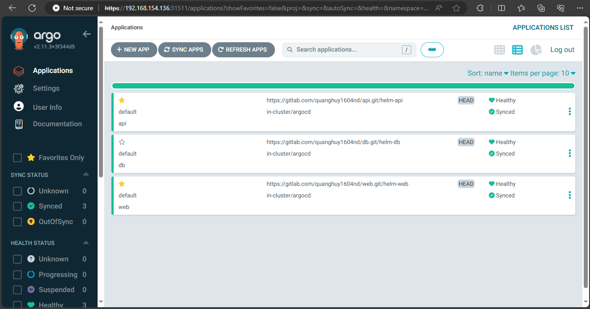
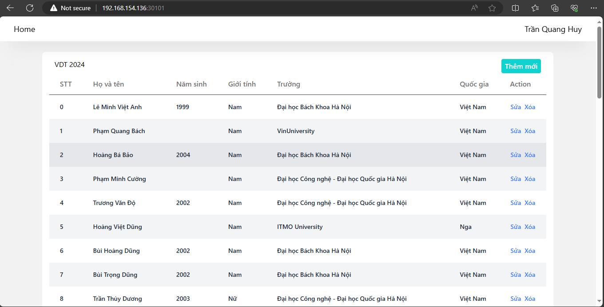
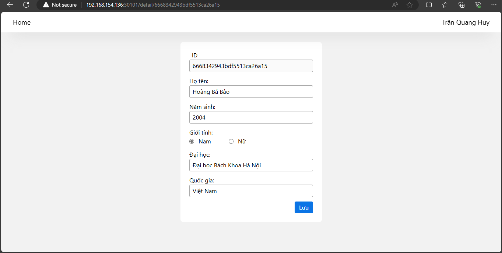
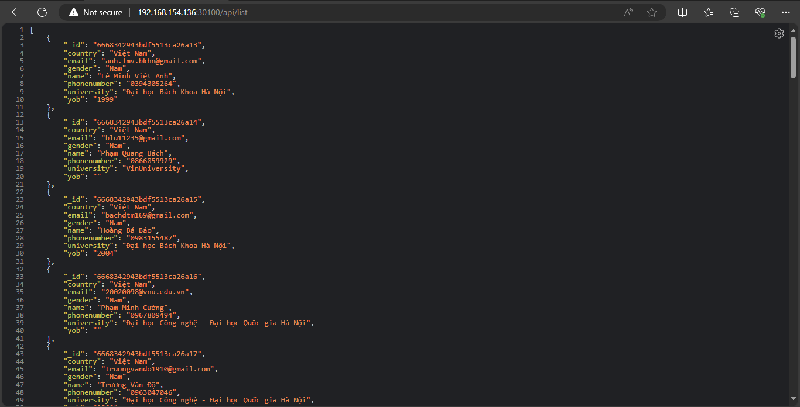
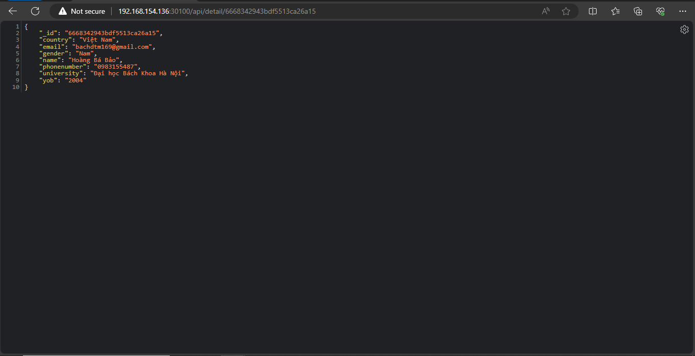

# Cài đặt ArgoCD trên cụm kubernetes
## 1. Install ArgoCD
1. Cài đặt
```sh
kubectl create namespace argocd
kubectl apply -n argocd -f https://raw.githubusercontent.com/argoproj/argo-cd/stable/manifests/install.yaml
```
> Uninstall argocd
```sh
kubectl delete -n argocd -f https://raw.githubusercontent.com/argoproj/argo-cd/stable/manifests/install.yaml

```
2. Đổi `argoCD-server` sang NodePort
```sh
sudo apt install -y vim
kubectl -n argocd edit service argocd-server
kubectl -n monitoring edit svc prom-operator-01-kube-prom-prometheus
```

chỉnh `IP` từ `ClusterIP` sang `NodePort`

Sau đó dùng lệnh
```
kubectl get all -n argocd
```

để lấy ra port của `argocd-server`
> Xóa các pod không Running
```
kubectl get pod --all-namespaces | awk '{if ($4 != "Running") system ("kubectl -n " $1 " delete pods " $2  " --grace-period=0 " " --force ")}'
```
> Xóa các Replicaset
```
kubectl delete replicaset $(kubectl get replicaset -o jsonpath='{ .items[?(@.spec.replicas==0)].metadata.name }')
```
Mặc định replicaset là 10
```yml
revisionHistoryLimit: 0 # Default to 10 if not specified
```

Truy cập thông qua `IP` của `kubemaster` và cổng đã được tạo.

`Username`: admin <br>
Lấy password bằng
```
kubectl -n argocd get secret argocd-initial-admin-secret -o jsonpath="{.data.password}" | base64 -d
```
Output:


# Output 1:
- File `manifests` sử dụng để triển khai ArgoCD lên K8S  Cluster
[Here](https://raw.githubusercontent.com/argoproj/argo-cd/stable/manifests/install.yaml)
- Ảnh chụp giao diện màn hình hệ thống ArgoCD khi truy cập qua trình duyệt trình duyệt


# Output 2:
- Các Helm Chart sử dụng để triển khai web Deployment và api Deployment lên K8S Cluster
### helm chart cho web
```sh
.
├── charts
├── Chart.yaml
└── templates
    ├── deployment.yaml
    └── service.yaml
─── values.yaml
```
file `Chart.yaml`
```yml
apiVersion: v2
name: helm-web
description: A Helm chart for Kubernetes
type: application
version: 0.1.0
appVersion: "1.16.0"
```

file `templates/deployment.yaml`
```yml
apiVersion: apps/v1
kind: Deployment
metadata:
  name: {{ .Release.Name }}
  labels:
    app: {{ .Values.deployment.app }}
spec:
  replicas: {{ .Values.replicaCount }}
  selector:
    matchLabels:
      app: {{ .Values.deployment.app }}
  template:
    metadata:
      labels:
        app: {{ .Values.deployment.app }}
    spec:
      containers:
        - name: {{ .Chart.Name }}-container
          image: "{{ .Values.image.repository }}"
          imagePullPolicy: {{ .Values.image.pullPolicy }}
          ports:
            - name: {{ .Values.deployment.containerPortName }}
              containerPort: {{ .Values.deployment.containerPort }}
          env:
            - name: {{ .Values.envname }}
              valueFrom:
                configMapKeyRef:
                  name: {{ .Values.config.name }}
                  key: {{ .Values.config.key }}
```
file `templates/service.yaml`
```yml
apiVersion: v1
kind: Service
metadata:
  name: {{ .Values.service.name }}
  labels:
    app: {{ .Values.service.app }}
spec:
  type: {{ .Values.service.type }}
  ports:
    - port: {{ .Values.service.port }}
      targetPort: {{ .Values.service.targetPort }}
      nodePort: {{ .Values.service.nodePort }}
      protocol: {{ .Values.service.protocol}}
      name: {{ .Values.service.portName }}
  selector:
    app: {{ .Values.service.app }}
```

### helm chart cho api
file `Chart.yaml`
```yml
apiVersion: v2
name: helm-api
description: A Helm chart for Kubernetes
type: application
version: 0.1.0
appVersion: "1.16.0"

```

file `templates/deployment.yaml`
```yml
apiVersion: apps/v1
kind: Deployment
metadata:
  name: {{ .Release.Name }}
  labels:
    app: {{ .Values.deployment.app }}
spec:
  replicas: {{ .Values.replicaCount }}
  selector:
    matchLabels:
      app: {{ .Values.deployment.app }}
  template:
    metadata:
      labels:
        app: {{ .Values.deployment.app }}
    spec:
      containers:
        - name: {{ .Chart.Name }}-container
          image: "{{ .Values.image.repository }}"
          imagePullPolicy: {{ .Values.image.pullPolicy }}
          ports:
            - name: {{ .Values.deployment.containerPortName }}
              containerPort: {{ .Values.deployment.containerPort }}
          env:
            - name: {{ .Values.envname }}
              valueFrom:
                configMapKeyRef:
                  name: {{ .Values.config.name }}
                  key: {{ .Values.config.key }}
```

file `templates/service.yaml`
```sh
.
├── charts
├── Chart.yaml
└── templates
    ├── deployment.yaml
    └── service.yaml
─── values.yaml
```
```yml
apiVersion: v1
kind: Service
metadata:
  name: {{ .Values.service.name }}
  labels:
    app: {{ .Values.service.app }}
spec:
  type: {{ .Values.service.type }}
  ports:
    - port: {{ .Values.service.port }}
      targetPort: {{ .Values.service.targetPort }}
      nodePort: {{ .Values.service.nodePort }}
      protocol: {{ .Values.service.protocol }}
      name: {{ .Values.service.portName }}
  selector:
    app: {{ .Values.service.app }}
```
`

- Các file values.yaml trong 2 config repo của  của web service và api service 

file `web-config/values.yaml`
```yml
replicaCount: 1

image:
  repository: registry.gitlab.com/quanghuy1604nd/web/vdt:8be3fc95
  pullPolicy: Always
  tag: ""

service:
  type: NodePort
  port: 80
  targetPort: 80
  nodePort: 30101
  name: web-svc
  app: web
  portName: http
  protocol: TCP
deployment:
  app: web
  containerPortName: http
  containerPort: 80
  
envname: REACT_APP_API_URL
config:
  name: config
  key: REACT_APP_API_URL

ingress:
  enabled: false
  className: ""
  annotations: {}
    # kubernetes.io/ingress.class: nginx
    # kubernetes.io/tls-acme: "true"
  hosts:
    - host: chart-example.local
      paths:
        - path: /
          pathType: ImplementationSpecific
  tls: []
  #  - secretName: chart-example-tls
  #    hosts:
  #      - chart-example.local
```
file `api-config/values.yaml`
```yml
replicaCount: 1

image:
  repository: registry.gitlab.com/quanghuy1604nd/api/vdt:dc5a0e6d
  pullPolicy: IfNotPresent
  tag: ""

service:
  type: NodePort
  port: 8000
  targetPort: 8000
  nodePort: 30100
  name: api-svc
  app: api
  protocol: TCP
  portName: http
deployment:
  app: api
  containerPortName: http
  containerPort: 8000
envname: MONGO_URL
config:
  name: config
  key: MONGO_URL

ingress:
  enabled: false
  className: ""
  annotations: {}
    # kubernetes.io/ingress.class: nginx
    # kubernetes.io/tls-acme: "true"
  hosts:
    - host: chart-example.local
      paths:
        - path: /
          pathType: ImplementationSpecific
  tls: []
  #  - secretName: chart-example-tls
  #    hosts:
  #      - chart-example.local
```
- Manifest của ArgoCD Application

file `application-cli.yaml`
```yml
---
apiVersion: argoproj.io/v1alpha1
kind: Application
metadata:
  name: db
  namespace: argocd
spec:
  project: default
  source:
    repoURL: https://gitlab.com/quanghuy1604nd/db.git
    targetRevision: HEAD
    path: helm-db
  destination: 
    server: https://kubernetes.default.svc
    namespace: argocd
  syncPolicy:
    syncOptions:
    - CreateNamespace=true
    automated:
      selfHeal: true
      prune: true
---
apiVersion: argoproj.io/v1alpha1
kind: Application
metadata:
  name: api
  namespace: argocd
spec:
  project: default
  sources:
    - repoURL: https://gitlab.com/quanghuy1604nd/api.git
      targetRevision: HEAD
      path: helm-api
      helm:
        valueFiles:
        - '$values/values.yaml'
    - repoURL:  https://gitlab.com/quanghuy1604nd/api-config.git
      targetRevision: main
      # path: . # Sử dụng toàn bộ repository
      ref: values
  destination: 
    server: https://kubernetes.default.svc
    namespace: argocd
  syncPolicy:
    syncOptions:
    - CreateNamespace=true
    automated:
      selfHeal: true
      prune: true
---
apiVersion: argoproj.io/v1alpha1
kind: Application
metadata:
  name: web
  namespace: argocd
spec:
  project: default
  sources:
    - repoURL: https://gitlab.com/quanghuy1604nd/web.git
      targetRevision: HEAD
      path: helm-web
      helm:
        valueFiles:
        - '$values/values.yaml'
    - repoURL:  https://gitlab.com/quanghuy1604nd/web-config.git
      targetRevision: main
      # path: . # Sử dụng toàn bộ repository
      ref: values
  destination: 
    server: https://kubernetes.default.svc
    namespace: argocd
  syncPolicy:
    syncOptions:
    - CreateNamespace=true
    automated:
      selfHeal: true
      prune: true
```
- Ảnh chụp giao diện màn hình hệ thống ArgoCD trên trình duyệt


- Ảnh chụp giao diện màn hình trình duyệt khi truy cập vào Web URL, API URL
    - Ảnh khi truy cập vào `Web URL`



- Ảnh khi truy cập vào `API URL`





