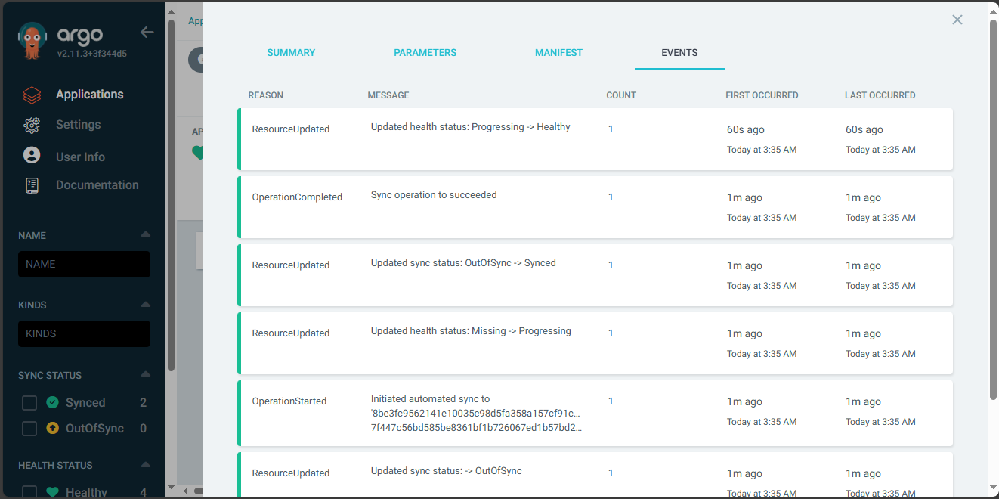

# Continous Delivery
**Yêu cầu**:
- Viết 2 luồng CD cho 2 repo web và api, khi có 1 tag mới được tạo ra trên trên 1 trong 2 repo này thì luồng deploy tương ứng của repo đó thực hiện các công việc sau:
    - Build docker image với image tag là tag name đã được tạo ra trên gitlab và push docker image sau khi build xong lên Docker Hub
    - Sửa giá trị Image version trong file values.yaml  trong config repo và push thay đổi lên config repo. Tham khảo: https://stackoverflow.com/a/72696837
    Cấu hình ArgoCD tự động triển khai lại web Deployment và api Deployment khi có sự thay đổi trên config repo.
                           
**Output**:
- Các file setup công cụ của 2 luồng CD
- Output log của 2 luồng CD khi tạo tag mới trên repo web và repo api

## Kết quả đạt được
- file CICD cho repo `web`
```yml
stages:
  - build
  - update_helm_chart

variables:
  APP_NAME: web-vdt
  IMAGE_TAG: registry.gitlab.com/quanghuy1604nd/web-finalterm/$APP_NAME:$CI_COMMIT_SHORT_SHA

build_image:
  image: docker
  stage: build
  services:
    - docker:dind
  script:
    - docker login -u $CI_REGISTRY_USER -p $CI_REGISTRY_PASSWORD $CI_REGISTRY
    - docker build -t $IMAGE_TAG .
    - docker push $IMAGE_TAG 

update_helm_chart:
    stage: update_helm_chart
    image: ubuntu:22.04
    before_script:
      - 'which ssh-agent || ( apt-get update -y && apt-get install openssh-client git -y )'
      - mkdir -p /root/.ssh
      - echo "$SSH_PRIVATE_KEY" > /root/.ssh/id_rsa
      - chmod 600 /root/.ssh/id_rsa
      - ssh-keyscan -H gitlab.com >> ~/.ssh/known_hosts
      - chmod 644 ~/.ssh/known_hosts
        # run ssh-agent
      - eval $(ssh-agent -s)
        # add ssh key stored in SSH_PRIVATE_KEY variable to the agent store
      - echo "$SSH_PRIVATE_KEY" | tr -d '\r' | ssh-add -  
      # Git
      - git config --global user.email "gitlab-ci@gmail.com"
      - git config --global user.name "gitlab-ci"
      - git clone git@gitlab.com:quanghuy1604nd/web-manifest.git
      - cd web-manifest
      - ls -latr
    script:
    # Update Image TAG
     - sed -i "s/web-vdt:.*/web-vdt:${CI_COMMIT_SHORT_SHA}/g" helm-web/values.yaml
     - git add helm-web/values.yaml
     - git commit -am "Update Image"
     - git push
```
- pipeline được thể hiện ở [here](https://gitlab.com/quanghuy1604nd/web/-/pipelines/1327982970)
- `stage 1`: build docker image và push lên Registry


Ảnh cho toàn bộ quá trình build và push được thể hiện [here](../images/P3/web-full-build.png)
- `stage 2`: Cập nhật lại file `values.yaml` trên repo `web-config`


Ảnh cho toàn bộ quá trình config được thể hiện [here](../images/P3/web-full-config.png)

- file CICD cho repo `api`
```yml
stages:
  - build
  - update-config

variables:
  APP_NAME: vdt
  IMAGE_TAG: registry.gitlab.com/quanghuy1604nd/api/$APP_NAME:$CI_COMMIT_SHORT_SHA

build_image:
  image: docker
  stage: build
  services:
    - docker:dind
  script:
    - docker login -u $CI_REGISTRY_USER -p $CI_REGISTRY_PASSWORD $CI_REGISTRY
    - docker build -t $IMAGE_TAG .
    - docker push $IMAGE_TAG 

update-config:
    stage: update-config
    image: alpine
    before_script:
      - apk add --no-cache git openssh
      - mkdir -p ~/.ssh
      - echo "$SSH_PRIVATE_KEY" > ~/.ssh/id_rsa
      - chmod 600 ~/.ssh/id_rsa
      - ssh-keyscan -H gitlab.com >> ~/.ssh/known_hosts
      - git config --global user.email "gitlab-ci@example.com"
      - git config --global user.name "gitlab-ci"
      - git clone git@gitlab.com:quanghuy1604nd/api-config.git
      - cd api-config
      - ls -latr
    script:
    # Update Image TAG
     - sed -i "s/vdt:.*/vdt:${CI_COMMIT_SHORT_SHA}/g" values.yaml
     - git add values.yaml
     - git commit -am "Update Image version"
     - git push origin main
```
- pipeline được thể hiện ở [here](https://gitlab.com/quanghuy1604nd/api/-/pipelines/1327496071)
- `stage 1`: build docker image và push lên Registry


Ảnh cho toàn bộ quá trình build và push được thể hiện [here](../images/P3/api-full-build.png)
- `stage 2`: Cập nhật lại file `values.yaml` trên repo `web-config`


Ảnh cho toàn bộ quá trình config được thể hiện [here](../images/P3/api-full-config.png)

- Event application `web`


- Event application `api`


- Ảnh log sau khi cập nhật config của repo


- Repo `api` trước cập nhật


- Repo `api` sau cập nhật


