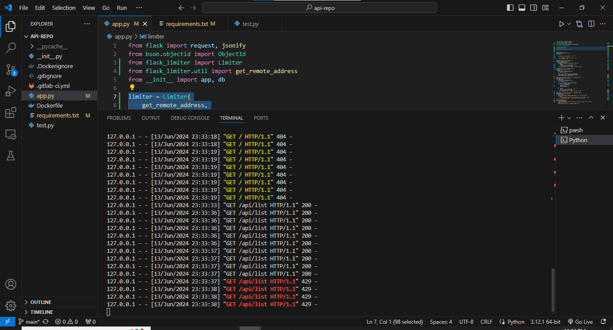
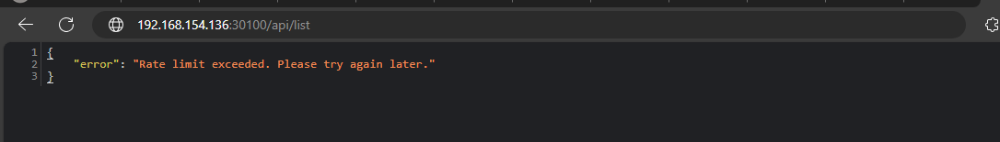

# Security

### Yêu cầu 1 (1đ): 

- Dựng HAProxy Loadbalancer trên 1 VM riêng (trong trường hợp cụm lab riêng của sinh viên) hoặc trên Basion Node (trường hợp sử dụng cụm Lab của Viettel Cloud) với mode TCP, mở 2 port web_port và api_port trên LB trỏ đến 2 NodePort của Web Deployment và API Deployment trên K8S Cluster. (0.5)
- Sử dụng 1 trong 2 giải pháp Ingress, hoặc haproxy sidecar container cho các deployment, đảm bảo các truy cập đến các port web_port và api_port sử dụng https (0.5)
Cho phép sinh viên sử dụng self-signed cert để làm bài

### Output 1: 

- File cấu hình của HAProxy Loadbalancer cho web port và api port
- File cấu hình ingress hoặc file cấu hình deployment sau khi thêm HAProxy sidecar container vào Deployment
- Kết quả truy cập vào web port và api port từ trình duyệt thông qua giao thức https hoặc dùng curl. Ví dụ:
	
### Yêu cầu 2 (1đ):

- Đảm bảo 1 số URL của api service  khi truy cập phải có xác thực thông qua 1 trong số các phương thức cookie, basic auth, token auth, nếu không sẽ trả về HTTP response code 403. (0.5)
- Thực hiện phân quyền cho 2 loại người dùng trên API:
- Nếu người dùng có role là user thì truy cập vào GET request trả về code 200, còn truy cập vào POST/DELETE thì trả về 403
- Nếu người dùng có role là admin thì truy cập vào GET request trả về code 200, còn truy cập vào POST/DELETE thì trả về 2xx
### Output: 

- File trình bày giải pháp sử dụng để authen/authorization cho các service
- Kết quả HTTP Response khi curl hoặc dùng postman gọi vào các URL khi truyền thêm thông tin xác thực và khi không truyền thông tin xác thực
- Kết quả HTTP Response khi curl hoặc dùng postman vào các URL với các method GET/POST/DELETE  khi lần lượt dùng thông tin xác thực của các user có role là user và admin

Tham khảo cách sử dụng công cụ CURL với thông tin xác thực: https://reqbin.com/req/c-haxm0xgr/curl-basic-auth-example
	

Yêu cầu 3 (1đ):

Sử dụng 1 trong số các giải pháp để ratelimit cho Endpoint của api Service, sao cho nếu có  quá 10 request trong 1 phút gửi đến Endpoint của api service thì các request sau đó bị trả về HTTP Response 409 

Output:

File tài liệu trình bày giải pháp
File ghi lại kết quả thử nghiệm khi gọi quá 10 request trong 1 phút vào Endpoint của API Service


## Yêu cầu 3
Sử dụng thư viện `Flask-limiter`
```
pip install Flask-limiter   
```
- Thiết lập cấu hình `10 request` trên 1 phút
```python
limiter = Limiter(
    get_remote_address,
    app=app,
    default_limits=["10 per minute"]
)
```
Code hoàn chỉnh
```python
from flask import request, jsonify
from bson.objectid import ObjectId
from flask_limiter import Limiter
from flask_limiter.util import get_remote_address
from __init__ import app, db

limiter = Limiter(
    get_remote_address,
    app=app,
    default_limits=["10 per minute"]
)

@app.route("/api/list")
@limiter.limit("10 per minute")
def home():
    students = list(db.students.find())
    for student in students:
        student['_id'] = str(student['_id'])
    return jsonify(student), 200

@app.route('/api/detail/<string:_id>')
@limiter.limit("10 per minute")
def get_student_by(_id):
    student = db.students.find_one(ObjectId(_id))
    if student:
        student['_id'] = str(student['_id'])
        return jsonify(student), 200
    return jsonify({'Error': 'Student not found'}), 404

@app.route('/api/add', methods=['POST'])
@limiter.limit("10 per minute")
def add():
    new_student = request.get_json()
    del new_student['_id']

    result = db.students.insert_one(new_student)
    new_student['_id'] = str(result.inserted_id)
    return jsonify(new_student), 200

@app.route('/api/update/<string:_id>', methods=['POST'])
@limiter.limit("10 per minute")
def update(_id):
    new_student = request.get_json()
    del new_student['_id']

    result = db.students.find_one_and_update(
        {"_id": ObjectId(_id)},
        {"$set": new_student},
        upsert=False,
        return_document=True
    )
    if result:
        result['_id'] = str(result['_id'])
        return jsonify(result), 200
    return jsonify({'Error': 'Student not found'}), 404

@app.route('/api/delete/<string:_id>', methods=['POST'])
@limiter.limit("10 per minute")
def delete(_id):
    result = db.students.find_one_and_delete({"_id": ObjectId(_id)})
    if result:
        return jsonify({'message': 'Delete student successfully!'}), 200
    return jsonify({'message': 'Student does not exist!'}), 404

@app.errorhandler(429)
def ratelimit_error(e):
    return jsonify(error="Rate limit exceeded. Please try again later."), 429
if __name__ == '__main__':
    app.run(host='0.0.0.0', port=8000, debug=True)

```
- Hình ảnh minh họa



