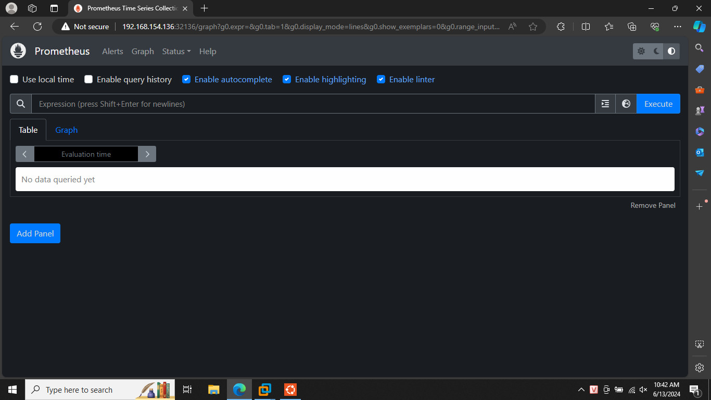

# Monitoring (1.5đ)
## Yêu cầu:
- Expose metric của web service và api service ra 1 http path. Tham khảo: https://github.com/korfuri/django-prometheus
- Triển khai Prometheus lên Kubernetes Cluster thông qua Prometheus Operator, phơi ra ngoài dưới dạng NodePort: 
Expose Prometheus dưới dạng Nodeport
- Trong trường hợp sử dụng cụm lab của Viettel Cloud, tạo 1 load balancer với backend là NodePort Service của Prometheus, để expose Prometheus UI ra Public Internet 
- Sử dụng Service Monitor của Prometheus Operator để giám sát Web Deployment và API Deployment
## Output:
- Các file setup để triển khai Prometheus lên Kubernetes Cluster
- Hình ảnh khi truy cập vào Prometheus UI thông qua trình duyệt
- Hình ảnh danh sách target của Web Deployment và API Deployment được giám sát bởi Prometheus

## Kết quả đạt được
- File setup để triển khai `Prometheus`
- File `servicemonitor.yaml`
```yml
apiVersion: monitoring.coreos.com/v1
kind: ServiceMonitor
metadata:
  name: web-svc-monitor
  labels:
    team: frontend
spec:
  selector:
    matchLabels:
      app: web-svc # target web service
  endpoints:
  - port: metrics
    interval: 15s
---
apiVersion: monitoring.coreos.com/v1
kind: ServiceMonitor
metadata:
  name: api-svc-monitor
  labels:
    team: backend
spec:
  selector:
    matchLabels:
      app: api-svc # target api service
  endpoints:
  - port: http
    path: /metrics
    interval: 15s

```

- File `podmonitor.yaml`
```yml

```
- File cấu hình ClusterRole và ClusterRoleBinding
```yml

```
- File `Prometheus.yaml`
```yml

```
2. Hình ảnh truy cập thông qua trình duyệt
- Hình ảnh truy cập qua API metrics

- Hình ảnh truy cập qua Web Metrics


3. Cấu hình lấy metrics
a. API metrics: [Here]()
b. Web metrics: [Here]()