# Bài tập giữa kì VDT 2024

## I. Phát triển một 3-tier web application đơn giản (3đ)
### Yêu cầu:
- Phát triển web application có các chức năng sau (0.5đ):
- Hiển thị danh sách sinh viên tham gia chương trình VDT2024 dưới dạng bảng với các thông tin sau: Họ và tên, Giới tính, trường đang theo học. 
- Cho phép xem chi tiết/thêm/xóa/cập nhật thông tin sinh viên.
- Thiết kế hệ thống với ba dịch vụ (1đ): 
- web: Giao diện web, tuỳ chọn ngôn ngữ, framework.
- api: RESTful API viết bằng ngôn ngữ lập trình tùy chọn, có đầy đủ các chức năng: list, get, create, update, delete.
- db: Database SQL hoặc NoSQL lưu trữ thông tin sinh viên.
- Viết unit tests cho các chức năng APIs, mỗi API tối thiếu 1 testcase (0.5đ).
- Maintain source code của api và web ở 2 repo khác nhau, mỗi feature là 1 Pull Request (1đ).

### Output:
- Hình ảnh thể hiện kết quả đã đạt được
- Mã nguồn của từng dịch vụ (link github)

### Kết quả đạt được:
1. `Techstacks`:
    - Front-end: ReactJS
    - Back-end/API: Flask (RESTful API)
    - Database: MongoDB
2. `Web` [`source code`](https://github.com/HenryTran1604/api-vdt)
    - Giao diện danh sách thành viên.
    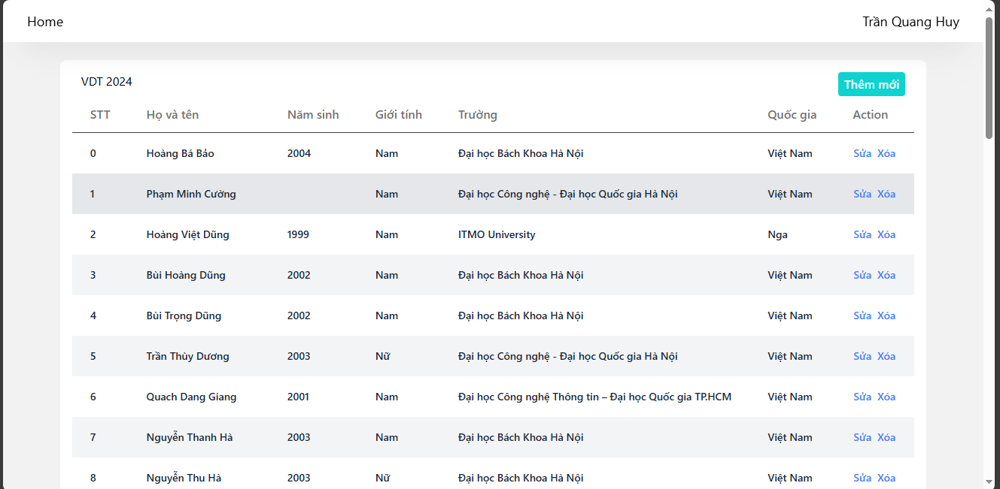

    - Giao diện thêm thành viên.
    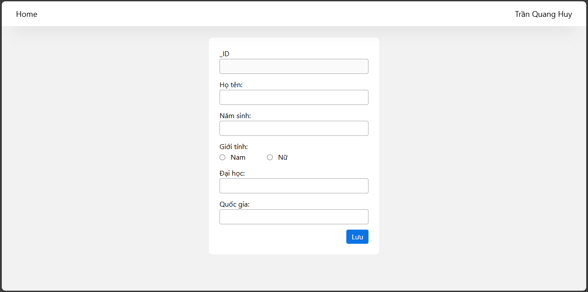
    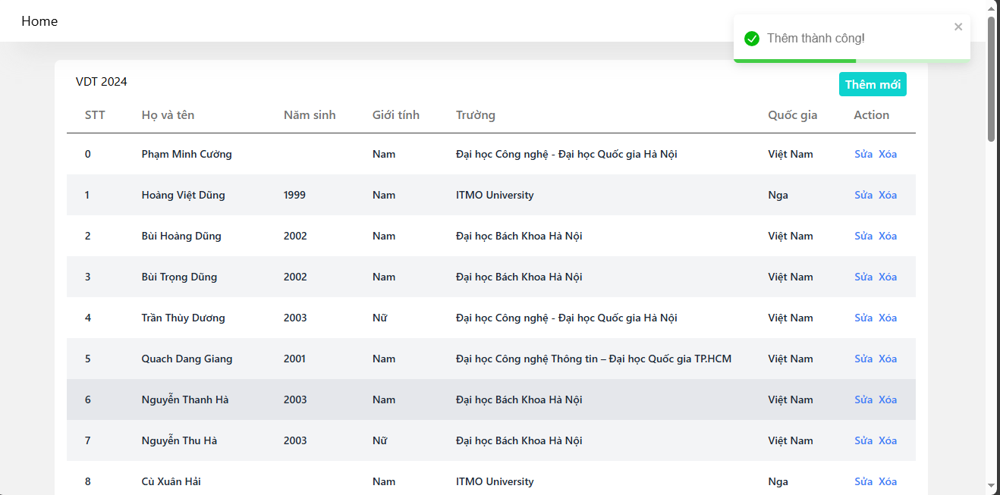

    - Giao diện cập nhật thành viên.
    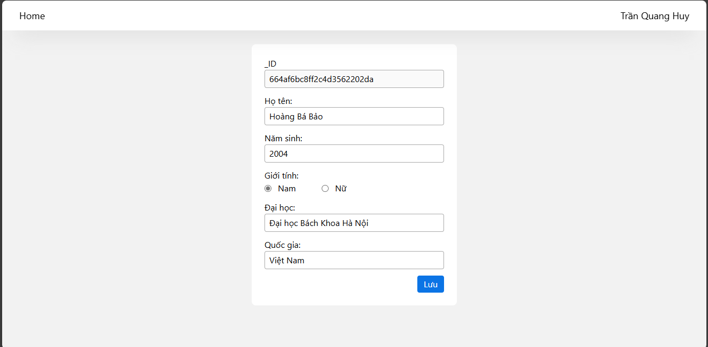
    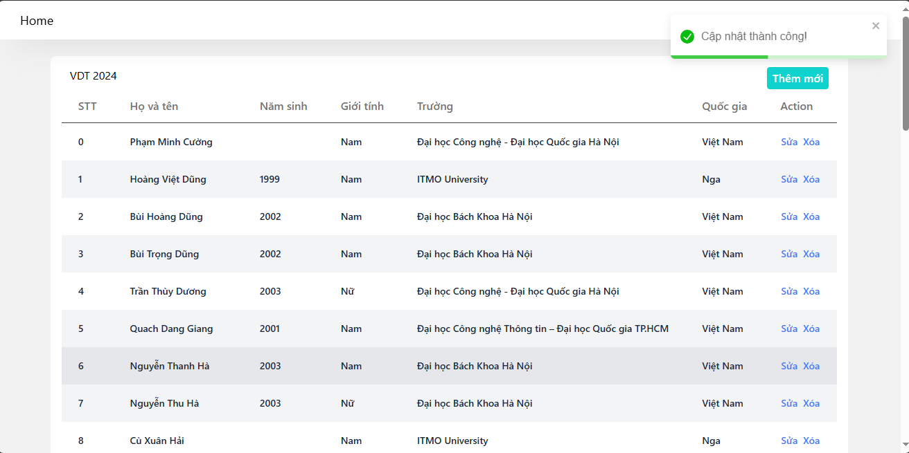


    - Giao diện xóa thành viên.
    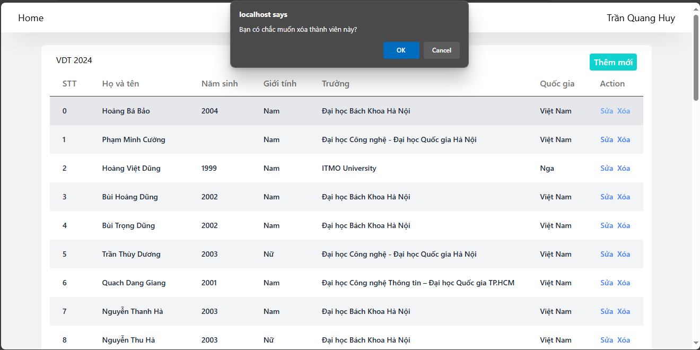
    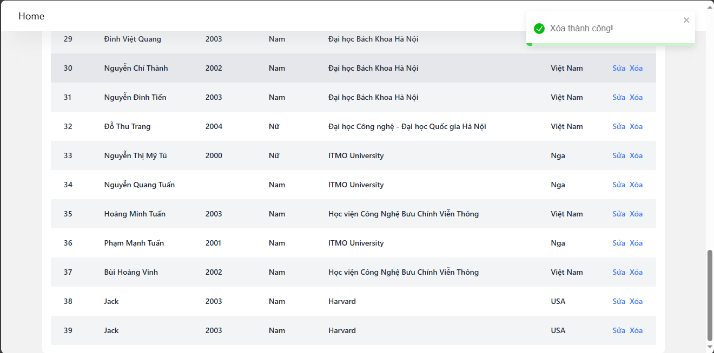
3. `Back-end/API` [`source code`](https://github.com/HenryTran1604/web-vdt)
4. `db` [`source`](https://github.com/HenryTran1604/db-vdt)
5. Unittest cho `APIs`
```Python
import unittest
from app import app
data = {
    "_id": "",
    "name": "Jack",
    "yob": "2003",
    "email": "Jack@jack.com",
    "phonenumber": "11111111",
    "gender": "Nam",
    "university": "Harvard",
    "country": "USA"
}
updated_data = {
    "_id": '',
    "name": "Jack New",
    "yob": "2003",
    "email": "Jack@jack.com",
    "phonenumber": "11111111 new",
    "gender": "Nam",
    "university": "Harvard new",
    "country": "USA new "
}
class AppTestCase(unittest.TestCase):
    def setUp(self):
        self.app = app
        self.client = app.test_client()

    def test_get_all_students(self):
        response = self.client.get('/api/list')
        self.assertEqual(response.status_code, 200)

    def test_add_student(self):
        response = self.client.post('/api/add', json=data)
        self.assertEqual(response.status_code, 200)

    def test_get_student(self):
        # thêm sv vào db
        response = self.client.post('/api/add', json=data)
        _id = response.get_json()['_id']
        response = self.client.get(f'/api/detail/{_id}')
        response_student = response.get_json()
        response_student['_id'] = '' # không quan tâm id
        self.assertEqual(response.status_code, 200)
        self.assertEqual(data, response_student)
    
    def test_update_student(self):
        # thêm một student vào db
        # response trả về student đó
        response = self.client.post('/api/add', json=data)
        _id = response.get_json()['_id']
        # cập nhật lại student với _id của student vừa thêm
        response = self.client.post(f'/api/update/{_id}', json=updated_data)
        updated_data['_id'] = _id # cập nhật lại id
        # print(response.get_json())
        self.assertEqual(response.status_code, 200)
        self.assertEqual(updated_data, response.get_json())
    
    def test_delete_student(self):
        # thêm một student vào db
        # response trả về student đó
        response = self.client.post('/api/add', json=data)
        _id = response.get_json()['_id']
        response = self.client.post(f'/api/delete/{_id}')
        self.assertEqual(response.status_code, 200)

if __name__ == "__main__":
    unittest.main()
```

## II. Triển khai web application sử dụng các DevOps tools & practices
### 1. Containerization
#### Yêu cầu:
- Viết Dockerfile để ở từng repo để đóng gói các dịch vụ trên thành các container image (1đ)
- Yêu cầu image đảm bảo tối ưu thời gian build và kích thước chiếm dụng, khuyến khích sử dụng các thủ thuật build image đã được giới thiệu (layer-caching, optimized RUN instructions, multi-stage build, etc.) (1đ)
#### Output:
- File Dockerfile cho từng dịch vụ
- Output câu lệnh build và thông tin docker history của từng image

#### Kết quả đạt được:
1. `web`
- `Dockerfile` cho `web`:
```Dockerfile
FROM node:16-alpine AS builder
WORKDIR /app
COPY ./package.json ./
RUN npm install
COPY . .
RUN npm run build

FROM nginx:1.26.0-alpine
COPY --from=builder /app/build /usr/share/nginx/html
COPY nginx.conf /etc/nginx/conf.d/default.conf
CMD ["nginx", "-g", "daemon off;"]
```
- Docker build
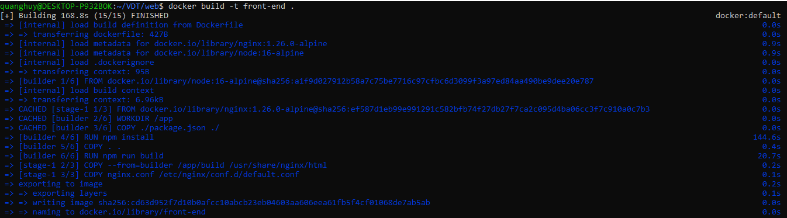
- Docker history
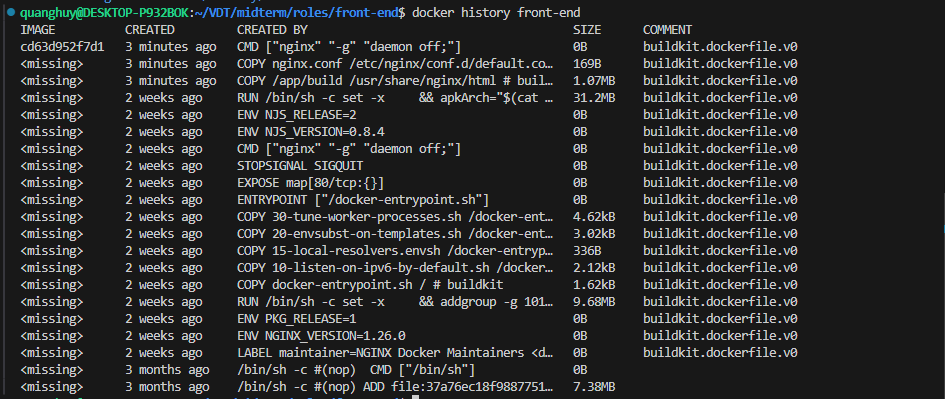
2. `Dockerfile` cho `API`
```Dockerfile
ARG DOCKER_BUILDKIT=1 # for fast build time
FROM python:3.10-alpine as builder
WORKDIR /app
COPY requirements.txt /app
RUN pip3 install --no-cache-dir -r requirements.txt

FROM builder
WORKDIR /src
COPY --from=builder /app /src
COPY .  .
EXPOSE 8000
CMD ["python", "-u", "app.py"]
```
- docker build
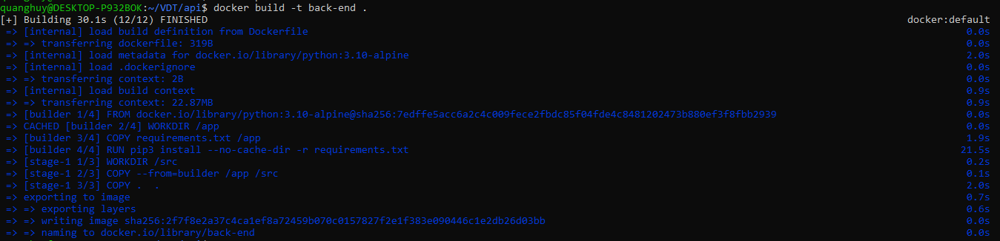
- docker history
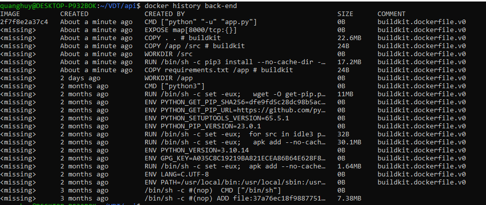
3. `Dockerfile` cho `databse`
```Dockerfile
FROM mongo
# ENV MONGO_INITDB_ROOT_USERNAME=root
# ENV MONGO_INITDB_ROOT_PASSWORD=1234
VOLUME [ "/data/db" ]
COPY init.js /docker-entrypoint-initdb.d/
EXPOSE 27017
CMD [ "mongod" ]
```
- docker build 
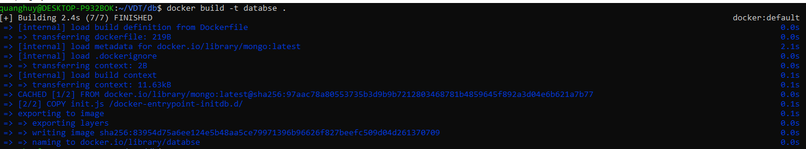
- docker history
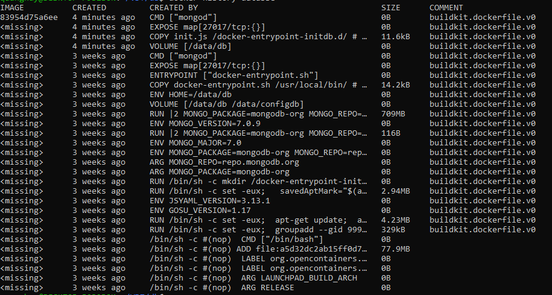
#### Tổng hợp
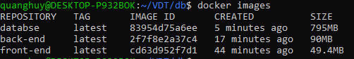

### 2. Continous Integration
#### Yêu cầu:
- Tự động chạy unit test khi tạo PR vào branch main.
- Tự động chạy unit test khi push commit lên một branch.
#### Output:
- File setup công cụ CI
- Output log của luồng CI
- Các hình ảnh demo khác

#### Kết quả đạt được
1. File set up công cụ CI (`ci.yaml`)
```yml
name: CI

on:
  push:
    branches: [ "*" ]
  pull_request:
    branches: [ "main" ]

jobs:
  build:

    runs-on: ubuntu-latest
    services:
      mongo:
        image: mongo:latest
        ports:
          - 27017:27017

    steps:
    - uses: actions/checkout@v2
    - name: Set up Python 3.10
      uses: actions/setup-python@v3
      with:
        python-version: "3.10"
    - name: Install dependencies
      run: |
        python -m pip install --upgrade pip
        if [ -f requirements.txt ]; then pip install -r requirements.txt; fi
    - name: Run test
      run: |
        python test.py
```
- Output log của luồng CI: [here](https://github.com/HenryTran1604/api-vdt/actions/runs/9220721867/job/25368285647)
- Luồng khi thực hiện CI thành công:

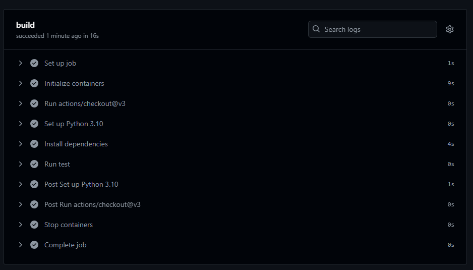
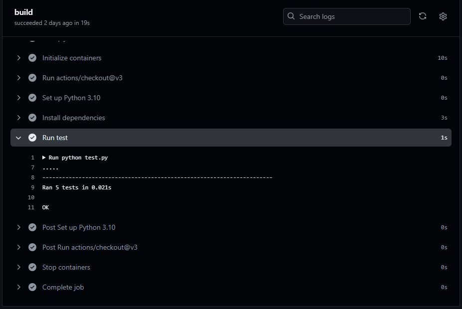

- Thông báo khi CI thất bại:

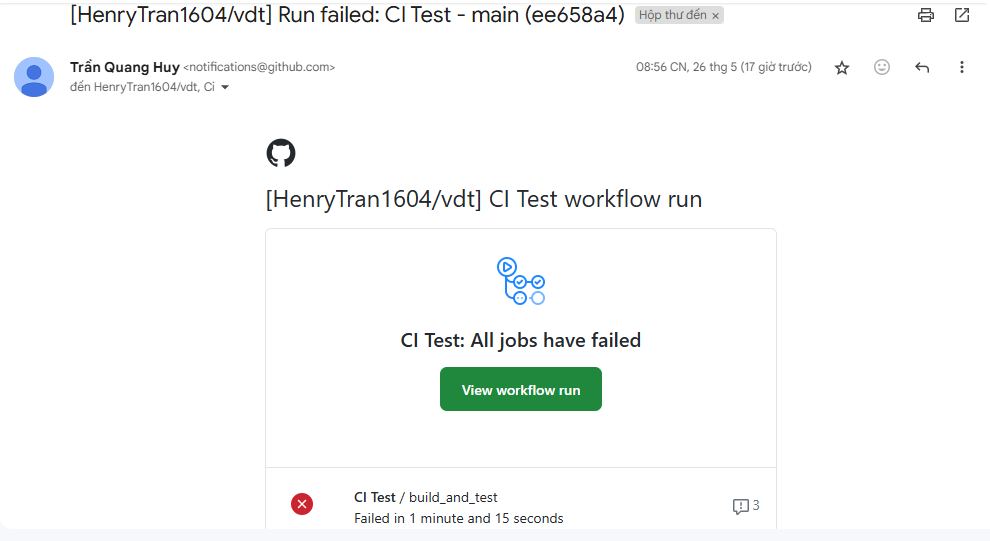
## III.	Automation (1.5đ)
#### Yêu cầu:
- Viết ansible playbooks để triển khai các image docker của các dịch vụ web, api, db, mỗi dịch vụ 1 role .
- Trong từng role cho phép tuỳ biến cấu hình của các dịch vụ thông qua các variables.
- Cho phép triển khai các dịch vụ trên các host khác nhau thông qua file inventory.

#### Output:
- Link github source code của ansible playbooks

### Kết quả đạt được [source](https://github.com/HenryTran1604/ansible-vdt)
1. Cấu trúc thư mục
```
.
├── inventory.yml
├── ansible.cfg
├── setup.yml
└── roles
    ├── common
    │   ├── tasks
    │   │   └── main.yml
    │   └── vars
    │       └── main.yml
    ├── api
    │   ├── tasks
    │   │   └── main.yml
    │   └── vars
    │       └── main.yml
    ├── db
    │   ├── tasks
    │   │   └── main.yml
    │   └── vars
    │       └── main.yml
    └── web
        ├── tasks
        │   └── main.yml
        └── vars
            └── main.yml
```
- Trong đó:
  - `inventory.yml`: chứa thông tin về các hosts trong mạng.
  - `ansible.cfg`: chứa thông tin về cấu hình ansible, bao gồm thông tin về `inventory`, `private-key`.
  - `setup.yml`: là `ansible-playbook` cho biết ansible sẽ thực hiện quản lý và cài đặt ở những roles nào.
  - `roles`: Thư mục chứa thông tin về các dịch vụ:
    - `api`: dịch vụ API
    - `db`: dịch vụ database
    - `web`: dịch vụ web
    - `common`: Chứa thông tin cài đặt về môi trường để chạy: `python`, `docker`, `pip`, `docker-repository` và cài đặt network.

- file `setup.yml`:
```yml
---
- name: Setup OS enviroment
  hosts: all
  become: true
  gather_facts: false
  roles:
    - common
    - db
    - api
    - web
```
2. Cách tiến hành
- `cd ./ansible`
- `ansible-playbook -i inventory.yml setup.yml`
- Log khi chạy ansible:


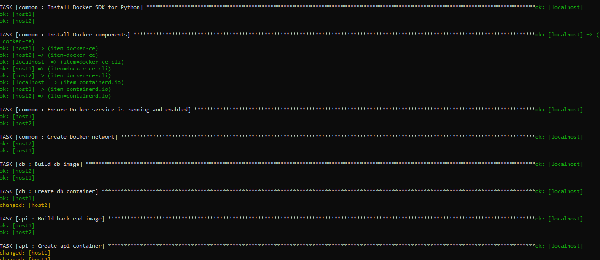
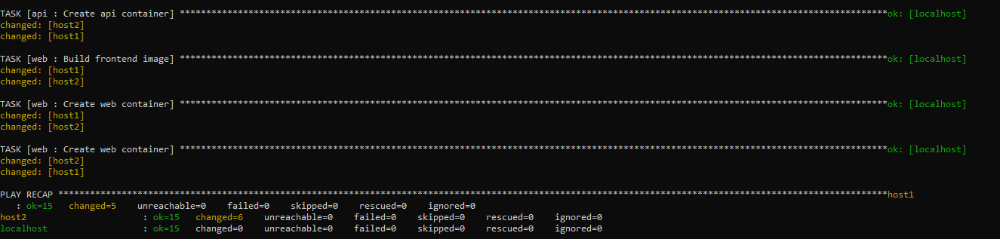
- Sau khi triển khai, các images và container được tự động cấu hình trên các host

host1
  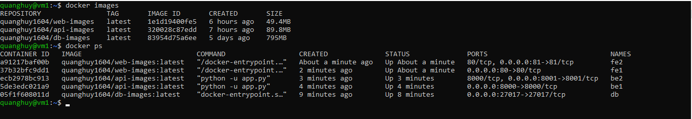

host2
  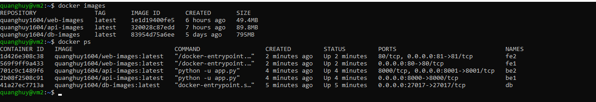
- Truy cập vào các dịch vụ đã được triển khai trên từng hosts

host1
  

host2
  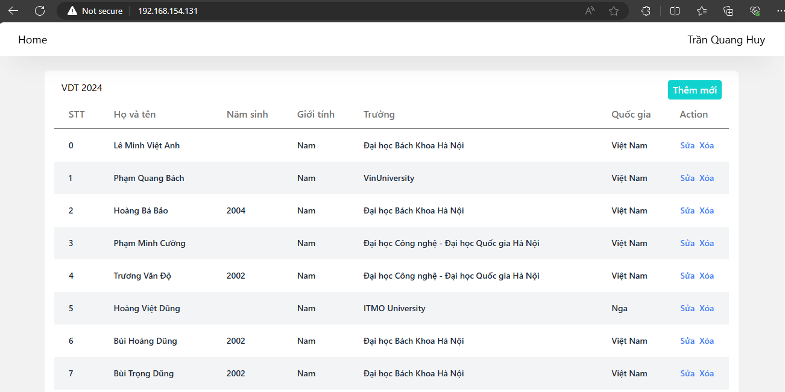


