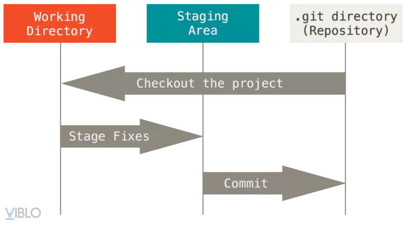
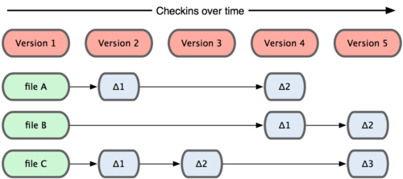

# Tìm hiểu sâu về một chủ đề đã được học
# Chủ đề: GIT và Cấu trúc thư mục .git
## 1. Git là gì?
Git được tạo ra vào năm 2005 bởi Linus Torvalds, Git được thiết kế để duy trì sự phát triển của nhân Linux, được xây dựng dựa trên các trụ cột về phân phối đầy đủ, tốc độ, thiết kế đơn giản, khả năng xử lý các dự án lớn và hỗ trợ mạnh mẽ cho sự phát triển phi tuyến tính. Một lượng truyền thuyết đáng kể tồn tại xung quanh lịch sử của Git và sự sáng tạo của nó, bao gồm cả lý do và làm thế nào nó có cái tên đặc biệt, lý do tạo ra nó ngay từ đầu, v.v. <br>
Theo trang official của git, git được định nghĩa *"Git is a fast, scalable, distributed revision control system with an unusually rich command set that provides both high-level operations and full access to internals"*.


Như vậy, git không chỉ là một công cụ dành cho developer mà dành cho tất cả mọi người. Nó hoạt động như một content tracker, tức là theo dõi sự thay đổi về nội dung của các tài liệu.
## 2. Cách thức git hoạt động
### a. Các khái niệm quan trọng
- Mọi thứ ở trong git đều được hash.
- **Working Directory**: Là khu vực mà chúng ta đang thực hiện những thay đổi lên các file.
- **Staging Area**: là một khu vực mà nó sẽ được chuẩn bị cho quá trình commit, được coi như là một khu vực khởi động. **Staging Area** được coi là một ưu điểm lớn của git khi nó đem lại nhiều lợi ích:
    - Chia nhỏ các commits: Khi làm việc với số lượng file lớn, chắc chắn chúng ta không muốn sẽ đưa tất cả vào khu vực lưu trữ. Việc này làm cho các thay đổi ở code không được rõ ràng. Việc đưa từng file cần thiết cho sự thay đổi rồi mới commit làm cho commit message trở nên tường minh hơn.
    - Giúp chúng ta có thể review lại sự thay đổi trong code trước khi đưa vào lưu trữ.
    - Giúp merge code đơn giản hơn, tránh conflicts: Nếu việc merge code bị conflict, nó sẽ ở trong trạng thái staging và chúng ta có thể thấy được sự khác biệt thông qua `git diff`.
- **Repository (.git directory)**: được hiểu là một kho lưu trữ nơi chứa các files của dự án. Các file đó có thể là code, hình ảnh, âm thanh hoặc mọi thứ liên quan đến dự án. Bạn có thể tổ chức kho lưu trữ của mình dưới nhiều hình thức khác nhau
### Quan hệ giữa các area

Trong đó, có 3 trạng thái của file:


- **Commit**: là thao tác ghi lại việc thêm/thay đổi file hay thư mục vào kho lưu trữ (repository). Các commit nối tiếp nhau theo thứ tự thời gian chỉnh sửa và thay đổi các file. Mỗi commit đều yêu cầu phải có message/comment giúp ghi nhận sự thay đổi theo tiến trình update của lập trình viên.
- **Snapshot**: là ảnh chụp các bước commit của bạn trên kho lưu trữ nhằm lưu lại nội dung tập tin, thư mục để tham chiếu.
Nếu tập tin không có thay đổi, Git không lưu trữ tập tin đó lại, thay vào đó nó sẽ chỉ tạo liên kết tới tập tin gốc đã tồn tại trước đó. Khi cần bạn hoàn toàn có thể khôi phục và sử dụng lại một snapshot. Công cụ này sẽ giúp người dùng tiết kiệm khá nhiều không gian lưu trữ. Hiểu đơn giản, **snapshot** là trạng thái của dự án tại một thời điểm cụ thể và không nhất thiết là tại `HEAD`.
- `commit` = `snapshot` + `metadata`

Để hiểu rõ hơn về **snapshot**, chúng ta xem ví dụ sau [here](#kết-luận)

### b. Cách thức hoạt động
- Đại đa số các Version Control System đều lưu thông tin dưới danh sách các sự thay đổi về file.
 <br>
Tức là sau mỗi lần thay đổi, vcs sẽ lưu lại sự thay đổi của file đó so với lịch sử trước đó. Và file đầu ra cuối cùng sẽ là tổng hợp sự thay đổi về file (delta-based).
- Tuy nhiên với git lai có cách tiếp cận khác, git coi thông tin được lưu trữ là một tập hợp các snapshot – ảnh chụp toàn bộ nội dung tất cả các file tại thời điểm. <br>

Mỗi khi chúng ta “commit”, Git sẽ “chụp” và tạo ra một snapshot cùng một tham chiếu tới snapshot đó. Để hiệu quả, nếu các tệp không thay đổi, Git sẽ không lưu trữ lại file — chỉ là một liên kết đến tệp giống file trước đó mà nó đã lưu trữ


## 3. Các thư mục và ý nghĩa
### a. Ý nghĩa các thư mục
Thư mục `.git` sẽ được tạo ra tự động sau khi chúng ta khởi động dự án bằng git. Nó sẽ tồn tại suốt dự án sẽ là nơi lưu trữ và git lấy và xử lý thông tin. Cấu trúc của dự án bao gồm `.git` như sau:
```
my_project/
├── .git/
│   ├── HEAD
│   ├── config
│   ├── description
│   ├── hooks/
│   ├── info/
│   ├── objects/
│   │   ├── info/
│   │   └── pack/
│   ├── refs/
│   │   ├── heads/
│   │   └── tags/
│   ├── logs/
│   │   └── refs/
│   │       ├── heads/
│   │       └── remotes/
│   ├── index
│   └── packed-refs
└── src
```
- **HEAD**: 
    - File này lưu trữ tham chiếu tới commit hiện tại của dự án. Nội dung file này có thể là ref: `refs/heads/<branch>` trong đó, `branch` là tên của nhánh đang được trỏ tới.
- **config**: 
    - File này chứa các cấu hình của repository như URL của remote repository, thông tin người dùng.
    ```shell
    [core]
        repositoryformatversion = 0
        filemode = true
        bare = false
        logallrefupdates = true
    ```
- **description**:
    - Mô tả ngắn về repository, thường được sử dụng bởi các công cụ như GitWeb.
    ```
    Unnamed repository; edit this file 'description' to name the repository.
    ```
- **hooks/**:
    - Chứa các script hook mà Git gọi tại các điểm nhất định trong vòng đời của các hành động Git. Ví dụ:
        - `pre-commit`: Chạy trước khi một commit được tạo ra.
        - `post-commit`: Chạy sau khi một commit được tạo ra.
- **info/**
    - Chứa các file cấu hình bổ sung như `exclude` để bỏ qua các file ngoài `.gitignore`.
- **objects/**
    - Thư mục này chứa tất cả các đối tượng (objects) Git tạo ra, gồm có blobs, trees, commits và tags.
    - `Blobs (binary large objects)`: Lưu trữ nội dung của các file.
    - `Trees`: Lưu trữ cấu trúc thư mục.
    - `Commits`: Lưu trữ metadata và con trỏ tới trees và commits cha.
    Tags: Lưu trữ các thông tin về các thẻ.
- **refs/**
    - Chứa các tham chiếu tới các commit, bao gồm các nhánh (heads) và các thẻ (tags).
- **logs/**
    - Chứa các file log ghi lại lịch sử các hành động trên các ref (như nhánh và remote).
- **index**
    - File này chứa thông tin về các thay đổi đã được staged (tạm thời) để chuẩn bị commit. Khu vực staging area.
- **packed-refs**
    - File này chứa các ref đã được "packed" để tối ưu hóa hiệu suất, đặc biệt khi có nhiều ref.
### b. Thực tế
Xuyên suốt phần này, chúng ta hãy tạo một repository `test` để có một cái nhìn rõ ràng hơn
```shell
cd ~
mkdir test
git init
```
Ngay sau khi tạo một git repository, chúng ta sẽ nhận thấy có thư mục `.git` xuất hiện
```shell
$ ls -a
.  ..  .git
```
Đây chính là repository mà chúng ta đã đề cập ở trên. Cấu trúc thư mục sẽ có dạng như sau:
```shell
.
├── COMMIT_EDITMSG
├── HEAD
├── branches
├── config
├── description
├── hooks
│   ├── applypatch-msg.sample
│   ├── commit-msg.sample
│   ├── fsmonitor-watchman.sample
│   ├── post-update.sample
│   ├── pre-applypatch.sample
│   ├── pre-commit.sample
│   ├── pre-merge-commit.sample
│   ├── pre-push.samples
│   ├── pre-rebase.sample
│   ├── pre-receive.sample
│   ├── prepare-commit-msg.sample
│   ├── push-to-checkout.sample
│   └── update.sample
├── index
├── info
│   ├── exclude
│   └── refs
├── logs
│   ├── HEAD
│   └── refs
│       └── heads
│           └── master
├── objects
│   ├── info
│   │   ├── commit-graph
│   │   └── packs
│   └── pack
│       ├── pack-333c7bc6f8daff0fc45d0b491327de5325318b71.idx
│       └── pack-333c7bc6f8daff0fc45d0b491327de5325318b71.pack
├── packed-refs
└── refs
    ├── heads
    └── tags
```

## Thư mục `object`
Đầu tiên chúng ta quan sát thư mục `object`, *đây được coi là cơ sở dữ liệu, là nơi lưu tất cả những thứ cần thiết trong các version khác nhau trong dự án.*
```
$ ls .git/object
info pack
```
Vì `object` là nơi lưu các file, tuy nhiên chưa có file nào được tạo, chúng ta tạo 1 file mới
```shell
$ echo "1" > first_file.txt

$ ls -a
.  ..  .git  first_file.txt

$ git status
On branch master

No commits yet

Untracked files:
  (use "git add <file>..." to include in what will be committed)
        first_file.txt

nothing added to commit but untracked files present (use "git add" to track)
```
File `first_file.txt` đang ở trạng thái `untracked`, điều này có nghĩa là file đang ở trong khu vực `working directory`. Ta thêm file vào trong `staging area`
```shell
$ git add .

$ git status
On branch master

No commits yet

Changes to be committed:
  (use "git rm --cached <file>..." to unstage)
        new file:   first_file.txt
```
Thực hiện commit
```shell
$ git commit -m 'add first_file.txt'
[master (root-commit) 0606c56] add first_file.txt
 1 file changed, 1 insertion(+)
 create mode 100644 first_file.txt
```
Chúng ta vừa đưa 1 file vào trong `repository`, điều này cũng có nghĩa là trong `object/` folder cũng xuất hiện thêm một vài thứ.
```shell
$ ls .git/objects/
06  97  d0  info  pack
```
Bên cạnh `info/` và `pack/` thì chúng ta có 3 folder mới được tạo ra `06` `97` `d0`. <br>
Chúng ta in log xem điều gì đã xảy ra.
```shell
$: git log
commit 0606c56a46d9d58c6a014b048442294ecacd65aa (HEAD -> master)
Author: HenryTran1604 <quanghuy1604nd@gmail.com>
Date:   Mon May 27 15:30:53 2024 +0700

    add first_file.txt
```
Có thể thấy hash của commit vừa rồi là `0606c56a46d9d58c6a014b048442294ecacd65aa`, chú ý rằng có 1 folder trong `object` có 1folder có tên 2 kí tự bắt đầu bằng `06`. <br>
Lại có
```shell
$ ls .git/objects/06/
06c56a46d9d58c6a014b048442294ecacd65aa
```
Tên của file trong thư mục `06` bằng với phần còn lại của hash key trong commit. Hay
```
06|06c56a46d9d58c6a014b048442294ecacd65aa = 0606c56a46d9d58c6a014b048442294ecacd65aa
```
Chúng ta có thể thấy rằng tên của thư mục được tạo trong cơ sở dữ liệu đối tượng là hai chữ số đầu tiên của hàm băm (hash) và tệp bên trong thư mục này là phần còn lại của các khóa băm. Đây là quy ước đặt tên mà Git tuân theo để lưu trữ dữ liệu. Cách thức này được Git sử dụng để tìm đối tượng hiệu quả hơn.

Tuy nhiên câu hỏi đặt ra là tại sao tạo ra 3 object?
1. Loại object đầu tiên: The commit
```shell
$ git cat-file 0606c56a46d9d58c6a014b048442294ecacd65aa -t
commit
$ git cat-file 0606c56a46d9d58c6a014b048442294ecacd65aa -p
tree 9782c59213a234b40728f75846f0148b9e4f5d5e
author HenryTran1604 <quanghuy1604nd@gmail.com> 1716798653 +0700
committer HenryTran1604 <quanghuy1604nd@gmail.com> 1716798653 +0700

add first_file.txt
```
Commit là plain text như các nội dung khác trong git, nó được nén và được gắn một mã hash key. Trong commit object sẽ chứa thông tin về tác giả, người commit, ngày tháng commit dạng timestap, múi giờ và nội dung của commit.
Đây mới chỉ là thư mục `06`, chúng ta đến với thư mục tiếp theo.
2. Loại object thứ hai: The tree
- `Tree` là object được dùng để lưu trữ thư mục trong dự án. Một `tree` có thể trỏ đến cây khác để tạo thành cây phân cấp, hoặc nó cũng có thể trỏ tới `blobs`
- Mỗi commit trỏ đến một đối tượng tree ghi lại trạng thái của kho lưu trữ tại thời điểm commit được thực hiện trong một `snapshot` hoàn chỉnh.
```shell
$ git cat-file 9782c59213a234b40728f75846f0148b9e4f5d5e -t
tree
$ git cat-file 9782c59213a234b40728f75846f0148b9e4f5d5e -p
100644 blob d00491fd7e5bb6fa28c517a0bb32b8b506539d4d    first_file.txt
```
Tree bao gồm một mỗi dòng là 1 file hoặc là thư mục, với mỗi dòng, nó lưu trữ `permissions`, `object type`, `object hash` và `file name`. <br>
Như vậy, mỗi `blobs` chỉ lưu trữ dữ liệu của file mà không quản lý tên file. Tên file được quản lý bởi tree
3. Kiểu dữ liệu thứ ba: The blob
- `Blob` (binary large object) chỉ lưu trữ data mà không lưu thêm bất kì thông tin thêm nào khác. Mỗi file trong dự án được lưu trữ dưới dạng một `blob`
```shell
$ git cat-file d00491fd7e5bb6fa28c517a0bb32b8b506539d4d -t
blob
$ git cat-file d00491fd7e5bb6fa28c517a0bb32b8b506539d4d -p
1
```
### Kết luận
- Thư mục `object/` được dùng để lưu trữ dữ liệu của dự án. Có 3 kiểu dữ liệu object trong git: `blobs`, `trees` và `commits`, mỗi kiểu dữ liệu đều được git tự động tạo ra khóa hash key và lưu trữ dưới dạng nén trong dự án.
    - Một `commit` trỏ đến một `tree` để lưu lại `snapshot` của toàn bộ dự án trong một thời điểm cụ thể.
    - Một `tree` trỏ tới các `blobs` hoặc nó có thể trỏ tới các `trees` khác để tạo ra cấu trúc phân cấp.

Bây giờ, chúng ta thử thêm 1 file mới vào trong dự án và xem `snapshot` mới được tạo ra
```shell
$ mkdir task
$ echo "2" > task/second_file.txt
$ ls
first_file.txt  task
$ git add .
$ git commit -m 'add second file'
[master a8104ae] add second file
 1 file changed, 1 insertion(+)
 create mode 100644 task/second_file.txt
```
Khi này, đã có các object mới được tạo ra
```
$ ls .git/objects/
06  0c  34  41  97  a8  d0  info  pack
```
Tương tự như phần trước, chúng ta sẽ có các file tương ứng. Tuy nhiên, `snapshot` được tạo ra thì hash key của các file cũ sẽ không bị thay đổi
```shell
ls .git/objects/d0/
0491fd7e5bb6fa28c517a0bb32b8b506539d4d
```
Bây giờ chúng ta thêm 1 file có nội dung giống với file `first_file.txt` xem điều gì xảy ra.
```shell
$ echo "1" > first_file_2.txt
$ git add .
$ git commit -m 'add first_file_2 with same content'
[master 8f54875] add first_file_2 with same content
 1 file changed, 1 insertion(+)
 create mode 100644 first_file_2.txt
$ cd .git/objects/14
$ git cat-file 149428d96465ce94fd903c299f32209a606e8473 -p
100644 blob d00491fd7e5bb6fa28c517a0bb32b8b506539d4d    first_file.txt
100644 blob d00491fd7e5bb6fa28c517a0bb32b8b506539d4d    first_file_2.txt
040000 tree 41ff5b38ee63c9eb70f8ce5af99c42f3b471331d    task
```
Có thể thấy 2 file `first_file.txt` và `first_file_2.txt` có cùng nội dung nên hash key của chúng giống nhau. Đây cũng là một cách mà git tối ưu bộ nhớ và thời gian lưu trữ.<br>
Để trực quan, chúng ta có diagram sau đây

## Thư mục `Refs`
Chúng ta thấy mỗi commit đều có mã hash key, tuy nhiên mỗi mã hash có độ dài 40 ký tự khó có thể nhớ được. Vì vậy, git cung cấp giải pháp là `refs` giúp tham chiếu tới các hash key đó.
```shell
$ ls .git/refs/
heads  tags
```
`heads`: là thư mục chứa thông tin của các nhánh
```
$ ls .git/refs/heads/
master
```
Giả sử chúng ta thêm 1 nhánh mới vào dự dán
```shell
$ git checkout -b branchA
Switched to a new branch 'branchA'
$ ls .git/refs/heads/
branchA  master
```
Khi này, `branchA` sẽ được tự động thêm vào `heads`
Vậy, `branch` này thực sự là gì?
```shell
cat .git/refs/heads/master
8f548755c87d0cd0cd966caa1658f7d68db118dd

$ git log
commit 8f548755c87d0cd0cd966caa1658f7d68db118dd (HEAD -> branchA, master)
Author: HenryTran1604 <quanghuy1604nd@gmail.com>
Date:   Mon May 27 16:31:13 2024 +0700

    add first_file_2 with same content

commit a8104ae8d4c8874893047feac939beac7bb487e5
Author: HenryTran1604 <quanghuy1604nd@gmail.com>
Date:   Mon May 27 16:23:17 2024 +0700

    add second file

commit 0606c56a46d9d58c6a014b048442294ecacd65aa
Author: HenryTran1604 <quanghuy1604nd@gmail.com>
Date:   Mon May 27 15:30:53 2024 +0700

    add first_file.txt
```
Nhận thấy rằng, branch `master` đang trỏ tới commit đầu tiên. Hay nói cách khác, branch là một con trỏ nhưng với tên thân thiện với con người.
#### Con trỏ `HEAD`
```shell
$ cat .git/HEAD
ref: refs/heads/branchA
```
Lúc này, con trỏ `HEAD` đang trỏ với nhánh `branchA`. Con trỏ `HEAD` là con trỏ trỏ tới một con trỏ khác.


### Thư mục `Tag`
Tag được dùng để đánh dấu một commit, nghe có vẻ giống như commit tuy nhiên tag là không thể thay đổi.
```shell
$ git tag v1.0
$ cat .git/refs/tags/v1.0
8f548755c87d0cd0cd966caa1658f7d68db118dd
```

### Kết luận:
- Git lưu trữ ba loại đối tượng trong cơ sở dữ liệu của nó: `commit`, `tree` và `blobs`. Mọi đối tượng trong cơ sở dữ liệu Git đều có hash được liên kết với nó.

- Với các `commit`, `tree` và `blobs` cũng như sử dụng các hash key làm con trỏ, Git xây dựng hệ thống phân cấp dữ liệu của dự án một cách hiệu quả và không trùng lặp nội dung.

- Con người không dễ dàng ghi nhớ các hash key và đó là lý do tại sao Git cung cấp một cách ghi nhớ hash key đó thân thiện hơn thông qua `refs`

- Nhánh là một con trỏ tới một `commit`. Tên nhánh mặc định trong Git là `master`, nhưng bạn có thể tạo bao nhiêu nhánh tùy thích. Tham chiếu `HEAD` cho chúng ta biết chúng ta đang làm việc ở nhánh nào. Mỗi khi bạn tạo một `commit` mới, con trỏ nhánh sẽ tự động di chuyển về phía trước.

- Cuối cùng, tham chiếu `tag` là bất biến và luôn được liên kết với cùng một `commit` để có thể luôn ghi nhớ một thời điểm

