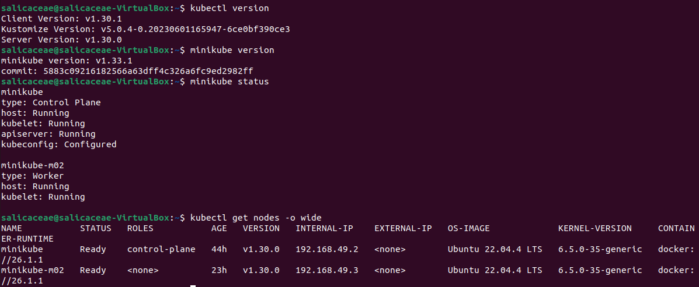
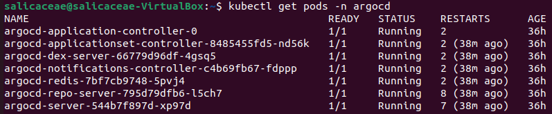
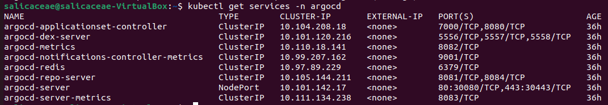
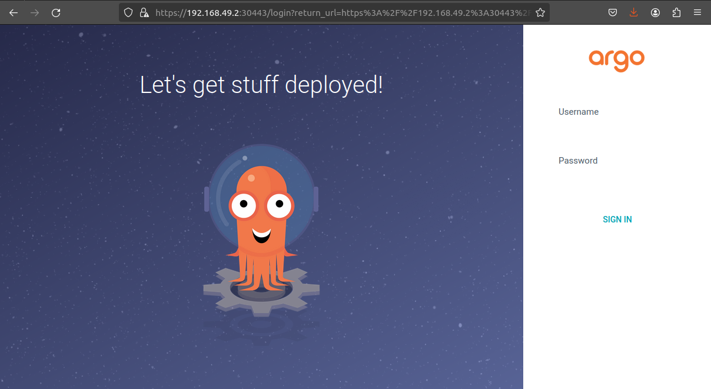
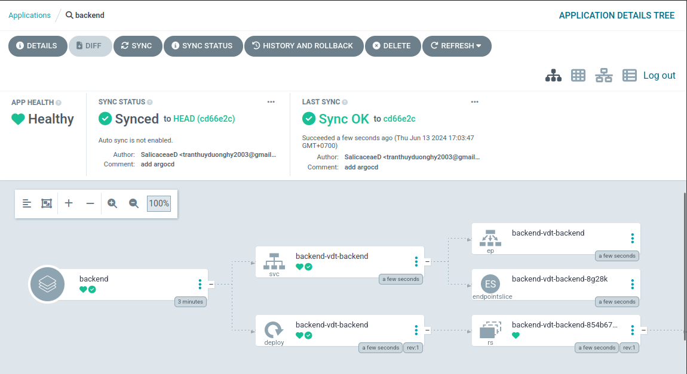
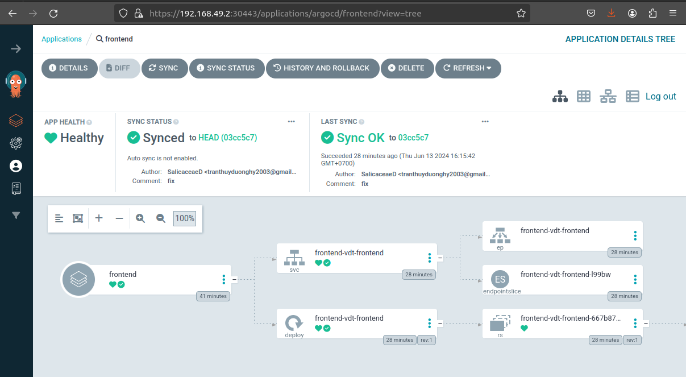
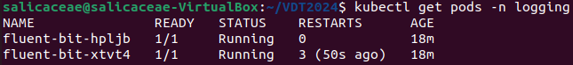
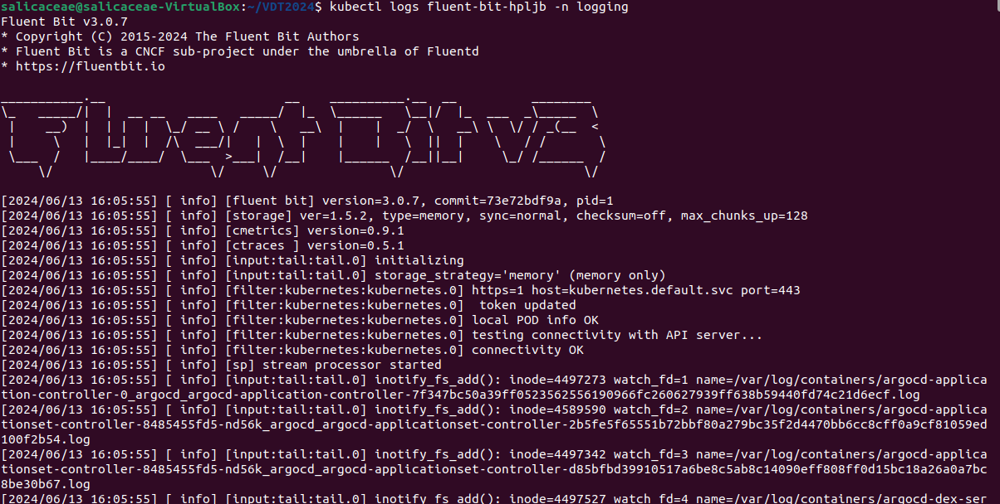
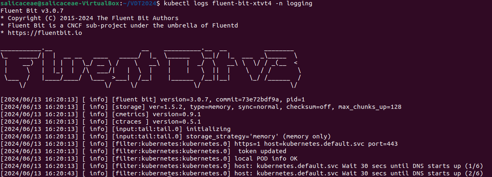

# Bài tập lớn cuối kỳ VDT 2024 - GĐ 1

## Triển khai Kubernetes 

1. Cài đặt kubectl
```bash
curl -LO https://dl.k8s.io/release/`curl -LS https://dl.k8s.io/release/stable.txt`/bin/linux/amd64/kubectl

chmod +x ./kubectl

sudo mv ./kubectl /usr/local/bin/kubectl

kubectl version
```


2. Cài đặt minikube

```bash
curl -LO https://storage.googleapis.com/minikube/releases/latest/minikube-linux-amd64

sudo install minikube-linux-amd64 /usr/local/bin/minikube && rm minikube-linux-amd64

minikube version 
```

3. Triển khai minikube 
```bash
minikube start
```
4. Thêm một node worker 
```bash
minikube node add --worker
```

5. Logs




## Cài đặt ArgoCD

1. Cài đặt ArgoCD sử dụng 
kubectl và file manifest gốc

```basg
kubectl create namespace argocd

kubectl apply -n argocd -f https://raw.githubusercontent.com/argoproj/argo-cd/stable/manifests/install.yaml
```

2. Expose ArgoCD qua NodePort

```bash
kubectl patch svc argocd-server -n argocd -p \
  '{"spec": {"type": "NodePort", "ports": [{"name": "http", "nodePort": 30080, "port": 80, "protocol": "TCP", "targetPort": 8080}, {"name": "https", "nodePort": 30443, "port": 443, "protocol": "TCP", "targetPort": 8080}]}}'
```
3. Kiểm tra trạng thái của các pod trong namespace `argocd`
```sh
kubectl get pods -n argocd
```

Kết quả:



4. Lấy các services trong namespace `argocd`

```sh
kubectl get svc -n argocd
```
Kết quả:


5. Lấy mật khẩu ban đầu cùa ArgoCD 
```bash
argocd admin initial-password -n argocd
```
6. Truy cập ArgoCD



## Helm chart 

- Các Helm Chart để triển khai backend và frontend lên Kubernetes Cluster:
  - [Helm Chart Repo Backend](https://github.com/SalicaceaeD/VDT-backend/tree/main/argocd)
  - [Helm Chart Repo Frontend](https://github.com/SalicaceaeD/VDT-frontend/tree/main/argocd)

- Các file values.yaml:

  - [Backend values.yaml](https://github.com/SalicaceaeD/VDT-backend-config)

```yaml
# Default values for vdt-backend.
# This is a YAML-formatted file.
# Declare variables to be passed into your templates.

replicaCount: 1

image:
  repository: salicaceae/vdt2024-backend
  pullPolicy: IfNotPresent
  # Overrides the image tag whose default is the chart appVersion.
  tag: "latest"

mongodb:
  repository: salicaceae/vdt2024-db
  pullPolicy: IfNotPresent
  tag: "latest"

imagePullSecrets: []
nameOverride: ""
fullnameOverride: ""

serviceAccount:
  # Specifies whether a service account should be created
  create: false
  # Automatically mount a ServiceAccount's API credentials?
  automount: true
  # Annotations to add to the service account
  annotations: {}
  # The name of the service account to use.
  # If not set and create is true, a name is generated using the fullname template
  name: ""

podAnnotations: {}
podLabels: {}

podSecurityContext: {}
  # fsGroup: 2000

securityContext: {}
  # capabilities:
  #   drop:
  #   - ALL
  # readOnlyRootFilesystem: true
  # runAsNonRoot: true
  # runAsUser: 1000

service:
  type: NodePort
  port: 10000

ingress:
  enabled: false
  className: ""
  annotations: {}
    # kubernetes.io/ingress.class: nginx
    # kubernetes.io/tls-acme: "true"
  hosts:
    - host: chart-example.local
      paths:
        - path: /
          pathType: ImplementationSpecific
  tls: []
  #  - secretName: chart-example-tls
  #    hosts:
  #      - chart-example.local

resources: {}
  # We usually recommend not to specify default resources and to leave this as a conscious
  # choice for the user. This also increases chances charts run on environments with little
  # resources, such as Minikube. If you do want to specify resources, uncomment the following
  # lines, adjust them as necessary, and remove the curly braces after 'resources:'.
  # limits:
  #   cpu: 100m
  #   memory: 128Mi
  # requests:
  #   cpu: 100m
  #   memory: 128Mi

  # livenessProbe:
  #   httpGet:
  #     path: /
  #     port: http
  # readinessProbe:
  #   httpGet:
  #      path: /
  #     port: http

autoscaling:
  enabled: false
  minReplicas: 1
  maxReplicas: 100
  targetCPUUtilizationPercentage: 80
  # targetMemoryUtilizationPercentage: 80

# Additional volumes on the output Deployment definition.
volumes: []
# - name: foo
#   secret:
#     secretName: mysecret
#     optional: false

# Additional volumeMounts on the output Deployment definition.
volumeMounts: []
# - name: foo
#   mountPath: "/etc/foo"
#   readOnly: true

nodeSelector: {}

tolerations: []

affinity: {}
```
  - [Frontend values.yaml](https://github.com/SalicaceaeD/VDT-frontend-config)

```yaml
# Default values for vdt-frontend.
# This is a YAML-formatted file.
# Declare variables to be passed into your templates.

replicaCount: 1

image:
  repository: salicaceae/vdt2024-frontend
  pullPolicy: IfNotPresent
  # Overrides the image tag whose default is the chart appVersion.
  tag: "latest"

imagePullSecrets: []
nameOverride: ""
fullnameOverride: ""

serviceAccount:
  # Specifies whether a service account should be created
  create: false
  # Automatically mount a ServiceAccount's API credentials?
  automount: true
  # Annotations to add to the service account
  annotations: {}
  # The name of the service account to use.
  # If not set and create is true, a name is generated using the fullname template
  name: ""

podAnnotations: {}
podLabels: {}

podSecurityContext: {}
  # fsGroup: 2000

securityContext: {}
  # capabilities:
  #   drop:
  #   - ALL
  # readOnlyRootFilesystem: true
  # runAsNonRoot: true
  # runAsUser: 1000

service:
  type: NodePort
  port: 8081

ingress:
  enabled: false
  className: ""
  annotations: {}
    # kubernetes.io/ingress.class: nginx
    # kubernetes.io/tls-acme: "true"
  hosts:
    - host: chart-example.local
      paths:
        - path: /
          pathType: ImplementationSpecific
  tls: []
  #  - secretName: chart-example-tls
  #    hosts:
  #      - chart-example.local

resources: {}
  # We usually recommend not to specify default resources and to leave this as a conscious
  # choice for the user. This also increases chances charts run on environments with little
  # resources, such as Minikube. If you do want to specify resources, uncomment the following
  # lines, adjust them as necessary, and remove the curly braces after 'resources:'.
  # limits:
  #   cpu: 100m
  #   memory: 128Mi
  # requests:
  #   cpu: 100m
  #   memory: 128Mi

  # livenessProbe:
  #   httpGet:
  #     path: /
  #     port: http
  # readinessProbe:
  #   httpGet:
  #     path: /
  #     port: http

autoscaling:
  enabled: false
  minReplicas: 1
  maxReplicas: 100
  targetCPUUtilizationPercentage: 80
  # targetMemoryUtilizationPercentage: 80

# Additional volumes on the output Deployment definition.
volumes: []
# - name: foo
#   secret:
#     secretName: mysecret
#     optional: false

# Additional volumeMounts on the output Deployment definition.
volumeMounts: []
# - name: foo
#   mountPath: "/etc/foo"
#   readOnly: true

nodeSelector: {}

tolerations: []

affinity: {}
```
- Các file ArgoCD Application

  - [Backend argocd-application.yaml](https://github.com/SalicaceaeD/VDT-backend/blob/main/argocd-application.yaml)
```yaml
apiVersion: argoproj.io/v1alpha1
kind: Application
metadata:
  name: backend
  namespace: argocd
spec:
  project: default
  source:
    repoURL: "https://github.com/SalicaceaeD/VDT-backend.git"
    path: argocd
    targetRevision: HEAD
  destination:
    namespace: vdt
    server: "https://193.168.49.3:32488"
  syncPolicy:
    syncOptions:
      - CreateNamespace=true
```


  - [Frontend argocd-application.yaml](https://github.com/SalicaceaeD/VDT-frontend/blob/main/argocd-application.yaml)
```yaml
apiVersion: argoproj.io/v1alpha1
kind: Application
metadata:
  name: frontend
  namespace: argocd
spec:
  project: default
  source:
    repoURL: "https://github.com/SalicaceaeD/VDT-frontend.git"
    path: argocd
    targetRevision: HEAD
  destination:
    namespace: vdt
    server: "https://192.168.49.3:30706"
  syncPolicy:
    syncOptions:
      - CreateNamespace=true
```



## Continuous Delivery

## Monitoring
- Cài đặt prometheus
```bash
helm repo add prometheus-community https://prometheus-community.github.io/helm-charts

helm install prometheus prometheus-community/prometheus

helm install prometheus-operator prometheus-community/kube-prometheus-stack

kubectl expose service prometheus-server --type=NodePort --target-port=9090 --name=prometheus-server-ext
```

- Hình ảnh truy cập vào Prometheus UI


## Logging
- Tạo namespace `logging`
```bash
kubectl create namespace logging
```

- Tạo file fluconfig.yaml
```yaml
apiVersion: v1
kind: ConfigMap
metadata:
  name: fluent-bit-config
  namespace: logging
data:
  fluent-bit.conf: |

    [SERVICE]
        Flush        1
        Log_Level    info
        Parsers_File parsers.conf

    [INPUT]
        Name          tail
        Path          /var/log/containers/*.log
        Parser        docker
        Tag           kube.*
        Refresh_Interval 5

    [FILTER]
        Name kubernetes
        Match kube.*
        Kube_URL https://kubernetes.default.svc:443
        Merge_Log On
        K8S-Logging.Parser On
        K8S-Logging.Exclude Off

    [OUTPUT]
        Name  es
        Match *
        Host  116.103.226.146
        Port  9200
        HTTP_User elastic
        HTTP_Passwd iRsUoyhqW-CyyGdwk6V_
        Index duongtt_0376065504
        Time_Key @timestamp
        Logstash_Prefix app-logs
        Logstash_DateFormat %d.%m.%Y
        Suppress_Type_Name On
        Replace_Dots On
        tls  On
        tls.verify  Off

  parsers.conf: |
    [PARSER]
        Name        docker
        Format      json
        Time_Key    time
        Time_Format %Y-%m-%dT%H:%M:%S.%L
```
- Apply fluconfig.yaml
```bash
kubectl apply -f fluconfig.yaml
```

- Tạo file fluser.yaml

```yaml
apiVersion: v1
kind: ServiceAccount
metadata:
  name: fluent-bit
  namespace: logging
---
apiVersion: rbac.authorization.k8s.io/v1
kind: ClusterRole
metadata:
  name: fluent-bit-role
rules:
- apiGroups: [""]
  resources: ["pods", "namespaces"]
  verbs: ["get", "list", "watch"]
---
apiVersion: rbac.authorization.k8s.io/v1
kind: ClusterRoleBinding
metadata:
  name: fluent-bit-role-binding
roleRef:
  apiGroup: rbac.authorization.k8s.io
  kind: ClusterRole
  name: fluent-bit-role
subjects:
- kind: ServiceAccount
  name: fluent-bit
  namespace: logging
```
- Apply fluser.yaml

```bash
kubectl apply -f fluser.yaml
```
- Tạo file fludaemon.yaml

```yaml
apiVersion: apps/v1
kind: DaemonSet
metadata:
  name: fluent-bit
  namespace: logging
spec:
  selector:
    matchLabels:
      k8s-app: fluent-bit
  template:
    metadata:
      labels:
        k8s-app: fluent-bit
    spec:
      serviceAccountName: fluent-bit
      containers:
      - name: fluent-bit
        image: fluent/fluent-bit:latest
        ports:
          - containerPort: 2020
            name: monitor
        volumeMounts:
          - name: config
            mountPath: /fluent-bit/etc
          - name: varlog
            mountPath: /var/log
          - name: varlibdockercontainers
            mountPath: /var/lib/docker/containers
            readOnly: true
      volumes:
        - name: config
          configMap:
            name: fluent-bit-config
        - name: varlog
          hostPath:
            path: /var/log
        - name: varlibdockercontainers
          hostPath:
            path: /var/lib/docker/containers
```
- Apply fludaemon.yaml
```bash
kubectl apply -f fludaemon.yaml
```






## Security

