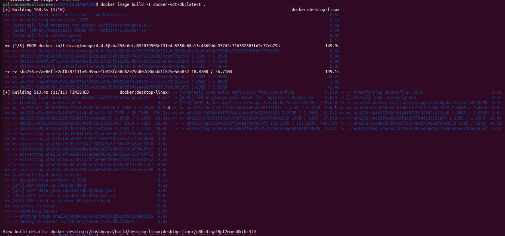

# Bài tập giữa kỳ Viettel Digital Talent 2024 
Trần Thùy Dương

## A. Phát triển một 3-tier web application đơn giản 
### 1. Hình ảnh thể hiện kết quả đạt được

- Hiển thị danh sách sinh viên dưới dạng bảng

    

- Cho phép thêm mới một sinh viên: 
    - Click vào nút "Add"
    - Điền thông tin cần thiết vào form 
    - Chọn "Submit" để lưu thông tin
    - Chọn "Close" để đóng form mà không thêm sinh viên mới
  
    
    

- Cho phép xem chi tiết và cập nhật thông tin sinh viên:   
    - Click vào "Detail & Update"
    - Sửa thông tin cần thiết
    - Chọn "Submit" để lưu thông tin
    - Chọn "Close" để đóng form mà không lưu thông tin
    
    
    

- Cho phép xóa thông tin sinh viên: 
  - Click vào nút "Delete"
    
  
  
### 2. Thiết kế hệ thống:
- Web: react
- APIs: node, express
- DB: mongoDB              

### 3. Mã nguồn:
  + Web: https://github.com/SalicaceaeD/VDT-frontend
  + API: https://github.com/SalicaceaeD/VDT-backend

## B. Triển khai web application sử dụng các DevOps tools & practices
#### 1. Containerization 
 - Dockerfile cho từng dịch vụ: 
- [API](https://github.com/SalicaceaeD/VDT-midterm/blob/main/vdt-backend/Dockerfile) 
    ```Dockerfile
    ARG NODE_VERSION=20.13.1

  FROM node:${NODE_VERSION}-alpine

  ENV NODE_ENV production


  WORKDIR /usr/src/app

  RUN --mount=type=bind,source=package.json,target=package.json \
      --mount=type=bind,source=package-lock.json,target=package-lock.json \
      --mount=type=cache,target=/root/.npm \
      npm ci --omit=dev

  USER node

  COPY . .

  EXPOSE 10000

  CMD npm start

    ```
- [Web](https://github.com/SalicaceaeD/VDT-midterm/blob/main/vdt-frontend/Dockerfile)

    ```Dockerfile
    FROM node:lts-alpine AS builder

    WORKDIR /app

    COPY package.json .
    COPY package-lock.json .

    RUN npm install

    COPY . .

    CMD ["npm", "start"]
    ```
- [Database](https://github.com/hantbk/vdtproject/blob/main/webcrud/db/Dockerfile)

    ```Dockerfile
    FROM mongo:4.4.6

    RUN mkdir -p /docker-db.d

    COPY data.json /docker-db.d/data.json
    COPY initdb.sh /docker-db.d/initdb.sh

    RUN chmod +x /docker-db.d/initdb.sh

    CMD ["bash", "-c", "/docker-db.d/initdb.sh && mongod --bind_ip_all"]
    
    ```
- Output câu lệnh build và history image web service


- Output câu lệnh build và history image api service


- Output câu lệnh build và history image db service



## C. Nghiên cứu về một vấn đề, khái niệm trong các chủ đề đã được học 

