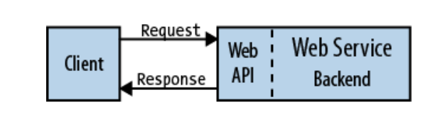

# Interprocess communication trong kiến trúc microservices
# Lời mở đầu
- Trong một ứng dụng sử dụng kiến trúc monolithic chạy dưới một tiến trình thì các thành phần của ứng dụng sẽ tương tác với nhau sử dụng các phương thức hoặc các lời gọi hàm. Những lời gọi này có thể liên kết chặt chẽ với nhau nếu chúng ta tạo ra các đối tượng bằng code, ví dụ thông qua câu lệnh tạo đối tượng mới `new Obj()`  hoặc sử dụng phương thức khác để làm cho các lời gọi này bớt liên kết chặt chẽ với nhau hơn thông qua kỹ thuật Dependency Injection. Cho dù là sử dụng cách nào đi cho nữa thì các đối tượng này vẫn sẽ chạy trong cùng một tiến trình.

- Khác với ứng dụng có kiến trúc monolithic thì các thành phần của ứng dụng mircoservices có thể chạy trên chạy trên nhiều hosts khác nhau, mỗi thành phần là một tiến trình trong từng host. Vì vây khi có một yêu cầu khi được gửi đến ứng dụng sử dụng kiến trúc microservices sẽ có độ trễ như là một hệ quả của kiến trúc này.
- Vấn đề được nêu ở trên chính là một trong những thách thức lớn nhất khi chuyển thì kiến trúc monolithic sang kiến trúc microservices đó chính là thay đổi việc thay đổi cơ chế giao tiếp với nhau giữa các thành phần trong ứng dụng. Việc quyết định xem cái cách mà các services trong hệ thống giao tiếp với nhau nhau nào trở thành một trong những quyết định quan trọng khi bắt đầu tiếp cận đến kiến trúc này. Một trong những quyết định quan trọng đầu tiên khi chọn cơ chế giao tiếp của các tiến trình là hiểu được các kiểu tương tác giữa các dịch vụ. Phần tiếp theo sẽ nói về chủ đề này.
# Tổng quan về tương tác giữa các tiến trình trong microservices
- Khi lựa chọn công nghệ cho IPC thì chúng ta có rất nhiều để lựa chọn. Dịch vụ có thể sử dụng các cơ chế giao tiếp dựa trên yêu cầu/phản hồi (pub/sub) đồng bộ, chẳng hạn như REST dựa trên HTTP hoặc gRPC. Ngoài ra, chúng có thể sử dụng các cơ chế giao tiếp không đồng bộ, dựa trên messages như AMQP hoặc STOMP. Ngoài ra còn có nhiều định dạng thông điệp khác nhau. Dịch vụ có thể sử dụng các định dạng chữ (text), các định dạng phổ biến như JSON hoặc XML. Ngoài ra, chúng có thể sử dụng định dạng nhị phân như Avro hoặc Protocol Buffers.
## Các loại hình tương tác giữa các dịch vụ.
- Thông thường, chúng ta sẽ có hai cách phân loại cách các dịch vụ sẽ tương tác với nhau như sau. 
- Cách phân loại đầu tiên là xác định xem đây là giao tiếp bằng giao thức **đồng bộ (Synchronous)** hay **bất đồng độ (Asynchronous)**.

	- Giao thức đồng bộ: Khi client gửi một request thì sẽ đợi trong một khoảng thời gan để dịch vụ trả về phản hồi. Quá trình này hoàn toàn không phụ thuộc vào code thực thi của client, đoạn code có thể là đồng bộ (khoá luồng) và chờ kết quả hoặc bất đồng bộ (không khoá luồng và nhận phản hồi ở một hàm callback). Một trong nhưng giao thức phổ biến được sử dụng đó là giao thức đồng bộ HTTP/HTTPs. Điều cần lưu ý ở đây đó chính là do bản thân chính là giao thức đồng bộ nên phía client chỉ có tiếp tục thực thi task của nó nếu nhận được phản hồi.
	
	- Giao thức bất đồng bộ: Giao thức phổ biến sử dụng có cơ chế bất đồng bộ là giao thức **AMQP**. Với loại giao thức này thì bên phía client hoặc bên gửi thường sẽ không đợi phản hồi mà nó chỉ gửi yêu cầu đến **AMQP** hoặc bất cứ **message broker** nào khác.
	
- Cách phân loại thứ hai là xác định xem liệu sự giao tiếp giữa các dịch vụ là theo cơ chế **một - một** hay **một - nhiều** hay theo thuật ngữ tiếng anh là single receiver và multiple receiver.

	- Ở kiểu giao tiếp single receiver thì các yêu cầu phải được thực thi bới **duy nhất** một receiver hoặc dịch vụ. Ví dụ tiêu biểu của kiểu giao tiếp này là **[Command Pattern](https://en.wikipedia.org/wiki/Command_pattern)**.
	- Ở kiểu multiple receiver thì các yêu cầu có thể sử lý bời **không hoặc nhiều receivers**. Kiểu giao tiếp này phải là bất đồng bộ. Ví dụ tiêu biểu của kiểu này là cơ chế publish/subcribe được sử dụng trong kiến trúc hướng sự kiện (Event-driven architecture).

- Một kiến trúc microservice thường kết hợp cả hai kiểu này, lấy ví dụ về một ứng dụng đặt xe 

- khi mà máy người dùng gửi một thông báo đến dịch vụ Trip management thì dịch vụ này sẽ gửi dến dịch vụ sẽ gửi request đến dịch vụ Passenger management để xác thực người dùng và sau đó tạo chuyến đi và sử dụng cơ chế pub/sub để thông báo đến các dịch vụ khác.

## Các định dạng thông điệp
- Một trong những đặc tính đặc trưng nhất của việc trao đổi giữa các tiến trình đó chính là trao đổi thông điệp. Các thông điệp này thường sẽ chưa dữ liệu trong nó vì vậy việc quyết định xem sử dụng định nào cũng sẽ ảnh hướng đến độ hiệu quả của việc trao đổi giữa các tiến trình, tính dễ sử dụng của API và tính phát triển về sau này của ứng dụng. Có hai định dang thông điệp chính đó là văn bản (text) và nhị phân (binary).
### Các thông điệp dựa trên định dạng chữ
- Với loại định dạng này thì hay lựa chọn phổ biến hiện nay là json và xml. Ưu điểm lớn nhất của dịnh dạng này là chúng rất dễ đọc. Một thông điệp json bao gồm các một tập hợp các thuộc tính đã được đặt tên. tương tự với xml.
- Tuy nhiên, nhược điểm của định dạng này đó chính là đó chính là việc chứa nhiều các thuộc tính được đặt tên sẵn cùng với giá trị của chúng khi mà thông điệp lớn thì ảnh hưởng lớn đến việc xử lý. Theo hệ quả, nếu hiệu năng là ưu tiên hàng đầu thì chúng ta nên cân nhắc sử dụng dạng nhị phân.
### Các thông điệp dạng nhị phân
- Với thông điệp dạng nhị phân thì [Protocol-Buffer](https://protobuf.dev), một định dạng được phát triển bởi google, là một trong những định dạng phổ biến nhất, dưới đây là Ví dụ về định nghĩa nghĩa một Proto được định nghĩa trong file .pro        
- Định dạng này là định dạng mặc định của giao thực gPRC hỗ trợ nhiều ngôn ngữ lập trình như C++, Java, Python, C# và Javascript. Các thuộc tính trong Protocol Buffer có một type code với giá trị riêng biệt. Bên nhận của protocol này khi nhận được thông điệp có thể lấy các trường nó cần và bỏ qua các trường nó không biết.
# Giao tiếp bất đồng bộ, giao tiếp dựa trên thông điệp
- Với cơ chế này, các dịch vụ giao tiếp với nhau thông qua trao đổi các thông điệp không đồng bộ cho nhau. Các ứng dụng sử dụng cơ chế này thường sử dụng một thành phần gọi là message broker đóng vai trò như là một trạm chung chuyển giữa các services, cơ chế này gọi là kiến trúc broker-based. Ngoài ra, còn một lựa chọn nữa cho kiểu giao tiếp dựa trên thông điệp này là kiến trúc "brokerless". Trong kiến trúc này, các services sẽ giao tiếp trực tiếp với nhau mà không thông qua một message broker.	Kiến trúc brokerless và kiến trúc broker-based
## Brokerless
- Trong kiến trúc Brokerless, các dịch vụ trao đổi thông điệp trực tiếp với nhau. [ZeroMQ](https://zeromq.org) là công nghệ nổi tiếng theo kiến trúc này.
- Kiến trúc này có một số lợi ích sau:
	- Có độ trễ thấp hơn kiến trúc brokerbased do thông điệp được trao đổi trực tiếp với nhau mà không thông qua một message broker.
	- Hạn chế được việc nếu chỉ có một message broker sẽ gây ra bottle neck dẫn đến "single point of failure".
	- Giảm độ phức tạp khi vận hành bởi khi không phải cài đặt và maintain một message broker khác
- Ngoài ưu điểm trên thì kiến trúc này cũng có nhược điểm sau:
	- Các service cần biết đến nhau dẫn dến phải sử thêm cơ chế Service discovery bên ngoài như server side discovery, client side discovery,... .
	- Tính có sẵn có thể bị giảm do các services phải còn sống khi trao đổi thông điệp với nhau
## Broker-based
- Message broker có thể coi là một trạm chung trung gian cho các service có thể tương tác với nhau. Bên gửi sẽ tạo một thông điệp và gửi đến message broker và message broker gửi đến cho bên nhận. Một lợi ích quan trọng có thể thấy của message broker là bên gửi không cần biết địa chỉ network của bên nhận. Một lợi ích nữa là message broker sẽ lưu lại thông điệp cho đến khi nó được xử lý.
- Một số công nghệ message broker phổ biến hiện nay là [ActiveMQ](http://activemq.apache.org), [RabbitMQ](https://www.rabbitmq.com)và [Apache Kafka](https://kafka.apache.org).
- Các thông điệp trong mesage broker được truyền trao đổi qua một channel. Có hai loại channel đó point-to-point và publish-subscribe.
	- Point-to-point: Khi có thông điệp trao đổi thì kênh này sẽ chuyển thông điệp này đến chính xác consumer. Trong microservice chúng ta có thể dùng kiểu này cho giao tiếp single receiver đã đề cập ở trên
	- publish-subscribe: kênh sẽ chuyển thông điệp đến tất cả các consumers gắn với thông điệp đó. Loại này thường được sử dụng cho giao tiếp multiple receiver.
Các message broker đều có hướng cài đặt các kênh này khác nhau, dươi đây là bảng so sánh:

- Các lợi ích khi sử dụng kiến trúc này:
	- Giúp các thành phần trong ứng dụng louse coupling với nhau
	- Message buffering: như đã đề cập ở trên thì các message sẽ được lưu lại trên message broker cho đến khi nó được xử lý.
	- Linh hoạt trong việc trao đổi giữa các dịch vụ với nhau.
- Các bất lợi:
	- Có thể gặp hiện tượng nghẽn cổ chai.
	- single point of failure
	- Thêm độ phức tạp khi vận hành
# Giao tiếp đồng bộ, giao tiếp dựa trên cơ chế request/respone
- Với cơ chế này thì client sẽ gửi các yêu cầu (request) đến dịch vụ và chờ phản hồi từ dịch vụ. Một số client sẻ sử dụng cơ chế blocking một số thì không nhưng điểm chung là chúng đều cho rằng chúng sẽ nhận lại phản hồi trong một khoảng thời gian nào đấy.
- Các kiểu được sử dụng phổ biến trong cơ chế này là RESTs API, GRPC và Service discovery.
## REST
- REST viết tắt cho "Representational State Transfer", là kiến trúc thường được sử dụng cho việc thiết kế các APIs cho ứng dụng web. Rest gồm hai thành phần chính đó là resource và verb. Resouce đại điện cho một đối tượng nghiệp vụ ví dụ như Khách hàng hay Sản Phẩm. Để có thế tương tác với các resource này thì REST sử dụng verb, ví dụ như là một request GET sẽ trả về các resource Khách hàng, với POST thì sẽ tạo mới và PUT sẽ cập nhập resource.
## GRPC
- gRPC là một giao thức RPC (Remote Procedure Call) hiện đại được thiết kế và phát hành bởi Google để phát triển client và server đa ngôn ngữ. RPC là một cơ chế được sử dụng trong nhiều ứng dụng phân tán để tạo thuận lợi cho giao tiếp giữa các tiến trình (Interprocess communication). RPC được coi là một giao thức cho phép trao đổi message giữa hai tiến trình với các đặc điểm là ít tốn tài nguyên, đơn giản và minh bạch. Theo mặc định, khi một client gửi yêu cầu đến server, nó sẽ tạm dừng tiến trình và chờ kết quả được trả về. Do đó, RPC được coi là hình thức giao tiếp đồng bộ. Không giống như REST API sử dụng HTTP/1.1 làm giao thức vận chuyển mặc định, gRPC chạy trên HTTP/2.0 mang lại cho gRPC một số lợi thế về hiệu suất và bảo mật.
## Service discovery
- Khi viết ứng dụng sử dụng REST, không ít lần chúng ta gặp phải vấn đề về địa chỉ IP của REST. Trong các máy chủ vật lý, thông thường các địa chi IP này là tĩnh. Tuy nhiên, với kiến trúc microservice các dịch vụ thường được triển khai bằng container hoặc trên Kubernetes thì việc giữ IP cố định cho các dịch vụ dường như là rất khó khăn. Để giải quyết vấn đề này chúng ta có thể sử dụng thêm service discovery để giải quyết vấn đề này.
### Client-side discovery pattern
- Với cách này thì các dịch vụ sẽ tự cài đặt phần service discovery của mình để tương tác vứi service registry.
- Khi mà một client muốn lấy địa chỉ của 1 services, thì nó sẽ query đến service registry để lấy danh sách địa chỉ của các services instances. Sau đó, sử các thuật toán load balancing như round-robin hoặc lấy ngẫu nhiên để gửi request.
### Server-side discovery.
- Thay vì client sẽ query đến service registry và tự chọn địa chỉ IP thì client sẽ gửi request với địa chỉ DNS của request router, sau đó request router sẽ query đến service registry và load balancer request.

# Tổng kết
- Các microservice cần giao tiếp với nhau bằng phương thức giao tiếp giữa các tiến trình (IPC). Khi thiết kế cách thức các dịch vụ chúng ta cân nhắc nhiều vấn đề khác nhau: cách các dịch vụ tương tác, cách xác định API cho mỗi dịch vụ,. Có hai loại cơ chế IPC mà microservice có thể sử dụng: bất đồng bộ, dựa trên thông điệp và yêu cầu/phản hồi đồng bộ.
- Hi vọng với phần tìm hiểu này, em sẽ có thêm kiến thức để phát triển các sản phẩm sử dụng kiến trúc microservice sau này. Em cảm ơn các mentor đã đồng hành và giúp đỡ em trong thời gian vừa qua.