## Project giữa kỳ Viettel Digital Talent 2024

### Vũ Thế Nam

### Phát triển một 3-tier web application đơn giản

Hiển thị danh sách sinh viên tham gia chương trình VDT2024 dưới dạng bảng với các thông tin sau: Họ và tên, Giới tính, trường đang theo học.
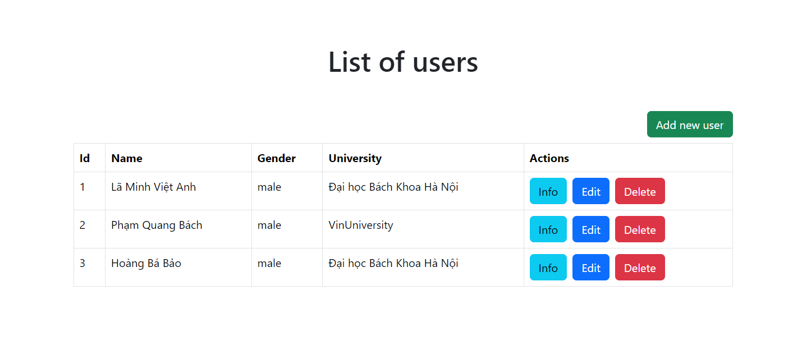
Cho phép xem chi tiết/thêm/xóa/cập nhật thông tin sinh viên.

- Thêm sinh viên
  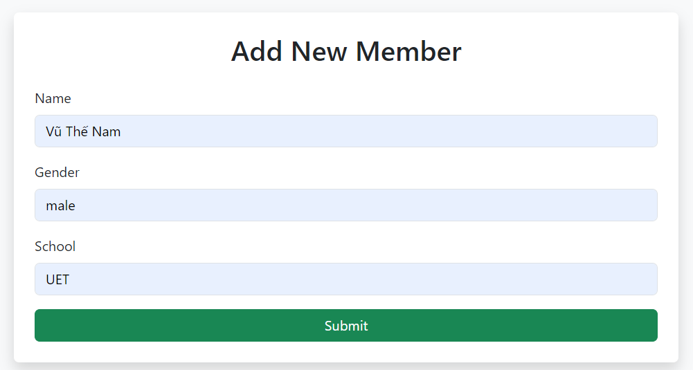
  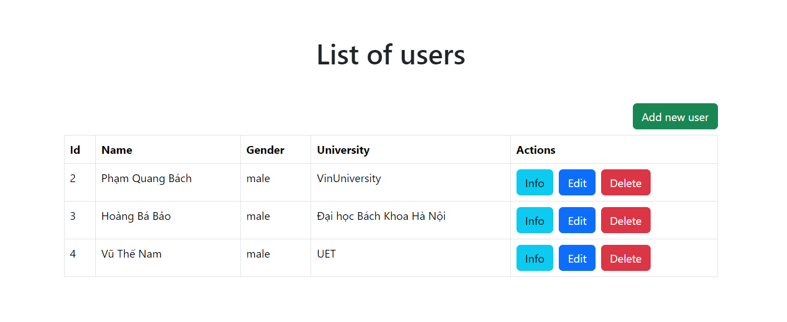

- Xem chi tiết sinh viên
  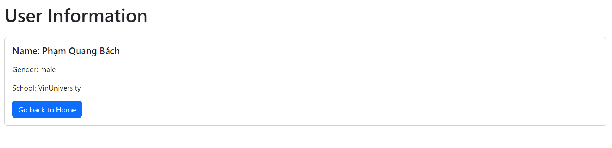

- Cập nhật thông tin sinh viên
  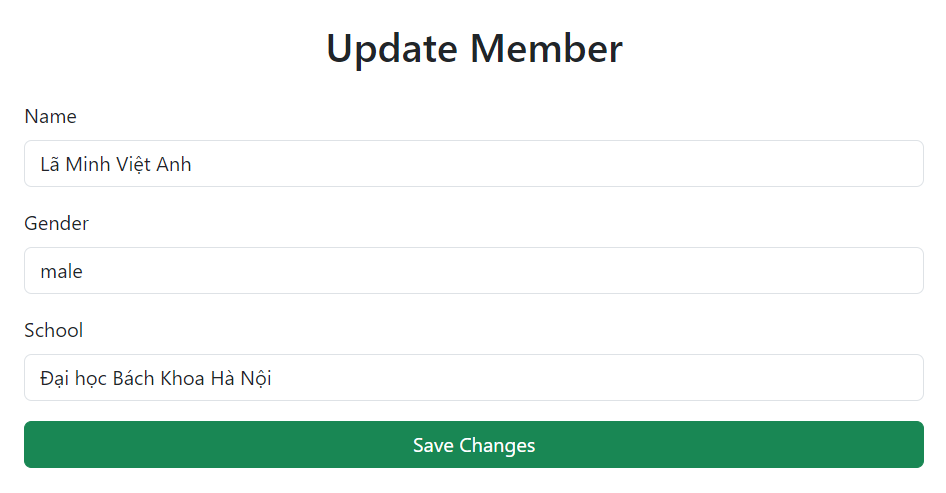

- Xóa sinh viên
  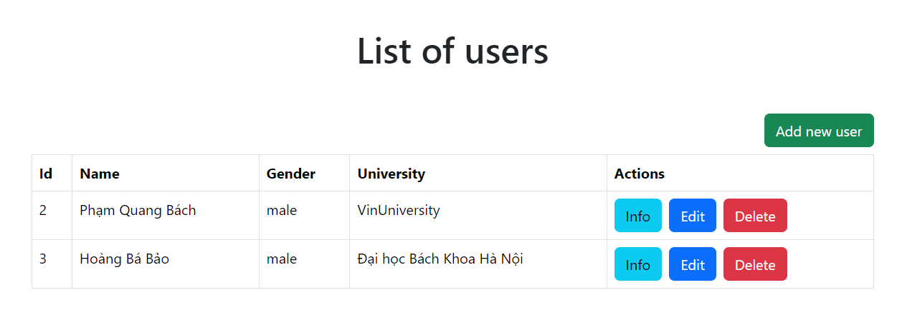

- Kết quả unit test cho các chức năng API:

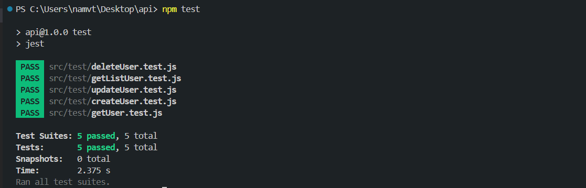

# Mã nguồn web service: [web](https://github.com/vtnam48/web)

# Mã nguồn api service: [api](https://github.com/vtnam48/api)

### Triển khai web application sử dụng các DevOps tools & practices

#### 1. Containerization

- Dockerfile cho từng dịch vụ:
- [Web]

  ```Dockerfile
    FROM node:latest

    WORKDIR /usr/src/app

    COPY package*.json ./

    RUN npm install

    COPY . .

    RUN npm run build

    EXPOSE 3000

    CMD ["npm", "start"]
  ```

- [API]

  ```Dockerfile
    # Stage 1: Build the application
    FROM node:lts-alpine AS build

    WORKDIR /app

    COPY package*.json ./

    RUN npm install

    COPY . .

    # Stage 2: Production-ready image
    FROM node:lts-alpine AS production

    WORKDIR /app

    COPY --from=build /app ./

    EXPOSE 8080

    CMD ["npm", "start"]

  ```

- [Database]

  ```Dockerfile
    FROM mysql:latest

    ENV MYSQL_ROOT_PASSWORD=root_password
    ENV MYSQL_DATABASE=db
    ENV MYSQL_USER=namvt
    ENV MYSQL_PASSWORD=123

    COPY init.sql /docker-entrypoint-initdb.d/

    EXPOSE 3306
  ```

- Output câu lệnh build và history image web service

  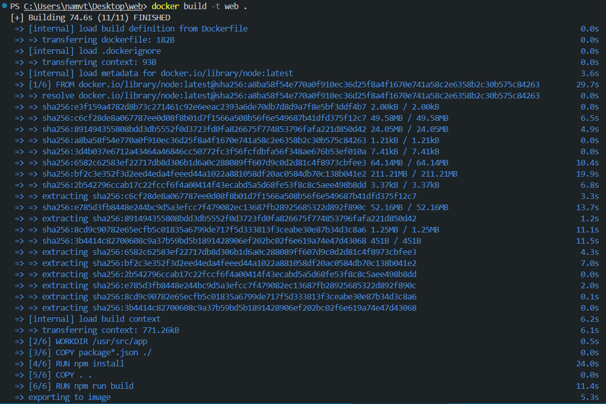

  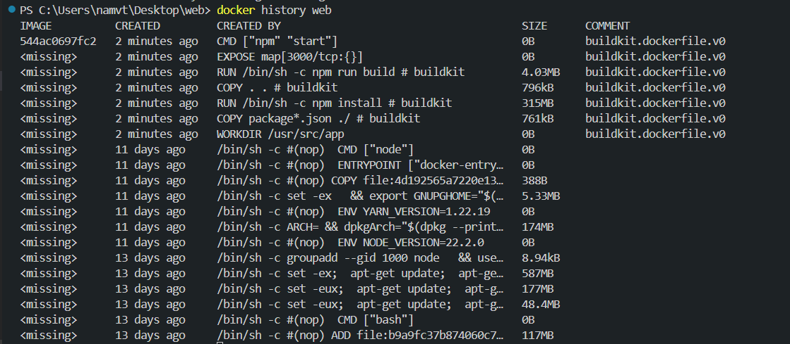

- Output câu lệnh build và history image api service

  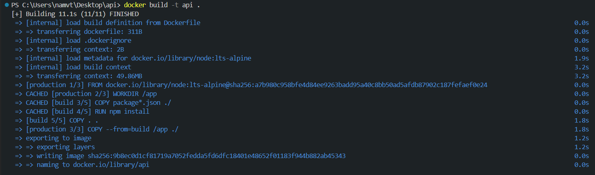

  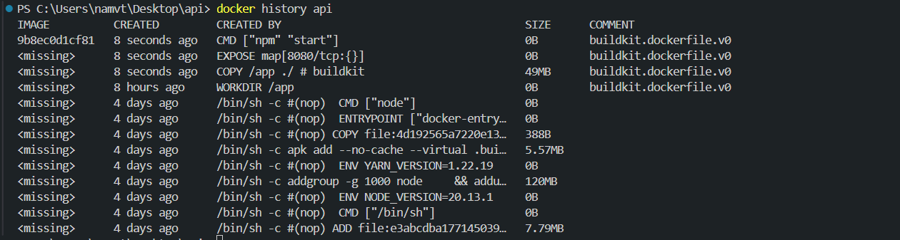

- Output câu lệnh build và history image db service

  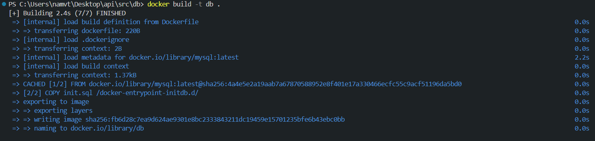

  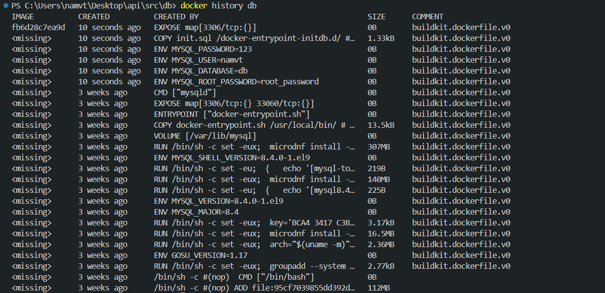

#### 2. Continuous Integration

- File setup công cụ CI: [ci](https://github.com/vtnam48/api/blob/main/.github/workflows/node.js.yml)

      ```yml

  name: Node.js CI

  on:
  push:
  branches: [ "main" ]
  pull_request:
  branches: [ "main" ]

  jobs:
  build:

        runs-on: ubuntu-latest

        strategy:
        matrix:
            node-version: [16.x, 18.x]

        steps:
        - uses: actions/checkout@v4
        - name: Use Node.js ${{ matrix.node-version }}
        uses: actions/setup-node@v3
        with:
            node-version: ${{ matrix.node-version }}
            cache: 'npm'
        - run: npm ci
        - run: npm run build --if-present
        - run: npm test
      ```

  Lịch sử chạy CI : [CI History](https://github.com/vtnam48/api/actions)

- CI khi push reuest

  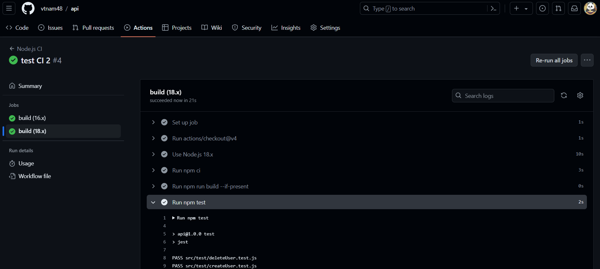

- CI khi Pull request

  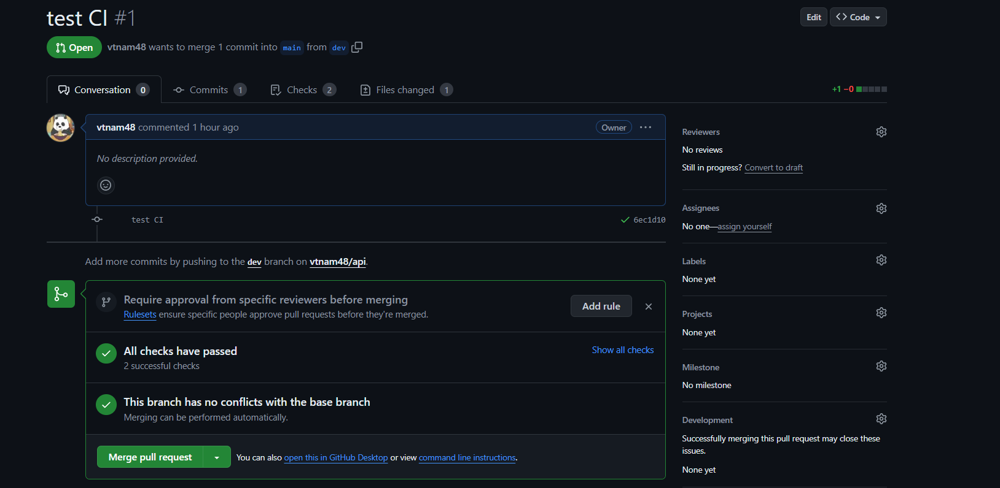

  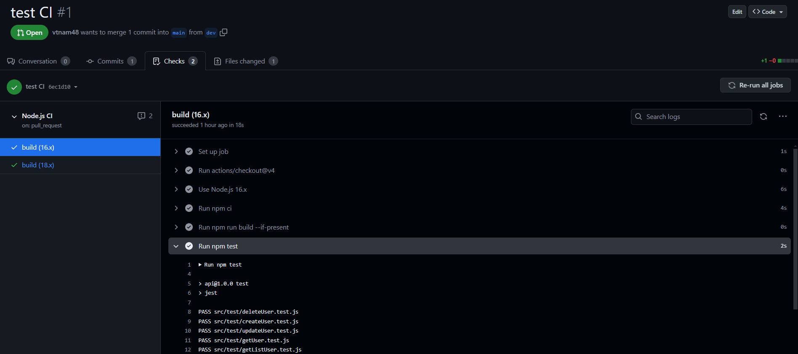
